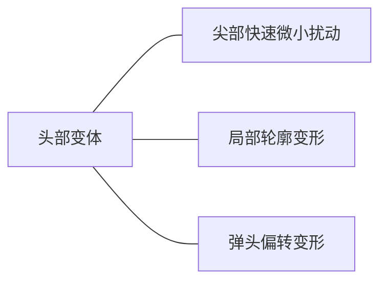

## 2.1 飞行器头部变体

飞行器头部形状同机翼一样可以影响飞行器气动性能，尤其是在超声速飞行时，合适的头部形状对于降低激波阻力、减小头部局部热流、降低地面声爆强度等具有良好效果。

早期头部变体技术的应用是协和号超声速客机上的可下垂机鼻。在起降阶段，机鼻下垂以改善飞行员视野；在超声速巡航时，机鼻复位，恢复良好的低阻流线外形。协和式客机的头部变体主要为了便于驾驶员观察，并非从气动性能角度考虑，但为头部变体技术发展提供了一种思路。

飞行器头部的偏转或者局部变形会导致流场变化，并在头部某些区域产生压差，进而产生相应气动力和气动力矩，可以起到敏捷控制飞行器姿态的作用。主要的头部变体形式如图 13 所示。其中相对体轴线的弹头偏转变形对飞行器气动特性影响最大，可以实现飞行器全方位的机动。本文主要对弹头偏转变形方案进行总结，其余头部变体方式可参考文献。

图 13 头部变体方式
Fig. 13 Head deformations

偏转弹头技术主要应用于导弹的快速机动，偏转弹头导弹的概念最早可以追溯到 1946 年。之后，针对偏转弹头方案进行了大量的可行性探索及技术应用研究。早期研究主要通过理论推导、风洞试验开展给定偏转角下导弹气动特性等的影响因素研究。

偏转弹头、鸭翼舵面是控制导弹机动的 2 种主要方案。偏转弹头导弹、鸭翼舵面导弹模型如图 14所示，相较于鸭翼舵面控制，偏转弹头控制避免了舵面与弹体的气动干扰。并且，由于弹头距离质心较远，较小的弹头偏转角度即可产生较大的操纵力矩。此外，与鸭翼舵面控制导弹相比，偏转弹头导弹具有更高的俯仰控制效率（见图 15，$\delta$ 为弹头偏转角度，$\Delta C_m$ 为俯仰力矩增量，$\Delta C_x$ 为轴向力系数增量）、更小的气动阻力。研究表明，与鸭翼导弹相比，偏转弹头导弹在 $Ma=3, 6$ 时阻力分别减小 5%、13%，适合超/高超声速飞行。因此，通过偏转弹头高效控制导弹机动飞行的技术受到广泛关注。

弹头偏转时，导弹攻角（$\alpha$）、俯仰力矩（$C_m$）随时间的变化曲线如图 16所示，附加升力导致的俯仰力矩会抑制导弹迎角的变化，有利于实现动态稳定飞行。随着弹头偏转角度的增加，导弹的法向过载明显增大（见图 17，$\beta$ 为弹头偏转角度，$N_{y_s}$ 为弹体坐标系下导弹法向过载），机动性显著增强。

目前，偏转弹头方案研究的热点主要集中在

Missile model Missile model

(a) 偏转弹头 (b) 鸭翼舵面

图 14 导弹模型
Fig. 14 Missile model

2 部分：一部分是建立飞行动力学模型，另一部分是研究不同来流马赫数、不同飞行攻角和不同弹头偏转角对偏转弹头局部压力分布、导弹整体气动特性的影响规律。针对气动特性的研究表明，偏转弹头导弹的气动效率随着偏转角、马赫数、攻角的增大而增大，且在超声速飞行时的气动效率相对于亚声速飞行时显著提高。

| δ/(°) | Ma=6.0 Deflectable nose | Ma=3.0 Deflectable nose | Ma=3.0 Canards | Ma=6.0 Canards |
| 0 | 0 | 0 | 0 | 0 |
| 4 | 0.6 | 0.4 | 0.2 | 0.1 |
| 8 | 1.5 | 1.0 | 0.5 | 0.3 |
| 12 | 2.3 | 1.6 | 0.8 | 0.5 |
| 16 | 2.8 | 2.1 | 1.1 | 0.7 |
| 20 |  | 2.5 | 1.3 | 0.9 |
| 24 |  |  | 1.5 | 1.1 |
| 28 |  |  | 1.7 | 1.3 |
(a) 俯仰力矩系数增量对比

| δ/(°) | Ma=6.0 Deflectable nose | Ma=3.0 Deflectable nose | Ma=6.0 Canards | Ma=3.0 Canards |
| 0 | 0 | 0 | 0 | 0 |
| 4 | 0.01 | 0.005 | 0.002 | 0.001 |
| 8 | 0.03 | 0.02 | 0.008 | 0.005 |
| 12 | 0.055 | 0.04 | 0.015 | 0.01 |
| 16 | 0.07 | 0.055 | 0.022 | 0.015 |
| 20 |  | 0.065 | 0.03 | 0.02 |
| 24 |  |  | 0.04 | 0.025 |
| 28 |  |  | 0.055 | 0.035 |
(b) 轴向力系数增量对比

图 15 俯仰控制效率对比
Fig. 15 Comparison of pitch control efficiency

此外，孙健根据蚕蛹的结构特征设计了头部引信可偏转结构，并探究了弹头偏转节数对气动性能的影响（见图 18），研究结果表明，不同偏转节数下的阻力系数、升力系数、俯仰力矩系数基本相同，节数增多会导致偏航力矩系数减小。

Pressure contours of deflection warhead with different numbers of deflection sections

图 18 偏转弹头不同偏转节数压力云图
Fig. 18 Pressure contours of deflection warhead with different numbers of deflection sections

由于弹头偏转导致流场的不对称分布，导弹在绕轴旋转时会产生非定常效应。研究发现，在飞行过程中弹头绕轴旋转会产生马格努斯效应并造成俯仰、偏航通道间的耦合，导弹气动特性干扰严重。不同转速下导弹气动特性随头部滚转角变化曲线如图 19所示。偏转弹头开始旋转时，弹头不同部位的速度差使得表面流动产生离心力进而形成气动力的增量，这种因弹头旋转引起的气动力的变化会使导弹呈螺旋摆动。

| t/s | α/(°) | C_m |
| 100 | 0.4 | 0 |
| 110 | 0.3 | -1 |
| 120 | 0.4 | 1 |
| 130 | 0.3 | -1 |
| 140 | 0.4 | 1 |
图 16 俯仰力矩系数
Fig. 16 Pitching moment

| t/s | β=0° | β=3° | β=5° |
| 0 | 0.2 | 0.2 | 0.2 |
| 50 | 0.2 | 0.2 | 0.2 |
| 100 | 0.2 | 0.2 | 0.2 |
| 150 | 0.3 | 0.3 | 0.3 |
| 200 | 3.5 | 3.5 | 3.5 |
| 250 | 0.5 | 0.5 | 0.5 |
图 17 法向过载
Fig. 17 Normal overload

| 滚转角φ/(°) | ω_h=70 r/s | ω_h=0 r/s |
| 0 | 0.05 | 0.05 |
| 90 | -0.08 | -0.05 |
| 180 | 0.05 | 0.05 |
| 270 | 0.08 | 0.05 |
| 360 | 0.05 | 0.05 |
(a) 升力系数随头部滚转角的变化曲线

| 滚转角$\phi/(^\circ)$                           | 侧向力系数$C_z$ ($\omega_h=70\text{ r/s}$) | 侧向力系数$C_z$ ($\omega_h=0\text{ r/s}$) |
| ------------------------------------------------- | ---------------------------------------------- | --------------------------------------------- |
| 0                                                 | 0                                              | 0                                             |
| 90                                                | -0.10                                          | -0.04                                         |
| 180                                               | 0                                              | 0                                             |
| 270                                               | 0.08                                           | 0.04                                          |
| 360                                               | 0                                              | 0                                             |
| 头部转速$\omega_h/(\text{r}\cdot\text{s}^{-1})$ | 侧向力系数$C_z$                              |                                               |
| ---                                               | ---                                            |                                               |
| 0                                                 | 0                                              |                                               |
| 10                                                | -0.002                                         |                                               |
| 20                                                | -0.003                                         |                                               |
| 30                                                | -0.004                                         |                                               |
| 40                                                | -0.004                                         |                                               |
| 50                                                | -0.005                                         |                                               |
| 60                                                | -0.006                                         |                                               |
| 70                                                | -0.009                                         |                                               |
| 80                                                | -0.010                                         |                                               |

图 19 偏转弹头绕弹轴旋转时气动特性变化曲线

Fig. 19 Aerodynamic characteristics of deflected projectile during rotation around axis

数据。此外，超/高超声速来流下偏转弹头局部热流沉积、偏转和旋转过程的非定常效应是推动偏转弹头工程化亟需解决的关键问题。随着智能材料、智能结构、智能控制手段的发展，可以根据任务需求、飞行状态操纵导弹飞行姿态的自适应偏转弹头技术能够大幅提高导弹打击能力，增强军事力量，推动装备体系建设。

除此之外，广大学者通过模仿动物形态变化探索新型头锥变体方式。其中，蜜蜂根据环境变化腹部结构就为仿生变体提供了一种思路。基于蜜蜂腹部机构的仿生变体头锥设计目前集中于变体结构设计，对于气动布局构型设计、气动特性分析的研究较为缺乏。蜜蜂腹部形态变化及一种仿生头锥构型分别如图 20、图 21所示。

Morphological changes of honeybee's abdomen

图 20 蜜蜂腹部形态变化
Fig. 20 Morphological changes of honeybee's abdomen

偏转弹头技术发展的关键难点在于蒙皮材料、驱动器、控制技术。而针对偏转弹头气动特性的计算分析主要是为动力学模型的建立提供

Deformation principle of bionic deflectable nose

图 21 仿生变体头锥变形原理

Fig. 21 Deformation principle of bionic deflectable nose

此外，湾流公司（Gulfstream Aerospace）曾经提出了变体低声爆超声速民机的概念，通过飞机头部静音锥的主动伸缩降低不同飞行状态时的地面声爆强度。可变形状和变级数的头部静音锥变形方案为超声速民机低声爆被动抑制技术提供了参考。

## 2.2 机翼变体

作为飞行器升力的主要来源，机翼是飞行器变形的主要部位。如图 22 所示，机翼变体按照变形尺度分为大、中、小尺度变形。小尺度变形主要是机翼表面的局部可控微小变形，以此实现局部流动控制。中尺度变形主要是在翼型层面上的变形，包括前缘变弯度、可变后缘、变厚度等变形方式。大尺度变形主要是机翼布局层面上的

变形，包括变展长、变后掠角、变上反角等多种形式，可以实现气动性能的大幅变化。

不同的机翼变体方式对气动性能的影响不同，带来的气动增益也有较大差别。机翼参数变化对气动性能的影响如表 1所示。

本文研究主要涉及机翼层面的中、大尺度变形，总结伸缩机翼、可变后掠机翼、折叠机翼等机翼主要变形方式。

### 2.2.1 可变后掠机翼

大后掠角机翼可以降低激波阻力，有利于跨声速、超声速飞行，小后掠角机翼则具有良好的低速特性，可变后掠机翼飞行器可以同时兼顾起降、低速飞行、高速飞行时的性能。变后掠飞行器的发展历程如图 23 所示。最早的可变后掠飞行器概念可追溯到 1944 年，这时的设计方案仅可以在地面改变后掠角，无法实现飞行中后掠角的改变。1951 年试飞的 Bell X-5 飞机是第一架可变后掠机翼飞机，其可在多个后掠角之间切换，但是由于变后掠时气动中心的变化会产生低头力矩，并未真正投入使用。20 世纪 60~70 年代是可变后掠机翼发展的黄金时期，发展出一系列型号，如 F-111、F-14、米格-23、图-160 等。其中 F-14、图-160 可以认作是可变后掠机翼飞行器的典

机翼变形尺度分类层次图

图 22 机翼变形尺度分类
Fig. 22 Classification by morphing scale of wings

表 1 机翼参数对气动性能的影响

Table 1 Influence of wing parameters on aerodynamic performance

| 参数     | 变化 | 影响情况                                                 |
| -------- | ---- | -------------------------------------------------------- |
| 翼面积   | 增大 | 提升升力和承载能力                                       |
|          | 减小 | 降低摩擦阻力                                             |
| 展弦比   | 增大 | 提高升阻比、续航能力、巡航距离、偏航速率；降低发动机要求 |
|          | 减小 | 提高最大速度，减小摩擦阻力                               |
| 上反角   | 增大 | 提高偏航性能和侧向稳定性                                 |
|          | 减小 | 提高最大速度                                             |
| 后掠角   | 增大 | 提高临界马赫数，减小阻力                                 |
|          | 减小 | 提高最大升力系数                                         |
| 根梢比   |      | 影响展向升力分布及诱导阻力                               |
| 机翼扭转 |      | 影响翼尖失速及展向升力分布                               |
| 翼型弯度 |      | 影响零升迎角、分离特性                                   |
| 前缘半径 | 增大 | 改善低速翼型性能                                         |
|          | 减小 | 改善高速翼型性能                                         |
| 翼型厚度 |      | 影响翼型性能、层流向湍流过渡                             |

Development history of variable sweep wing showing different aircraft designs and operational modes: ground adjustment, in-flight adjustment, combination with other morphing methods, and automatic adjustment based on flight status.

图 23 变后掠形式发展历程
Fig. 23 Development history of variable sweep wing

型成果。F-14 采用双垂尾正常式气动布局，能根据飞行状态自动调整后掠角。

可变后掠机翼飞行器的设计存在 2 个问题：驱动结构增加飞机重量、结构复杂度，气动中心在变后掠过程中的大幅度变化严重影响整机的操稳性能。针对气动中心的变化往往会采取气动补偿措施，如 F-14 飞机在机翼固定段前缘设计了可动扇翼维持气动中心变化时的俯仰平衡。前期可变后掠机翼的应用基本针对常规布局飞行器，未对气动布局形式产生较大影响。由于结构、材料上的限制，可变后掠机翼飞行器在 20 世纪 70 年代后的发展陷入停滞，但其带来的巨大气动收益证实了变体技术提高飞行器气动性能的可行性。

随着智能材料、智能结构的发展，变后掠技术的研究再次受到人们关注。目前的可变后掠机翼设计方案并不仅是简单的后掠角变化，往往与其他形状参数的变化相结合，如变展长或变弦长等。其中最为著名的是美国 NextGen 公司提出的“滑动蒙皮方案”。该公司在 2007 年试飞了 MFX-1，机翼面积改变 40%，展长变化 30%，后掠角在 15°~35°之间变化，载重量 90 kg。2008 年又试飞了 MFX-2，变形仅需要 10 s，其机翼可以滑动并展开成 5 种姿态（见图 24），满足盘旋、巡航、爬升、高升力、高速机动的飞行要求。

目前针对可变后掠机翼飞行器气动布局的研究集中在：变后掠方式及变后掠技术在不同气动布局飞行器上的应用、不同后掠角下及变后掠过程中飞行器的飞行性能、最佳变后掠规律、变

Morphing wing configurations for different working conditions: high lift, climb, cruise, loiter, and maneuver.

图 24 几种工作状态时的变体方案
Fig. 24 Morphing wing configurations for working conditions

后掠与其他变形方式的组合、变后掠飞行器气动外形优化设计。陈钱等探索了旋转变后掠和剪切变后掠方式对气动特性的影响，针对翼身组合构型（Wing Body, WB）飞行器的数值模拟结果如图 25所示，$L/D$ 为升阻比，$C_D$ 为阻力系数。与旋转变后掠相比，剪切变后掠形式在变后掠过程中沿流向翼型保持不变，有利于控制流动分离和翼尖涡的产生，在宽速域内升阻比、阻力特性更佳。

彭悟宇对比了常规布局翼身组合体构型导弹应用伸缩机翼、可变后掠机翼、折叠机翼变体方案时的气动特性（见图 26）、操稳特性（见表 2、表 3）。对比气动特性发现，在超声速飞行状态下，伸缩机翼方案升阻比小于相同翼面积的变后掠机翼方案。3 种变形方案纵向静稳定性品质均较高，伸缩机翼静稳定性和舵面效率最佳。变后掠机翼方案、折叠机翼方案的舵面效率随着马赫数的增大快速降低。

李惠璟则将变后掠机翼应用到无尾鸭式布局上，研究结果表明机翼变后掠过程中焦点位置变化较大，不利于纵向静稳定，其气动特性如图 27所示，其中，$C_L$ 为升力系数，$\beta$ 为后掠角，$\delta$ 为舵偏角，下标表示对应舵面，$\Delta x$ 表示焦点位置。

可变后掠机翼技术在乘波体构型上的应用可以使飞行器满足宽速域飞行需求。一种变后掠乘波体的设计方案和相应气动特性如图 28所示，$\Lambda$ 为后掠角，$\alpha$ 为飞行迎角，$\Delta(L/D)$ 为各

(a) 旋转变后掠

(b) 不同马赫数下升阻比

| Ma_∞ | WB, 0° swee | WB, 60° rotating | WB, 60° shearing |
| ----- | ------------ | ----------------- | ----------------- |
| 0.2   | 9.5          | 7.8               | 11.5              |
| 0.4   | 10.0         | 8.0               | 12.0              |
| 0.6   | 10.5         | 8.5               | 12.2              |
| 0.8   | 10.2         | 8.8               | 10.5              |
| 1.0   | 6.5          | 7.0               | 6.8               |
| 1.2   | 2.8          | 3.5               | 3.0               |

(c) 剪切变后掠

(d) 不同马赫数下阻力系数

| Ma_∞ | WB, 0° swee | WB, 60° rotating | WB, 60° shearing |
| ----- | ------------ | ----------------- | ----------------- |
| 0.2   | 0.03         | 0.02              | 0.02              |
| 0.4   | 0.03         | 0.02              | 0.02              |
| 0.6   | 0.03         | 0.02              | 0.02              |
| 0.8   | 0.04         | 0.02              | 0.02              |
| 1.0   | 0.10         | 0.04              | 0.04              |
| 1.2   | 0.11         | 0.08              | 0.08              |

图 25 变后掠方式影响
Fig. 25 Effect of variable sweep forms

(a) 基准外形 (b) 变后掠方案 (c) 伸缩方案 (d) 折叠方案

(e) 升阻比对比

| Ma_∞ | Telescopic wing | Variable sweep wing | Folding wing |
| ----- | --------------- | ------------------- | ------------ |
| 2     | 2.84            | 2.78                | 2.81         |
| 3     | 2.89            | 2.82                | 2.86         |
| 4     | 2.93            | 2.86                | 2.91         |
| 5     | 2.92            | 2.85                | 2.90         |
| 6     | 2.90            | 2.83                | 2.88         |
| 7     | 2.88            | 2.81                | 2.86         |
| 8     | 2.87            | 2.80                | 2.84         |
| 9     | 2.85            | 2.78                | 2.82         |

图 26 不同变形方案升阻比对比
Fig. 26 Comparison of lift-to-drag ratio of different deformation schemes

**表 2 不同变形模式和马赫数下俯仰力矩静导数**
**Table 2 Static derivatives of pitching moment under different deformation modes and Mach numbers**

| 马赫数$Ma$ | 俯仰力矩静导数  |
| ------------ | --------------- |
| 3            | $-0.002\ 859$ |
| 6            | $-0.002\ 174$ |
| 8            | $-0.002\ 058$ |

**表 3 不同变形模式和马赫数下操纵力矩静导数**
**Table 3 Static derivatives of operating moment under different deformation modes and Mach numbers**

| 马赫数$Ma$ | 操纵力矩静导数  |
| ------------ | --------------- |
| 3            | $-0.001\ 606$ |
| 6            | $-0.000\ 758$ |
| 8            | $-0.000\ 529$ |

构型相对机翼收起构型的升阻比增量，$C_m$ 为俯仰力矩系数。该变后掠乘波体构型在不同马赫数下可以通过改变后掠角达到最佳气动性能，

在设计马赫数下，各构型俯仰力矩系数均随攻角减小，各构型保持纵向静稳定，这为实现乘波体飞行器机翼连续变后掠提供了参考。

Diagram of a tailless canard configuration with variable sweep wing scheme showing different wing positions labeled 1, 2, 3, 4.

(a) 变后掠方案

| CL                     | β=30° | β=40° | β=45° | β=50° | β=60° |
| ---------------------- | ------- | ------- | ------- | ------- | ------- |
| 0.05                   | 1.8     | 1.7     | 1.6     | 1.5     | 1.4     |
| 0.10                   | 3.2     | 3.0     | 2.8     | 2.6     | 2.4     |
| 0.15                   | 4.2     | 4.0     | 3.8     | 3.5     | 3.2     |
| 0.20                   | 4.8     | 4.6     | 4.4     | 4.1     | 3.8     |
| 0.25                   | 5.1     | 4.9     | 4.7     | 4.4     | 4.1     |
| 0.30                   | 5.2     | 5.0     | 4.8     | 4.5     | 4.2     |
| (b) 超声速状态下升阻比 |         |         |         |         |         |

| β/(°)                  | Ma=0.85 | Ma=1.60 |
| ------------------------ | ------- | ------- |
| 30                       | 0.75    | 0.42    |
| 40                       | 0.62    | 0.38    |
| 50                       | 0.72    | 0.32    |
| 60                       | 0.88    | 0.25    |
| (c) 不同后掠角下焦点位置 |         |         |

| CL                     | β=30° | β=40° | β=45° | β=50° | β=60° |
| ---------------------- | ------- | ------- | ------- | ------- | ------- |
| 0.1                    | 4.5     | 4.0     | 3.5     | 3.0     | 2.5     |
| 0.2                    | 8.2     | 7.5     | 6.8     | 6.0     | 5.2     |
| 0.3                    | 11.5    | 10.5    | 9.5     | 8.5     | 7.5     |
| 0.4                    | 13.8    | 12.5    | 11.2    | 10.0    | 8.8     |
| 0.5                    | 14.5    | 13.2    | 11.8    | 10.5    | 9.2     |
| 0.6                    | 14.2    | 12.8    | 11.5    | 10.2    | 8.9     |
| (d) 亚声速状态下升阻比 |         |         |         |         |         |

图 27 无尾鸭式布局变后掠方案
Fig. 27 Tailless canard configuration with variable sweep wing scheme

虽然增大后掠角可以降低阻力，有利于高速飞行，但在变后掠过程中，后掠角的增大会导致展长、升力面的减小。为了保证变后掠过程的升力特性，研究人员探究了变展长、变后掠结合的组合方案。试验结果如图 29所示，其中，$C_{CP}$ 为压心位置系数。后掠角增大增强了飞行器纵向稳定性，有后掠角时，展长的增大同样增强了纵向静稳定性，但导致操纵性变差。虽然组合方案可以有效改善气动性能，但是方案的实现需要机翼具有多自由度变形能力，对机翼变体结构提出了更高的要求，吸引了广大研究者开展涉及变后掠、展向弯曲、扭转等多维度变形机构方案的设计研究。

题同样显著，飞行攻角、马赫数、变后掠速率均会对非定常效应产生影响。变后掠速率对气动特性滞回环的影响如图 30所示（$\lambda$ 为外段机翼后掠角，$T$ 为变后掠周期，$C_{Mz}$、$C_{Fz}$、$C_{Mx}$ 分别为俯仰力矩系数、侧向力系数、滚转力矩系数），变后掠速率的改变会使气动特性滞回环大小出现大幅变化。在气动布局设计过程中，需要关注连续变后掠带来的非定常气动力的变化，保证飞行器纵向和横航向的稳定性。近些年来，基于机器学习的非定常气动力预测方法在变体飞行器领域也有所应用。

可变后掠机翼技术可以显著提高飞行器气动性能，并且变体形式相对简单，在巡航导弹、飞翼布局飞行器、乘波体构型飞行器上具有广阔的应用前景。

此外，变后掠过程中的非定常空气动力学问

Diagrams and line charts showing waverider configuration with variable sweep wing scheme, including aerodynamic coefficients like lift-to-drag ratio increments and pitching moment coefficients at various Mach numbers and sweep angles.

图 28 变后掠乘波体构型方案
Fig. 28 Waverider configuration with variable sweep wing scheme

Diagrams and line charts showing combined scheme of variable sweep and span, including four different configurations (A, B, C, D) and their corresponding aerodynamic performance curves for pitching moment coefficient, lift-to-drag ratio, and pressure center coefficient.

图 29 变后掠变展长组合方案
Fig. 29 Combined scheme of variable sweep and span

| λ/(°)      | Quasi-steady | Unsteady, T=17.58 s | Unsteady, T=8.79 s | Unsteady, T=4.40 s |
| ------------ | ------------ | ------------------- | ------------------ | ------------------ |
| 32           | 365          | 365                 | 365                | 365                |
| 36           | 345          | 355                 | 350                | 340                |
| 40           | 320          | 330                 | 325                | 315                |
| 44           | 300          | 310                 | 305                | 295                |
| 48           | 290          | 290                 | 290                | 290                |
| (a) 升力系数 |              |                     |                    |                    |

| λ/(°)          | Quasi-steady | Unsteady, T=17.58 s | Unsteady, T=8.79 s | Unsteady, T=4.40 s |
| ---------------- | ------------ | ------------------- | ------------------ | ------------------ |
| 32               | -0.285       | -0.285              | -0.285             | -0.285             |
| 36               | -0.275       | -0.265              | -0.270             | -0.280             |
| 40               | -0.260       | -0.250              | -0.255             | -0.265             |
| 44               | -0.245       | -0.235              | -0.240             | -0.250             |
| 48               | -0.235       | -0.235              | -0.235             | -0.235             |
| (b) 俯仰力矩系数 |              |                     |                    |                    |

| λ/(°)        | Quasi-steady | Unsteady, T=17.58 s | Unsteady, T=8.79 s | Unsteady, T=4.40 s |
| -------------- | ------------ | ------------------- | ------------------ | ------------------ |
| 32             | -95          | -95                 | -95                | -95                |
| 36             | -88          | -82                 | -85                | -92                |
| 40             | -82          | -76                 | -79                | -86                |
| 44             | -76          | -72                 | -74                | -78                |
| 48             | -70          | -70                 | -70                | -70                |
| (c) 侧向力系数 |              |                     |                    |                    |

| λ/(°)          | Quasi-steady | Unsteady, T=17.58 s | Unsteady, T=8.79 s | Unsteady, T=4.40 s |
| ---------------- | ------------ | ------------------- | ------------------ | ------------------ |
| 32               | -0.165       | -0.165              | -0.165             | -0.165             |
| 36               | -0.145       | -0.135              | -0.140             | -0.150             |
| 40               | -0.130       | -0.120              | -0.125             | -0.135             |
| 44               | -0.120       | -0.115              | -0.118             | -0.122             |
| 48               | -0.115       | -0.115              | -0.115             | -0.115             |
| (d) 滚转力矩系数 |              |                     |                    |                    |

图 30 变后掠速率对气动特性滞回环的影响
Fig. 30 Effect of sweep speed on hysteresis loop of aerodynamic characteristics

## 2. 2. 2 可变前掠机翼

可变后掠机翼在大后掠角时翼面积的减小会导致升力减小，与之相比，相同翼面积的前掠翼可提供更大的升力。此外，前掠机翼飞行器具有良好的失速特性和高机动性能。人们开始探讨可变前掠机翼技术方案。

经典的可变前掠机翼方案如图 31所示。在低速起降、亚声速巡航过程中采用升阻比较高的平直翼。随着马赫数的增大，在跨声速巡航或

者超声速机动时，采用可以避免翼尖失速进而提高操纵性能的前掠机翼布局，并根据飞行速度改变前掠角以达到最优气动性能。在超声速巡航过程中，机翼完全前掠为三角翼布局，进而减小波阻，提高超声速飞行性能。虽然前掠机翼避免了翼尖失速，但带来了翼根失速的问题，诸多设计方案通过加装鸭翼、边条翼来控制翼根部位的流动分离。此外，变前掠为三角翼布局时，后缘操纵面距离中心较远，适合采用无尾布局形式。而且，鸭式无尾布局可以改善无尾布局横航向操纵能力上的不足，提高低速机动性能和起降性能。因此，可变前掠机翼技术往往应用在鸭式无尾布局飞行器上，兼顾隐身、横航向操纵、高速飞行能力。

Deformation process of variable forward sweep wing

平直翼	前掠翼	三角翼

图 31 可变前掠机翼变形过程
Fig. 31 Deformation process of variable forward sweep wing

平直翼（前掠角 0°）、三角翼（前掠角 90°）、前掠翼（前掠角 22.5°、45.0°）对应的各飞行阶段气动特性如图 32所示。在低速巡航阶段，平直翼在对应各迎角下升阻比最大；机动阶段，在大迎角下前掠翼对应升力系数较大，失速迎角最大，

| 迎角/(°)                              | 前掠角0°+副油箱 | 前掠角0° | 前掠角-22.5° | 前掠角-45.0° | 前掠角-90.0° |
| -------------------------------------- | ---------------- | --------- | ------------- | ------------- | ------------- |
| -4                                     | -8               | -6        | -5            | -4            | -3            |
| 0                                      | 5                | 6         | 7             | 8             | 9             |
| 4                                      | 11               | 12        | 13            | 14            | 10            |
| 8                                      | 8                | 9         | 10            | 9             | 8             |
| 12                                     | 5                | 5         | 5             | 5             | 5             |
| (a) 低速巡航过程升阻比比较($Ma=0.6$) |                  |           |               |               |               |

| 迎角/(°)                            | 前掠角0° | 前掠角-22.5° | 前掠角-45.0° |
| ------------------------------------ | --------- | ------------- | ------------- |
| -5                                   | -0.2      | -0.2          | -0.2          |
| 5                                    | 0.5       | 0.5           | 0.5           |
| 15                                   | 1.2       | 1.2           | 1.2           |
| 25                                   | 1.8       | 1.8           | 1.8           |
| 35                                   | 2.3       | 2.3           | 2.3           |
| 45                                   | 2.2       | 2.2           | 2.2           |
| (b) 机动过程升力系数比较($Ma=0.4$) |           |               |               |

| 迎角/(°)                                | 前掠角0° | 前掠角-22.5° | 前掠角-45.0° |
| ---------------------------------------- | --------- | ------------- | ------------- |
| -5                                       | 0.2       | 0.2           | 0.2           |
| 5                                        | 0         | -0.1          | -0.2          |
| 15                                       | -0.3      | -0.5          | -0.8          |
| 25                                       | -0.6      | -1.0          | -1.5          |
| 35                                       | -0.9      | -1.6          | -2.2          |
| 45                                       | -1.2      | -2.2          | -2.8          |
| (c) 机动过程俯仰力矩系数比较($Ma=0.4$) |           |               |               |

| 马赫数                         | 前掠角0°+副油箱 | 前掠角0° | 前掠角-22.5° | 前掠角-45.0° | 前掠角-90.0° |
| ------------------------------ | ---------------- | --------- | ------------- | ------------- | ------------- |
| 0.4                            | 0.02             | 0.02      | 0.02          | 0.02          | 0.02          |
| 0.8                            | 0.025            | 0.025     | 0.025         | 0.025         | 0.025         |
| 1.2                            | 0.13             | 0.12      | 0.11          | 0.10          | 0.10          |
| 1.6                            | 0.11             | 0.10      | 0.09          | 0.08          | 0.08          |
| (d) 超声速飞行过程阻力系数比较 |                  |           |               |               |               |

图 32 可变前掠飞行器各飞行阶段气动特性对比
Fig. 32 Comparison of aerodynamic characteristics of variable forward sweep aircraft in each flight stage

同时纵向静稳定性更佳；超声速飞行过程，三角翼对应零升阻力系数最小，利于超声速飞行。可变前掠机翼方案能够兼顾平直翼、前掠翼、三角翼的气动性能优势。

叶露同样针对鸭式无尾布局可变前掠机翼飞行器的气动特性开展了数值模拟研究，气动特性变化曲线如图 33所示，$\Lambda_0$ 为前掠角，$\chi_{acw}$ 为静稳定度。结果表明，平直翼和前掠翼均表现为纵向静稳定，三角翼表现为纵向静不稳定。3 种构型焦点相对于重心的移动幅度较小，纵向静稳定性好。

前掠机翼良好的横航向稳定性也推动了大型客机前掠后缘尾翼的应用探索，与传统尾翼相比，前掠尾翼的应用在保证操控性能的前提下可以使尾翼面积减小 2%，进而节省燃油。新型可变前掠尾翼不失为一种增强控制稳定性的思路。

但前掠机翼会导致翼根失速，对机翼与机身连接处的结构强度提出了很高的要求。此外，自由流撞击到翼尖上会引起扭曲，带来严重的气动弹性发散，可能导致翼尖结构的破坏。可变前掠机翼技

| α/(°)              | 平直翼 | 前掠翼 | 三角翼 |
| -------------------- | ------ | ------ | ------ |
| -20                  | 0.1    | 0.1    | 0.1    |
| 0                    | 0      | 0      | 0      |
| 20                   | -0.1   | -0.2   | 0.1    |
| 40                   | -0.2   | -0.4   | 0.2    |
| 60                   | -0.3   | -0.6   | 0.3    |
| (a) 俯仰力矩系数对比 |        |        |        |

| Λ₀/(°)                    | χacw |
| ---------------------------- | ----- |
| 0                            | -0.12 |
| 20                           | -0.08 |
| 40                           | -0.04 |
| 60                           | -0.01 |
| 80                           | 0.01  |
| 100                          | 0.02  |
| (b) 静稳定度随前掠角变化曲线 |       |

图 33 变前掠鸭式无尾布局气动特性
Fig. 33 Aerodynamic characteristics of tailless canard configuration with variable forward sweep wing

术的应用依赖于材料和结构学科的发展，在大空域、宽速域的变体飞行器领域具有应用前景。

### 2.2.3 折叠机翼

折叠机翼的发展历程如图 34 所示，折叠机翼技术最早是应用在第二次世界大战的舰载机上，考虑到甲板空间有限，通过铰链等笨重机械结构实现机翼折叠便于舰载机的停放。随着变体技术的发展，通过大幅度改变翼面积或展长改善飞机气动特性的折叠机翼技术得到了广泛关注。

早期的折叠机翼技术主要针对翼尖折叠，受驱动结构限制只能在有限角度折叠。其中最为著名的是 XB-70 超声速飞机，低空超声速飞行时翼尖向下偏转 25°，高空高速巡航时向下偏转 65°。翼尖折叠时与翼梢小翼作用一致，可以减少下洗流，以此改善飞机的飞行性能。折叠机翼技术主要通过展弦比、翼面积的变化满足低速飞行和高速巡航的任务需求。

Images showing different folding wing configurations and mechanisms

图 34 折叠机翼发展历程

Fig. 34 Development history of folding wing

在 MAS 项目中，洛马公司提出了 Z 型折叠机翼方案并开展了一系列应用研究，包括大量风洞测试。风洞试验模型如图 35所示，折叠机翼完全展开后，机翼面积增大 2.8 倍，展长增大 1.7 倍，浸润面积增大 1.3 倍，可以大幅改善气动性能。

该项目针对折叠翼展开/折叠过程气动特性变化开展了研究，发现机翼的折叠和展开可以实现升力的大幅变化。

在施加临界载荷 Q 下，机翼升力、迎角、外侧（Outboard, OB）机翼电机扭矩（Motor Torque, MIR TQ）、内侧（Inboard, IB）机翼折叠角和外侧机翼折叠角如图 36所示。图 37表示机翼折叠角为 130°时，施加气动载荷后，内侧机翼折叠角和外侧机翼折叠角随气动载荷的变化情况，表明机翼会产生弹性变形。

Wind tunnel model showing different configurations: Intermediate, Dash, and Loiter

Close-up of wind tunnel model showing flexible seamless skins

图 35 风洞试验模型
Fig. 35 Wind tunnel model

此外，项目还探讨了折叠处局部非定常气动载荷的影响（见图 38），以及连接位置铰链力矩的影响（不同试验次数对应内侧机翼和外侧机翼处铰链力矩随折叠角度从 0°~130°和从 130°~0°变化曲线如图 39所示）。结果发现，折叠过程非定常效应明显，局部气动干扰仍然是折叠机翼技术不可忽略的问题。此外，连接机构在机翼展开折叠过程中承受较大集中动态载荷，对强度和刚度要求很高。设计发展新型驱动机构是未来折叠机翼技术的重要研究趋势。

国内对于折叠机翼技术也开展了大量研究。袁明川等分析了折叠机翼变形过程非定常效应的产生机制，数值模拟结果表明，气动力的滞回效应与机翼前缘涡的影响有关（折叠与展开过程涡量云图和速度矢量图如图 40所示）。郭秋亭等总结了攻角、折叠角等参数对折叠机翼气

| Time/s | Lift/lbs           | AoA/(°)           | OB MTR TQ/% |
| ------ | ------------------ | ------------------ | ----------- |
| 0      | 2500               | 5                  | 0           |
| 10     | 2500               | 6                  | 0           |
| 20     | 2500               | 7                  | 0           |
| 30     | 2500               | 8                  | 0           |
| 40     | 2500               | 9                  | 0           |
| 50     | 2500               | 10                 | 0           |
| 60     | 2500               | 11                 | -100        |
| 70     | 2500               | 12                 | -100        |
| Time/s | IB fold angle/(°) | OB fold angle/(°) |             |
| ---    | ---                | ---                |             |
| 0      | 0                  | 0                  |             |
| 10     | 10                 | 10                 |             |
| 20     | 20                 | 20                 |             |
| 30     | 30                 | 30                 |             |
| 40     | 40                 | 40                 |             |
| 50     | 50                 | 50                 |             |
| 60     | 130                | 130                |             |
| 70     | 130                | 130                |             |

图 36 折叠机翼运动变形过程
Fig. 36 Deformation process of folding wing motion

| Lift/lbs   | Wing fold angle IB | Wing fold angle OB | Nominal angle |
| ---------- | ------------------ | ------------------ | ------------- |
| 500        | 131                | 130                | 130           |
| 1000       | 131                | 129                | 130           |
| 1500       | 131                | 128                | 130           |
| 2000       | 131                | 127                | 130           |
| 2500       | 131                | 126                | 130           |
| 3000       | 131                | 125                | 130           |
| Angle/(°) | Hinge Moment (a)   | Hinge Moment (b)   |               |
| ---        | ---                | ---                |               |
| 10         | 4                  | -3                 |               |
| 30         | 5                  | -2                 |               |
| 50         | 6                  | -1                 |               |
| 70         | 7                  | 0                  |               |
| 90         | 8                  | 1                  |               |
| 110        | 12                 | 1                  |               |
| 130        | 24                 | 0                  |               |

图 37 升力与折叠角关系图

Fig. 37 Relationship between lift force and folding angle

图 39 连接处铰链力矩随折叠角变化
Fig. 39 Hinge moment at joint varying with folding angle

| Time/s | Upstream Xducer | Downstream Xducer |
| ------ | --------------- | ----------------- |
| 53.5   | -0.3            | -0.2              |
| 54.5   | -0.35           | -0.25             |
| 55.5   | -0.3            | -0.2              |
| 56.5   | -0.35           | -0.25             |
| 57.5   | -0.3            | -0.2              |

图 38 连接处不稳定的压力分布

Fig. 38 Unstable pressure distribution at connection

Pressure distribution visualization on a wing surface

(a) 折叠过程

动效率的影响规律。

总的来说，折叠机翼技术在不同布局方案飞行器上的应用需考虑如何设置飞行器气动中心以达到纵向、横航向上的静稳定，以及如何提高舵面操纵效率。

随着飞翼布局飞行器性能优势愈加显著，探

Flow field visualization of a folding wing during morphing motion

图 40 折叠机翼变形过程流场分布
Fig. 40 Flow field in morphing motion of folding wing

索飞翼布局上变体技术应用的可行性引起了关注。国内很多学者探索了 Z 型折叠机翼技术和传统外翼段/翼尖折叠技术在飞翼布局上的应用。

郭述臻等将 Z 型折叠机翼技术应用到飞翼布局飞行器上，并研究了其气动特性、操稳特性，结果如图 41所示，$x_c$ 为焦点位置，$\delta_a$ 为副翼偏角，$C_{Mx}$ 为滚转力矩系数。随着折叠角度增大，翼

面积减小，升力系数逐渐减小，飞行器纵向静稳定性先增强后减弱；机翼的折叠减缓了气流的展向流动，飞行器失速迎角增大；机翼折叠后滚转操纵响应更加灵敏。金鼎等的研究则表明折叠翼飞机具有更好的纵向动稳定性。

尹文强等则将翼尖折叠技术应用到飞翼布局上，开展了空气动力学与飞行动力学分析。结果如图 42所示，$C_{mC_L}$ 反映飞行器的纵向静稳定裕度，$C_{mC_L} = (C_m - C_{m0}) / C_L$；$C_{l\beta}$ 为滚转力矩系数对侧滑角的导数，用来反映飞行器的横向静稳定性；$C_{n\beta}$ 为偏航力矩系数对侧滑角的导数，用来反映飞行器的航向静稳定性；$C_{m\delta_{ea}}$ 为俯仰力矩系数对副翼偏角的导数；$C_{n\delta_{ea}}$ 为偏航力矩系数对副翼偏角的导数；$C_{l\delta_{ea}}$ 为滚转力矩系数对副翼偏角的导数。随着机翼的折叠，飞行器纵向静稳定裕度增大，副翼滚转操纵效率、航向操纵效率都有所提高。

| β/(°)                        | α=8° | α=6° | α=2° |
| ------------------------------ | ------ | ------ | ------ |
| 0                              | 0.88   | 0.78   | 0.58   |
| 30                             | 0.87   | 0.77   | 0.57   |
| 60                             | 0.80   | 0.70   | 0.52   |
| 90                             | 0.70   | 0.62   | 0.46   |
| 120                            | 0.60   | 0.53   | 0.40   |
| 150                            | 0.50   | 0.45   | 0.35   |
| (b) 升力系数随折叠角度变化曲线 |        |        |        |

| β/(°)                        | x_c/m |
| ------------------------------ | ----- |
| 0                              | 6.65  |
| 30                             | 6.70  |
| 60                             | 6.80  |
| 90                             | 6.85  |
| 120                            | 6.88  |
| 150                            | 6.65  |
| (c) 焦点位置随折叠角度变化曲线 |       |

Schematic of aircraft outer shape with dimensions
(a) 飞行器外形

| δ_a/(°)                  | β=150° | β=0° |
| -------------------------- | -------- | ------ |
| -15                        | -0.075   | -0.055 |
| -10                        | -0.045   | -0.035 |
| -5                         | -0.020   | -0.015 |
| 0                          | 0.000    | 0.000  |
| 5                          | 0.025    | 0.015  |
| 10                         | 0.050    | 0.030  |
| 15                         | 0.075    | 0.040  |
| (d) 滚转力矩系数随副翼偏角 |          |        |

图 41 Z 型折叠机翼飞翼布局方案
Fig. 41 Flying wing layout scheme with z-folding wing

翼尖折叠飞翼布局方案及气动特性曲线图

(a) 设计方案

(b) 静稳定裕度随折叠角变化

(c) 横向稳定度随折叠角变化

(d) 航向静稳定度随折叠角变化

(e) 升降副翼操纵导数随折叠角变化

(f) 副翼偏航操纵导数随折叠角变化

(g) 副翼操纵效率随折叠角变化

图 42 翼尖折叠飞翼布局方案
Fig. 42 Flying wing layout scheme with wingtip folding

折叠机翼技术还在导弹弹翼、舵面折叠等领域得到了应用，并且具有较好效果。

折叠机翼技术可以大幅度改变翼面积，与伸缩机翼技术类似，能满足低速巡航与高速飞行任务需求。但是，折叠机翼连接结构复杂、承受载荷大，需要开展结构设计。近年来，折叠机翼无人机受到广泛关注，具有停放占用空间小、可快速飞行等优点，目前已应用到潜射折叠机翼无人机、舰载折叠机翼无人机、炮射/箱式发射折叠机翼无人机等军用无人机领域，提高作战能力。

### 2.2.4 伸缩机翼

大展弦比机翼飞机在燃油效率、高升阻比方面具有优势，但缺乏机动性且仅适用于在相对较低的速度下巡航；小展弦比飞机具有高机动性、高巡航速度的优势，但气动效率较差。针对不同飞行状态改变展长可以使飞行器同时具有大展弦比和小展弦比飞行器的优势。当展弦比增大时，机翼升力线斜率增大。两侧机翼展长不同时，还可产生额外的滚转力矩用于横航向控制。

早期的伸缩机翼飞机设计可以追溯到 1931 年的 MAK-10（见图 43(a)），其翼展能从 13 m 变化到 21 m。在此之后还有一系列伸缩机翼飞机的问世，如 LIG-7（见图 43(b)）、Fanasa Beach 等。早期伸缩机翼飞机均是通过简单伸缩机构控制外侧机翼从内侧机翼伸出实现展长变化。由于材料

MAK-10 飞机设计图

(a) MAK-10

LIG-7 飞机设计图

(b) LIG-7
图 43 早期伸缩机翼飞机
Fig. 43 Early variable span wing aircraft

和结构技术等的限制，伸缩结构较为笨重复杂，伸缩机翼技术的发展缓慢。

21 世纪初，随着材料、结构等的发展，伸缩机翼技术重新得到关注。其中最具代表性的是 MAS 项目中的伸缩机翼方案，以“战斧”巡航导弹为研究对象，希望能使导弹以小展弦比快速飞至高空，以大展弦比在高空巡航至攻击目标上空，再以小展弦比形式快速俯冲打击目标。其机翼展长最大有 50% 的增幅，从而使得在巡航末端的盘旋时间增加约 75%。由于高速巡航导弹弹翼载荷较大，很难在薄弹翼中安装复杂的伸缩运动机构，该方案最终被放弃。同时，其他学者针对伸缩机翼导弹的研究表明改变机翼翼展可以有效改善飞行器气动性能。其中一种伸缩机翼导弹布局和升力随翼展变化曲线如图 44、图 45所示，$y_e$ 为机翼伸缩段长度，$b$ 为固定段展长。

之后的研究大多集中于伸缩机翼在小型无人机的应用，衍生了一些新的变展长方案，如充气机翼方案等。

Missile with variable span wing

图 44 伸缩翼导弹布局
Fig. 44 Missile with variable span wing

| Increase of span$y_e/b$ / % | Ma=0 | Ma=0.3 | Ma=0.5 | Ma=0.7 |
| ----------------------------- | ---- | ------ | ------ | ------ |
| 0                             | 0.18 | 0.19   | 0.21   | 0.24   |
| 10                            | 0.21 | 0.22   | 0.24   | 0.28   |
| 20                            | 0.24 | 0.25   | 0.27   | 0.31   |
| 30                            | 0.27 | 0.28   | 0.30   | 0.34   |
| 40                            | 0.30 | 0.31   | 0.33   | 0.37   |
| 50                            | 0.33 | 0.34   | 0.36   | 0.41   |

图 45 升力随翼展变化
Fig. 45 Lift variation with span length

伸缩机翼在常规布局导弹、飞翼布局飞行器上都有所应用。总的来看，伸缩机翼方案具有良好的气动收益，可以兼顾快速机动飞行和长时间巡航，满足多任务飞行的需要，尤其在巡航导弹、长航时飞行器上具有巨大应用价值。但是，机翼的伸缩机构复杂，使得结构重量增大、燃油效率降低，并且外侧机翼需要伸缩进内侧机翼，对需要较大机翼空间的飞行器不利（尤其是多级伸缩机翼）。其次，机翼伸展开后，翼面的不连续外形会导致严重的气动干扰问题，甚至可能导致气动性能的恶化。相同伸缩速度下（25 mph），有接缝机翼和无接缝机翼气动性能随攻角的变化规律如图 46所示，在大攻角下，翼面接缝会对气动性能产生大幅影响。受限于上述问题，伸缩机翼技术仍需长时间发展才能投入工程应用，但不失为变体飞行器发展的一种思路。

| Angle of attack / (°) | Telesc II 100% 25 mph no tape | Telesc II 100% 25 mph tape | Theory 100% |
| ---------------------- | ----------------------------- | -------------------------- | ----------- |
| 0                      | 0.02                          | 0.02                       | 0.00        |
| 5                      | 0.35                          | 0.35                       | 0.38        |
| 10                     | 0.65                          | 0.65                       | 0.75        |
| 15                     | 0.90                          | 0.90                       | 1.10        |
| 20                     | 0.80                          | 0.85                       |             |
| 25                     | 0.75                          | 0.82                       |             |
| Angle of attack / (°) | Telesc II 100% 25 mph no tape | Telesc II 100% 25 mph tape |             |
| ---                    | ---                           | ---                        |             |
| 0                      | 0.02                          | 0.02                       |             |
| 5                      | 0.03                          | 0.03                       |             |
| 10                     | 0.06                          | 0.06                       |             |
| 15                     | 0.12                          | 0.12                       |             |
| 20                     | 0.22                          | 0.20                       |             |
| 25                     | 0.35                          | 0.30                       |             |

图 46 接缝对气动性能影响
Fig. 46 Impact of seams on aerodynamic characteristics

### 2.2.5 斜置机翼

降低跨声速和超声速飞行时的激波阻力是优化飞行器阻力特性的方法之一。20 世纪 50 年代 Jones提出的斜置机翼方案能有效减小激波阻力。具有相同后掠角的斜置机翼与常规后掠

机翼相比，沿流向长度较长，升致波阻、体致波阻显著降低（见图 47）。不同转掠角机翼阻力系数随飞行攻角的变化曲线如图 48所示，斜置机翼飞机可以通过改变机翼转掠角兼顾亚声速巡航性能和超声速飞行时的阻力特性。此外，与可变后掠机翼布局相比，斜置机翼布局单点枢轴的结构设计相对简单。

从气动布局设计角度考虑，斜置机翼飞行器首先考虑降低升致波阻和体致波阻。其中，升致

波阻取决于飞机的速度参数、重量、升力长度分布，其与飞机升力分布长度的平方成反比，这要求斜置机翼细长、后掠角要大；体致波阻与飞机的体积、长细比有关，为了减小体致波阻，要求飞机的体积尽量小，同时增加斜置机翼升力分布长度。因此，多数斜置机翼飞行器都会选择采用大展弦比机翼、细长机身的布局方案来增大机翼浸润面积、降低阻力。

半个多世纪以来，设计人员提出了大量斜置机翼飞行器的设计方案，但大多数都停留在概念研究阶段。只有少部分通过风洞试验、数值计算或飞行试验工作对斜置机翼的气动原理进行研究。斜置机翼飞行器的发展历程如图 49 所示。早在第二次世界大战时期，德国对斜置机翼飞机开展了研究，并提出了 P202、P1101，但仅仅处于概念设计阶段。在 1951 年 Jones 提出斜置机翼方案后，出现了大批将斜置机翼技术应用到运输机、客机和战斗机上的设计方案，但由于技术限制等各种原因，均没有投入实际使用。直到 20 世纪 70 年代，NASA 开展了 OWRA (Oblique Wing Research Aircraft) 项目，并成功制造了一批验证机探索斜置机翼飞机的可行性。1979 年，Jones 团队设计制造的 AD-1 低速斜置机翼飞机试飞成功，这也是斜置机翼技术应用最著名的成果之一。之后，该项目还探索了斜置机翼技术在 F-18 飞机上的应用，但项目最终被搁置。1990 年，Vandervelden基于理论分析和数值计算研究了斜置飞翼布局飞机在不同后掠角时的气动特性，发现与常规布局飞机相比斜置飞翼具有高升阻比的优势（见图 50、图 51）。在此之后，斜置飞翼布局运输机和客机的研究成为了热点。NASA 在这一时期组织了 DAC-1、OAW-3 设计研究工作。2006 年，DARPA 开展了斜置飞翼 (Oblique Flying Wing, OFW) 项目，计划设计制造一种斜置飞翼布局 X-飞机，其斜掠角可以随着速度的增大而增大，保证飞机在不同飞行状态下具有高升阻比特性。虽然后期项目被搁置，但也展现了可变斜置飞翼布局飞行器的应用价值。

尽管斜置机翼带来了良好的气动效应收益，但其独特的非对称机翼布局与常规对称机翼布

Comparison of span distribution between oblique and conventional wings

| Ma | C_D |
| 1.0 | 0.001 |
| 1.2 | 0.004 |
| 1.4 | 0.007 |
| 1.6 | 0.006 |

图 47 斜置机翼与常规机翼对比

Fig. 47 Comparison between oblique and conventional wing

| α/(°) | 转掠角0°(全机) | 转掠角10°(全机) | 转掠角15°(全机) | 转掠角20°(全机) | 全机去机翼 |
| -4 | 0.03 | 0.03 | 0.03 | 0.03 | 0.01 |
| 0 | 0.03 | 0.03 | 0.03 | 0.03 | 0.01 |
| 4 | 0.08 | 0.08 | 0.08 | 0.08 | 0.02 |
| 8 | 0.16 | 0.16 | 0.16 | 0.16 | 0.03 |
| 12 | 0.26 | 0.26 | 0.26 | 0.26 | 0.04 |
| α/(°) | 转掠角50°(全机) | 转掠角55°(全机) | 转掠角60°(全机) | 转掠角65°(全机) | 全机去机翼 |
| -4 | 0.05 | 0.04 | 0.04 | 0.03 | 0.01 |
| -2 | 0.04 | 0.03 | 0.03 | 0.02 | 0.01 |
| 0 | 0.04 | 0.03 | 0.03 | 0.02 | 0.01 |
| 2 | 0.05 | 0.04 | 0.04 | 0.03 | 0.01 |
| 4 | 0.07 | 0.06 | 0.05 | 0.04 | 0.01 |
| 6 | 0.10 | 0.09 | 0.08 | 0.07 | 0.02 |

图 48 不同转掠角对应阻力系数

Fig. 48 Drag coefficients corresponding to different sweep angles

Development of oblique wing

图 49 斜置机翼发展历程

Fig. 49 Development of oblique wing

Oblique flying wing scheme

图 50 斜置飞翼方案

Fig. 50 Oblique flying wing scheme

| Mach number | OFW | B747 | B 1080-827 |
| ----------- | --- | ---- | ---------- |
| 0.4         | 20  | 15   |            |
| 0.6         | 22  | 16   |            |
| 0.8         | 24  | 17   |            |
| 1.0         | 21  | 12   | 12         |
| 1.2         | 19  |      | 13         |
| 1.4         | 17  |      | 14         |
| 1.6         | 15  |      | 12         |
| 1.8         | 13  |      | 11         |
| 2.0         | 11  |      | 10         |

图 51 升阻比对比

Fig. 51 Lift-to-drag ratio comparison

局相比，会导致新的非对称气动问题。前翼后缘尾涡的诱导下洗会在后翼上产生附加升力，使前翼下沉产生滚转力矩。不对称的诱导阻力分布也将产生使转掠角减小的偏航力矩，偏航和滚转的惯性耦合使得斜置机翼的飞行动力学特性变得非常复杂。常规飞翼布局飞行器的控制已十分复杂，重心的稳定甚至需要依靠主动控制技术，非对称的斜置飞翼方案会使得飞行器的控制

问题更加复杂。同时，机翼转掠时显著的动态气动干扰和气动弹性问题也是斜置机翼技术发展的技术难题。斜置机翼技术距离投入工程应用仍然需要经历长时间的发展。

## 2. 2. 6 连续变弯度机翼

机翼弯度等是影响飞行器气动效率的重要参数。传统的刚性襟翼、副翼等舵面是提高飞行器升力、控制飞机机动的重要部件。传统的刚性舵面无法实现光滑连续变形，偏转时容易诱导机翼表面的流动分离，可能导致气动特性的恶化。但是，机翼表面往往需要采用刚性材料来满足强度、刚度和热防护等方面的要求。这在很长一段时间内导致了可变弯度机翼飞行器发展的停滞。随着柔性蒙皮等材料和智能结构的发展，可连续变弯度的自适应柔性机翼重新受到人们的关注。NASA 在 2001 年提出了未来新概念变体飞行器的发展愿景，设计概念如图 52所示，可以通过柔性材料、智能结构实现翼展、后掠角、翼型弯度、翘曲角的连续改变，满足不同飞行状态的性能需求。

近几十年来，国外开展了一系列针对机翼变弯度的研究项目，如 MAW、AFW、AAW、Smart

NASA's morphing aircraft concept

图 52 NASA 的变体飞行器概念
Fig. 52 Morphing aircraft proposed by NASA

Wing 项目等，并取得了很多成果。其中最著名的是，ACTE 项目中在湾流飞机后缘加装的柔性 ACTE 襟翼，已经趋于工程应用。至今，机翼连续变弯度技术发展相对较为成熟。机翼连续变弯度可分为展向连续变弯度、弦向连续变弯度，本文主要针对弦向连续变弯度技术进行总结。

连续变弯度机翼分为连续变前缘机翼、连续变后缘机翼。连续变前缘机翼消除了前缘缝翼等与主翼之间的空腔带来的气动噪声，同时能够延缓翼面上的气流分离并产生附加升力，可用于层流机翼设计。

与传统的加装襟翼方案相比，后缘连续变弯度机翼在大攻角范围内升力系数和俯仰力矩系数更高、阻力系数更小。在起降过程中后缘变弯度能有效缩短滑跑距离。在巡航飞行过程中，后缘变弯度可以提高升阻比，减小雷达反射面积，减缓阵风。在非巡航任务剖面，后缘变形同样可以降低抖振点的激波强度。

连续变前后缘机翼技术在亚声速民机上得到广泛应用，该技术的应用不仅可以降低起降阶段噪声、缩短起降距离，还能提高巡航阶段的气动效率，并通过前后缘变弯度时刻保持最佳气动性能以大幅提高燃油效率和经济性。军用远程大型运输机除了上述优点外，还能提高隐身性

能。除此之外，该技术还可以应用到长航时无人机、战斗机、小型无人机等飞行器上以改善飞行性能、提高飞行品质。

不同飞行状态下飞行器对机翼前后缘变弯度的需求如图 53所示，可以通过前后缘变弯度实现不同飞行状态下最佳的气动效率、控制飞行姿态，进而优化飞行性能。连续变弯度机翼技术可以应用到各种气动布局构型上实现飞行器减阻、降噪、减重。但是，机翼连续变弯度技术的发展很大程度上依靠新型材料和新型驱动器的应用，在应用连续变弯度机翼时有必要考虑变弯度机构等与总体设计方案的协调。

### 2.2.7 其他

除了改变展长、弦长、弯度等机翼参数的变形方式，还有一些机翼整体变形的变体手段，如倾转机翼技术。

具有固定翼飞行器高速巡航能力又兼具直升机垂直起降能力的新概念飞行器一直以来都是航空领域研究的热点。目前已经发展了旋转机翼飞行器、倾转旋翼飞行器、倾转机翼飞行器、倾转涵道式飞行器、尾座式垂直起降飞行器等多种布局形式。其中，倾转机翼飞行器与倾转旋翼飞行器类似，通过机翼的倾转实现直升机模式

| Flight Condition | LE Deflection | TE Deflection | Altitude (ft) | Sweep Angle | Mach Number |
| Takeoff & landing high lift | 30° | 20° | Sea level | 18° |  |
| Ma=0.6 endurance | 5° | 7.5° root, 0° tip | 20,000 | 28° | 0.6 |
| Ma=0.85 cruise | 0° | 0° | 30,000 | 28° | 0.85 |
| Ma=0.9 maneuver | 5° | 7.5° root, 0° tip | 30,000 | 65° | 0.9 |
| Ma=0.9 attack | 0° | 0° root, -5° tip | Sea level | 60° | 0.9 |
| Ma=1.2 maneuver | 0° | 0° | 10,000 | 65° | 1.2 |
| Ma=2.0 maneuver | 5° | 0° root, -5° tip | 45,000 | 65° | 2.0 |
| Ma=2.0 cruise | 0° | 0° | 45,000 | 65° | 2.0 |

图 53 不同飞行状态下对机翼前后缘变弯度的需求

Fig. 53 Requirements for wing bending at front and rear edges under different flight conditions

和固定翼模式之间的转换，使飞行器同时具有垂直起降和高速巡航能力，进而扩大飞行包线。

最早的倾转机翼飞行器可以追溯到 20 世纪 50 年代的 VZ-2，其在 1957 年首次实现了直升机模式飞行，并在之后完成了 34 次完整过渡飞行，证明了倾转机翼技术的可行性。虽然 VZ-2 由于技术限制并没投入工程应用，但是为后续倾转旋翼飞行器 V-22 的研制提供了大量技术积累。随后，美国海军在 20 世纪 60 年代又启动了大型军用运输机 XC-142A（见图 54）的研制工作，并在 1965 年实现了过渡飞行。XC-142A 已经接近于投入使用，但仍因操控稳定性和噪声等问题未得到军方后续支持。之后，倾转机翼飞行器的发展陷入了很长时间的停滞。

XC-142A aircraft on a runway

图 54 XC-142A
Fig. 54 XC-142A

近些年来，随着分布式电推进技术（Distributed Electric Propulsion, DEP）的发展，倾转机翼技术又重新受到广泛关注。2015 年，NASA 推出了 GL-10 无人机，采用分布式螺旋桨布局，其在固定翼模式、过渡模式、直升机模式时的示意如图 55所示。多次测试结果表明，采用 DEP

系统可以使倾转机翼飞行器的推重比有较大增幅，有效提高了飞行效率。

除了军事用途外，采用 DEP 系统的倾转机翼飞行器在城市交通领域展现了广阔的应用前景。2016 年，空客公司启动了 Vahana 项目，研制了 Vahana 原型机作为下一代城市交通工具（见图 56）。到 2019 年，空客公司已经发展了第 2 代 Vahana 垂直起降飞行器，最快飞行速度可以达到 170 km/h。相关技术的研究推动了采用分布式电推进系统的倾转机翼飞行器的进一步发展。

Vahana air vehicle prototype in flight

图 56 Vahana 飞行器原型机
Fig. 56 Vahana air vehicle prototype

但是，倾转机翼飞行器在直升机模式下需要的升力和固定翼模式下需要的推力相差较大，串列多个螺旋桨的倾转机翼飞行器存在动力效率低的缺点。

2019 年，航空工业集团直升机研究所首先提出了多桨倾转机翼飞行器并在第五届中国天津国际直升机博览会展出缩比模型（见图 57）。该构型飞行器在前后机翼前缘布置多组升力旋翼与动力螺旋桨。垂直起降时，机翼保持竖直状态，升力由旋翼、动力螺旋桨共同提供，可以减小旋翼载荷，降低旋翼诱导速度，减小旋翼尾流的

GL-10 CAD models in different flight modes

图 55 不同飞行模式下的 GL-10 CAD 模型
Fig. 55 GL-10 CAD models in different flight modes

Multi-rotor tilt wing aircraft model at an exhibition

图 57 多桨倾转机翼飞行器
Fig. 57 Multi-rotor tilt wing aircraft

干扰。高速巡航时，旋翼收起，由螺旋桨提供前飞推力，有效提高巡航时的动力效率。

本研究团队面向多桨倾转机翼研发需求，针对已有 100 kg 级多桨倾转机翼无人机（见图 58）开展了总体布局研究，建立了适用于多桨倾转机翼无人机全飞行剖面的非线性飞行动力学模型，探究了垂直起降模式与固定翼模式下的操稳特性，着重对垂直起降模式开展了控制方法研究与控制律设计验证。研究结果表明：垂直起降模式不稳定，纵横向耦合严重且具有独特的横航向运动模态；固定翼模式下多桨倾转机翼无人机纵向静稳定性与固定翼飞行器相似，随重心位置变化剧烈。以前重心位置线性模型为对象设计的垂直起降过程中的前飞速度控制逻辑如图 59所

多桨倾转机翼无人机示意图

图 58 多桨倾转机翼无人机
Fig. 58 Multi-rotor tilt wing UAV

示，对应俯仰角阶跃仿真操纵信号和前向速度阶跃仿真操纵信号分别如图 60、图 61所示，姿态和速度控制回路的仿真结果表明了良好的控制效果。

前飞速度控制逻辑框图

图 59 前飞速度控制逻辑
Fig. 59 Forward flight speed control logic

| Time (t/s)                                            | 高度操纵/(°) | 俯仰操纵/(°) | 滚转操纵/(°) | 偏航操纵/(°) |
| ----------------------------------------------------- | ------------- | ------------- | ------------- | ------------- |
| 0                                                     | 0             | 0             | 0             | 0             |
| 10                                                    | 0             | 0             | 0             | 0             |
| 20                                                    | 0             | 0             | 0             | 0             |
| 30                                                    | 0.02          | -1.5          | 0.01          | 1.5           |
| 40                                                    | 0.02          | -1.5          | 0.01          | 1.5           |
| 50                                                    | 0.02          | -1.5          | 0.01          | 1.5           |
| 60                                                    | 0.02          | -1.5          | 0.01          | 1.5           |
| 70                                                    | 0.02          | -1.5          | 0.01          | 1.5           |
| 80                                                    | 0.02          | -1.5          | 0.01          | 1.5           |
| 90                                                    | 0.02          | -1.5          | 0.01          | 1.5           |
| 100                                                   | 0.02          | -1.5          | 0.01          | 1.5           |
| 图 60 俯仰角阶跃仿真操纵信号                          |               |               |               |               |
| Fig. 60 Step simulation control signal of pitch angle |               |               |               |               |

| Time (t/s)                                              | 高度操纵/(°) | 俯仰操纵/(°) | 滚转操纵/(°) | 偏航操纵/(°) |
| ------------------------------------------------------- | ------------- | ------------- | ------------- | ------------- |
| 0                                                       | 0             | 0             | 0             | 0             |
| 10                                                      | 0             | 0             | 0             | 0             |
| 20                                                      | 0             | 0             | 0             | 0             |
| 30                                                      | 0.05          | 4             | 0.04          | 0.05          |
| 40                                                      | 0.05          | 4             | 0.04          | 0.05          |
| 50                                                      | 0.05          | 4             | 0.04          | 0.05          |
| 60                                                      | 0.05          | 4             | 0.04          | 0.05          |
| 70                                                      | 0.05          | 4             | 0.04          | 0.05          |
| 80                                                      | 0.05          | 4             | 0.04          | 0.05          |
| 90                                                      | 0.05          | 4             | 0.04          | 0.05          |
| 100                                                     | 0.05          | 4             | 0.04          | 0.05          |
| 图 61 前飞速度阶跃仿真操纵信号                          |               |               |               |               |
| Fig. 61 Step simulation control signal of forward speed |               |               |               |               |

52

与倾转旋翼飞行器相比，倾转机翼飞行器机翼弦长与旋翼桨盘始终保持垂直，减缓了旋翼下洗对机翼的冲击作用。同时，采用电推进技术可以有效降低结构重量和复杂度并减小噪声。随着电推进技术的日益成熟，多桨倾转机翼电驱动飞行器将是新构型高速旋翼飞行器发展的重要方向之一。但是，倾转机翼飞行器面临着机翼/旋翼气动弹性耦合特性分析、过渡模式动力学建模等关键技术难题，亟需开展过渡模式下气动弹性、气动性能、操稳特性等相关研究。
