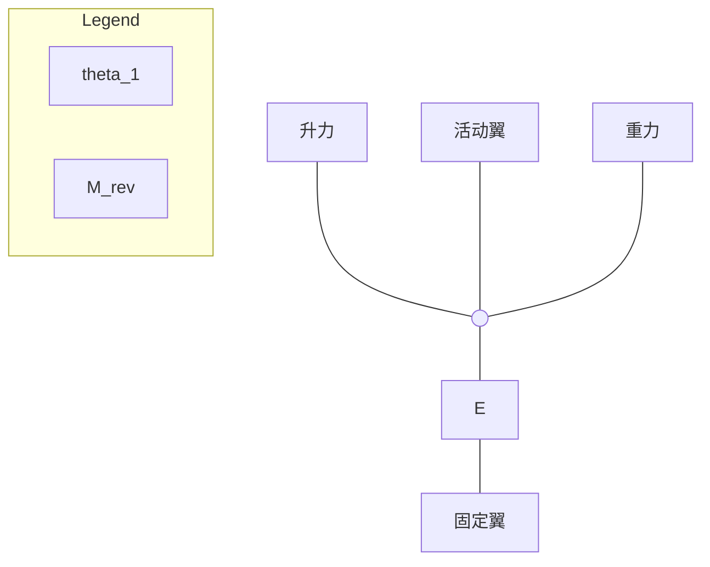

# 第 3 章 单-双折叠翼变体飞行器概念的发展和完善

## 3.1 引言

在 2015 年所提出的单-双折叠翼变体飞行器概念的基础上，本章将进一步发展和完善优化这一新概念。相较于原始的单-双折叠翼变体飞行器概念，在本文的发展和完善中，变体的机构将进一步简化，变体的控制方式、驱动方式和应用场景也得到了进一步明确。

单-双折叠翼变体飞行器使用气动力驱动完成变体，相较于传统变体方式，在结构、重量、体积等方面付出的代价更小，优势更加突出。在本章中，将首先详尽阐述单-双折叠翼变体的变体方式和气动力驱动变体的控制方式。其后，将介绍单-双折叠翼变体飞行器的飞行剖面和应用场景。最后讨论了单-双折叠翼变体相对于其他现有变体方式的优缺点。

## 3.2 单-双折叠翼变体飞行器的概念

### 3.2.1 单-双折叠翼变体飞行器的变体方式

单-双折叠翼变体飞行器有单翼和双翼两种模式，通过变体进行切换，如图 3.1 所示。其机翼分为两部分：固定机翼（内、下机翼）和活动机翼（外、上机翼），两部分机翼之间由连杆连接。活动机翼围绕连杆上的铰链旋转，连杆围绕固定机翼上的铰链旋转，变体的过程就是通过这两个旋转的配合实现的。在起降状态下，固定机翼与活动机翼组成双翼式布局，此时飞机具有较小的翼展、对起降场地要求较低、并具有较好的低空低速飞行性能；在巡航状态下，固定机翼和活动机翼组成大展弦比单翼布局，此时飞机具有较好的巡航升阻比。在从双翼构型到单翼构型的变体过程中，两个活动机翼首先与机身解除固定，随后向上向外运动，带动连杆向外旋转，直到活动机翼与固定机翼端面对接，活动机翼与固定机翼通过相应的固定锁定机构固连在一起，最终成为一架大展弦比单翼机；在从单翼构型到双翼构型的变体过程中，两个活动机翼首先与固定机翼解除固定，随后两个活动机翼向上向内运动，带动连杆向内旋转，直到活动机翼与机身对应的机构对接，平行地固定在活动机翼上方，形成一架上下双翼式布局的飞机。

相较于初始的单-双折叠翼变体飞行器方案，本文所提出的方案取消了原有方案中的螺旋桨等机构，使得变体机构得到了进一步简化，代价进一步降低。

单-双折叠翼变体飞行器的变体过程示意图，展示了双翼模式、单翼模式以及变体过程中的活动翼、连杆和固定翼。

图 3.1 单-双折叠翼变体飞行器的变体过程

在双翼构型下，飞机的翼展相较于单翼构型减少了接近 50%，除因上下机翼的干扰损失少部分升力外，有效升力面积基本不变，这使得飞机可以在更小的空间下起降。由于翼展的降低，飞机的转动惯量降低，机翼刚度和强度增加，具有更好的抗侧风、突风能力和更强的空中机动性能，有效地克服了大展弦比飞行器存在的诸多缺点。除此之外，两个机翼与连杆之间形成了稳固的桁架结构，飞机结构强度相较于普通双翼机更进一步增强，可以承受更大的起降过载和突风过载，也更适用于舰载起降等对结构强度要求较高的应用场景。

在单翼构型下，飞机的展弦比相较于双翼状态增加了一倍，极大地减少了飞机的诱导阻力，提高了飞机的升阻比，增加了飞机的航程。

单-双折叠翼变体飞行器的变体过程是通过气动力控制完成的。其中，连杆与固定机翼和活动机翼之间均为铰接。机翼的变体运动可以分解为连杆绕固定机翼的公转和活动机翼围绕连杆的自转，如图 3.2 所示。每个活动机翼在左右两侧各自设有一段副翼。在变体过程中，通过对副翼的偏转控制，使活动机翼的升力矢量的方向和大小发生改变，从而控制活动机翼的运动。

当飞机准备从单翼状态变体为双翼状态时，活动机翼的副翼将适当上偏，使活动机翼的升力降低至与其自身重力相当，此后使活动机翼解除与固定机翼的锁定，如图 3.3（a）所示；变体开始后，活动机翼的副翼开始下偏，升力增加，驱动机翼向上运动，如图 3.3（b）所示；在变体的后半段，活动机翼的副翼转变为上偏，升力降低，驱动机翼向下运动，如图 3.3（c）所示；两段副翼在向上或向

下偏转的同时，还会产生一定量的差动，使活动机翼产生滚转力矩，从而控制活动机翼的姿态，如图 3.3（d）所示；在整个变体过程中，通过自转和公转的协调，活动机翼和固定机翼可以保持平行或略微倾斜；在变体结束后，活动机翼的副翼保持上偏，使活动机翼的升力降低至略小于重力，此后活动机翼完成与机身的固定，变体结束，副翼恢复至正常状态。机翼从双翼到单翼的变体过程与上述变体过程相反。

单-双折叠翼变体过程中的自转与公转示意图，标注了自由铰链、自转角和公转角

图 3.2 单-双折叠翼变体过程中的自转与公转

变体前活动机翼副翼上偏的示意图

（a）变体前，活动机翼的副翼上偏，使机翼升力与重力刚好抵消，从而解开机翼固定

副翼下偏时活动机翼向上运动的示意图

（b）当副翼下偏时，活动机翼的升力增加，机翼向上运动

图 3.3 气动力驱动的单-双折叠翼变体过程

飞行器副翼上偏示意图，显示机翼向下运动

（c）当副翼上偏时，活动机翼的升力降低，机翼向下运动

飞行器副翼差动示意图，显示机翼向一侧自转

（d）当两个副翼差动时，产生滚转力矩，控制机翼自转

续图 3.3 气动力驱动的单-双折叠翼变体过程

在此变体过程中，每个活动机翼增加了自转和公转两个自由度，而每段机翼的副翼提供两个控制输入，每一侧的机翼变体均为双输入双输出控制系统。变体过程中全机为 10 自由度系统。

在单-双折叠翼变体飞行器中，每侧的固定机翼与活动机翼之间的连杆并不局限为一个，可以为两个或多个。当每侧机翼间有两个连杆，且两个连杆沿机翼弦向平行放置时（图 3.4a），连杆的抗弯和抗扭性能得到增强，但也增加了变体机构和结构的复杂度，此时机翼自转和公转的自由度不变（图 3.4b），连杆不传递机翼升力带来的弯矩；当三根杆呈三角形分布时（图 3.4b）, 不同的杆与内外机翼组成了平行四边形结构，此时机翼的抗扭刚度进一步增强，同时活动机翼与固定机翼将始终保持平行，即自转角和公转角始终相等，变体的自由度减少为 1，控制的难度降低，但连杆需要传递机翼升力带来的弯矩。

固定机翼与活动机翼之间的延机翼弦向平行布置两根连杆的飞行器示意图

（a）固定机翼与活动机翼之间的延机翼弦向平行布置两根连杆

固定机翼与活动机翼之间以三角形分布平行布置三根连杆的飞行器示意图

（b）固定机翼与活动机翼之间以三角形分布平行布置三根连杆

图 3.4 固定机翼与活动机翼之间的连杆为两个或多个时的情况

### 3.2.2 单-双折叠翼变体飞行器的应用场景和飞行剖面

单-双折叠翼变体技术有多种应用方向，一方面，可以在现有大展弦比飞行器的基础上，通过折叠缩减翼展，使飞行器在巡航性能不变的情况下，降低对起降跑道的要求，提高起降过载，提高低速性能，如实现大展弦比无人机在航母舰载起降，大展弦比民用飞机在小型通航机场或简易跑道起降。另一方面，则可以在起降翼展不变的情况下，进一步增大飞机的巡航翼展，以拓宽飞机的飞行包线，或增加航程。

在正常飞行过程中，飞机的活动机翼和固定机翼均提供升力，在变体过程中，通过副翼的偏转，活动机翼的升力与自身的重力基本抵消，需要通过增加固定机翼的升力来补偿副翼偏转带来的升力损失，以保证飞行的稳定，这需要机翼的升力和副翼的舵效有足够的冗余，否则可能会导致失速。

单-双折叠翼变体的应用对象为巡航高度较高的长航时飞行器，变体过程将在飞机的飞行包线内选择合适的高度和速度进行。以“全球鹰”为原准机，图 3.5 显示了典型的变体飞行剖面。飞机以双翼构型起飞，起飞后速度增加至

400km/h，飞行高度爬升至 3000m 左右，此时飞行的来流动压较高，平飞所需的升力系数较低，机翼和副翼有足够的线性升力和气动力冗余，只需要很小的副翼偏转就可以完成升力控制，在此工况下完成变体后，飞机进一步爬升至巡航高度开始长时间巡航，巡航结束后，飞机再次下降高度至相同工况，完成单翼到双翼的折叠变体，以双翼构型降落。

| Altitude (m) | Ascent/Cruise Phase   | Descent/Landing Phase |
| ------------ | --------------------- | --------------------- |
| 20000 m      | V ≈ 600km/h, CL ≈ 1.2 | V ≈ 600km/h, CL ≈ 0.8 |
| 3000 m       | V ≈ 400km/h, CL ≈ 0.4 | V ≈ 400km/h, CL ≈ 0.3 |
| 0 m          | V ≈ 200km/h, CL ≈ 1.2 | V ≈ 160km/h, CL ≈ 1.2 |

图 3.5 单-双折叠翼变体飞机的典型飞行剖面

## 3.3 单-双折叠翼变体飞行器的优势

### 3.3.1 单-双折叠翼变体与其他变体方式的比较

变体飞行器在改善了飞行性能的同时，在重量、结构、可靠性等方面也带来了诸多代价，变体的代价过大，无法匹配其带来的收益，是变展长变体飞行器发展的最大阻碍。表 3.1 为单-双折叠翼变体与其他变体方式的收益代价比较，对比的对象包括 Z 型折叠翼，充气式伸缩翼，桁架伸缩翼，硬壳式伸缩翼，折叠翼尖，变后掠等多种变展长变体构型。

单-双折叠翼变体可以缩小机翼的一半展长，不弱于目前所有的主流变展长变体方案；单-双折叠翼变体除了在双翼状态下因上下机翼的干扰损失约 10%的升力，基本不改变飞机的有效升力面积，相比之下，传统的机翼折叠变体在折叠状态下会大幅损失有效升力面积，虽然缩减了飞机的起降翼展，但也大幅增加了起飞速度，减低了低速性能；在重量、体积和复杂度方面，单-双折叠翼变体使用气

动力控制变体，无需复杂的驱动机构和作动器，使得变体的机构得以大幅度简化，不破坏机翼原有的结构，而大部分变展长变体方案则机构复杂，甚至完全破坏了原有的机翼结构；单-双折叠翼变体在变体过程中活动机翼的升力和重力大多相互抵消，连接结构只需传递活动机翼的阻力和阻力引起的扭矩，可有效降低对连杆和铰链的强度和刚度要求，减轻结构重量，对于机翼容积的侵占也较小；在气动力的连续性方面，单-双折叠翼变体对机翼蒙皮的破坏较少，同时由于活动机翼平行变化，机翼的气动中心、压心、重心变化较小，变体对飞机的安定性影响较小；在适应性方面，单-双折叠翼变体采用气动力驱动变体，其驱动力主要来自于机翼自身的副翼，更适用于大尺寸的大展弦比机翼。综合来看，在相近的变展长能力下，单-双折叠翼变体的性能在多个方面显著优于其他变体方式。

表 3.1 单-双折叠翼变体方案与其它变展长变体方案的比较

|                    | 单-双折叠翼 | Z 型折叠翼 | 充气式伸缩翼   | 桁架伸缩翼 | 折叠翼尖   | 变后掠         | 硬壳式伸缩翼 |
| ------------------ | ----------- | ---------- | -------------- | ---------- | ---------- | -------------- | ------------ |
| 最小展长/最大展长  | 50%         | 约 60%     | 最大 50%       | 50%        | 80%-90%    | 约 60%         | 约 50%       |
| 变体前后升力变化   | 10%         | 50%以上    | 同展长变化     | 同展长变化 | 同展长变化 | 较小           | 同展长变化   |
| 结构重量和复杂程度 | ★★★         | ★★         | ★★★            | ★★         | ★★★        | ★★             | ★            |
| 容积侵占           | ★★★         | ★★         | ★★★            | ★          | ★★★        | ★★             | ★            |
| 对原有结构的破坏   | ★★★         | ★★         | ★★★            | ★          | ★★★        | ★★             | ★            |
| 气动连续性         | 较好        | 较差       | 较好           | 较差       | 较好       | 较好           | 较差         |
| 其他               | ——          | ——         | 不适用大型飞机 | ——         | ——         | 不适用大展弦比 | ——           |

注：表中★的多少代表了性能的优劣

### 3.3.2 气动力驱动变体与作动器直接驱动变体的比较

传统的变体飞行器，一般采用作动器直接驱动变体，即由作动器直接产生力和力矩驱动变体机构，但是这种驱动方式对作动器的要求较大，尤其是对于大型飞机而言，随着飞机重量、飞行速度和机翼尺寸的增加，变体所需要的力矩迅速增大，使得在飞机上安装相应的作动器变得异常困难。

与传统的变体方式相比，气动力驱动变体是通过驱动副翼或其他气动舵面的偏转来改变机翼的流场结构，进而改变机翼的气动力和气动力矩，驱动机翼完成变体，这种驱动方式只需要在现有的副翼和副翼作动器上进行改进和增强即可，而不需要复杂的作动器和机构。

图 3.6 显示了一个典型的副翼上下偏转时，机翼的压力分布变化。当副翼向上或向下偏转时，空气动力在副翼铰链处产生相反的力矩，这需要副翼作动器提供足够的铰链力矩来克服，以 3.2.2 节中以全球鹰为原准机的单-双折叠翼变体飞行器为例，驱动其副翼偏转 20 度，作动器所需要的克服的铰链力矩约 $2000\text{ N}\cdot\text{m}$。

机翼压力分布变化示意图

图 3.6 当副翼偏转时，压力分布变化使副翼铰链处产生相反的力矩

如果使用作动器直接驱动代替气动驱动来完成相同的变体，则需要作动器来抵抗整个活动机翼的升力。此时，如图 3.7 所示，机翼旋转所需的驱动力矩约为：

$$M_{\text{rev}} = (L_{\text{w}} - G_{\text{w}})l \cos \theta_1 \tag{3-1}$$

其中，$M_{\text{rev}}$ 为驱动活动机翼公转所需的作动器力矩，$L_{\text{w}}$ 为活动机翼的升力，$G_{\text{w}}$ 为活动机翼的重力，$l$ 为连杆长度，$\theta_1$ 为公转角度。若仍以全球鹰为原准机，此时驱动变体所需要的作动器力矩约为 $7 \times 10^5\text{ N}\cdot\text{m}$，是气动力驱动变体所需副翼铰链力矩的 300 多倍，这充分体现了气动力驱动变体的优势。除了不需要使用复杂的作动器外，气动驱动变体方案还使连杆和铰链大大简化，进一步节省了大量结构重量。

图 3.7 作动器直接驱动变体时所需要的驱动力矩

为了更为全面的体现气动力驱动变体的优势，进一步选择了四种不同重量，不同尺寸的长航时固定翼飞机，包括 15 公斤级的单-双折叠翼变体原理验证机（详见 第 8 章）、600 公斤级 RX-1E 电动飞机、4 吨级 MQ-9 无人机和 12 吨级 RQ-4A 无人机，分别计算了这些大展弦比飞机使用气动力驱动折叠变体所需要的铰链力矩、作动器直接驱动变体所需要作动器力矩、以及机翼的容积，如 图 3.8 所示。可以看出，气动驱动变体所需的力矩，对于不同尺寸的飞机，均比作动器直接驱动变体所需要的力矩低 2.5 个数量级左右。同时，随着飞机尺寸的增加，变体所需的力矩增长速度远高于机翼容积的增长速度，这意味着飞机的重量越大，安装作动器越加困难，气动驱动变体的优势也愈加突出。

| 飞机型号              | 飞机重量/kg | 气动力驱动变体所需要的副翼铰链力矩/N·m | 作动器直接驱动变体所需的作动器力矩/N·m | 机翼容积/m³ |
| --------------------- | ----------- | -------------------------------------- | -------------------------------------- | ----------- |
| 单-双折叠翼原理验证机 | 15          | 0.2                                    | 40                                     | 0.05        |
| RX-1E                 | 600         | 25                                     | 5000                                   | 0.8         |
| MQ-9                  | 4000        | 400                                    | 80000                                  | 2           |
| RQ-4A                 | 12000       | 2000                                   | 400000                                 | 7           |

图 3.8 四种不同飞机上应用气动力驱动变体和作动器直接驱动变体所需的力矩比较

## 3.4 本章小结

针对现有变展长变体技术的缺陷，发展和完善了单-双折叠翼变体飞行器的新概念，这种新型飞行器使用气动力驱动变体，有效解决了现有变体技术在结构重量和空间侵占等方面代价大，难以应用于大展弦比飞行器的缺陷。

本章首先介绍了单-双折叠翼变体飞行器的概念和气动力驱动变体的概念，讨论了单-双折叠翼变体飞行器的应用场景和飞行剖面。其后分别分析了单-双折叠翼变体和气动力驱动变体相较于已有变体方式的优势，单-双折叠翼变体在变展长能力达到 50%的基础上，其变体前后有效升力面积不变，结构简单，重量成本和

容积侵占低，对机翼原有结构破坏少，对大展弦比飞行器的适配性显著优于其他变体方案；气动力驱动变体所需的副翼铰链力矩相较于作动器直接驱动变体的作动器力矩低 2.5 个数量级左右，且飞机的尺寸越大，优势越突出。