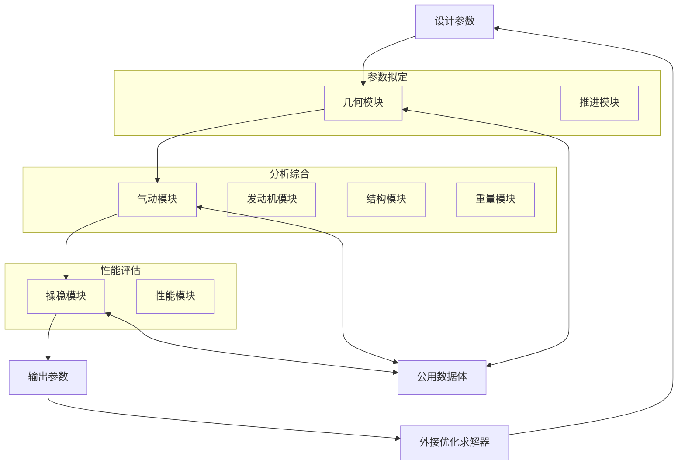
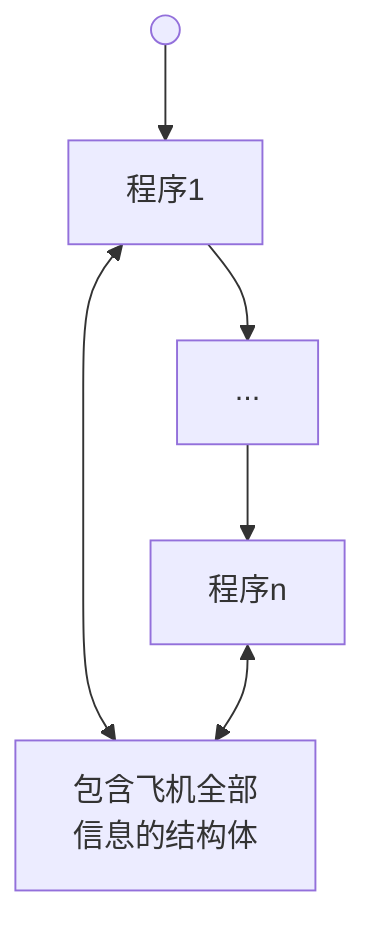
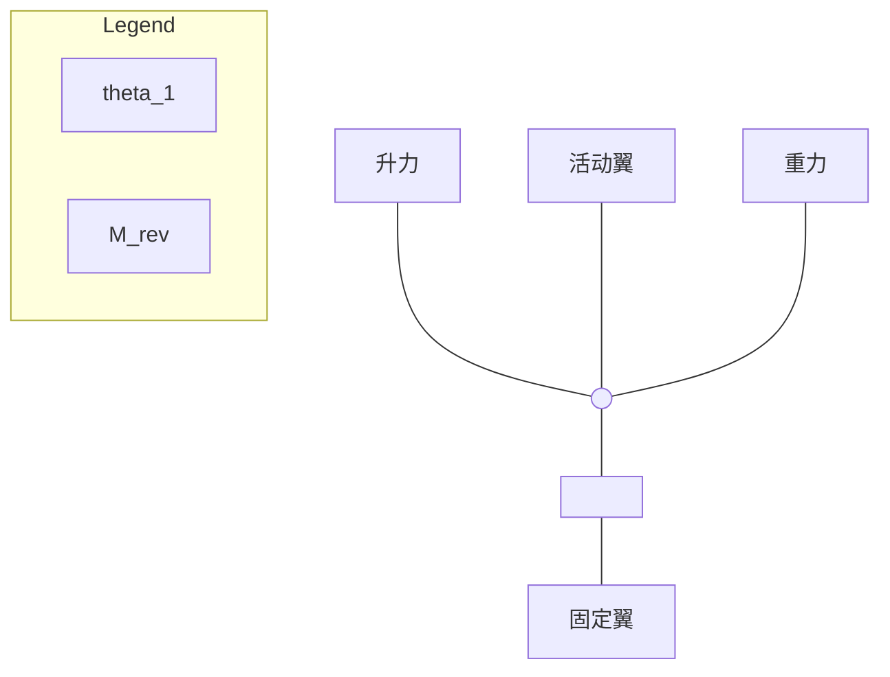
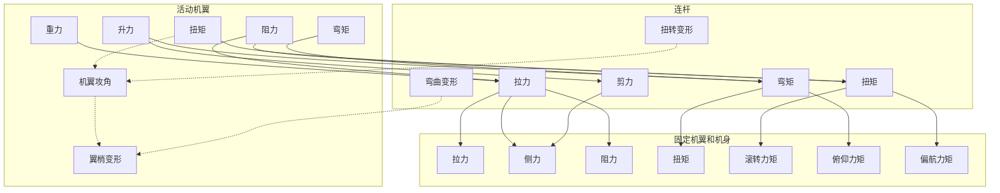
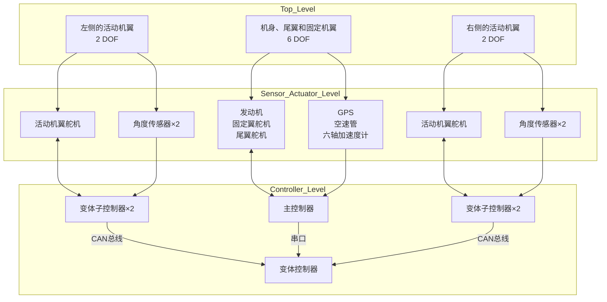

# 单-双折叠翼变体飞行器
## 总体设计研究
(申请清华大学工学博士学位论文)

*
*
*
*

二〇二三年五月

# Research on the Overall Design of the Monoplane-Biplane Morphing Aircraft

Dissertation Submitted to

**Tsinghua University**

in partial fulfillment of the requirement for the degree of

**Doctor of Philosophy**

in

**Aeronautical and Astronautical Science and Technology**

by

**Guo Tingyu**

Dissertation Supervisor: Professor Chen Haixin

# 学位论文公开评阅人和答辩委员会名单

## 公开评阅人名单

| 任玉新 | 教授 | 清华大学 |
| 曾宏刚 | 研究员 | 中国航空研究院 |

## 答辩委员会名单

| 主席 | 何国威 | 研究员 | 中国科学院力学研究所 |
| 委员 | 张旭辉 | 研究员 | 中国航天科技创新研究院 |
| 钱战森 | 研究员 | 中国航空工业空气动力研究院 |
| 符松 | 教授 | 清华大学 |
| 任玉新 | 教授 | 清华大学 |
| 陈海昕 | 教授 | 清华大学 |
| 张宇飞 | 副教授 | 清华大学 |
| 秘书 | 李润泽 | 博士后 | 清华大学 |

# 摘 要

大展弦比长航时飞行器在飞行器发展中占有重要地位。对于亚声速飞行器来说，增大机翼的展弦比，是降低诱导阻力，提高巡航升阻比的最有效手段。但大展弦比飞行器也存在着对起降跑道要求高、抗风能力差的缺陷。变展长变体技术可以使飞机在起降和巡航两个飞行阶段拥有不同的翼展和气动外形，进而解决大展弦比飞行器的性能缺陷，但现有的变展长变体技术往往在结构增重、空间侵占等方面付出过高的代价，进而抵消了变体带来的性能收益。

为此，本文发展和完善了一种单-双折叠翼变体飞行器的新概念。这种变体飞行器使用气动力驱动变体，在获得 50%变展长能力的同时，极大降低了变体所需要付出的各方面代价，在多个方面优于现有的变展长变体飞行器。在这一新概念的基础上，进一步开展了单-双折叠翼变体的气动特性研究、动力学和控制研究、结构机构设计研究。在气动特性研究中，重点分析了单-双折叠翼变体飞行器在双翼构型下的气动特性、变体过程中的气动特性以及气动力驱动变体的副翼特性，总结形成了单-双折叠翼变体飞行器的气动设计规律和设计准则；在动力学和控制研究中，建立了单-双折叠翼变体的动力学模型，明确了单-双折叠翼变体的控制方案，并进一步讨论了变体对于飞机稳定性的影响；在变体的结构机构设计研究中，分析了变体过程中机翼和机构的传力路径和受力特性，并进一步以“全球鹰”无人机为原准机，开展了变体机构的强度刚度设计，形成了单-双折叠翼变体飞行器结构设计方案。此后，基于以上三项研究内容，进一步开展了单-双折叠翼变体飞行器总体设计方法研究，分析了单-双折叠翼变体飞行器总体设计中气动、结构、控制等多个学科之间的耦合作用，明确了其设计约束和设计准则，发展了适用于单-双折叠翼变体飞行器的飞机总体参数拟定方法和平面形状设计方法，并进一步分析单-双折叠翼变体的收益和代价。

最后，本文还开展了单-双折叠翼变体的原理验证研究，研制了单-双折叠翼变体原理验证机并开展了空中变体飞行试验和地面车载变体试验。通过这些试验，充分验证了单-双折叠翼变体概念的合理性和可行性，综合检验了论文中所形成的单-双折叠翼变体飞行器设计方法。

**关键词：**变体飞行器；大展弦比长航时飞行器；飞机总体设计；飞机气动设计；原理验证机

# Abstract

High aspect ratio long-endurance aircraft plays an important role in the development of aircraft. For subsonic aircraft, increasing the aspect ratio is the most effective way to reduce the induced drag and improve the cruise lift-drag ratio. However, aircraft with a high aspect ratio also has the defects of high requirements for takeoff /landing runways and poor wind resistance. The variable-span morphing technology can make the aircraft have different wingspan and aerodynamic shapes in the two flight phases of takeoff/landing and cruise, thus solving the performance defects of the high-aspect-ratio aircraft. However, the existing variable-span morphing technology often pays a high price in terms of structural weight gain, space occupation, and so on, thus offsetting the performance benefits brought by the morphing.

To this end, this dissertation developed and perfected a new concept of monoplane-biplane morphing aircraft. This morphing aircraft uses aerodynamics to drive morphing, which greatly reduces the cost of the morphing and is superior to the existing morphing aircraft in many aspects while obtaining the variable-wingspan capability of 50%. Based on this new concept, the research on aerodynamic characteristics, dynamics and control, and structural mechanism design of the monoplane-biplane morphing aircraft were further carried out. In the study of aerodynamic characteristics, the aerodynamic characteristics in the biplane configuration, the aerodynamic characteristics during the morphing process, and the aileron characteristics of the aerodynamic-driven morphing were emphatically analyzed, and the aerodynamic design regular pattern and criteria are summarized; In the research of dynamics and control, the dynamics model of the monoplane-biplane morphing is established, the control scheme was defined, and the influence of the morphing on the aircraft stability was further discussed; In the structural mechanism design research of the morphing, the force transmission path and force characteristics of the wing and morphing mechanism during the morphing process were analyzed, and the strength and stiffness design of the variant mechanism was further carried out with the "Global Hawk" UAV as the original aircraft, forming the structural design scheme of the monoplane-biplane morphing aircraft. Since then, based on the above three research contents, the research on the overall design method of the monoplane-biplane morphing aircraft, analyzed the coupling between the aerodynamics,

structure, control, and other disciplines in the overall design of the monoplane-biplane morphing aircraft were carried out, its design constraints and design criteria were clarified, and the aircraft overall parameter formulation method and plane shape design method applicable to the monoplane-biplane morphing aircraft were developed. The benefits and costs of the monoplane-biplane morphing were further analyzed.

Finally, this dissertation also carried out the principal verification research of the monoplane-biplane morphing, developed the monoplane-biplane morphing principle verification UAV, and carried out the flight morphing test and the ground vehicle morphing test. Through these tests, the rationality and feasibility of the concept of the monoplane-biplane morphing aircraft were fully verified, and the design method of monoplane-biplane morphing aircraft formed in this dissertation was also comprehensively verified.

**Keywords:** Morphing aircraft; Large aspect ratio long-endurance aircraft; Aircraft overall design; Aircraft aerodynamic design; Principal verification aircraft

# 目 录

摘 要 I
Abstract II
目 录 IV
插图清单 VII
附表清单 XIII
符号和缩略语说明 XIV
第 1 章 绪论 1
1.1 研究背景 1
1.2 大展弦比长航时飞行器的发展现状 1
1.2.1 国内外大展弦比长航时飞行器的发展情况 1
1.2.2 大展弦比飞行器的缺陷 4
1.3 变展长变体飞行器的发展现状 6
1.4 本文的主要研究工作 13
第 2 章 大展弦比变展长变体飞行器设计规律研究 16
2.1 引言 16
2.2 研究方法 16
2.3 变展长变体飞行器的设计准则和收益分析 18
2.3.1 气动最优下飞机的最优展弦比 18
2.3.2 气动-结构重量最优下的飞机最优展弦比 19
2.3.3 应用变体技术的大展弦比飞机收益代价边界 21
2.4 本章小结 22
第 3 章 单-双折叠翼变体飞行器概念的发展和完善 24
3.1 引言 24
3.2 单-双折叠翼变体飞行器的概念 24
3.2.1 单-双折叠翼变体飞行器的变体方式 24
3.2.2 单-双折叠翼变体飞行器的应用场景和飞行剖面 28
3.3 单-双折叠翼变体飞行器的优势 29
3.3.1 单-双折叠翼变体与其他变体方式的比较 29

3.3.2 气动力驱动变体与作动器直接驱动变体的比较 30
3.4 本章小结 32

# 第 4 章 单-双折叠翼变体飞行器的气动特性研究 34
4.1 引言 34
4.2 双翼布局的气动特性研究 34
* 4.2.1 研究背景和研究方法 34
* 4.2.2 双翼的二维空气动力学特性 35
* 4.2.3 双翼的三维空气动力学特性 52
* 4.2.4 连杆对双翼布局的气动特性影响 61
4.3 变体过程中的空气动力学特性研究 62
* 4.3.1 研究方法 62
* 4.3.2 变体过程中的气动力变化 64
* 4.3.3 变体过程中的非定常效应 68
4.4 气动力驱动变体的副翼特性研究 70
4.5 本章小结 75

# 第 5 章 单-双折叠翼变体飞行器的动力学和控制研究 77
5.1 引言 77
5.2 单-双折叠翼变体的动力学方程及控制方法 77
* 5.2.1 机翼变体的 2 自由度动力学分析 77
* 5.2.2 单-双折叠翼变体的全机 10 自由度动力学分析 80
5.3 变体对飞机操稳特性的影响和失效安全性 82
5.4 本章小结 86

# 第 6 章 单-双折叠翼变体飞行器的结构机构设计研究 87
6.1 引言 87
6.2 单-双折叠翼变体飞行器变体过程中的受力特性 87
6.3 单-双折叠翼变体飞行器的变体机构设计 94
* 6.3.1 连杆的设计和性能分析 94
* 6.3.2 考虑变体的机翼结构设计 99
6.4 本章小结 101

# 第 7 章 单-双折叠翼变体飞行器总体设计方法研究 102
7.1 引言 102
7.2 单-双折叠翼变体飞行器的初始总体参数拟定 103

7.2.1 单-双折叠翼变体飞行器的飞行包线与变体包线 103
7.2.2 单-双折叠翼变体飞行器的总体参数拟定 104
7.3 单-双折叠翼变体飞行器的几何外形设计研究 106
7.3.1 单-双折叠翼变体几何外形设计的设计约束和设计目标 106
7.3.2 单-双折叠翼变体飞行器的几何外形设计 107
7.3.3 单-双折叠翼变体飞行器的气动舵面设计 111
7.4 单-双折叠翼变体飞行器的收益代价研究 115
7.4.1 单-双折叠翼变体飞行器的代价估算方法 115
7.4.2 单-双折叠翼变体的收益代价评估 117
7.5 本章小结 121
**第 8 章 单-双折叠翼变体飞行器的原理验证研究** 122
8.1 引言 122
8.2 原理验证机的设计方案 122
8.2.1 原理验证机的设计目标 122
8.2.2 原理验证机的详细设计方案 123
8.3 原理验证机的测试和试飞 130
8.3.1 车载变体测试 130
8.3.2 基本飞行试验 133
8.3.3 变体飞行试验 135
8.4 本章小结 144
**第 9 章 总结与展望** 145
**参考文献** 148
**致 谢** 156
# 第 1 章 绪论

## 1.1 研究背景

固定翼的长航时飞行器在侦察监视、资源普查、环境监测、通信中继、救灾等军用和民用领域均发挥着重要作用，也是未来飞行器发展的重要方向之一。此类飞行器大多飞行在 10000 米以上的平流层，飞行速度为亚声速，发挥“大气层卫星”的作用。由于高空空气稀薄，来流动压较低，为了产生足够的升力，高空飞行器的巡航升力系数较高，而诱导阻力又近似正比于升力系数的平方，因此诱导阻力在其总阻力中占比较大。提高展弦比是降低飞机诱导阻力的最直接方法，为了提高气动效率、扩大航程，高空长航时飞行器往往采用大展弦比乃至超大展弦比的设计，其展弦比普遍在 20 以上。

但另一方面，大展弦比飞机在使用中也存在着诸多缺点：大展弦比飞机的翼展较大，如 10 吨级的“全球鹰”无人机翼展与 70 吨级的大型民用客机波音 737 相当，需要足够空间的大型跑道才能完成起降，而在军用领域和民用领域，大展弦比飞机都有在小型机场、航母、民用船舶等有限空间内起降的使用需求；除此之外，大展弦比飞机的低空飞行和抗侧风、抗突风性能较差，对气象条件的要求较高，这些都极大的限制了大展弦比飞机的发展。

近年来，变体飞行器逐渐成为飞行器发展探索的热点。通过变体技术，在飞机的不同飞行阶段改变机翼展长，可以有效的解决大展弦比飞机起降与巡航性能之间的设计矛盾。现有的变展长变体方式包括变后掠、折叠翼尖、柔性桁架、充气机翼、伸缩翼等等，但这些变体方式存在着机构复杂、重量代价大、对机翼空间侵占多等缺点。为此，开发出一种适用性更强的变展长变体技术，可以进一步增强大展弦比飞行器的飞行性能，扩展其适用范围。

## 1.2 大展弦比长航时飞行器的发展现状

### 1.2.1 国内外大展弦比长航时飞行器的发展情况

对于亚声速飞行器来说，零升阻力和诱导阻力是飞机总阻力的两个主要组成部分。其阻力可以表示为：

$$ C_D = C_{D0} + C_{Di} = C_{D0} + \frac{C_L^2}{\pi e AR} \qquad (1-1) $$

其中 $C_D$ 为飞机的阻力系数，$C_{D0}$ 为飞机的零升阻力系数，$C_{Di}$ 为飞机的诱导阻力系数，$C_L$ 为飞机的升力系数，$e$ 为奥斯瓦尔德因子，$AR$ 为飞机的展弦比。飞机零升阻力的主要组成部分是摩擦阻力，减阻比较困难，而诱导阻力则反比于飞机的展弦比。因此，提高飞机的展弦比，是飞机降低阻力、增大航程最有效和最直接的方法之一。在过去几十年间，飞机设计师们也在不断的追求增大飞机的展弦比，提升飞机的航程。

大展弦比平直机翼是最常见的大展弦比布局形式，平直机翼结构简单，气动效率高，有利于高空亚声速巡航，长期以来是飞行器的主流设计方案。美国 RQ-4“全球鹰”无人机（图 1.1）是大展弦比平直机翼布局的典型代表，通过先进的复合材料机翼结构，“全球鹰”系列无人机的展弦比在 25 以上，翼展接近 40m，其巡航飞行高度约 19000m，最大巡航升阻比达到了 28 以上，航程达 20000km 以上。除了“全球鹰”之外，大部分高空长航时军用飞机也都采用大展弦比平直机翼，如美国 U-2 高空侦察机，以色列“苍鹭”系列高空侦察机，空客公司与美国陆军联合开发的“西风”太阳能无人机等。

全球鹰无人机在飞行中

图 1.1 全球鹰无人机①

大展弦比机翼可以极大地降低飞机的诱导阻力，提高飞机的升阻比，但随着展弦比的增加，机翼变得更加细长，所需要的结构重量也随之增加，同时机翼的气动弹性等结构问题也逐渐突出，为此，人们在大展弦比平直机翼的基础上进一步开发出了连接翼布局、支撑翼布局、双/多机身布局等其他布局形式，以期望突破大展弦比飞行器发展的瓶颈，获得更佳的飞行性能。

对于连接翼布局的研究最早起源于 80 年代的美国航空航天局(NASA)，连接翼布局使用前后串列的机翼排列成菱形，和常规布局相比，连接翼布局菱形的

① 图片来源于网络

结构更有利于机翼的受力，结构重量更轻，连接翼布局的机翼后掠角较大，具有更好的跨声速性能和侧向力控制能力。中国空军装备的无侦-7 无人侦察机（图 1.2）即采用了连接翼布局。

无侦-7 无人机实物图

图 1.2 无侦-7 无人机①

双/多机身布局飞机通过两个或多个机身的设计，使机翼分为多段，降低了机身根部的弯矩负载，使得飞机拥有较常规布局更大的展弦比，如美国“白骑士 2 号”（图 1.3）。现有的众多太阳能无人机也都采用双/多机身布局的设计，如美国 Facebook 公司研制的用于通信的 Aquila 太阳能无人机，中国航空工业集团公司第一飞机设计研究院研制的启明星 50 太阳能无人机等。

白骑士二号飞行器实物图

图 1.3 白骑士二号飞行器

支撑翼布局也同样是降低机翼负载，增加机翼展弦比的创新布局形式之一。支撑翼飞机的概念最早出现在上世纪 50 年代，并在近年来成为商业运输机未来

布局发展的希望之星。目前美国航空航天局已经与波音公司合作开展了跨声速桁架-支撑翼大展弦比客机的研制工作，计划于 2028 年首飞（图 1.4）。

波音支撑翼大展弦比概念客机方案的 3D 渲染图，展示了一架带有支撑翼结构的客机在云层上空飞行。

图 1.4 波音支撑翼大展弦比概念客机方案

两个或多个较小展弦比的飞机分别起飞，在空中通过翼尖对接的方式组成一架大展弦比的飞机，是近年兴起的大展弦比飞机发展的另一个全新方案，目前已经有国内外多个研究团队开展了相关研究工作。

图 1.5 展示了不同年代的典型的大展弦比飞行器的翼展，可以看出，随着技术的进步和新型布局的不断出现，飞行器的展弦比和翼展也不断突破新的记录。

| 年代 | 翼展/m | 型号 |
| 1955 | 31 | U2 |
| 1986 | 34 | “旅行者”号 |
| 1998 | 40 | “全球鹰” |
| 2001 | 75 | “太阳神” |
| 2005 | 80 | “全球观察者” |
| 2019 | 117 | Stratolaunch |

图 1.5 不同年代的大展弦比飞行器的翼展

### 1.2.2 大展弦比飞行器的缺陷

大展弦比飞行器在获得较高巡航性能的同时，也带来了诸多的问题与挑战。最突出的问题之一是，大展弦比飞行器起降与巡航性能的矛盾。

在机翼面积相同的情况下，展弦比越大，飞机的翼展越大。高空长航时飞机

往往都具有巨大的翼展，这对机场的跑道宽度、净空条件等均提出了较高的要求。而在实际应用中，大展弦比飞机经常面临着在有限空间起降的需求。在军用领域，大展弦比长航时飞机面临随航母或两栖攻击舰舰载部署的任务需求，例如美国军队的 U-2 高空侦察机就进行过舰载起降的相关实验（图 1.6），但由于 U-2 的翼展过大，十分不利于航母甲板的调度和部署，最终没有实现部署。除舰载部署之外，大展弦比长航时飞行器也也面临着在前线简易机场起降的需求，美国空军将可在强对抗环境中强韧运作的前沿基地作为其装备发展的重要目标之一，美国通用原子公司为此专门研发了一种可在前线机场进行起降的长航时无人机“莫哈韦”（图 1.7）。在民用领域，随着通航产业和民用无人机行业的迅速发展，以及机场资源的日趋紧张，也迫切需求发展能在小型跑道乃至普通路面起降的大展弦比民用无人机。大展弦比飞机翼展与起降性能的矛盾已经愈发突出。

美国军队在航母进行 U-2 高空侦察机的起降试验照片

图 1.6 美国军队在航母进行 U-2 高空侦察机的起降试验①

通用原子公司“莫哈韦”无人机照片

图 1.7 通用原子公司“莫哈韦”无人机②

大展弦比飞机的另一个缺点是对气象条件要求较高，大展弦比飞机的机翼结

① 图片来源于网络。

② 图片来源于网络。

构细长，机翼气动弹性等问题十分突出，飞机的抗突风、抗侧风能力孱弱，这也十分不利于飞机的起降和起降前后的低空低速飞行。例如 2003 年，NASA 主导研制的“太阳神”高空长航时无人机在海上遭遇突风后解体坠毁（图 1.8）；2016 年，Facebook 的公司的一架 Aquila 太阳能无人机因遭遇湍流，机翼出现结构性故障导致坠毁。除此之外，大展弦比飞机在起降时也极易发生翼尖擦地事故（图 1.9）。

“太阳神”无人机在飞行中及遭遇突风后解体的照片

图 1.8 “太阳神”无人机遭遇突风后解体

U-2 侦察机在跑道上起降时翼尖接近地面的照片

图 1.9 U-2 侦察机起降时极易发生擦地事故①

## 1.3 变展长变体飞行器的发展现状

近年来，变体飞行器逐渐成为飞行器发展探索的热点之一。而变体技术也为解决大展弦比飞机的缺点提供了新的思路。通过变体技术，在飞机的不同飞行阶段改变机翼的展长，可以有效的解决大展弦比飞机起降与巡航性能之间的设计矛盾。

最早期的变体飞行器多采取变后掠翼或折叠翼尖的方式实现。对于变后掠翼

① 图片来源于网络。

飞机的研究最早起源于 20 世纪 40 年代，世界上第一种成熟的变后掠翼飞行器是 1964 年首飞的 F-111 战斗轰炸机（图 1.10）。其在亚声速飞行时机翼向前转动，此时飞机的展弦比较大，后掠角较小，飞机的低速和起降性能较好；在超声速飞行时则机翼向后转动，此时飞机的后掠角增大，有利于降低激波阻力，提高飞行性能。此后，变后掠翼技术在 70 年代得到了进一步发展，出现了 F-14、B-1、Tu-160 等众多型号。近年来，随着材料、结构等技术的进步，对变后掠机翼的研究重新兴起。

F-111 可变后掠翼战斗轰炸机在不同飞行状态下的对比图

图 1.10 F-111 可变后掠翼战斗轰炸机

折叠翼尖的典型代表是 1964 年首飞的 XB-70 轰炸机（图 1.11），XB-70 采用了大三角翼的设计，其翼尖与主机翼之间以铰链连接，在高速飞行时 XB-70 的翼尖可以向下折叠，一方面破坏掉部分升力，有利于超声速配平，另一方面也起到垂直安定面的作用。

XB-70 轰炸机在地面停放时的全景图

图 1.11 XB-70 轰炸机

这一时期的变体飞行器，其变体的目标主要是为了满足飞机在亚声速和超声速下对于飞行性能的不同需求，而并非是改变飞机的展长，但也在一定程度上发挥了变展长的优势，如 F-14 舰载战斗机可以在航母停放时机翼后掠，从而缩小自

己的翼展和占地面积。这些变体飞行器由于机构复杂、重量代价大、维护困难等因素在随后被淘汰，但也为变体飞行器的发展带来了宝贵的经验。

进入 21 世纪以来，随着控制、材料等学科的进步，变体技术的发展迎来了新的高峰。2004 年，在美国国防部高级研究计划局（DARPA）的主导下，洛克希德.马丁公司为美军研制了一款 Z 字形折叠翼变体飞机，使用电作动器驱动，这款变体飞行器开创了新时期变体飞行器发展的先河；此后洛马公司又研发了“鸬鹚”潜射无人机，这种无人机采用了类似于海鸥形状的机翼，机翼可以折叠并容纳在潜艇发射管中进行发射。这两种折叠翼飞行器如图 1.12 所示。

洛克希德.马丁公司的两款折叠翼飞行器展示图

图 1.12 洛克希德.马丁公司的两款折叠翼飞行器

同样在 DARPA 主导下，NextGen Aeronautics 公司提出了一种滑动蒙皮的机翼变体方案，通过机翼蒙皮的滑动可以改变机翼的面积和后掠角，进而改变飞机的翼展，如图 1.13 所示。

NextGen Aeronautics 公司滑动蒙皮的机翼变体方案对比图

图 1.13 NextGen Aeronautics 公司滑动蒙皮的机翼变体方案

在 DARPA 的带动下，变体飞行器的发展进入了一个高潮。此后涌现了一大批变展长的机翼变体方案，其主要类型有折叠翼、伸缩翼、柔性变体机翼等等。
2008 年，Kheong 等人研发了一种使用充气式机翼来改变飞机展长的变体方

案，如图 1.14 所示，这种飞机分为内侧的固定机翼和外侧的充气机翼两部分，通过对外侧机翼的充气和放气，可以调整飞机的机翼面积和翼展。

Kheong 等人研发的充气伸缩式机翼变体方案实物图

图 1.14 Kheong 等人研发的充气伸缩式机翼变体方案

除了充气式伸缩机翼之外，2011 年，Mestrinho 等人提出了一种小型无人机的变展长方案，机翼的固定部分为硬壳式结构，机翼的活动部分可以在固定的硬壳内滑动并通过伺服电机驱动，如图 1.15 所示。

Mestrinho 等人提出的硬壳式伸缩翼变体方案实物对比图

图 1.15 Mestrinho 等人提出的硬壳式伸缩翼变体方案

综合利用记忆合金和柔性蒙皮等新型材料、新型作动器、变形结构完成变体是变展长机翼发展的另一个趋势。Lesieutre 等人设计了一种使用柔性桁架改变展长的变体机翼；在这种方案中，机翼的翼肋之间通过桁架连接，通过桁架的变形可以调整翼肋的间距，从而实现机翼的伸缩，如图 1.16 所示。

Lesieutre 等人设计的柔性桁架变展长机翼示意图及实物图

图 1.16 Lesieutre 等人设计的使用柔性桁架改变展长的变体机翼

Ajaj 等人利用泊松比为零的蜂窝结构和弹性蒙皮研发了一种变展长的变体机翼，并验证了相应的齿轮机构和连杆机构，其理论上的变形量可以达到 100%，在实际测试中变形量达到了 20% ，如图 1.17 所示。

Ajaj 等人研发的基于 0 泊松比蜂窝结构的变展长机翼原理图及实验照片

图 1.17 Ajaj 等人研发的基于 0 泊松比的蜂窝结构和弹性蒙皮的变展长机翼

利用仿生学开展变体飞行器的设计同样是变体飞行器研发的一种新思路。2019 年，Ajanic 等人根据北苍鹰等鸟类的飞行特点，研发了一种仿鸟的变体飞行器，可以同时改变机翼和尾翼的展长，如图 1.18 所示。

Ajanic 等人研发的仿鸟变体飞行器与真实鸟类飞行姿态对比图

图 1.18 Ajanic 等人研发的仿鸟变体飞行器

除了新的折叠方案之外，变后掠、折叠翼尖等传统的变体方案也再次得到应用，如波音 777-X 飞机上首次使用了折叠翼尖，用于在滑行或停车时减少翼展，如图 1.19 所示。折叠翼尖技术不仅可以减少飞机的起飞/着陆翼展，在未来也有望兼作气动安定面，提高飞机的滚转稳定性和抗侧风能力。

Boeing 777X aircraft showing the folded wingtip technology on the ground.

图 1.19 波音 777-X 上所使用的折叠翼尖

在国内，对变展长变体机翼的研究起步相对较晚，但近几年也同样涌现了较多方案。王礼佳提出了一种多级伸缩式的伸缩翼变体方案，如图 1.20 所示。其机翼分为多段，每两段之间均可以进行伸缩。

Experimental setup of a multi-stage telescopic morphing wing showing extended and retracted states.

图 1.20 王礼佳等人研发的多级伸缩式的伸缩机翼

李智等人提出了一种使用菱形结构进行驱动的伸缩翼变体方案，如图 1.21 所示；这种机翼通过菱形结构驱动板式导轨完成机翼的伸缩。

李智等人提出的使用菱形结构进行驱动的伸缩机翼方案示意图，标注有连杆1、连杆2、铰链1、板式导轨、外翼固接架、锁紧块等部件。

图 1.21 李智等人提出的使用菱形结构进行驱动的伸缩机翼方案

张祖豪提出了一种具有连续蒙皮的伸缩翼方案，如图 1.22 所示。这种机翼的活动机翼伸出之后可以向外展开，使得活动机翼和固定机翼之间保持连续。

张祖豪提出的具有连续蒙皮的伸缩机翼方案实验模型照片，展示了机翼在不同状态下的形态。

图 1.22 张祖豪提出的具有连续蒙皮的伸缩机翼方案

| 现有变展长变体技术的缺点 |
| --- |
图 1.23 现有变展长变体技术的缺点

尽管变展长变体技术在过去的一段时间取得了长足发展，但是这些变体技术的应用仍面临着较大的问题。图 1.23 列举了现有变展长变体方式的缺陷和不足，以新型机械结构为主导的变展长变体飞行器，如 Z 字型折叠翼，机械结构驱动的伸缩翼等，在结构重量增加、飞机空间占用等方面付出的代价过高，使得变体技

术带来的收益无法抵消其付出的各方面代价；以新型材料和结构为主导的变展长变体飞行器，如柔性伸缩蒙皮、充气式伸缩翼等，目前技术成熟度还很低，变形尺度较小，其结构强度也无法满足大型飞行器的需求。综合来看，这些变展长变体方案并不适用于大展弦比的大型长航时飞机。为此，提高变体技术的性能收益，降低变体技术的综合代价，是未来变体技术发展的必经之路。

为此，2015 年，清华大学陈海昕课题组提出了一种新的单-双折叠翼变体飞行器的概念，这种变体飞行器具有单翼和双翼两种模式，可以有效解决大展弦比飞行器起降与巡航性能的矛盾，如图 1.24 所示。这种新的变体飞行器在获得较大变展长能力的同时，具有较低的变体代价。本文将在此新概念的基础上，进一步完善和细化单-双折叠翼变体飞行器的概念，并开展单-双折叠翼变体飞行器的设计方法研究和原理验证。

Diagram of a single-double folding wing morphing aircraft concept showing components like movable wing section, engine, control surface, propeller, movable arm, fixed wing section, and fuselage. Below the labeled diagram is a 3D perspective view of the aircraft in its dual-wing configuration.

图 1.24 2015 年清华大学陈海昕提出的单-双折叠翼变体方案

## 1.4 本文的主要研究工作

本文以一种新概念的单-双折叠翼变体飞行器为研究目标。本文首先通过

对大展弦比变展长变体飞行器的多学科总体分析，明确了变展长变体技术的应用边界，发展完善了气动力驱动的单-双折叠翼变体的新概念。

在气动力驱动的单-双折叠翼变体新概念基础上，主要开展了两部分的研究：第一部分是单-双折叠翼变体飞行器的设计方法研究，包括单-双折叠翼变体飞行器的气动特性研究，单-双折叠翼变体的动力学与控制研究，单-双折叠翼变体飞行器的结构机构设计研究，并总结上述研究成果，形成了单-双折叠翼变体飞机多学科总体设计方法；第二部分是单-双折叠翼变体飞行器的原理验证研究，设计和研制了 6m 翼展的单-双折叠翼变体原理验证机，并开展了空中折叠变体试验和相关地面试验，实现了单-双折叠翼变体技术的原理验证。

本文第 1 章为绪论，主要阐述了论文的研究背景，介绍了大展弦比长航时飞行器以及变展长变体飞行器的历史和发展现状，对大展弦比飞行器和变展长变体飞行器发展中的主要问题进行了总结归纳。

第 2 章使用多学科总体设计方法，对变展长变体技术应用于大展弦比长航时飞行器的应用前景和设计规律展开了分析。本章首先研究了升阻比与航程、展弦比与升阻比、展弦比与重量的等价关系，探讨了大展弦比长航时飞行器设计规律；其后，以“全球鹰”为原准机，具体分析了变展长变体技术的收益与代价，获得了变展长变体技术的收益边界。这一章中所形成的设计方法也将进一步对后续飞机的总体设计方法研究提供指导。

第 3 章发展和完善了气动力驱动的单-双折叠翼变体概念，本章首先阐述了单-双折叠翼变体的变体方式，气动力驱动变体的控制方式和单-双折叠翼变体的应用场景，最后分析了单-双折叠翼变体相较于传统变体方式的优点。

第 4 章为单-双折叠翼变体的气动特性研究，本章首先使用数值计算方法，分析了不同设计参数的双翼飞机的气动特性，并结合现有的双翼理论，进一步探讨了双翼布局的气动力设计方法；其后，对单-双折叠翼变体飞行器在变体过程中的气动特性及其变化规律开展研究，分析了变体过程中的非定常效应，以及变体过程中气动力变化对飞机气动稳定性的影响；最后，对气动力驱动变体过程中舵面偏转所产生的气动力及其变化规律展开了研究。

第 5 章为单-双折叠翼变体的动力学和控制研究，本章首先建立单-双折叠翼变体的 2 自由度动力学模型和全机的 10 自由度动力学模型，并根据动力学模型，分析了单-双折叠翼变体的动力学特性和控制特性，确定了单-双折叠翼变体的控制方法，研究了变体对于飞机操稳特性的影响和变体的失效安全性。

第 6 章为单-双折叠翼变体的结构机构设计研究，本章首先根据前两章中

单-双折叠翼变体飞行器气动、动力学和控制的研究结果，分析了单-双折叠翼变体飞行器在变体过程中的受力特性和结构特性。在此基础上，以“全球鹰”为原准机，对连杆等核心结构的力学特性展开计算和分析，讨论了单-双折叠翼变体飞行器的结构机构设计方案；。

第 7 章为单-双折叠翼变体的多学科总体设计方法研究。本章首先分析了单-双折叠翼变体在飞机总体设计中引入的新要求、新参数、新约束，研究了单-双折叠翼变体飞行器的初始总体参数拟定方法；结合第 4-6 章的研究结果，以及飞机平面外形设计参数对单-双折叠翼变体的影响和气动力驱动变体对飞机气动舵面设计的要求，形成了单-双折叠翼变体飞行器的几何外形设计方法；在此基础上，以 RQ-4A“全球鹰”无人机为例，进一步分析了单-双折叠翼变体的收益代价。

第 8 章为单-双折叠翼变体的原理验证研究，基于气动力驱动的单-双折叠翼变体新概念，设计和研制了 6m 翼展的单-双折叠翼变体大展弦比原理验证机，并完成了验证机的地面测试和空中变体测试。试飞结果充分验证了单-双折叠翼变体的可行性，检验了 4-7 章所形成的单-双折叠翼变体飞行器设计方法。

# 第 2 章 大展弦比变展长变体飞行器设计规律研究

## 2.1 引言

机翼的展弦比是飞行器设计的最重要参数之一，大展弦比机翼可以降低诱导阻力，提高气动效率，增加航程。但另一方面，增加展弦比会使机翼根部弯矩增加，导致机翼结构重量增加，使得飞机的有效载荷和燃油携带量降低。因此，飞机的展弦比不能无限扩展，必须平衡气动、结构、重量等多个学科，并结合起降场地和气象条件限制等约束，为飞行器选择最优的翼展和展弦比。将变展长变体技术应用于飞行器，则意味着原有的设计约束被打破，飞机在原有的设计约束下有望获得更大的展弦比和更高的气动效率。

另一方面，尽管变展长变体技术在过去的一段时间取得了长足发展，但是这些变体技术的应用仍面临着较大的阻碍。一个突出的问题是：现有的大部分变体技术，在结构重量增加、机翼空间占用等方面付出的代价过高，使得变体技术带来的收益无法抵消其付出的代价。为此，也需要明确变体技术的收益代价边界，以便对变展长变体飞行器的设计和应用提供明确指导。

在本章中，基于课题组自主研发的 ACADO 多学科总体设计平台，综合分析了大展弦比飞行器气动-重量-性能的等价关系，以“全球鹰”为原准机，讨论了大展弦比变展长变体飞行器的设计规律，得出了变展长变体技术应用于大展弦比飞行器的收益边界。本章中对于展弦比设计规律和变体技术收益代价边界的研究，也为后文中飞机的总体设计方法研究打下了基础。

## 2.2 研究方法

本章将使用课题组自主研发的多学科总体设计工具 ACADO ，对变体飞行器的总体性能进行评估。ACADO 采用模块化设计，同时耦合了重量、结构、推进、气动等多个模块，其计算流程如图 2.1 所示。

ACADO 总体设计平台是基于 matlab 二次开发而来，包括参数拟定、分析综合、性能评估三个主要组成部分。在使用中，首先由用户输入飞机的主要设计参数和设计指标，包括飞行器的核心重量参数、几何尺寸约束、飞行性能和飞行包线、平面形状、发动机参数等，这些参数通过 ACADO 的参数拟定模块，进一步生成飞机的详细几何形状、发动机参数、大气参数、推重比、翼载荷、初始重量

等等；拟定好的参数再通过分析综合模块，计算出飞机的气动性能、重量参数、操稳参数等；最后再通过性能评估模块计算飞的起降特性，操纵稳定性等飞行性能。

ACADO 中的所有模块通过一个公用的数据块进行数据交互，并以飞机的最大起飞重量为目标进行迭代求解，每一个迭代循环都对飞机所有性能参数进行一次运算和更新，直到最大起飞重量收敛，计算停止。求解结束后 ACADO 将飞机的气动、结构重量分布、操稳特性、航程、起降距离等性能数据进行输出。ACADO 计算核心的控制流和数据流如图 2.2 所示。

图 2.1 ACADO 的模块和结构

图 2.2 ACADO 计算核心程序的控制流和数据流

在气动模块，ACADO 集成了 friction、idrag 等快速气动计算程序计算飞机的升力、摩擦阻力和诱导阻力，并结合一些半经验方法预测升力、各项阻力以及动导数。

ACADO 的重量结构模块采用了部件级的工程梁模型法和双板层模型法，即将机翼的结构分解为梁、肋、蒙皮、增升装置等结构分别计算结构重量。对于梁等核心承力结构，首先根据气动模块的计算结果确定其压力分布，再计算其结构受力，最后根据相应的梁模型或板模型估算其结构重量，对于蒙皮，增升装置等次要结构，将使用一些半经验方法计算其结构重量。

ACADO 的模块化结构适合于新概念飞行器的总体设计与分析，对于新概念布局所带来的非常规的计算问题，可以进行专门的计算和修正。ACADO 曾应用于支撑翼布局飞机、自然层流飞机等新概念飞行器的分析和设计，并取得良好效果。在变体飞行器的总体设计研究中，对于不同模态下的气动特性、变体机构的增重等缺乏经验公式和数据支撑的估算，将先建立物理模型，使用数值仿真等手段进行计算，再根据计算结果对 ACADO 原有的计算模型进行修正。

## 2.3 变展长变体飞行器的设计准则和收益分析

### 2.3.1 气动最优下飞机的最优展弦比

增大飞机的展弦比有助于减小飞机的诱导阻力，但另一方面，飞机的气动效率也并非随着展弦比增大而无限增加，在公式（1-1）基础上，进一步计算飞机的升阻比，可以得到：

$$ L / D = C_L / (C_{D0} + C_{Di}) = C_L / \left( C_{D0} + \frac{C_L^2}{\pi e AR} \right) \quad (2-1) $$

对该式进一步分析可以得到，当

$$ C_L = \sqrt{C_{D0}} \cdot \sqrt{\pi e AR} \quad (2-2) $$

即飞机的零升阻力系数 $C_{D0}$ 和诱导阻力系数 $C_{Di}$ 相同时，飞机的升阻比最大。根据此结论，可以计算出固定翼飞机在不同升力系数和零升阻力系数下对应的最优展弦比，如图 2.3 所示。

以一般的民航客机为例，其巡航升力系数一般在 0.5-0.6 左右，零升阻力系数在 0.02-0.025 左右，对应的气动最优展弦比在 10 左右，最大升阻比在 18 左右；对于高空飞行器来说，由于高空空气稀薄，其巡航飞行的升力系数较高，诱导阻力系数也更大，因而其气动最优展弦比也相较于一般飞行器更大，以“全球鹰”

为例，其巡航升力系数在 1.1 左右，零升阻力系数在 0.02 左右，对应的气动最优展弦比在 35 左右，但由于结构强度、起降翼展等方面的限制，实际的展弦比在 27 左右。除此之外，高空飞行时的雷诺数较低，易于实现层流，随着层流减阻等技术的发展，高空飞行器的摩擦阻力有望进一步降低，其气动最优展弦比也将进一步增大。

| 巡航升力系数 | 零升阻力系数0.010 | 零升阻力系数0.015 | 零升阻力系数0.020 | 零升阻力系数0.025 | 零升阻力系数0.030 |
| --- | --- | --- | --- | --- | --- |
| 0.2 | 3 | 2 | 2 | 2 | 1 |
| 0.4 | 12 | 10 | 8 | 7 | 6 |
| 0.6 | 27 | 22 | 19 | 17 | 15 |
| 0.8 | 48 | 39 | 34 | 30 | 27 |
| 1.0 | 60 | 50 | 43 | 38 | 34 |
| 1.2 |  | 60 | 52 | 46 | 41 |

图 2.3 固定翼飞机在不同巡航升力系数和零升阻力系数下对应的气动最优展弦比

## 2.3.2 气动-结构重量最优下的飞机最优展弦比

飞机在增大展弦比的同时，翼根弯矩也进一步增大，进而使机翼的结构重量增加，导致飞机载荷和燃油携带降低。因此，在飞机的展弦比设计中还需要考虑到结构重量-气动效率的平衡。在本节中，将以 RQ-4A“全球鹰”无人机为例，进一步开展讨论。

以 RQ-4A 为原准机，在最大起飞重量、机翼面积、飞行工况、发动机参数和飞机其他设计参数不变的情况下，使用 ACADO 计算飞机的气动性能随展弦比变化的情况，如图 2.4 所示。可以看出，随着展弦比的增加，飞机的诱导阻力系数降低，但降低趋势逐步放缓，而飞机的零升阻力系数基本不变，飞机升阻比的增长趋势也逐步放缓。另一方面，图 2.5 显示了飞机的重量随展弦比增加变化的情况，随着飞机展弦比的增加，机翼的翼根弯矩增加，机翼结构重量也近似线性增加，在最大起飞重量相同的情况下，飞机的有效载荷和燃油携带也相对减少。

| 展弦比 | 升阻比 | 总阻力系数 | 零升阻力系数 | 诱导阻力系数 |
| --- | --- | --- | --- | --- |
| 10 | 14.5 | 0.068 | 0.020 | 0.048 |
| 15 | 20.0 | 0.050 | 0.020 | 0.030 |
| 20 | 24.0 | 0.042 | 0.021 | 0.021 |
| 25 | 27.5 | 0.037 | 0.022 | 0.015 |
| 30 | 30.0 | 0.035 | 0.022 | 0.013 |
| 35 | 32.0 | 0.033 | 0.022 | 0.011 |
| 40 | 33.5 | 0.032 | 0.022 | 0.010 |
| 45 | 35.0 | 0.031 | 0.022 | 0.009 |

图 2.4 “全球鹰”的巡航阻力系数和升阻比随展弦比变化的情况

| 展弦比 | 最大起飞重量/kg | 使用空重/kg | 全机结构重量/kg | 机翼结构重量/kg |
| --- | --- | --- | --- | --- |
| 10 | 12100 | 5200 | 2700 | 800 |
| 15 | 12100 | 5400 | 2900 | 1000 |
| 20 | 12100 | 5600 | 3100 | 1300 |
| 25 | 12100 | 5700 | 3300 | 1600 |
| 30 | 12100 | 5900 | 3500 | 1800 |
| 35 | 12100 | 6100 | 3700 | 2000 |
| 40 | 12100 | 6300 | 3900 | 2200 |
| 45 | 12100 | 6500 | 4100 | 2400 |

图 2.5 “全球鹰”的重量随展弦比变化的情况

图 2.6 进一步显示了“全球鹰”航程随展弦比变化的情况，随着展弦比的增加，飞机的升阻比提高，而燃油携带逐渐减少，当展弦比在 30 左右时，飞机的航程达到了最大值，即“全球鹰”的气动-结构重量最优展弦比在 30 左右。

| 展弦比 | 航程/km |
| --- | --- |
| 10 | 13500 |
| 15 | 16800 |
| 20 | 18500 |
| 25 | 19500 |
| 30 | 19800 |
| 35 | 19500 |
| 40 | 19000 |
| 45 | 18200 |

图 2.6 “全球鹰”的航程随展弦比变化的情况

在实际设计中，除了考虑气动效率-结构重量的平衡外，飞机的展弦比也受到起降场地宽度，起降过载，抗风性能等诸多设计因素的限制，其实际展弦比也一般小于考虑结构重量后的最优展弦比。如“全球鹰”无人机早期型号的展弦比在 25 左右，后期型号的展弦比增加至 27 左右。

### 2.3.3 应用变体技术的大展弦比飞机收益代价边界

变展长变体技术可以在飞机飞行的不同阶段改变自身展长，打破原有的设计约束，拓展飞机的飞行包线，改善飞机在不同阶段的飞行性能。另一方面，变体所需要的机构结构也将付出一定的重量代价和空间代价，增加飞机的空重，侵占飞机的容积，进而侵占飞机的燃油，减小飞机的航程，削弱飞机的性能。如果一种变体技术的代价过高，不足以平衡其带来的性能优势，这种变体技术将不具有实用价值。为此，在变体飞行器设计中，需明确变体的收益代价及其边界。

对于大展弦比飞机来说，通过变体减小起降翼展，使飞机满足在航母、小型机场等有限空间起降的需求，是变展长变体技术的最主要应用背景。仍以 RQ-4A “全球鹰”无人机为例，其翼展近 40 米，若想实现航母起降，则其起降翼展需减小 50% 至 20 米左右。为此，在保持飞机的最大起飞重量和机翼面积不变的情况下，分别计算了在不同重量代价下，应用变体技术减少了 50%起降翼展后 RQ-4A 的航程随起降翼展的变化情况，如图 2.7 所示。

| 起降翼展/m | RQ-4A原准机 | 忽略变体增重 | 变体增重3% | 变体增重5% | 变体增重10% | 变体增重20% |
| --- | --- | --- | --- | --- | --- | --- |
| 10 |  | 11500 | 11000 | 10500 | 9500 | 8000 |
| 15 |  | 16500 | 15500 | 14500 | 13000 | 11000 |
| 20 | 8000 | 20500 | 19000 | 17500 | 15500 | 13000 |
| 25 | 13000 | 19500 | 18000 | 16500 | 14500 | 12000 |
| 30 | 17000 | 16500 | 15000 | 14000 | 12000 | 10000 |
| 35 | 19500 |  |  |  |  |  |
| 40 | 20000 |  |  |  |  |  |
| 45 | 19000 |  |  |  |  |  |
| 50 | 17500 |  |  |  |  |  |
| 55 | 15500 |  |  |  |  |  |

图 2.7 在不同重量代价下，应用变体技术减少了 50%起降翼展后 RQ-4A 的航程随起降翼展的变化情况

可以看出，当飞机的起降翼展被限制在 20 米，且忽略变体机构的增重时，变体 RQ-4A 的航程在 20000km 左右，相较于翼展同样限制为为 20 米的 RQ-4A 原准机航程增加了一倍以上，当变体的增重为全机的 3%-5%最大起飞

重量时，变体 RQ-4A 的航程仍然十分可观；当变体的增重为全机 10%最大起飞重量时，变体 RQ-4A 仍有较大的航程收益；当变体的增重为全机的 20%最大起飞重量时，变体 RQ-4A 相较于相同起降翼展的 RQ-4A 原准机已经几乎无法取得航程收益。

图 2.8 则显示了在不同空间代价下，应用变体技术减少了 50%起降翼展后 RQ-4A 的航程随起降翼展的变化情况。可以看出，变体机构对于飞机油箱的侵占也同样会影响飞机的航程，当变体机构侵占了 2000L 油箱时，其航程损失与变体机构增重 10%时的效果相当。

| 起降翼展/m | RQ-4A原准机 | 缩减50%起降翼展的变体RQ-4A(忽略油箱侵占) | 缩减50%起降翼展的变体RQ-4A(变体侵占500升油箱) | 缩减50%起降翼展的变体RQ-4A(变体侵占1000升油箱) | 缩减50%起降翼展的变体RQ-4A(变体侵占1500升油箱) | 缩减50%起降翼展的变体RQ-4A(变体侵占2000升油箱) |
| --- | --- | --- | --- | --- | --- | --- |
| 10 |  | 11000 | 10800 | 10600 | 10400 | 10200 |
| 15 |  | 16500 | 15800 | 15100 | 14400 | 13700 |
| 20 |  | 19800 | 18800 | 17800 | 16800 | 15800 |
| 25 |  | 20200 | 19200 | 18200 | 17200 | 16200 |
| 30 | 16000 | 16000 | 15500 | 15000 | 14500 | 14000 |
| 35 | 18500 |  |  |  |  |  |
| 40 | 19500 |  |  |  |  |  |
| 45 | 19800 |  |  |  |  |  |
| 50 | 19500 |  |  |  |  |  |
| 55 | 18500 |  |  |  |  |  |

图 2.8 在不同空间代价下，应用变体技术减少了 50%起降翼展后 RQ-4A 的航程随起降翼展的变化情况

结合以上两点，在缩减 50%起降翼展的情况下，当变体机构增重不超过 10%最大起飞重量，变体机构的容积侵占不大于 2000L 时，可以取得较好的航程收益。但现有的伸缩翼，Z 型折叠翼等变体形式，需要强力的作动器来驱动变体，同时变体机构极大的破坏了机翼原有的结构形式，重量代价和空间代价均较高，难以满足现有大展弦比长航时飞行器的使用需求。

## 2.4 本章小结

本章主要开展了大展弦比变展长变体飞行器设计规律研究，借助于课题组自行开发的多学科总体设计优化平台 ACADO，本章首先分析了不同飞机的气动最优展弦比，其后，以“全球鹰”无人机作为原准机，分析了气动-结构重量最优的展弦比，讨论了飞机航程随展弦比变化的规律，最后，讨论了“全球鹰”应用变展长变体技术后的收益代价，结果表明，在缩减 50%起降翼展的情

况下，当变体的增重为小于 10%最大起飞重量，变体机构的容积侵占不大于 2000L 时，可以取得较好的收益。而现有的常见的变展长变体方案，在结构重量增加和容积侵占方面难以满足这一设计需求，为此，对于大展弦比长航时飞行器，迫切需要发展一种代价更低的变展长变体方案。

# 第 3 章 单-双折叠翼变体飞行器概念的发展和完善

## 3.1 引言

在 2015 年所提出的单-双折叠翼变体飞行器概念的基础上，本章将进一步发展和完善优化这一新概念。相较于原始的单-双折叠翼变体飞行器概念，在本文的发展和完善中，变体的机构将进一步简化，变体的控制方式、驱动方式和应用场景也得到了进一步明确。

单-双折叠翼变体飞行器使用气动力驱动完成变体，相较于传统变体方式，在结构、重量、体积等方面付出的代价更小，优势更加突出。在本章中，将首先详尽阐述单-双折叠翼变体的变体方式和气动力驱动变体的控制方式。其后，将介绍单-双折叠翼变体飞行器的飞行剖面和应用场景。最后讨论了单-双折叠翼变体相对于其他现有变体方式的优缺点。

## 3.2 单-双折叠翼变体飞行器的概念

### 3.2.1 单-双折叠翼变体飞行器的变体方式

单-双折叠翼变体飞行器有单翼和双翼两种模式，通过变体进行切换，如图 3.1 所示。其机翼分为两部分：固定机翼（内、下机翼）和活动机翼（外、上机翼），两部分机翼之间由连杆连接。活动机翼围绕连杆上的铰链旋转，连杆围绕固定机翼上的铰链旋转，变体的过程就是通过这两个旋转的配合实现的。在起降状态下，固定机翼与活动机翼组成双翼式布局，此时飞机具有较小的翼展、对起降场地要求较低、并具有较好的低空低速飞行性能；在巡航状态下，固定机翼和活动机翼组成大展弦比单翼布局，此时飞机具有较好的巡航升阻比。在从双翼构型到单翼构型的变体过程中，两个活动机翼首先与机身解除固定，随后向上向外运动，带动连杆向外旋转，直到活动机翼与固定机翼端面对接，活动机翼与固定机翼通过相应的固定锁定机构固连在一起，最终成为一架大展弦比单翼机；在从单翼构型到双翼构型的变体过程中，两个活动机翼首先与固定机翼解除固定，随后两个活动机翼向上向内运动，带动连杆向内旋转，直到活动机翼与机身对应的机构对接，平行地固定在活动机翼上方，形成一架上下双翼式布局的飞机。

相较于初始的单-双折叠翼变体飞行器方案，本文所提出的方案取消了原有方案中的螺旋桨等机构，使得变体机构得到了进一步简化，代价进一步降低。

单-双折叠翼变体飞行器的变体过程示意图，展示了双翼模式、单翼模式以及变体过程中的活动翼、连杆和固定翼。

图 3.1 单-双折叠翼变体飞行器的变体过程

在双翼构型下，飞机的翼展相较于单翼构型减少了接近 50%，除因上下机翼的干扰损失少部分升力外，有效升力面积基本不变，这使得飞机可以在更小的空间下起降。由于翼展的降低，飞机的转动惯量降低，机翼刚度和强度增加，具有更好的抗侧风、突风能力和更强的空中机动性能，有效地克服了大展弦比飞行器存在的诸多缺点。除此之外，两个机翼与连杆之间形成了稳固的桁架结构，飞机结构强度相较于普通双翼机更进一步增强，可以承受更大的起降过载和突风过载，也更适用于舰载起降等对结构强度要求较高的应用场景。

在单翼构型下，飞机的展弦比相较于双翼状态增加了一倍，极大地减少了飞机的诱导阻力，提高了飞机的升阻比，增加了飞机的航程。

单-双折叠翼变体飞行器的变体过程是通过气动力控制完成的。其中，连杆与固定机翼和活动机翼之间均为铰接。机翼的变体运动可以分解为连杆绕固定机翼的公转和活动机翼围绕连杆的自转，如图 3.2 所示。每个活动机翼在左右两侧各自设有一段副翼。在变体过程中，通过对副翼的偏转控制，使活动机翼的升力矢量的方向和大小发生改变，从而控制活动机翼的运动。

当飞机准备从单翼状态变体为双翼状态时，活动机翼的副翼将适当上偏，使活动机翼的升力降低至与其自身重力相当，此后使活动机翼解除与固定机翼的锁定，如图 3.3（a）所示；变体开始后，活动机翼的副翼开始下偏，升力增加，驱动机翼向上运动，如图 3.3（b）所示；在变体的后半段，活动机翼的副翼转变为上偏，升力降低，驱动机翼向下运动，如图 3.3（c）所示；两段副翼在向上或向

下偏转的同时，还会产生一定量的差动，使活动机翼产生滚转力矩，从而控制活动机翼的姿态，如图 3.3（d）所示；在整个变体过程中，通过自转和公转的协调，活动机翼和固定机翼可以保持平行或略微倾斜；在变体结束后，活动机翼的副翼保持上偏，使活动机翼的升力降低至略小于重力，此后活动机翼完成与机身的固定，变体结束，副翼恢复至正常状态。机翼从双翼到单翼的变体过程与上述变体过程相反。

单-双折叠翼变体过程中的自转与公转示意图，标注了自由铰链、自转角和公转角

图 3.2 单-双折叠翼变体过程中的自转与公转

变体前活动机翼副翼上偏的示意图

（a）变体前，活动机翼的副翼上偏，使机翼升力与重力刚好抵消，从而解开机翼固定

副翼下偏时活动机翼向上运动的示意图

（b）当副翼下偏时，活动机翼的升力增加，机翼向上运动

图 3.3 气动力驱动的单-双折叠翼变体过程

飞行器副翼上偏示意图，显示机翼向下运动

（c）当副翼上偏时，活动机翼的升力降低，机翼向下运动

飞行器副翼差动示意图，显示机翼向一侧自转

（d）当两个副翼差动时，产生滚转力矩，控制机翼自转

续图 3.3 气动力驱动的单-双折叠翼变体过程

在此变体过程中，每个活动机翼增加了自转和公转两个自由度，而每段机翼的副翼提供两个控制输入，每一侧的机翼变体均为双输入双输出控制系统。变体过程中全机为 10 自由度系统。

在单-双折叠翼变体飞行器中，每侧的固定机翼与活动机翼之间的连杆并不局限为一个，可以为两个或多个。当每侧机翼间有两个连杆，且两个连杆沿机翼弦向平行放置时（图 3.4a），连杆的抗弯和抗扭性能得到增强，但也增加了变体机构和结构的复杂度，此时机翼自转和公转的自由度不变（图 3.4b），连杆不传递机翼升力带来的弯矩；当三根杆呈三角形分布时（图 3.4b）, 不同的杆与内外机翼组成了平行四边形结构，此时机翼的抗扭刚度进一步增强，同时活动机翼与固定机翼将始终保持平行，即自转角和公转角始终相等，变体的自由度减少为 1，控制的难度降低，但连杆需要传递机翼升力带来的弯矩。

固定机翼与活动机翼之间的延机翼弦向平行布置两根连杆的飞行器示意图

（a）固定机翼与活动机翼之间的延机翼弦向平行布置两根连杆

固定机翼与活动机翼之间以三角形分布平行布置三根连杆的飞行器示意图

（b）固定机翼与活动机翼之间以三角形分布平行布置三根连杆

图 3.4 固定机翼与活动机翼之间的连杆为两个或多个时的情况

### 3.2.2 单-双折叠翼变体飞行器的应用场景和飞行剖面

单-双折叠翼变体技术有多种应用方向，一方面，可以在现有大展弦比飞行器的基础上，通过折叠缩减翼展，使飞行器在巡航性能不变的情况下，降低对起降跑道的要求，提高起降过载，提高低速性能，如实现大展弦比无人机在航母舰载起降，大展弦比民用飞机在小型通航机场或简易跑道起降。另一方面，则可以在起降翼展不变的情况下，进一步增大飞机的巡航翼展，以拓宽飞机的飞行包线，或增加航程。

在正常飞行过程中，飞机的活动机翼和固定机翼均提供升力，在变体过程中，通过副翼的偏转，活动机翼的升力与自身的重力基本抵消，需要通过增加固定机翼的升力来补偿副翼偏转带来的升力损失，以保证飞行的稳定，这需要机翼的升力和副翼的舵效有足够的冗余，否则可能会导致失速。

单-双折叠翼变体的应用对象为巡航高度较高的长航时飞行器，变体过程将在飞机的飞行包线内选择合适的高度和速度进行。以“全球鹰”为原准机，图 3.5 显示了典型的变体飞行剖面。飞机以双翼构型起飞，起飞后速度增加至

400km/h，飞行高度爬升至 3000m 左右，此时飞行的来流动压较高，平飞所需的升力系数较低，机翼和副翼有足够的线性升力和气动力冗余，只需要很小的副翼偏转就可以完成升力控制，在此工况下完成变体后，飞机进一步爬升至巡航高度开始长时间巡航，巡航结束后，飞机再次下降高度至相同工况，完成单翼到双翼的折叠变体，以双翼构型降落。

| Altitude (m) | Ascent/Cruise Phase | Descent/Landing Phase |
| --- | --- | --- |
| 20000 m | V ≈ 600km/h, CL ≈ 1.2 | V ≈ 600km/h, CL ≈ 0.8 |
| 3000 m | V ≈ 400km/h, CL ≈ 0.4 | V ≈ 400km/h, CL ≈ 0.3 |
| 0 m | V ≈ 200km/h, CL ≈ 1.2 | V ≈ 160km/h, CL ≈ 1.2 |

图 3.5 单-双折叠翼变体飞机的典型飞行剖面

## 3.3 单-双折叠翼变体飞行器的优势

### 3.3.1 单-双折叠翼变体与其他变体方式的比较

变体飞行器在改善了飞行性能的同时，在重量、结构、可靠性等方面也带来了诸多代价，变体的代价过大，无法匹配其带来的收益，是变展长变体飞行器发展的最大阻碍。表 3.1 为单-双折叠翼变体与其他变体方式的收益代价比较，对比的对象包括 Z 型折叠翼，充气式伸缩翼，桁架伸缩翼，硬壳式伸缩翼，折叠翼尖，变后掠等多种变展长变体构型。

单-双折叠翼变体可以缩小机翼的一半展长，不弱于目前所有的主流变展长变体方案；单-双折叠翼变体除了在双翼状态下因上下机翼的干扰损失约 10%的升力，基本不改变飞机的有效升力面积，相比之下，传统的机翼折叠变体在折叠状态下会大幅损失有效升力面积，虽然缩减了飞机的起降翼展，但也大幅增加了起飞速度，减低了低速性能；在重量、体积和复杂度方面，单-双折叠翼变体使用气

动力控制变体，无需复杂的驱动机构和作动器，使得变体的机构得以大幅度简化，不破坏机翼原有的结构，而大部分变展长变体方案则机构复杂，甚至完全破坏了原有的机翼结构；单-双折叠翼变体在变体过程中活动机翼的升力和重力大多相互抵消，连接结构只需传递活动机翼的阻力和阻力引起的扭矩，可有效降低对连杆和铰链的强度和刚度要求，减轻结构重量，对于机翼容积的侵占也较小；在气动力的连续性方面，单-双折叠翼变体对机翼蒙皮的破坏较少，同时由于活动机翼平行变化，机翼的气动中心、压心、重心变化较小，变体对飞机的安定性影响较小；在适应性方面，单-双折叠翼变体采用气动力驱动变体，其驱动力主要来自于机翼自身的副翼，更适用于大尺寸的大展弦比机翼。综合来看，在相近的变展长能力下，单-双折叠翼变体的性能在多个方面显著优于其他变体方式。

表 3.1 单-双折叠翼变体方案与其它变展长变体方案的比较

|  | 单-双折叠翼 | Z 型折叠翼 | 充气式伸缩翼 | 桁架伸缩翼 | 折叠翼尖 | 变后掠 | 硬壳式伸缩翼 |
| --- | --- | --- | --- | --- | --- | --- | --- |
| 最小展长/最大展长 | 50% | 约 60% | 最大 50% | 50% | 80%-90% | 约 60% | 约 50% |
| 变体前后升力变化 | 10% | 50%以上 | 同展长变化 | 同展长变化 | 同展长变化 | 较小 | 同展长变化 |
| 结构重量和复杂程度 | ★★★ | ★★ | ★★★ | ★★ | ★★★ | ★★ | ★ |
| 容积侵占 | ★★★ | ★★ | ★★★ | ★ | ★★★ | ★★ | ★ |
| 对原有结构的破坏 | ★★★ | ★★ | ★★★ | ★ | ★★★ | ★★ | ★ |
| 气动连续性 | 较好 | 较差 | 较好 | 较差 | 较好 | 较好 | 较差 |
| 其他 | —— | —— | 不适用大型飞机 | —— | —— | 不适用大展弦比 | —— |

注：表中★的多少代表了性能的优劣

### 3.3.2 气动力驱动变体与作动器直接驱动变体的比较

传统的变体飞行器，一般采用作动器直接驱动变体，即由作动器直接产生力和力矩驱动变体机构，但是这种驱动方式对作动器的要求较大，尤其是对于大型飞机而言，随着飞机重量、飞行速度和机翼尺寸的增加，变体所需要的力矩迅速增大，使得在飞机上安装相应的作动器变得异常困难。

与传统的变体方式相比，气动力驱动变体是通过驱动副翼或其他气动舵面的偏转来改变机翼的流场结构，进而改变机翼的气动力和气动力矩，驱动机翼完成变体，这种驱动方式只需要在现有的副翼和副翼作动器上进行改进和增强即可，而不需要复杂的作动器和机构。

图 3.6 显示了一个典型的副翼上下偏转时，机翼的压力分布变化。当副翼向上或向下偏转时，空气动力在副翼铰链处产生相反的力矩，这需要副翼作动器提供足够的铰链力矩来克服，以 3.2.2 节中以全球鹰为原准机的单-双折叠翼变体飞行器为例，驱动其副翼偏转 20 度，作动器所需要的克服的铰链力矩约 $2000\text{ N}\cdot\text{m}$。

机翼压力分布变化示意图

图 3.6 当副翼偏转时，压力分布变化使副翼铰链处产生相反的力矩

如果使用作动器直接驱动代替气动驱动来完成相同的变体，则需要作动器来抵抗整个活动机翼的升力。此时，如图 3.7 所示，机翼旋转所需的驱动力矩约为：

$$M_{\text{rev}} = (L_{\text{w}} - G_{\text{w}})l \cos \theta_1 \tag{3-1}$$

其中，$M_{\text{rev}}$ 为驱动活动机翼公转所需的作动器力矩，$L_{\text{w}}$ 为活动机翼的升力，$G_{\text{w}}$ 为活动机翼的重力，$l$ 为连杆长度，$\theta_1$ 为公转角度。若仍以全球鹰为原准机，此时驱动变体所需要的作动器力矩约为 $7 \times 10^5\text{ N}\cdot\text{m}$，是气动力驱动变体所需副翼铰链力矩的 300 多倍，这充分体现了气动力驱动变体的优势。除了不需要使用复杂的作动器外，气动驱动变体方案还使连杆和铰链大大简化，进一步节省了大量结构重量。

图 3.7 作动器直接驱动变体时所需要的驱动力矩

为了更为全面的体现气动力驱动变体的优势，进一步选择了四种不同重量，不同尺寸的长航时固定翼飞机，包括 15 公斤级的单-双折叠翼变体原理验证机（详见 第 8 章）、600 公斤级 RX-1E 电动飞机、4 吨级 MQ-9 无人机和 12 吨级 RQ-4A 无人机，分别计算了这些大展弦比飞机使用气动力驱动折叠变体所需要的铰链力矩、作动器直接驱动变体所需要作动器力矩、以及机翼的容积，如 图 3.8 所示。可以看出，气动驱动变体所需的力矩，对于不同尺寸的飞机，均比作动器直接驱动变体所需要的力矩低 2.5 个数量级左右。同时，随着飞机尺寸的增加，变体所需的力矩增长速度远高于机翼容积的增长速度，这意味着飞机的重量越大，安装作动器越加困难，气动驱动变体的优势也愈加突出。

| 飞机型号 | 飞机重量/kg | 气动力驱动变体所需要的副翼铰链力矩/N·m | 作动器直接驱动变体所需的作动器力矩/N·m | 机翼容积/m³ |
| --- | --- | --- | --- | --- |
| 单-双折叠翼原理验证机 | 15 | 0.2 | 40 | 0.05 |
| RX-1E | 600 | 25 | 5000 | 0.8 |
| MQ-9 | 4000 | 400 | 80000 | 2 |
| RQ-4A | 12000 | 2000 | 400000 | 7 |

图 3.8 四种不同飞机上应用气动力驱动变体和作动器直接驱动变体所需的力矩比较

## 3.4 本章小结

针对现有变展长变体技术的缺陷，发展和完善了单-双折叠翼变体飞行器的新概念，这种新型飞行器使用气动力驱动变体，有效解决了现有变体技术在结构重量和空间侵占等方面代价大，难以应用于大展弦比飞行器的缺陷。

本章首先介绍了单-双折叠翼变体飞行器的概念和气动力驱动变体的概念，讨论了单-双折叠翼变体飞行器的应用场景和飞行剖面。其后分别分析了单-双折叠翼变体和气动力驱动变体相较于已有变体方式的优势，单-双折叠翼变体在变展长能力达到 50%的基础上，其变体前后有效升力面积不变，结构简单，重量成本和

容积侵占低，对机翼原有结构破坏少，对大展弦比飞行器的适配性显著优于其他变体方案；气动力驱动变体所需的副翼铰链力矩相较于作动器直接驱动变体的作动器力矩低 2.5 个数量级左右，且飞机的尺寸越大，优势越突出。

# 第 4 章 单-双折叠翼变体飞行器的气动特性研究

## 4.1 引言

作为一种全新概念的变体飞行器，单-双折叠翼变体飞机具有单翼和双翼两种模式，通过副翼等气动舵面偏转产生的气动力驱动其在两种模式间进行切换。两种模式下飞机的升力、阻力和力矩特性各不相同；变体过程中飞机的气动力特性也发生非线性变化，并伴随着非定常效应；这些都对单-双折叠翼飞机的设计提出了新的挑战。同时，作为气动力驱动变体的飞行器，变体过程中副翼等舵面偏转产生的气动力变化也需要进一步明确。

单翼模式下的单-双折叠翼飞机，为大展弦比单翼的常规布局，该类型的飞机已经有完善的设计方法，在本章中不再进行重点讨论。而双翼布局下飞机的气动特性变化规律，则尚有很多问题需要解决。为此在本章中首先开展了双翼布局的空气动力学特性研究，研究内容包括双翼布局的二维弦向气动特性和三维展向气动特性，并根据研究结果总结提炼出适用于双翼布局飞行器总体设计的气动设计规律和设计准则。其后，对单-双折叠翼变体飞行器变体过程中气动力变化特性开展研究，研究内容包括变体过程中升力、阻力的变化情况，变体过程中的非定常效应及其对飞机气动稳定性的影响。最后，对气动力驱动变体的副翼特性展开了研究，分析了副翼偏转对机翼升力、阻力和力矩特性的影响。

明确单-双折叠翼飞机在不同模式下及变体过程中的空气动力学特性，总结单-双折叠翼变体的气动规律，可以对单-双折叠翼变体飞机的总体方案设计、结构设计、动力学和控制设计形成指导，并进一步构建完善的单-双折叠翼变体飞机设计方法。

## 4.2 双翼布局的气动特性研究

### 4.2.1 研究背景和研究方法

双翼飞机是上下布置有两幅机翼的飞机。在飞机发展的早期，机翼的结构和蒙皮多为木材、蒙布等材料，为了提高机翼的强度，同时获得足够大的机翼面积，飞机多采用上下双翼式的设计。早期双翼机的上下机翼间一般装有张线和支柱，使机翼组成桁架式结构，增加结构强度。双翼机在二十世纪三十年代前一直在飞机中占据主导地位。但由于双翼之间的气动干扰和支柱等结构带来

的额外阻力，双翼机的气动效率较低，三十年代后，随着高强度铝合金材料的问世，双翼机逐步被单翼机取代。

由于双翼飞行器出现在飞机发展的早期，对双翼气动特性的研究主要集中在 1950 年以前。上世纪二三十年代起，普朗特、芒克等人根据早期的薄翼理论和升力线理论，建立了一般性的双翼气动理论，发展了双翼布局的升力计算方法和诱导阻力计算方法。上世纪五十年代以后，对于双翼布局的研究逐步减少，1975 年，Addoms 等人开展了高性能双翼研究，研究结果表明，双翼机在经过充分优化和设计后，其气动性能可以接近同等展长的单翼飞机；1977 年，Prosnak 等人使用势流理论推导了一种双翼布局的气动力计算方法；1980 年，Laitone 等人将普朗特的双翼理论进一步推广到了串列双翼布局；2001 年，Ahmed 等人讨论了双翼布局增加端板所带来的气动收益。进入 21 世纪以来，人们对双翼布局的研究主要转向低雷诺数双翼和高超声速双翼。连接翼布局在某种形式上可以看做是双翼布局的一种变体，其气动特性和双翼布局也有一定相似之处。

总的来说，在飞行器发展的早期，对于双翼机的研究较多，但由于这一阶段空气动力学发展的理论还尚不成熟（在普朗特和芒克等人提出早期双翼理论时，还没有展弦比、梢根比的概念），相关的实验技术还不充分，这些研究在当下已经不能满足指导双翼飞机设计的需求。此后，由于双翼机已经被单翼机所取代，对于双翼机的研究很少，没有形成完善的体系。随着各种新概念布局的出现，双翼机逐渐重回飞机设计师的视野，也需要对双翼布局的气动性能展开更明确的进一步研究。

在本节中，将使用计算流体动力学（CFD）方法，并结合现有的升力线理论和双翼理论，对双翼构型的气动力展开计算和分析，并最终总结归纳为具有一定通用性的双翼布局气动设计方法。

## 4.2.2 双翼的二维空气动力学特性

按照普朗特和芒克等人建立的早期双翼理论，二维双翼构型的主要平面参数包括：上翼的弦长和翼型、下翼的弦长和翼型、上翼相对于下翼的安装角、两个机翼的上下间距（Gap）、两个机翼前缘的前后间距（Stagger），如图 4.1 所示。

Diagram showing traditional biplane geometric parameters: upper wing chord, lower wing chord, stagger (前后交错), gap (上下间距), and upper wing incidence angle (上翼安装角).

图 4.1 传统双翼理论中描述二维双翼的主要平面参数

在本文中，为了更好的讨论上下机翼的相对位置关系对双翼气动特性的影响，使用两个无量纲量 $\bar{x}$ 和 $\bar{y}$ 来重新定义上机翼和下机翼的位置关系：

$$ \bar{x} = \frac{2x_{bi}}{c_1 + c_2} \tag{4-1} $$

$$ \bar{y} = \frac{2y_{bi}}{c_1 + c_2} \tag{4-2} $$

其中，$c_1$ 和 $c_2$ 分别为上机翼和下机翼的弦长，$x_{bi}$ 为上机翼和下机翼几何中心的前后间距，当上翼在前时为负，上翼在后时为正，$y_{bi}$ 为上机翼和下机翼几何中心的上下间距，如图 4.2 所示。$\bar{x}$ 和 $\bar{y}$ 即分别为上下机翼的前后间距/平均弦长和上下机翼的上下间距/平均弦长。

Diagram illustrating the redefined plane parameters for a 2D biplane, showing chord lengths c1 and c2, horizontal distance xbi, and vertical distance ybi between geometric centers.

图 4.2 本文重新定义的描述二维双翼的平面参数

对于一个二维翼型而言，其升力曲线包括三个主要参数：升力线斜率、零升攻角、最大升力系数和其对应的失速攻角，如图 4.3 所示。在本节中，将构建不同构型的二维双翼开展数值计算，并以上述三项主要参数为重点，对计算的结果进行分析与讨论，进一步总结提炼出二维双翼的一般设计规律。

| 参数名称 | 位置描述 |
| --- | --- |
| 零升攻角 | 横轴截距点 |
| 升力线斜率 | 直线段的斜率 |
| 最大升力系数 | 曲线最高点对应的纵坐标 |
| 失速攻角 | 曲线最高点对应的横坐标 |

图 4.3 二维翼型的三个主要参数

需要说明的是，在计算双翼的升力和阻力系数时，参考弦长/面积按上下机翼总弦长/总面积计算。

对于双翼来说，其展弦比的定义也存在一定分歧，本文将双翼视作为展弦比相同的两块机翼，将展弦比定义为：$AR = S / 2c^2 = b^2 / 2S$，其中 $S$ 为上下机翼的总面积，$c$ 为上下机翼的平均弦长，$b$ 为翼展。即展弦比为 $AR$ 的单翼折叠为双翼后展弦比为 $AR/2$。

### 1）上下机翼的位置关系对双翼气动性能的影响

上机翼和下机翼的相对位置 $\bar{x}$ 和 $\bar{y}$ 是双翼的最主要设计参数。在双翼构型中，上下机翼之间的流场会相互干扰，当两个机翼的相对位置变化时，双翼间的流场结构也随之改变，进而影响机翼的气动性能。普朗特和芒克等人使用薄翼理论和升力线理论，通过分布涡来计算上下机翼之间的相互作用，这些理论在一定范围内对双翼的设计提供了有效指导，但也缺乏对于双翼流场结构的精确分析。

为此，分别构建了上下机翼处于不同相对位置的 167 组双翼，使用计算流体力学方法分别计算这些双翼的升力曲线和流场结构，以便开展进一步分析。首先考虑上机翼和下机翼完全相同时的情形，双翼的上下机翼均选取弦长 1m 的 NACA2412 翼型。考虑到计算中所用的构型较多，采用了结构化的二维重

叠网格，其中下机翼和外流场为背景网格，上机翼和周围流场为重叠网格，通过重叠网格的移动改变上机翼相对于下机翼的位置相对位置 $\bar{x}$ 和 $\bar{y}$，其中上机翼和下机翼的前后间距在-3 到 3 倍机翼弦长之间，上下间距在 0.25 到 3 倍机翼弦长之间。计算的总网格量为 16 万，如图 4.4 所示。计算中使用了 RANS 方法。采用二阶 SST 湍流模型，来流马赫数为 0.4，雷诺数为 300 万。

二维双翼 CFD 计算所使用的重叠网格示意图，显示了背景网格与重叠网格的分布以及两个翼型的相对位置

图 4.4 二维双翼 CFD 计算所使用的重叠网格

图 4.5 为上下机翼处于不同相对位置时，双翼整体和上下机翼的零升攻角等值线图，该等值线图是通过对上述 167 组机翼的计算结果插值和拟合得到的（本节中以下所有等值线图均相同）。若将双翼作为一个整体来看，当上机翼位于下机翼斜前方时，双翼的零升攻角将提前，当上机翼位于下机翼前方 0.5 倍左右弦长位置，上下翼间距在 1 倍弦长以内时，双翼整体的零升攻角提前了 1 度左右（NACA2412 翼型的零升攻角在-2 度左右）；当上机翼处于下机翼正上方位置时，双翼整体的零升攻角基本保持不变；当上机翼处于下机翼斜后方时，双翼整体的零升攻角将滞后，当上机翼位于下机翼后方 0.5-1 倍弦长左右位置，上下翼间距 1 倍弦长以内时，双翼整体的零升攻角滞后了 1 度左右。若将上机翼和下机翼分别来看，当上机翼在下机翼前方时，上机翼的零升攻角将大幅度提前，同时下机翼的零升攻角有小幅度的滞后；当上机翼处于下机翼正上方位置时，上机翼的零升攻角大幅提高，而下机翼的零升攻角大幅降低；当上机翼处于下机翼后方时，下机翼的零升攻角将大幅度提高，同时上机翼的零

升攻角有小幅度的降低。

总的来看，上机翼在前时可以提高双翼整体的弯度，降低零升攻角；下机翼在前时将降低双翼整体的弯度，提高零升攻角；上机翼处于下机翼正上方时，双翼整体的弯度和零升攻角基本不变。

Contour plot of zero-lift angle of attack for the combined wing system at different relative positions

Contour plot of zero-lift angle of attack for the upper wing at different relative positions

Contour plot of zero-lift angle of attack for the lower wing at different relative positions

图 4.5 上下机翼处于不同位置时机翼的零升攻角
（从上至下分别为双翼整体，上机翼，下机翼）

图 4.6 为上下机翼处于不同相对位置时，双翼整体和上下机翼各自的升力线斜率变化情况。若将双翼的升力线斜率当做一个整体来看，上机翼和下机翼的距离越大，双翼的升力线斜率越高，当上翼位于下翼正前方，且距离较近

时，双翼的升力线斜率只有单翼状态下的 60%左右（NACA2412 翼型的升力线斜率约 6.4）。若将上机翼和下机翼分别来看，当上机翼在下机翼前方 1 倍弦长左右位置，上下翼间距 1 倍弦长以内时，上机翼的升力线斜率将大幅度提高，同时下机翼的升力线斜率将大幅度降低；当上机翼处于下机翼后方 1 倍弦长左右位置，上下翼间距 1 倍弦长以内时，下机翼的升力线斜率将大幅度提高，同时上机翼升力线斜率将大幅度降低。

Heatmap showing the lift-line slope for the entire biplane configuration at different relative positions.

Heatmap showing the lift-line slope for the upper wing at different relative positions.

Heatmap showing the lift-line slope for the lower wing at different relative positions.

图 4.6 上下机翼处于不同位置时机翼的升力线斜率
（从上至下分别为双翼整体，上机翼，下机翼）

图 4.7 进一步显示了小攻角下，单翼和几种典型构型双翼的流场情况。若将上机翼和下机翼作为一个整体来看，上机翼下表面前缘的高压区和下机翼上表面的低压区相互削弱，从而降低了机翼整体的升力线斜率，这种相互影响随着上机翼和下机翼距离的减小而增强，即上机翼和下机翼的距离越近，损失的升力线斜率越高。若将上机翼和下机翼单独来看，当上机翼在前时，来流经过上机翼后会向下偏转，使下机翼的实际攻角降低，进而使下机翼的升力线斜率降低，零升攻角滞后，而上机翼的实际攻角则会增加，升力线斜率升高，零升攻角提前；当下机翼在前时，机翼间的作用则会完全相反；当上机翼处于下机翼正上方时，上机翼和下机翼实际来流的攻角基本不变，但两个机翼流场之间的互相干扰会降低各自的升力线斜率。

小攻角下上下机翼处于不同位置时机翼的流场压力分布云图及流线图

图 4.7 小攻角下上下机翼处于不同位置时机翼的流场情况

图 4.8 和图 4.9 分别为上下机翼处于不同相对位置时，双翼整体和上下机翼各自的最大升力系数和失速攻角的变化情况。若将双翼作为一个整体来看，

当上机翼与下机翼的前后距离为-0.5 到 1.5 倍弦长之间，上下间距在 1 倍弦长以内时，机翼有较大的最大升力系数损失；当上机翼在下机翼前方一倍弦长左右位置，上下机翼间距在 1 倍弦长左右时，机翼的失速攻角有小幅度提高，其余位置时机翼的失速攻角基本不变。若将上机翼和下机翼分别来看，当上机翼在前时，上机翼和下机翼的最大升力系数均大幅提高，但由于上机翼和下机翼不能同步失速，双翼整体的最大升力系数并没有提高；当下机翼在前时，双翼失速的同步性略好，但最大升力系数较低；当上机翼位于下机翼正上方时，双翼失速的同步性最好，由于上下机翼的最大升力系数均较低，双翼整体的最大升力系数仍低于单翼构型。

Heatmap showing the maximum lift coefficient of the overall biplane configuration at different relative positions of the upper and lower wings.

Heatmap showing the maximum lift coefficient of the upper wing at different relative positions.

Heatmap showing the maximum lift coefficient of the lower wing at different relative positions.

图 4.8 上下机翼处于不同位置时机翼的最大升力系数
（从上至下分别为双翼整体，上机翼，下机翼）

Stall angle of attack contour map for the overall biwing configuration

Stall angle of attack contour map for the upper wing

Stall angle of attack contour map for the lower wing

图 4.9 上下机翼处于不同位置时机翼的失速攻角
（从上至下分别为双翼整体，上机翼，下机翼）

图 4.10 显示了大攻角下，单翼和几种典型构型双翼的流场情况。可以看出，当两机翼距离较近且上机翼在前时，由于下机翼对于流场的影响，上机翼的实际攻角会增大，失速将提前，下机翼的实际攻角减小，失速将推迟；当下机翼在前时，结果则相反；当上机翼处于下机翼正上方时，由于来流攻角的原因，下机翼先接触到来流，其情况与下机翼在前时类似；当上机翼和下机翼距离过近，后失速的机翼会处在先失速的机翼产生的流动分离区内，进而使失速

提前，当下机翼在前时，这种情况更容易发生；当上机翼在前且上下机翼的前后距离较长时，机翼的失速将会有小幅度推迟。

大攻角下上下机翼处于不同位置时机翼的流场云图，包含压力分布 P 的色标，范围从 28000 到 36000

图 4.10 大攻角下上下机翼处于不同位置时机翼的流场情况

综合以上讨论可以看出，双翼的最大升力系数相较于常规单翼有一定损失，当上机翼处于下机翼斜前方时，损失的最大升力系数较少，在其余位置，损失的升力系数则较多。

除最大升力系数外，也还需要关注机翼的失速攻角，当上机翼在下机翼前方时，上下机翼的失速攻角相差很大，失速的同步性很差，当上机翼在下机翼正上方时，双翼的失速同步性则较好。从飞行器设计的角度来说，若双翼同步失速，则不利于失速后飞机的控制；若双翼不同步失速且失速攻角相差很大，

则会使飞机过于容易发生失速，在设计中应权衡两方面进行考量。

## 2）上下机翼的弦长大小对双翼气动性能的影响

在双翼飞机的设计中，上机翼和下机翼的弦长和翼型并不一定完全相同。早期的双翼飞机通常采用上机翼弦长略大于下机翼的设计。对于单-双折叠翼变体飞机而言，当机翼的梢根比小于 1 时，上机翼（活动机翼）的弦长也将略小于下机翼（固定机翼）。因此，对双翼气动特性的研究，也需要考虑到上机翼弦长大于或略小于下机翼的情形。

在保持下机翼的弦长和翼型不变的情况下，将上机翼的弦长扩大至 1.4m，重新组成了 167 组上翼弦长大于下翼弦长的双翼，进一步开展了数值计算，计算使用的网格方法和计算参数设置保持不变。

图 4.11-图 4.14 分别展示了上机翼弦长大于下机翼时，双翼整体的零升攻角、升力线斜率、最大升力系数和失速攻角变化的情况。可以看出，此时双翼的零升攻角、升力线斜率、最大升力系数和失速攻角随 $\overline{x}$ 和 $\overline{y}$ 的变化情况与图 4.5-图 4.9 中，上下翼弦长相等时的变化趋势高度一致。

Heatmap showing zero-lift angle of attack for different wing positions with upper wing chord larger than lower wing

图 4.11 上下机翼处于不同位置时双翼的零升攻角（上机翼弦长大于下机翼）

Heatmap showing lift-curve slope for different wing positions with upper wing chord larger than lower wing

图 4.12 上下机翼处于不同位置时双翼的升力线斜率（上机翼弦长大于下机翼）

| $\bar{y}$ \ $\bar{x}$ | -3 | -2 | -1 | 0 | 1 | 2 | 3 |
| --- | --- | --- | --- | --- | --- | --- | --- |
| 3.0 | 0.8000 | 0.8000 | 0.8000 | 0.8000 | 0.8000 | 0.8000 | 0.8000 |
| 2.5 | 1.000 | 1.000 | 1.000 | 1.000 | 1.000 | 1.000 | 1.000 |
| 2.0 | 1.200 | 1.200 | 1.200 | 1.200 | 1.200 | 1.200 | 1.200 |
| 1.5 | 1.400 | 1.400 | 1.400 | 1.400 | 1.400 | 1.400 | 1.400 |
| 1.0 | 1.600 | 1.600 | 1.600 | 1.600 | 1.600 | 1.600 | 1.600 |
| 0.5 | 1.800 | 1.800 | 1.800 | 1.800 | 1.800 | 1.800 | 1.800 |

图 4.13 上下机翼处于不同位置时双翼的最大升力系数（上机翼弦长大于下机翼）

| $\bar{y}$ \ $\bar{x}$ | -3 | -2 | -1 | 0 | 1 | 2 | 3 |
| --- | --- | --- | --- | --- | --- | --- | --- |
| 3.0 | 5.000 | 5.000 | 5.000 | 5.000 | 5.000 | 5.000 | 5.000 |
| 2.5 | 9.000 | 9.000 | 9.000 | 9.000 | 9.000 | 9.000 | 9.000 |
| 2.0 | 13.00 | 13.00 | 13.00 | 13.00 | 13.00 | 13.00 | 13.00 |
| 1.5 | 17.00 | 17.00 | 17.00 | 17.00 | 17.00 | 17.00 | 17.00 |
| 1.0 | 13.00 | 13.00 | 13.00 | 13.00 | 13.00 | 13.00 | 13.00 |
| 0.5 | 9.000 | 9.000 | 9.000 | 9.000 | 9.000 | 9.000 | 9.000 |

图 4.14 上下机翼处于不同位置时双翼的失速攻角（上机翼弦长大于下机翼）

在保持下机翼的弦长和翼型不变的情况下，将上机翼的弦长缩小至 0.7m，重新组成了 167 组上翼弦长略小于下翼弦长的双翼，进一步开展了数值计算，计算使用的网格方法和计算参数设置保持不变。

图 4.15-图 4.18 分别展示了上机翼弦长小于下机翼弦长时，双翼整体的零升攻角、升力线斜率、最大升力系数和失速攻角变化的情况。可以看出，此时双翼的零升攻角、升力线斜率、最大升力系数随 $\bar{x}$ 和 $\bar{y}$ 的变化情况与图 4.5-图 4.8 中上下机翼弦长相等时的变化趋势高度一致，失速攻角的变化情况与图 4.9 上下翼弦长相等时的变化趋势略有区别，但总体趋势也保持一致。

综合以上两项计算可以得出结论，当二维双翼的上机翼弦长大于下机翼，或下机翼弦长大于上机翼时，其气动性能可以近似等价于相同 $\bar{x}$ 和 $\bar{y}$，上下翼弦长相等的双翼。

上下机翼处于不同位置时双翼的零升攻角云图

图 4.15 上下机翼处于不同位置时双翼的零升攻角（下机翼弦长大于上机翼）

上下机翼处于不同位置时双翼的升力线斜率云图

图 4.16 上下机翼处于不同位置时双翼的升力线斜率（下机翼弦长大于上机翼）

上下机翼处于不同位置时双翼的最大升力系数云图

图 4.17 上下机翼处于不同位置时双翼的最大升力系数（下机翼弦长大于上机翼）

上下机翼处于不同位置时双翼的失速攻角等值线图

图 4.18 上下机翼处于不同位置时双翼的失速攻角（下机翼弦长大于上机翼）

### 3）上下机翼的不同弯度对双翼气动性能的影响

在双翼飞机的设计中，上机翼和下机翼通常会使用相同厚度的机翼，但翼型弯度并不一定完全相同。早期的双翼通常采用上机翼正弯度，下机翼无弯度的设计，以期望上下机翼能够同步失速，进而增大飞机的最大升力系数。对于单-双折叠翼变体飞行器而言，为防止翼尖失速，飞机在大展弦比单翼构型下通常采用翼尖负扭转角的设计，则当机翼折叠为双翼构型时，上机翼的弯度将低于下机翼。因此，对上下机翼弯度不相等时双翼的气动特性也同样需要开展研究。

为此，仍保持上机翼为弦长 1m 的正弯度的 NACA2412 翼型，将下机翼替换为弦长 1m 的无弯度的 NACA0012 翼型，重新组成了 167 组上机翼弯度大于下机翼的双翼，并进一步开展了数值计算，计算使用的网格方法和计算参数设置与上文中保持一致。

图 4.19-图 4.22 分别展示了上机翼弯度大于下机翼时，双翼整体的零升攻角、升力线斜率、最大升力系数和失速攻角随上下机翼之间的位置关系 $\bar{x}$ 和 $\bar{y}$ 变化的情况。可以看出，尽管翼型不同，此时双翼的零升攻角、升力线斜率、最大升力系数的变化情况与图 4.5-图 4.8 中上下机翼弯度相等时的变化趋势高度一致，失速攻角的变化情况与图 4.9 上下机翼弯度相等时的变化趋势略有区别，但总体趋势也保持一致。

A contour plot showing the zero-lift angle of attack for a biplane configuration with different upper and lower wing positions. The x-axis represents $\bar{x}$ from -3 to 3, and the y-axis represents $\bar{y}$ from 0.5 to 3.0. A color scale on the right indicates values from -1.800 to -0.2000.

图 4.19 上下机翼处于不同位置时双翼的零升攻角（上机翼弯度大于下机翼）

A contour plot showing the lift-curve slope for a biplane configuration with different upper and lower wing positions. The x-axis represents $\bar{x}$ from -3 to 3, and the y-axis represents $\bar{y}$ from 0.5 to 3.0. A color scale on the right indicates values from 4.000 to 7.000.

图 4.20 上下机翼处于不同位置时双翼的升力线斜率（上机翼弯度大于下机翼）

| 最大升力系数 |
| --- |
| 1.800 |
| 1.600 |
| 1.400 |
| 1.200 |
| 1.000 |
| 0.8000 |

图 4.21 上下机翼处于不同位置时双翼的最大升力系数（上机翼弯度大于下机翼）

Contour plot showing the stall angle of attack for biplanes with different wing positions (upper wing camber greater than lower wing camber). The x-axis ranges from -3 to 3 and the y-axis ranges from 0.5 to 3.0. A color scale on the right indicates values from 5.000 to 17.00.

图 4.22 上下机翼处于不同位置时双翼的失速攻角（上机翼弯度大于下机翼）

在下机翼仍为弦长 1m 的正弯度的 NACA2412 翼型的情况下，将上机翼替换为弦长 1m 的无弯度的 NACA0012 翼型，重新组成了 167 组上机翼弯度小于下机翼的双翼，进一步开展了数值计算，计算使用的网格方法和计算参数设置与上文中保持一致。

图 4.23-图 4.26 分别展示了上机翼弯度小于下机翼时，双翼整体的零升攻角、升力线斜率、最大升力系数和失速攻角变化随 $\bar{x}$ 和 $\bar{y}$ 变化的情况。可以看出，尽管翼型不同，但此时双翼的零升攻角、升力线斜率、最大升力系数随 $\bar{x}$ 和 $\bar{y}$ 的变化趋势与图 4.5-图 4.8 中上下机翼弯度相等时的变化趋势高度一致，失速攻角的变化情况与图 4.9 中上下机翼弯度相等时的变化趋势略有区别，但总体趋势也保持一致。

结合以上两项可以看出，当上下机翼弯度不相等时，二维双翼的空气动力学特性变化规律与上下机翼弯度相同时的情形基本保持一致。

Contour plot showing the zero-lift angle of attack for biplanes with different wing positions (upper wing camber smaller than lower wing camber). The x-axis ranges from -3 to 3 and the y-axis ranges from 0.5 to 3.0. A color scale on the right indicates values from -3.000 to 1.000.

图 4.23 上下机翼处于不同位置时双翼的零升攻角（上机翼弯度小于下机翼）

上下机翼处于不同位置时双翼的升力线斜率等值线图

图 4.24 上下机翼处于不同位置时双翼的升力线斜率（上机翼弯度小于下机翼）

上下机翼处于不同位置时双翼的最大升力系数等值线图

图 4.25 上下机翼处于不同位置时双翼的最大升力系数（上机翼弯度小于下机翼）

上下机翼处于不同位置时双翼的失速攻角等值线图

图 4.26 上下机翼处于不同位置时双翼的失速攻角（上机翼弯度小于下机翼）

通过对上述计算的进一步整理和分析，可以得出如下结论：

1）当上机翼位于下机翼前方时，双翼的整体弯度增加，零升攻角提前；当上机翼位于下机翼正上方时，双翼的零升攻角基本不变；当上机翼位于下机翼后方时，双翼的整体弯度减小，零升攻角滞后。

2）上下机翼的相互干扰会使双翼损失一部分升力线斜率，且损失的升力线斜率随着上机翼和下机翼间距的增加而增加。通过对前文中计算结果的拟合，双翼的升力线斜率可以用如下公式近似计算：

$$ C'_{L\alpha} = -1.434(\bar{x}^2 + \frac{\bar{y}^2}{3})^{-0.263} + 1.133C_{L\alpha} \qquad （4-3） $$

其中 $C'_{L\alpha}$ 为双翼的升力线斜率，$C_{L\alpha}$ 为相同翼型的单翼的升力线斜率。

3）上下机翼间的相互干扰会使飞机损失一定的最大升力系数，且损失的升力系数随上下翼间距的增加而减少。当上机翼位于下机翼前方时，该升力系数损失相对较小，当上机翼位于下机翼正上方或后方时，升力系数损失相对较大。

4）当上机翼弦长大于或小于下机翼时，上述结论和公式依然成立。即上下机翼弦长不相等的双翼，其气动特性可以近似等价于相同 $\bar{x}$ 和 $\bar{y}$ 的上下翼弦长相等的双翼。

5）当上机翼和下机翼弯度不相等时，上述结论和公式依然成立。

以上分析的结果，可以进一步对单-双折叠翼变体飞行器的气动外形设计提供指导：

1）对于单-双折叠翼变体飞行器来说，若机翼采用无后掠角的设计，则上机翼（活动机翼）将处于下机翼（固定机翼）的正上方，此时双翼的流场较为简单。若机翼采用前掠或后掠的设计，则上机翼将处于下机翼的前方或后方，此时在不同的截面内，上下机翼的相对位置都不尽相同，双翼的流场结构将会较为复杂，在设计中应慎重考虑。

2）当上下机翼的间距过近时，双翼之间的气动干扰会使双翼的升力系数损失较多，当上下机翼的间距过大时，机翼在机身上的布置存在较大困难。综合以上两点，为了尽可能的提高双翼的飞行性能，双翼的上下翼间距应尽可能的大，但考虑到机翼的安装，重心的变化等，上下机翼间距应保持在 1 倍弦长左右为宜。

### 4.2.3 双翼的三维空气动力学特性

在飞行器的空气动力学设计中，在机翼的二维平面形状和二维气动特性的基础上，还需要进一步了解机翼的三维流动特性，设计飞机的三维平面形状。

对于双翼布局来讲，上下机翼的梢根比、后掠角，以及上下机翼的长度关系等，都是需要深入考量的设计参数，在本节中，将围绕这些设计参数，分别加以讨论。

## 1）上下机翼的相对位置对于机翼展向气动特性的影响

对于二维翼型来说，通过零升攻角、升力线斜率和最大升力系数三个主要特征即可获得翼型的完整升力曲线。对于三维机翼来说，除机翼弦向的压力分布和流动特性以外，还需要关注机翼展向的升力分布和流动特性。机翼的展向流动将降低飞机的升力系数，并产生诱导阻力。

飞机的诱导阻力系数 $C_{Di}$ 可以表示为：

$$C_{Di} = \frac{C_L^2}{\pi e AR} \tag{4-4}$$

可以看出，飞机的诱导阻力系数主要取决于展弦比和奥斯瓦尔德因子，其中展弦比 $AR$ 为飞机的简单几何参数，如果掌握了奥斯瓦尔德因子 $e$ 的变化规律，即可以计算出机翼的诱导阻力，进而了解飞机的展向流动特性。为此，本节中将首先围绕机翼的奥斯瓦尔德因子重点展开分析。

对于大展弦比平直机翼来说，其奥斯瓦尔德因子主要取决于机翼的梢根比。当机翼的梢根比在 0.3-0.4 左右时，机翼的升力分布接近于椭圆形分布，奥斯瓦尔德因子也接近于 1，当机翼的梢根比过大或过小时，其奥斯瓦尔德因子则较低。

为了进一步探究上下机翼的相对位置对于机翼展向气动特性的影响，首先建立了三个不同形状的双翼几何，进行对比计算。其中构型 1 的上下机翼均为展弦比 10 的矩形机翼；构型 2 的上下机翼均为梢根比 0.4、展弦比 10 的梯形翼；构型 3 为梢根比 0.4，展弦比 20 的单翼折叠后形成的双翼，三个机翼的平均弦长均为 1m，翼型均为 NACA2412 翼型，如图 4.27 所示。

在上述三个构型双翼的基础上，分别构建了上下机翼处于不同相对位置的 17 组双翼，仍使用计算流体力学方法分别计算这些双翼的升力曲线、阻力曲线和流场结构。考虑到计算中所用的构型较多，依旧采用了结构化的三维重叠网格，其中下机翼和外流场为背景网格，上机翼和周围流场为重叠网格，通过重叠网格的移动改变上机翼相对于下机翼的相对位置 $\bar{x}$ 和 $\bar{y}$，上机翼和下机翼的前后间距在 -1 到 1 倍机翼弦长之间，上下间距在 0.5 到 1.5 倍机翼弦长之间。计算的总网格量约为 2000 万。来流马赫数为 0.4，高度为 3km，其他计算参数设置与上一节中二维 CFD 计算保持相同。计算前已经进行了网格无关

性验证。

三组不同构型的双翼的几何外形，分别为构型1、构型2和构型3

图 4.27 三组不同构型的双翼的几何外形

图 4.28 显示了三个构型的双翼的奥斯瓦尔德因子随上下机翼的相对位置 $\bar{x}$ 和 $\bar{y}$ 变化的情况，该等值线图是通过对 32 组不同 $\bar{x}$ 和 $\bar{y}$ 的双翼的计算结果插值拟合得到的。可以看出，当上下机翼间距较近时，三个构型的双翼的奥斯瓦尔德因子均较低，在 0.5 左右；随着机翼上下间距增加到 1 倍弦长左右，三个构型的双翼的奥斯瓦尔德因子增长至 0.6 左右，但这仍然是一个较低的水平。结合三幅图来看，梢根比的变化对于双翼奥斯瓦尔德因子和机翼展向流动的影响不大。

构型1的奥斯瓦尔德因子等值线图

构型2的奥斯瓦尔德因子等值线图

图 4.28 三个构型的双翼的奥斯瓦尔德因子随上下翼的位置关系变化情况
（从前至后依次为构型 1 至构型 3）

| 奥斯瓦尔德因子 |
| --- |
| 1.000 |
| 0.9000 |
| 0.8000 |
| 0.7000 |
| 0.6000 |
| 0.5000 |
| 0.4000 |

续图 4.28 三个构型的双翼的奥斯瓦尔德因子随上下翼的位置关系变化情况
（从前至后依次为构型 1 至构型 3）

图 4.29 显示了三个构型的双翼的压力分布对比情况。对于常规单翼而言，当机翼为矩形翼时，升力分布接近为矩形，奥斯瓦尔德因子较低，当机翼为带有较小梢根比的梯形翼时，翼根的弦长和升力增加，翼尖的弦长和升力减少，机翼的升力分布更接近于椭圆形，从而提高奥斯瓦尔德因子，减小诱导阻力。但对于双翼而言，当机翼带有较小的梢根比时，翼根的弦长增加，翼根截面的 $\bar{x}$ 和 $\bar{y}$ 减小，增加了因上下机翼相互干扰而损失的升力，与此同时，翼尖的弦长减小，翼尖部分的 $\bar{x}$ 和 $\bar{y}$ 增加，减少了因上下机翼相互干扰而损失的升力，进而使得机翼的展向升力分布更接近于矩形，抵消掉了减小梢根比带来的好处。

总的来看，增加上机翼和下机翼的间距有助于增加双翼的奥斯瓦尔德因子，减少诱导阻力。但很难通过改变机翼的梢根比来优化双翼的展向升力分布，降低诱导阻力。

三个构型的双翼压力分布云图及压力P数值色标

图 4.29 三个构型的双翼的压力分布对比

结合 4.2.2 节和本节中的计算结果，对于单-双折叠翼变体飞行器而言，当上机翼处于下机翼正上方，且上下机翼间距约为 1 倍平均弦长时，即 $\bar{x}=0$，$\bar{y}=1$ 时，可以较好的平衡各方面的设计需求。为此，在后续计算中，将上下机翼位置关系固定于此，以进一步讨论梢根比、展弦比、翼展比等机翼设计参数对双翼气动性能的影响。

### 2）梢根比对于双翼升力阻力特性的影响

在上文的研究中，讨论了上下机翼的相对位置和梢根比对于双翼展向流动特性的影响。这里进一步讨论梢根比对双翼升力和阻力特性的影响。保持 $\bar{x}=0$，$\bar{y}=1$，在此基础上，构建了梢根比不同的 4 组双翼，四组双翼均使用 NACA2412 翼型，平均弦长均为 1m。通过计算得到 4 组机翼的升力系数和阻力系数曲线，如图 4.30 所示。通过计算结果可以看出，梢根比的变化对于双翼气动特性的影响非常小。除最大升力系数有所区别外，不同梢根比的双翼升力曲线和阻力曲线几乎完全一致。

| 攻角/° | 梢根比1 | 梢根比0.8 | 梢根比0.6 | 梢根比0.4 |
| --- | --- | --- | --- | --- |
| -2 | 0.0 | 0.0 | 0.0 | 0.0 |
| 2 | 0.3 | 0.3 | 0.3 | 0.3 |
| 6 | 0.6 | 0.6 | 0.6 | 0.6 |
| 10 | 0.9 | 0.9 | 0.9 | 0.9 |
| 14 | 1.1 | 1.1 | 1.1 | 1.1 |
| 16 | 1.2 | 1.2 | 1.2 | 1.2 |
| 攻角/° | 梢根比1 | 梢根比0.8 | 梢根比0.6 | 梢根比0.4 |
| --- | --- | --- | --- | --- |
| -2 | 0.01 | 0.01 | 0.01 | 0.01 |
| 2 | 0.02 | 0.02 | 0.02 | 0.02 |
| 6 | 0.03 | 0.03 | 0.03 | 0.03 |
| 10 | 0.05 | 0.05 | 0.05 | 0.05 |
| 14 | 0.09 | 0.09 | 0.09 | 0.09 |
| 16 | 0.12 | 0.11 | 0.11 | 0.11 |

图 4.30 不同梢根比的双翼升力和阻力对比

### 3）展弦比对于双翼升力阻力特性的影响

展弦比同样是机翼平面设计的重要参数，保持机翼的其他几何参数不变（$\bar{x}=0$，$\bar{y}=1$，弦长 1m），构建了展弦比不同的 3 组双翼和这 3 组双翼变体展开后所形成的单翼，通过计算得到 6 组机翼的升力系数和阻力系数曲线，如图 4.31 所示。通过计算结果可以看出，展弦比的变化对于单翼和双翼气动特性的影响是一致的，即增大展弦比会降低诱导阻力，并少量提升飞机的升力。

通过对单翼和双翼计算结果的比较，还可以进一步分析变体前后的升力变化。对于单-双折叠翼变体飞行器来说，在由单翼构型变体为双翼构型后，除了因上下机翼的相互干扰损失一部分升力外，还会因为展弦比的降低损失一部分升力，前者在升力损失中占主要部分，后者在升力损失中占次要部分；同

时，飞机从单翼构型转变为双翼构型后，诱导阻力也将大幅上升。

| 攻角/° | 展弦比20单翼 | 展弦比15单翼 | 展弦比10单翼 | 展弦比10双翼 | 展弦比7.5双翼 | 展弦比5双翼 |
| --- | --- | --- | --- | --- | --- | --- |
| 0 | 0.00 | 0.00 | 0.00 | 0.00 | 0.00 | 0.00 |
| 5 | 0.45 | 0.45 | 0.45 | 0.42 | 0.42 | 0.42 |
| 10 | 0.90 | 0.90 | 0.90 | 0.85 | 0.85 | 0.85 |
| 12 | 1.10 | 1.10 | 1.10 | 1.00 | 1.00 | 1.00 |
| 15 | 1.30 | 1.25 | 1.15 | 1.15 | 1.15 | 1.15 |
| 攻角/° | 展弦比20单翼 | 展弦比15单翼 | 展弦比10单翼 | 展弦比10双翼 | 展弦比7.5双翼 | 展弦比5双翼 |
| --- | --- | --- | --- | --- | --- | --- |
| 0 | 0.010 | 0.010 | 0.010 | 0.012 | 0.012 | 0.012 |
| 5 | 0.020 | 0.022 | 0.025 | 0.035 | 0.040 | 0.050 |
| 10 | 0.035 | 0.045 | 0.055 | 0.075 | 0.090 | 0.120 |
| 15 | 0.050 | 0.070 | 0.100 | 0.135 | 0.165 | 0.200 |

图 4.31 不同展弦比的双翼升力和阻力对比

### 4）上下机翼的翼展比对于双翼升力阻力特性的影响

上下机翼的翼展比是双翼飞机的另一个重要设计参数，其定义如图 4.32 所示。在传统的双翼机设计中，有时会采用上机翼的翼展大于下机翼的设计，此时翼展比大于 1。对于单-双折叠翼变体飞行器来说，若活动机翼和固定机翼翼展相同，则在双翼构型下翼展比为 1；若减小活动机翼翼展，从而使固定机翼的翼展大于活动机翼，则翼展比小于 1。

保持上下机翼的位置关系不变（$\bar{x}=0$，$\bar{y}=1$），构建了翼展比不同但机翼面积和平均翼展相同的 3 组双翼，其中第一组双翼的翼展比为 1，第二组双翼的上机翼相较于下机翼长 25%，即翼展比为 1.25，第三组双翼上机翼相较于下机翼短 25%，即翼展比为 0.8。通过计算得到 3 组机翼的升力系数和阻力系数曲线，如图 4.33 所示，同时得到三组机翼的压力分布如图 4.34 所示。通过计算结果可以看出，在一定范围内，翼展比的变化对于双翼气动特性的影响同样非常小。

双翼机的翼展比示意图

翼展比 $= b_1 / b_2$

图 4.32 双翼机的翼展比示意

| 攻角/° | 翼展比1.25升力系数 | 翼展比1升力系数 | 翼展比0.8升力系数 | 翼展比1.25阻力系数 | 翼展比1阻力系数 | 翼展比0.8阻力系数 |
| --- | --- | --- | --- | --- | --- | --- |
| 0 | 0.00 | 0.00 | 0.00 | 0.01 | 0.01 | 0.01 |
| 2 | 0.18 | 0.18 | 0.18 | 0.015 | 0.015 | 0.015 |
| 4 | 0.35 | 0.35 | 0.35 | 0.02 | 0.02 | 0.02 |
| 6 | 0.52 | 0.52 | 0.52 | 0.03 | 0.03 | 0.03 |
| 8 | 0.68 | 0.68 | 0.68 | 0.04 | 0.04 | 0.04 |
| 10 | 0.82 | 0.82 | 0.82 | 0.055 | 0.055 | 0.055 |
| 12 | 0.95 | 0.95 | 0.95 | 0.075 | 0.075 | 0.075 |
| 14 | 1.05 | 1.05 | 1.05 | 0.095 | 0.095 | 0.095 |
| 16 | 1.15 | 1.10 | 1.18 | 0.12 | 0.115 | 0.125 |
图 4.33 不同翼展比的双翼升力和阻力对比

Pressure distribution visualization on biplane wings - top view

Pressure distribution visualization on biplane wings - perspective view

| P (Pa) |
| --- |
| 75000 |
| 74000 |
| 73000 |
| 72000 |
| 71000 |
| 70000 |
| 69000 |
| 68000 |
| 67000 |
| 66000 |
| 65000 |
| 64000 |
图 4.34 不同翼展比双翼的压力分布

### 5）上翼上反角对于双翼升力阻力特性的影响

在传统的双翼设计中，上机翼和下机翼一般为平行设置，两个机翼均无上反角。根据前文的分析可知，上机翼和下机翼的间距越大，上下机翼之间的相互干扰越小，双翼的气动性能越好。但对单-双折叠翼变体飞行器来说，上下机翼之间的间距会受到机身高度的限制。若在双翼构型下，保持翼根处上下机翼间距不变，上机翼适当上反，则可以在满足机身高度约束的条件下，增大上下机翼的平均间距，改善飞机的性能。

为了研究上机翼上反对于双翼升力阻力特性的影响，在保持翼根处上下翼间距为 1 倍弦长的情况下，将翼尖处的上下翼间距增大到 1.5 倍弦长，从而构造了一组上机翼带有一定上反角的双翼几何，并进一步计算了其升阻力特性，如图 4.35 所示，作为对照，图中还增加了上下翼间距分别为 1 倍弦长、1.25 倍弦长、1.5 倍弦长的三组无上反双翼作为对比。图 4.36 则进一步显示了此构型下机翼的压力分布情况。从计算结果可以看出，在保持翼根处上下翼间距不变的情况下，上机翼的上反可以小幅度的增加最大升力系数，降低阻力，有助于改善双翼的气动性能。同时，这种带有上反角的双翼构型，其气动性能近似等价于上下翼平均间距为 1.25 倍弦长的无上反双翼。

| 攻角/° | 有上反双翼 | 上下翼间距1倍弦长无上反双翼 | 上下翼间距1.25倍弦长无上反双翼 | 上下翼间距1.5倍弦长无上反双翼 |
| --- | --- | --- | --- | --- |
| 0 | 0.02 | 0.02 | 0.02 | 0.02 |
| 5 | 0.42 | 0.40 | 0.41 | 0.42 |
| 10 | 0.81 | 0.78 | 0.80 | 0.82 |
| 15 | 1.18 | 1.12 | 1.15 | 1.18 |
| 攻角/° | 有上反双翼 | 上下翼间距1倍弦长无上反双翼 | 上下翼间距1.25倍弦长无上反双翼 | 上下翼间距1.5倍弦长无上反双翼 |
| --- | --- | --- | --- | --- |
| 0 | 0.008 | 0.010 | 0.009 | 0.008 |
| 5 | 0.025 | 0.028 | 0.026 | 0.025 |
| 10 | 0.062 | 0.068 | 0.064 | 0.062 |
| 15 | 0.120 | 0.130 | 0.125 | 0.120 |

图 4.35 上翼带有上反角的双翼与常规双翼升力阻力对比

Pressure distribution visualization of a biplane configuration with an upward-dihedral upper wing, showing a color-coded pressure scale from 63000 to 75000 P.

图 4.36 上翼包含上反角的双翼的压力分布

通过上述研究，可以进一步得出如下结论：
1）由于上机翼和下机翼之间的相互干扰，双翼的展向升力分布较差，奥

斯瓦尔德因子和诱导阻力较高；且改变机翼的梢根比对提升双翼的奥斯瓦尔德因子，减少诱导阻力帮助不大。当上下机翼间距为 1 倍平均弦长时，奥斯瓦尔德因子在 0.6 左右。

2）对单-双折叠翼变体飞行器来说，机翼由单翼折叠为双翼后，损失的升力来自于两部分，其中大部分来自于上机翼和下机翼之间的相互干扰，小部分来自于机翼折叠引起的展弦比变化。

3）对于双翼机来说，当上下机翼的翼展比略大于或略小于 1 时，其升力与阻力特性近似等于与其平均展长相同，翼展比为 1 的双翼。

4）对于双翼机来说，当翼根处上下机翼间距固定时，上机翼的上反有助于提高双翼的最大升力系数。

以上几条和 4.2.3 节中形成的几条结论可以进一步总结成双翼布局气动的等效性原则：除最大升力系数有少量区别外，双翼的升力阻力特性可以近似等效于与其平均弦长、平均展长、$\bar{x}$ 和 $\bar{y}$ 相同的，上下翼等弦长等展长的矩形双翼。这一等效性原则适用于上下机翼几何尺寸相差不大，雷诺数处于自准区时的情形。

同时，也可以形成双翼气动设计的两条准则：

1）双翼的性能主要由双翼的位置关系的两个无量纲量 $\bar{x}$ 和 $\bar{y}$ 决定，整体来看，双翼的上下翼间距越小，损失的升力越多，奥斯瓦尔德因子越低，气动效率越差。若上下机翼分别来看，上下机翼中靠前的机翼，其升力增加，上下机翼中靠后的机翼，其升力减少。

2）双翼的气动性能对于机翼平面参数的变化不敏感，除了增大上机翼与下机翼的间距外，比较难以通过对梢根比、翼展比等气动外形参数的优化来提升双翼的性能。

对于单-双折叠翼变体飞行器来说，飞机在双翼构型下，上下机翼间距为一倍平均弦长时，可以较好的平衡气动和机身高度的设计约束。这种构型下的双翼相较于单翼构型会损失 20%左右的升力线斜率和 15%左右的最大升力系数。在阻力方面，排除连杆对于阻力的影响，相较于单翼构型，双翼构型的零升阻力不变，诱导阻力有大幅度的增加。

由于双翼的气动性能对于机翼平面参数的变化不敏感，在单-双折叠翼变体飞行器的设计中，可以更多的考虑优化单翼构型下的气动性能，根据一般大展弦比平直机翼的设计规律，在单翼构型下采用 0.4 左右梢根比的大展弦比梯形翼为宜。

## 4.2.4 连杆对双翼布局的气动特性影响

固定机翼和活动机翼之间的连杆是单-双折叠翼变体飞行器的重要结构，在前文的分析和计算中，出于简化模型和减少计算规模的考量，忽略了杆对双翼的气动特性的影响，在本节中，将对此专门进行讨论。

根据 4.2.3 中计算和分析的结果，当上下翼间距为 1 倍弦长，单翼状态下梢根比为 0.4 左右时，机翼的综合气动性能最优，以该构型为设计基准，建立了包含连杆的两个双翼构型，构型 1 为单连杆结构，构型 2 为并列的双连杆结构，两个连杆均整流为厚翼型形状，如图 4.37 所示。在此基础上分别计算了两者的升阻力系数和压力分布变化情况，如图 4.38 和图 4.39 所示（阻力计算中增加了机身的零升阻力）。

包含连杆的两种几何构型：左侧为单连杆结构，右侧为并列的双连杆结构

图 4.37 包含连杆的两种几何构型

| 攻角/° | 无连杆 | 单连杆 | 双连杆 |
| 0 | 0.00 | 0.00 | 0.00 |
| 5 | 0.40 | 0.40 | 0.40 |
| 10 | 0.80 | 0.80 | 0.80 |
| 15 | 1.15 | 1.15 | 1.15 |
| 16 | 1.20 | 1.20 | 1.20 |
| 攻角/° | 无连杆 | 单连杆 | 双连杆 |
| 0 | 0.025 | 0.030 | 0.032 |
| 5 | 0.042 | 0.048 | 0.050 |
| 10 | 0.075 | 0.082 | 0.085 |
| 15 | 0.115 | 0.122 | 0.125 |
| 16 | 0.120 | 0.128 | 0.130 |

图 4.38 包含连杆构型双翼与不含连杆构型双翼的升力和阻力比较

单连杆构型双翼与双连杆构型双翼的压力分布比较云图

图 4.39 单连杆构型双翼与双连杆构型双翼的压力分布比较

从计算结果可看出，包含连杆的双翼构型，其升力相较于不包含连杆的构型有小幅下降，最大升力系数下降 0.03 左右；含连杆构型的零升阻力系数相较于不包含连杆的构型有较大幅度提升，这主要是由于连杆的摩擦阻力和连杆引起的局部流动分离导致的，同时，含连杆构型的诱导阻力系数相较于不包含连杆的构型有小幅降低，推测是连杆产生的端板效应抑制了翼尖涡的发展。

总的来看，连杆对于机翼升力的影响较小，对于机翼阻力的影响主要来自于连杆和机翼连接处的流动分离，在机翼外形设计中应采取一定整流手段给予消除。

## 4.3 变体过程中的空气动力学特性研究

### 4.3.1 研究方法

单-双折叠翼变体飞行器使用气动力驱动自主折叠和展开，在变体过程中，气动特性的变化，尤其是升力变化的平稳尤为重要，如果变体过程中飞机的升力变化剧烈或非定常效应较强，则不利于单-双折叠变体的控制和安全。

本节中仍使用 CFD 方法对变体过程中的空气动力学特性开展研究。考虑到完整的单-双折叠翼变体飞行器模型比较复杂，包含副翼、连杆等较多结构，计算较为困难，为减小计算规模，这里使用了简化的几何模型开展计算。用于计算的几何模型为半模，包括机身、固定机翼和活动机翼三个部分，活动机翼可绕固定机翼平行旋转，如图 4.40 所示。其中固定机翼和活动机翼均为 NACA

2412 翼型的平直机翼，固定机翼和活动机翼的弦长均为 1m，展长均为 5m，对应单翼状态下的全机展长为 20m。

变体过程中活动机翼的运动路径示意图，展示了活动机翼绕固定机翼公转的轨迹及公转角度。

图 4.40 用于变体过程中非定常数值计算的几何模型

CFD 计算中使用的网格为结构化的六面体网格，包括背景网格和嵌套网格两部分，其中背景网格包括机身、固定机翼、对称面和流场网格，网格量约 1400 万；嵌套网格包括活动机翼及活动机翼周围流场，网格量约 200 万；背景网格中与嵌套网格运动路径重合的部分进行了加密处理，网格的结构如图 4.41 所示。计算中来流马赫数为 0.2，雷诺数为 400 万，来流攻角包括 2 度和 6 度两个工况，计算的过程中活动机翼从单翼状态匀速旋转为双翼状态，或从双翼状态匀速旋转为单翼状态，其中活动机翼绕固定机翼的公转速度为 10° 每秒，公转时间为 15.7 秒，公转角度 157 度。计算使用 URANS 方法和 SST 湍流模型，时间步长为 0.005 秒，每个时间步长内迭代次数为 20 步，在进行非定常计算前，在初始构型下首先进行了 2000 步的定常计算，以获得稳定的初始流场。

用于变体过程中非定常数值计算的结构化六面体网格局部视图，展示了背景网格与嵌套网格的分布。

图 4.41 用于变体过程中非定常数值计算的网格

### 4.3.2 变体过程中的气动力变化

图 4.42 和图 4.43 展示了变体过程中机翼升力和阻力变化情况，图中公转角度为 0 时，飞机处于单翼构型，公转角度为 157 度时，飞机处于双翼构型。从计算结果可以看出，在由单翼向双翼的折叠变体过程中，升力呈逐步下降趋势，变体前后的升力变化幅度约为 20%，阻力呈上升趋势，阻力变化的幅度相较于升力变化较小。在从双翼到单翼的展开变体过程中，升阻力随公转角度的变化趋势也基本相同。总的来看，变体过程中升力和阻力变化都较为平稳，这对变体过程中的气动力控制较为有利。

| 公转角度/° | 全机升力系数 | 活动翼升力系数 | 固定翼和机身升力系数 |
| --- | --- | --- | --- |
| 0 | 0.40 | 0.40 | 0.22 | 0.22 | 0.18 | 0.18 |
| 40 | 0.37 | 0.37 | 0.21 | 0.21 | 0.16 | 0.16 |
| 80 | 0.35 | 0.35 | 0.20 | 0.20 | 0.15 | 0.15 |
| 120 | 0.34 | 0.34 | 0.19 | 0.19 | 0.15 | 0.15 |
| 160 | 0.33 | 0.33 | 0.19 | 0.19 | 0.14 | 0.14 |
| 6 度攻角 (右图) |
| 0 | 0.78 | 0.78 | 0.44 | 0.44 | 0.34 | 0.34 |
| 40 | 0.72 | 0.72 | 0.41 | 0.41 | 0.31 | 0.31 |
| 80 | 0.68 | 0.68 | 0.39 | 0.39 | 0.29 | 0.29 |
| 120 | 0.66 | 0.66 | 0.38 | 0.38 | 0.28 | 0.28 |
| 160 | 0.64 | 0.64 | 0.37 | 0.37 | 0.27 | 0.27 |

图 4.42 2 度攻角（左）和 6 度攻角（右）下变体过程中全机的升力变化情况

| 公转角度/° | 全机阻力系数 | 活动翼阻力系数 | 固定翼和机身阻力系数 |
| --- | --- | --- | --- |
| 0 | 0.019 | 0.019 | 0.012 | 0.012 | 0.007 | 0.007 |
| 40 | 0.020 | 0.020 | 0.013 | 0.013 | 0.007 | 0.007 |
| 80 | 0.021 | 0.021 | 0.014 | 0.014 | 0.007 | 0.007 |
| 120 | 0.022 | 0.022 | 0.015 | 0.015 | 0.007 | 0.007 |
| 160 | 0.023 | 0.023 | 0.016 | 0.016 | 0.007 | 0.007 |
| 6 度攻角 (右图) |
| 0 | 0.032 | 0.032 | 0.020 | 0.020 | 0.012 | 0.012 |
| 40 | 0.034 | 0.034 | 0.021 | 0.021 | 0.013 | 0.013 |
| 80 | 0.036 | 0.036 | 0.022 | 0.022 | 0.014 | 0.014 |
| 120 | 0.038 | 0.038 | 0.023 | 0.023 | 0.015 | 0.015 |
| 160 | 0.039 | 0.039 | 0.024 | 0.024 | 0.015 | 0.015 |

图 4.43 2 度攻角（左）和 6 度攻角（右）下变体过程中全机的阻力变化情况

图 4.44 和图 4.45 进一步显示了 2 度和 6 度攻角下折叠变体过程中的机翼压力分布变化情况。可以看出，随着机翼从单翼状态逐步转变为双翼状态，活动机翼上表面前缘的低压区有减弱的趋势，这也是导致升力下降的主要原因，除此之外没有过于剧烈的压力分布变化。

Pressure distribution changes of the aircraft during the morphing process at 2 degrees angle of attack, showing six stages of wing folding.

图 4.44 2 度攻角下变体过程中飞机的压力分布变化情况

| Pressure (P) | Stage |
| --- | --- |
| 89700 |  |
| 88500 |  |
| 87300 |  |
| 86100 |  |
| 84900 |  |
| 83700 | 1 |
| 82500 | 2 |

图 4.45 6 度攻角下变体过程中飞机的压力分布变化情况

Pressure distribution changes of the aircraft during the morphing process at 6 degrees angle of attack

续图 4.45 6 度攻角下变体过程中飞机的压力分布变化情况

除了升力和阻力，还需要关注变体过程中飞机升力中心和气动中心的变化情况，机翼弦向的压力中心和气动中心的变化情况将影响到变体过程中飞机的俯仰安定性，活动机翼展向的压力中心变化则会影响到活动机翼的自转。

对于单-双折叠翼变体飞行器来说，在变体过程中，飞机的重心和气动外形均发生较大变化，常规飞行器的升力中心和气动中心的概念对于单-双折叠翼变体飞行器全机已经不再适用，为此，在研究中，将飞机拆分为固定机翼及机身、活动机翼两部分分别计算其升力中心和气动中心。

分别以固定机翼和活动机翼的机翼前缘为坐标原点，图 4.46 显示了变体过程中固定机翼及机身、活动机翼的弦向升力中心变化情况。可以看出，在变体过程中，活动机翼的升力中心出现了 5%弦长左右的变化，而固定机翼和机身的升力中心位置基本不变。

| 公转角度/° | 固定机翼和机身升力中心-折叠变体 | 固定机翼和机身升力中心-展开变体 | 活动翼升力中心-折叠变体 | 活动翼升力中心-展开变体 |
| --- | --- | --- | --- | --- |
| 0 | 32.5 | 32.5 | 38.5 | 38.5 |
| 20 | 32.6 | 32.6 | 39.2 | 39.2 |
| 40 | 32.7 | 32.7 | 39.5 | 39.5 |
| 60 | 32.8 | 32.8 | 39.4 | 39.4 |
| 80 | 32.8 | 32.8 | 38.8 | 38.8 |
| 100 | 32.7 | 32.7 | 38.2 | 38.2 |
| 120 | 32.6 | 32.6 | 37.8 | 37.8 |
| 140 | 32.5 | 32.5 | 37.5 | 37.5 |
| 160 | 32.4 | 32.4 | 36.5 | 36.5 |
| 公转角度/° | 固定机翼和机身升力中心-折叠变体 | 固定机翼和机身升力中心-展开变体 | 活动翼升力中心-折叠变体 | 活动翼升力中心-展开变体 |
| --- | --- | --- | --- | --- |
| 0 | 24.5 | 24.5 | 30.5 | 30.5 |
| 20 | 24.6 | 24.6 | 31.0 | 31.0 |
| 40 | 24.7 | 24.7 | 31.2 | 31.2 |
| 60 | 24.8 | 24.8 | 31.3 | 31.3 |
| 80 | 24.8 | 24.8 | 31.4 | 31.4 |
| 100 | 24.7 | 24.7 | 31.5 | 31.5 |
| 120 | 24.6 | 24.6 | 31.4 | 31.4 |
| 140 | 24.5 | 24.5 | 31.0 | 31.0 |
| 160 | 24.4 | 24.4 | 29.5 | 29.5 |

图 4.46 2 度攻角（左）和 6 度攻角（右）下变体过程中飞机的弦向升力中心变化情况

图 4.47 显示了变体过程中固定机翼及机身、活动机翼的气动中心变化情况。可以看出，在从单翼到双翼的变体过程中，固定机翼和机身的气动中心有 3%机翼弦长左右的前移，活动机翼的气动中心则有 2%机翼弦长左右的前移，为此，在飞机的气动设计中，应适当增大飞机的静稳定裕度，以确保变体过程中的俯仰安定性。

| 公转角度/° | 固定机翼和机身气动中心-折叠变体 | 固定机翼和机身气动中心-展开变体 | 活动机翼气动中心-折叠变体 | 活动机翼气动中心-展开变体 |
| --- | --- | --- | --- | --- |
| 0 | 13 | 13 | 23 | 23 |
| 20 | 12 | 12 | 22 | 22 |
| 40 | 12 | 12 | 22 | 22 |
| 60 | 12 | 12 | 22 | 22 |
| 80 | 12 | 12 | 23 | 23 |
| 100 | 11 | 11 | 23 | 23 |
| 120 | 11 | 11 | 22 | 22 |
| 140 | 11 | 11 | 22 | 22 |
| 160 | 10 | 10 | 23 | 23 |
图 4.47 变体过程中飞机的气动中心变化情况

以活动机翼内侧端面为坐标原点，图 4.48 显示了变体过程中活动机翼的展向升力中心变化情况。可以看出，在单翼和双翼构型下，由于机翼的展向流动，活动机翼内侧的升力高于外侧，此时活动机翼的展向升力中心在 46%机翼展长左右位置，在变体过程中，由于机翼间的相互干扰，活动机翼内侧的升力降低，升力中心向外移动至 50%机翼展长左右位置。为了在变体过程中尽可能地平衡活动机翼两侧的升力，活动机翼的铰链应尽量布置在上述两个位置之间。

| 公转角度/° | 活动机翼展向升力中心-折叠变体-6度攻角 | 活动机翼展向升力中心-折叠变体-2度攻角 | 活动机翼展向升力中心-展开变体-6度攻角 | 活动机翼展向升力中心-展开变体-2度攻角 |
| --- | --- | --- | --- | --- |
| 0 | 46.0 | 46.0 | 46.0 | 46.0 |
| 20 | 49.5 | 49.5 | 49.5 | 49.5 |
| 40 | 50.0 | 50.0 | 50.0 | 50.0 |
| 60 | 50.5 | 50.5 | 50.5 | 50.5 |
| 80 | 51.0 | 51.0 | 50.5 | 50.5 |
| 100 | 51.0 | 51.0 | 50.5 | 50.5 |
| 120 | 51.0 | 51.0 | 50.5 | 50.5 |
| 140 | 50.5 | 50.5 | 50.0 | 50.0 |
| 160 | 47.5 | 47.5 | 47.5 | 47.5 |
图 4.48 变体过程中活动机翼的展向升力中心变化情况

## 4.3.3 变体过程中的非定常效应

从上述计算结果中可以看出，折叠变体和展开变体过程中，飞机的气动力变化特性存在一定差异，即变体过程中存在着非定常效应。为了进一步研究这种非定常效应，在开展非定常 CFD 计算的同时，在变体路径中每间隔 15 度公转角度开展了相应的定常 CFD 计算，非定常计算与定常计算的结果比较有助于进一步分析非定常效应的大小和来源。

定常计算与非定常计算的结果对比如图 4.49 和图 4.50 所示，其中实线为非定常计算的结果，黑色方块为相同构型的机翼在定常工况下的计算结果。可以看出，定常计算的结果恰好处于折叠变体和展开变体计算结果之间，且定常计算的结果与二者的差值随公转角度的变化近似为正弦曲线，且在公转角度为 90 度时为零，由此猜想，可能是由于变体过程中活动机翼的运动在垂直于来流方向的速度分量导致其有效迎角发生变化，进而使活动机翼的升力和阻力发生了变化，如图 4.51 所示。

| 2 度攻角 | 6 度攻角 |
| --- | --- |
| 0 | 0.410 | 0.380 | 0.410 | 0 | 0.780 | 0.720 | 0.780 |
| 15 | 0.385 | 0.365 | 0.400 | 15 | 0.740 | 0.700 | 0.760 |
| 30 | 0.370 | 0.355 | 0.385 | 30 | 0.715 | 0.690 | 0.735 |
| 45 | 0.360 | 0.350 | 0.370 | 45 | 0.700 | 0.680 | 0.715 |
| 60 | 0.355 | 0.345 | 0.360 | 60 | 0.690 | 0.675 | 0.700 |
| 75 | 0.345 | 0.342 | 0.350 | 75 | 0.680 | 0.670 | 0.685 |
| 90 | 0.340 | 0.340 | 0.340 | 90 | 0.665 | 0.665 | 0.665 |
| 105 | 0.335 | 0.338 | 0.330 | 105 | 0.655 | 0.660 | 0.650 |
| 120 | 0.330 | 0.335 | 0.320 | 120 | 0.645 | 0.655 | 0.635 |
| 135 | 0.325 | 0.332 | 0.315 | 135 | 0.635 | 0.645 | 0.620 |
| 150 | 0.318 | 0.328 | 0.310 | 150 | 0.620 | 0.635 | 0.610 |
| 165 | 0.315 | 0.325 | 0.305 | 165 | 0.620 | 0.630 | 0.605 |
图 4.49 2 度攻角（左）和 6 度攻角（右）下非定常与定常计算的升力结果对比

| 2 度攻角 | 6 度攻角 |
| --- | --- |
| 0 | 0.0205 | 0.0218 | 0.0205 | 0 | 0.0335 | 0.0355 | 0.0335 |
| 15 | 0.0213 | 0.0220 | 0.0208 | 15 | 0.0348 | 0.0362 | 0.0342 |
| 30 | 0.0215 | 0.0221 | 0.0212 | 30 | 0.0358 | 0.0368 | 0.0352 |
| 45 | 0.0217 | 0.0222 | 0.0215 | 45 | 0.0363 | 0.0372 | 0.0360 |
| 60 | 0.0219 | 0.0222 | 0.0218 | 60 | 0.0370 | 0.0375 | 0.0368 |
| 75 | 0.0221 | 0.0222 | 0.0220 | 75 | 0.0375 | 0.0378 | 0.0375 |
| 90 | 0.0222 | 0.0222 | 0.0222 | 90 | 0.0380 | 0.0380 | 0.0380 |
| 105 | 0.0223 | 0.0222 | 0.0224 | 105 | 0.0383 | 0.0381 | 0.0385 |
| 120 | 0.0224 | 0.0222 | 0.0226 | 120 | 0.0385 | 0.0382 | 0.0388 |
| 135 | 0.0224 | 0.0222 | 0.0227 | 135 | 0.0386 | 0.0383 | 0.0390 |
| 150 | 0.0225 | 0.0222 | 0.0228 | 150 | 0.0388 | 0.0384 | 0.0392 |
| 165 | 0.0225 | 0.0222 | 0.0228 | 165 | 0.0385 | 0.0383 | 0.0390 |
图 4.50 2 度攻角（左）和 6 度攻角（右）下非定常与定常计算的阻力结果对比

外机翼的运动在垂直来流方向产生分量

外机翼运动速度分解图

机翼剖面有效攻角变化示意图
该速度分量使外机翼有效迎角改变

图 4.51 变体过程中非定常效应的来源

图中 $v$ 为活动机翼绕固定机翼公转的速度，$v_y$ 为 $v$ 在垂直方向上的分量，$\alpha$ 为攻角，$v_\infty$ 为来流速度，$v'_\infty$ 为考虑机翼运动后的来流速度，据此可以进一步推导出：

$$ \Delta C_L = \frac{v_y}{v_\infty} C_{L_\alpha} \eqno(4-5) $$

其中，$\Delta C_L$ 为机翼运动引起的升力系数变化量，$C_{L_\alpha}$ 为升力系数对攻角的导数。为了验证这一结论，将该公式计算的结果与 CFD 计算的结果进行对比，结果如图 4.52 所示。可以看出，二者基本完全吻合，验证了上述猜想，即机翼变体过程中的非定常效应主要来自外机翼运动造成的机翼有效攻角的变化。

| 公转角度/° | 2度攻角下定常/非定常计算的升力系数差值 | 6度攻角下定常/非定常计算的升力系数差值 | 等效攻角改变引起的升力系数变化 |
| --- | --- | --- | --- |
| 0 | -0.015 | -0.015 | -0.015 |
| 15 | -0.014 | -0.014 | -0.014 |
| 30 | -0.013 | -0.013 | -0.013 |
| 45 | -0.010 | -0.010 | -0.010 |
| 60 | -0.007 | -0.007 | -0.007 |
| 75 | -0.004 | -0.004 | -0.004 |
| 90 | 0.000 | 0.000 | 0.000 |
| 105 | 0.003 | 0.003 | 0.003 |
| 120 | 0.006 | 0.006 | 0.006 |
| 135 | 0.010 | 0.011 | 0.011 |
| 150 | 0.012 | 0.013 | 0.014 |

图 4.52 变体过程中非定常效应引起的升力系数变化

变体过程中另一个值得关注的问题是变体开始阶段，活动机翼和固定机翼从一个完整的机翼断开分离为两段时，机翼的气动力变化情况。为此建立了机翼完整时的几何模型开展计算，并结合非定常计算的结果，进一步得到了这一阶段机翼的压力分布和翼尖涡流变化情况，如图 4.53 所示，可以看出，当机翼从一个完整的机翼分为两截并开始变体时，机翼断开的部位会产生较强的翼尖涡流，这可能会对变体过程中的飞行控制产生不利干扰，在制定变体控制方案时需要特别关注。同时结合图 4.42 中的升力变化情况来看，这个翼尖涡对机翼升力的影响并不剧烈，仍在可控的范围内。

变体开始阶段机翼的压力分布和翼尖涡流云图，包含 X Vorticity 和 P (压力) 的标尺

图 4.53 变体开始阶段机翼的压力分布和翼尖涡情况

综合上述计算结果可以看出，单-双翼变体飞行器变体过程中升力变化幅度较低，变化平稳，机翼运动所产生的非定常效应来源单一，规律清晰，这非常有利于变体过程中的气动控制。

## 4.4 气动力驱动变体的副翼特性研究

单-双折叠翼变体飞行器使用副翼偏转所产生的气动力驱动变体，副翼的气动特性及其变化规律也是其设计中的重要气动问题之一。一方面，在变体过程中，副翼偏转是否能够提供足够的气动力和气动力矩，直接关系到变体的成功与否；另一方面，变体过程中副翼的偏转也会带来额外的力和力矩，这些力和力矩通过活动机翼传导到连杆、固定机翼和机身上，进而造成连杆等变体机

构的变形，并对全机的俯仰稳定性等造成不利影响。

对于单-双折叠翼变体飞行器来说，在正常飞行时，活动机翼和固定机翼均产生升力，且二者的升力之和等于飞机的重力。在变体过程中，全机的升力需重新分配，活动机翼的升力将卸载一部分，使其升力近似等于自身重力，而固定机翼的升力则需补偿一部分，使其升力等于全机余下部分的重力。在实际的变体控制中，活动机翼的副翼除了需要卸载升力以外，还需要少量上偏或下偏用以控制活动机翼的公转，活动机翼两侧的副翼也还需一定程度的差动以控制活动机翼自转。

这里以 NACA2412 翼型为例，进一步讨论变体对于副翼的需求，以及副翼偏转产生的额外气动力和气动力矩。在 NACA2412 翼型的基础上，按 15% 副翼弦长，20%副翼弦长，25%副翼弦长建立了三个机翼几何，三个机翼的副翼分别在±20°范围内偏转，如图 4.54 所示。分别计算了 0 度和 4 度攻角下，这些机翼的升力和阻力随副翼偏转角度的变化情况，如图 4.55 和图 4.56 所示。

副翼偏转的几何构型示意图，展示了15%弦长副翼、20%弦长副翼和25%弦长副翼在不同上偏和下偏角度下的翼型剖面变化。

图 4.54 副翼偏转的几何构型

可以看出，在一定偏转范围内，机翼的升力随副翼偏角的改变而线性变化；但当副翼的偏角过大时，副翼的舵效则体现出了较强的非线性，此时机翼的阻力系数也大幅增加；当副翼偏转角度进一步增大时，则会出现失速的情况。对于单-双折叠翼变体飞行器来说，当副翼舵效非线性时，飞行控制的难度将会大幅度增大；另一方面，副翼偏角过大时，流动分离也会使副翼的阻力迅速增加，进而使连杆等变体机构承受的弯矩、扭矩等大幅增加，也同样不利于变体的实现。综上，在单-双折叠翼变体飞行器的副翼设计和飞行控制算法

中，应避免副翼的偏转处于非线性区。

| 副翼偏角/° | 15%副翼弦长 | 25%副翼弦长 | 20%副翼弦长 |
| --- | --- | --- | --- |
| -20 | 0.88 | 1.18 | 1.10 |
| -15 | 0.92 | 1.05 | 1.02 |
| -10 | 0.85 | 0.98 | 0.92 |
| -5 | 0.70 | 0.75 | 0.72 |
| 0 | 0.50 | 0.50 | 0.50 |
| 5 | 0.22 | 0.15 | 0.18 |
| 10 | 0.02 | -0.18 | -0.10 |
| 15 | -0.18 | -0.45 | -0.32 |
| 20 | -0.22 | -0.45 | -0.35 |

图 4.55 副翼偏转时机翼升力的变化情况

| 副翼偏角/° | 15%副翼弦长 | 25%副翼弦长 | 20%副翼弦长 |
| --- | --- | --- | --- |
| -20 | 0.015 | 0.040 | 0.033 |
| -15 | 0.019 | 0.029 | 0.024 |
| -10 | 0.013 | 0.016 | 0.014 |
| -5 | 0.011 | 0.011 | 0.011 |
| 0 | 0.010 | 0.010 | 0.010 |
| 5 | 0.009 | 0.009 | 0.009 |
| 10 | 0.010 | 0.010 | 0.010 |
| 15 | 0.011 | 0.012 | 0.011 |
| 20 | 0.017 | 0.026 | 0.021 |

图 4.56 副翼偏转时机翼阻力的变化情况

除此之外，对于单-双折叠翼变体飞行器来说，还需关注变体过程中因副翼偏转所产生的额外俯仰力矩。当副翼偏转时，机翼的升力大小和升力中心位置均发生改变，进而机翼的俯仰力矩也将发生改变。对于常规飞行器来说，由于副翼面积占机翼总面积的比例较小，副翼偏转所产生的俯仰力矩也影响较小。但对于单-双折叠翼变体飞行器来说，活动机翼的副翼偏转所产生的俯仰力矩将以弯矩和扭矩的形式在连杆上传导，当力矩过大时，会造成连杆的大幅度变形，甚至造成结构破坏。

为此，在上述计算的基础上，进一步计算了副翼不同偏转角度时，机翼相

较于不同参考点的俯仰力矩系数变化情况，如图 4.57 所示。从图中可以看出，当参考点取 45%弦长左右位置时，机翼的俯仰力矩系数基本不随副翼偏转角度的变化而改变，即副翼偏转产生的额外气动力的作用中心处于 45%弦长左右位置。

| 力矩参考点在机翼弦向位置 (%) | 副翼偏角-20° | 副翼偏角-15° | 副翼偏角-10° | 副翼偏角-5° | 副翼偏角0° | 副翼偏角5° | 副翼偏角10° | 副翼偏角15° | 副翼偏角20° |
| --- | --- | --- | --- | --- | --- | --- | --- | --- | --- |
| 0 | -0.30 | -0.23 | -0.15 | -0.08 | 0.00 | 0.08 | 0.15 | 0.23 | 0.30 |
| 10 | -0.23 | -0.18 | -0.12 | -0.06 | 0.00 | 0.06 | 0.12 | 0.18 | 0.23 |
| 20 | -0.17 | -0.13 | -0.08 | -0.04 | 0.00 | 0.04 | 0.08 | 0.13 | 0.17 |
| 30 | -0.10 | -0.08 | -0.05 | -0.03 | 0.00 | 0.03 | 0.05 | 0.08 | 0.10 |
| 40 | -0.03 | -0.02 | -0.01 | -0.01 | 0.00 | 0.01 | 0.01 | 0.02 | 0.03 |
| 50 | 0.03 | 0.02 | 0.01 | 0.01 | 0.00 | -0.01 | -0.01 | -0.02 | -0.03 |
| 60 | 0.10 | 0.08 | 0.05 | 0.03 | 0.00 | -0.03 | -0.05 | -0.08 | -0.10 |
（a）副翼面积 15%，0 度攻角

| 力矩参考点在机翼弦向位置 (%) | 副翼偏角-20° | 副翼偏角-15° | 副翼偏角-10° | 副翼偏角-5° | 副翼偏角0° | 副翼偏角5° | 副翼偏角10° | 副翼偏角15° | 副翼偏角20° |
| --- | --- | --- | --- | --- | --- | --- | --- | --- | --- |
| 0 | -0.42 | -0.35 | -0.27 | -0.20 | -0.12 | -0.05 | 0.03 | 0.10 | 0.18 |
| 10 | -0.32 | -0.26 | -0.20 | -0.14 | -0.08 | -0.02 | 0.04 | 0.10 | 0.16 |
| 20 | -0.22 | -0.17 | -0.13 | -0.08 | -0.04 | 0.01 | 0.05 | 0.10 | 0.14 |
| 30 | -0.12 | -0.09 | -0.06 | -0.03 | 0.00 | 0.03 | 0.06 | 0.09 | 0.12 |
| 40 | -0.02 | -0.01 | 0.00 | 0.01 | 0.02 | 0.03 | 0.04 | 0.05 | 0.06 |
| 50 | 0.08 | 0.07 | 0.06 | 0.05 | 0.04 | 0.03 | 0.02 | 0.01 | 0.00 |
| 60 | 0.18 | 0.15 | 0.12 | 0.09 | 0.06 | 0.03 | 0.00 | -0.03 | -0.06 |
（b）副翼面积 15%，4 度攻角

| 力矩参考点在机翼弦向位置 (%) | 副翼偏角-20° | 副翼偏角-15° | 副翼偏角-10° | 副翼偏角-5° | 副翼偏角0° | 副翼偏角5° | 副翼偏角10° | 副翼偏角15° | 副翼偏角20° |
| --- | --- | --- | --- | --- | --- | --- | --- | --- | --- |
| 0 | -0.38 | -0.28 | -0.19 | -0.10 | 0.00 | 0.10 | 0.19 | 0.28 | 0.38 |
| 10 | -0.29 | -0.22 | -0.15 | -0.08 | 0.00 | 0.08 | 0.15 | 0.22 | 0.29 |
| 20 | -0.20 | -0.15 | -0.10 | -0.05 | 0.00 | 0.05 | 0.10 | 0.15 | 0.20 |
| 30 | -0.11 | -0.08 | -0.05 | -0.03 | 0.00 | 0.03 | 0.05 | 0.08 | 0.11 |
| 40 | -0.02 | -0.01 | -0.01 | 0.00 | 0.00 | 0.00 | 0.01 | 0.01 | 0.02 |
| 50 | 0.07 | 0.05 | 0.03 | 0.02 | 0.00 | -0.02 | -0.03 | -0.05 | -0.07 |
| 60 | 0.16 | 0.12 | 0.08 | 0.04 | 0.00 | -0.04 | -0.08 | -0.12 | -0.16 |
（c）副翼面积 20%，0 度攻角

| 力矩参考点在机翼弦向位置 (%) | 副翼偏角-20° | 副翼偏角-15° | 副翼偏角-10° | 副翼偏角-5° | 副翼偏角0° | 副翼偏角5° | 副翼偏角10° | 副翼偏角15° | 副翼偏角20° |
| --- | --- | --- | --- | --- | --- | --- | --- | --- | --- |
| 0 | -0.50 | -0.40 | -0.31 | -0.21 | -0.12 | -0.02 | 0.07 | 0.16 | 0.26 |
| 10 | -0.38 | -0.30 | -0.23 | -0.16 | -0.08 | -0.01 | 0.06 | 0.13 | 0.20 |
| 20 | -0.26 | -0.20 | -0.15 | -0.10 | -0.04 | 0.01 | 0.06 | 0.11 | 0.16 |
| 30 | -0.14 | -0.10 | -0.07 | -0.04 | 0.00 | 0.03 | 0.06 | 0.09 | 0.12 |
| 40 | -0.02 | 0.00 | 0.01 | 0.02 | 0.03 | 0.04 | 0.05 | 0.06 | 0.07 |
| 50 | 0.10 | 0.09 | 0.08 | 0.07 | 0.06 | 0.05 | 0.04 | 0.03 | 0.02 |
| 60 | 0.22 | 0.18 | 0.15 | 0.12 | 0.09 | 0.06 | 0.03 | 0.00 | -0.03 |
（d）副翼面积 20%，4 度攻角

| 力矩参考点在机翼弦向位置 (%) | 副翼偏角-20° | 副翼偏角-15° | 副翼偏角-10° | 副翼偏角-5° | 副翼偏角0° | 副翼偏角5° | 副翼偏角10° | 副翼偏角15° | 副翼偏角20° |
| --- | --- | --- | --- | --- | --- | --- | --- | --- | --- |
| 0 | -0.45 | -0.34 | -0.23 | -0.11 | 0.00 | 0.11 | 0.23 | 0.34 | 0.45 |
| 10 | -0.34 | -0.26 | -0.17 | -0.09 | 0.00 | 0.09 | 0.17 | 0.26 | 0.34 |
| 20 | -0.23 | -0.17 | -0.12 | -0.06 | 0.00 | 0.06 | 0.12 | 0.17 | 0.23 |
| 30 | -0.12 | -0.09 | -0.06 | -0.03 | 0.00 | 0.03 | 0.06 | 0.09 | 0.12 |
| 40 | -0.01 | -0.01 | 0.00 | 0.00 | 0.00 | 0.00 | 0.00 | 0.01 | 0.01 |
| 50 | 0.10 | 0.07 | 0.05 | 0.03 | 0.00 | -0.03 | -0.05 | -0.07 | -0.10 |
| 60 | 0.21 | 0.16 | 0.11 | 0.06 | 0.00 | -0.06 | -0.11 | -0.16 | -0.21 |
（e）副翼面积 25%，0 度攻角

| 力矩参考点在机翼弦向位置 (%) | 副翼偏角-20° | 副翼偏角-15° | 副翼偏角-10° | 副翼偏角-5° | 副翼偏角0° | 副翼偏角5° | 副翼偏角10° | 副翼偏角15° | 副翼偏角20° |
| --- | --- | --- | --- | --- | --- | --- | --- | --- | --- |
| 0 | -0.58 | -0.47 | -0.36 | -0.24 | -0.12 | -0.01 | 0.11 | 0.22 | 0.34 |
| 10 | -0.44 | -0.36 | -0.27 | -0.18 | -0.08 | 0.01 | 0.10 | 0.18 | 0.27 |
| 20 | -0.30 | -0.24 | -0.18 | -0.12 | -0.04 | 0.02 | 0.08 | 0.14 | 0.20 |
| 30 | -0.16 | -0.12 | -0.09 | -0.06 | 0.00 | 0.04 | 0.07 | 0.10 | 0.13 |
| 40 | -0.02 | 0.00 | 0.01 | 0.02 | 0.03 | 0.05 | 0.06 | 0.07 | 0.08 |
| 50 | 0.12 | 0.11 | 0.10 | 0.09 | 0.07 | 0.06 | 0.05 | 0.04 | 0.03 |
| 60 | 0.26 | 0.22 | 0.18 | 0.14 | 0.10 | 0.06 | 0.02 | -0.02 | -0.06 |
（f）副翼面积 25%，4 度攻角

图 4.57 不同副翼面积的机翼在不同攻角下副翼偏转时俯仰力矩变化情况

同时，图 4.58 显示了 NACA2412 翼型在不同攻角下俯仰力矩变化情况，可以看出，机翼的气动中心（当机翼的攻角变化时，所产生的气动力增量的作用中心）处于 25%左右弦长的位置。同时，因攻角变化而产生的俯仰力矩变化远小于因副翼偏转所产生的俯仰力矩变化，因此在设计中应更多考虑副翼偏转对于机翼俯仰力矩的影响。据此，若连杆与活动机翼的连接处位于 45%弦长左右位置，可以最大程度的减少变体过程中连杆的受力。若同时兼顾因攻角变化和副翼偏转角度变化而产生的俯仰力矩，则连杆与活动机翼的连接点可以选择 45%弦长更偏前一点的位置。

| 力矩参考点在机翼弦向位置 (%) | 0°攻角 | 2°攻角 | 4°攻角 |
| --- | --- | --- | --- |
| 0% | -0.1 | -0.15 | -0.2 |
| 10% | -0.08 | -0.1 | -0.12 |
| 20% | -0.05 | -0.05 | -0.05 |
| 30% | -0.03 | 0 | 0.03 |
| 40% | -0.01 | 0.05 | 0.1 |
| 50% | 0.01 | 0.08 | 0.15 |
| 60% | 0.03 | 0.12 | 0.21 |

图 4.58 NACA2412 翼型在不同攻角下俯仰力矩变化情况

下面以基于 RQ-4A 无人机的单-双折叠翼变体飞机为例，定量分析副翼偏转所产生的额外力和力矩。若考虑在 3000m 高度和 400km/h 速度下变体，飞机机身和固定机翼的重量为 10000kg，每个活动机翼的重量为 800kg，活动机翼的副翼面积占比为 20%。则在变体过程中，固定机翼的升力系数约为 0.3，活动机翼的升力系数约为 0.08。此时活动机翼的副翼需上偏 8 度以完成机翼升力的卸载，在此基础上，副翼还需要少量上偏或下偏用以控制活动机翼的公转，两侧的副翼也还需一定程度的差动以控制活动机翼自转。考虑活动机翼内侧副翼上偏 15 度，外侧副翼上偏 5 度的极限偏转情况，俯仰力矩参考点取 45%弦长位置，计算了活动机翼所产生的力和力矩，如图 4.59 所示，计算结果表明，在极限偏转的工况下，活动机翼向连杆传递的阻力约为 900N，不对称阻力产生的扭转力矩约 1150N·m，副翼偏转产生的俯仰力矩约为 3200 N·m。

| P |  |
| --- | --- |
| 73000 |  |
| 70000 |  |
| 67000 |  |
| 64000 |  |
| 61000 |  |
| 58000 |  |

图 4.59 以 RQ-4A 为原准机，副翼偏转所产生的额外力和力矩

## 4.5 本章小结

本章主要开展了单-双折叠翼变体的气动特性研究。单-双折叠翼变体有单翼和双翼两种构型，其中大展弦比单翼构型的气动特性已有成熟的研究，本章首先开展了双翼构型的气动特性研究，结合早年对于双翼布局的研究结果，提出了双翼平面参数设计的两个无量纲量 $\bar{x}$ 和 $\bar{y}$ ，并基于这两个无量纲量，通过数值计算方法，讨论了上下机翼的相对位置，上下机翼的弦长和弯度变化等对于二维双翼气动性能的影响，并结合双翼的流场结构，总结了多条双翼气动设计的相关规律；此后，又进一步开展了三维数值计算，讨论了梢根比、展弦比、翼展比、上机翼上反等设计参数对于双翼气动性能的影响，并得出了双翼气动性能的等效原则和双翼气动设计的两条准则：1）双翼的性能主要由双翼的位置关系的两个无量纲量 $\bar{x}$ 和 $\bar{y}$ 决定。2）双翼的气动性能对于机翼平面参数的变化不敏感。除此之外，本章中还讨论了连杆对于双翼气动性能的影响，连杆对于机翼升力的影响较小，对于机翼阻力的影响主要来自于连杆和机翼连接处的流动分离，在相应的飞行器设计中应采取一定整流手段给予消除。这些准则和结论也为单-双折叠翼变体飞行器的气动设计提供了指导。

其后，开展了单-双折叠翼变体飞行器变体过程中的空气动力学特性研究。使用简化的空气动力学模型和非定常 CFD 计算方法，分析了变体过程中的固定机翼和活动的机翼的升力、阻力变化趋势，并通过与定常计算结果的比较，分析研究了变体过程中的非定常效应。研究结果表明，单-双折叠翼变体

过程中整体的气动力变化稳定，最大升力变化在 20%左右；单-双折叠翼变体过程中的非定常气动力来源于活动机翼垂直方向运动引起的等效攻角变化，来源稳定且单一；总的来看，变体过程中的气动力变化较为平稳，对于变体过程中的飞行控制较为有利。

最后，开展了单-双折叠翼变体的副翼特性研究，以 NACA2412 翼型为例，通过数值计算分析了变体过程中副翼偏转所产生的气动力的变化情况。研究表明，在进行副翼设计和飞行控制算法设计时，应保证变体过程中副翼偏转处于线性区；副翼偏转所产生的额外气动力有相对固定的作用中心，同时副翼偏转所引起的俯仰力矩变化远大于机翼攻角改变所引起的俯仰力矩变化，活动机翼和连杆的连接点应布置在上述作用中心所在位置。本章还以基于 RQ-4A 无人机的单-双折叠翼变体飞机为例，定量分析了副翼偏转所产生的额外力和力矩。

# 第 5 章 单-双折叠翼变体飞行器的动力学和控制研究

## 5.1 引言

单-双折叠翼变体飞行器使用副翼偏转产生的气动力驱动变体，动力学特性和控制规律是其设计中的核心问题之一。单-双折叠翼变体飞行器每一侧机翼的变体包含自转和公转 2 个自由度，加上飞机原有的 6 个自由度，全机在变体过程中共有 10 个自由度，相较于一般的变体飞行器自由度更多，且涉及到气动、结构、控制等多个学科的耦合，控制的难度更大。为此，在设计中必须明确其动力学特性，并制定合适的控制策略。对动力学和控制的研究也将进一步对飞机的总体方案设计、气动设计、结构设计提供指导。

本章首先建立了变体的 2 自由度动力学方程和全机的 10 自由度动力学方程，并根据其动力学方程，进一步分析明确单-双折叠翼变体的动力学特性，讨论和研究单-双折叠翼变体的控制策略；最后，分析了变体对于飞机稳定性的影响。

## 5.2 单-双折叠翼变体的动力学方程及控制方法

### 5.2.1 机翼变体的2自由度动力学分析

在机翼变体过程中，活动机翼主要受气动力、杆拉力与重力作用，如图 5.1 所示，图中 $F_1$、$F_2$ 为活动机翼两侧的气动力（这里仅考虑活动机翼运动平面内的力，机翼的阻力和俯仰力矩等垂直于运动平面，故不考虑）；$G_1$、$G_2$ 为活动机翼的两侧的重力；$\theta_1$、$\theta_2$ 分别为活动机翼公转和自转的角度；$G_3$ 为连杆的重力。

单-双折叠翼单侧变体的 2 自由度动力学模型示意图，展示了受力 F1, F2, G1, G2, G3 以及角度 θ1, θ2

图 5.1 单-双折叠翼单侧变体的 2 自由度动力学模型

对于单侧机翼的变体，可以使用拉格朗日方法建立其动力学模型$^{}$：

$$\frac{\text{d}}{\text{dt}}\left( \frac{\partial L_a}{\partial \dot{q}_j} \right) - \left( \frac{\partial L_a}{\partial q_j} \right) = Q_j \quad (j=1,2, \cdots, k) \eqno(5-1)$$

其中，$L_a$ 为拉格朗日函数，$q_j$ 为广义坐标，对于此模型即为机翼的自转和公转角度，$\dot{q}_j$ 为广义速度，对于此模型为自转和公转的角速度，$Q_j$ 为广义力，并满足如下关系式：

$$Q_j \delta q_j = \delta W_j \eqno(5-2)$$

式中 $\delta W_j$ 为对应广义坐标的虚功微元。

设两侧升力中心和转轴的距离分别为 $l_1$、$l_2$，连杆的长度为 $l$，上机翼绕转轴的质量为 $m_1$，转动惯量为 $J_1$，连杆的转动惯量为 $J_2$，则整个系统的总动能为：

$$T = \frac{1}{2} J_2 \dot{\theta}_1^2 + \frac{1}{2} J_1 (\dot{\theta}_2 - \dot{\theta}_1)^2 + \frac{1}{2} m_1 (l \dot{\theta}_1)^2 \eqno(5-3)$$

以单翼状态为零重力势能点，并近似认为活动机翼的重心位于铰链处，则系统的总势能为：

$$V = (G_1 + G_2) l \sin(\theta_1) + G_3 \frac{l}{2} \sin(\theta_1) \eqno(5-4)$$

系统的拉格朗日函数为系统的总动能减去系统的总势能：

$$L_a = \frac{1}{2} J_2 \dot{\theta}_1^2 + \frac{1}{2} J_1 (\dot{\theta}_2 - \dot{\theta}_1)^2 + \frac{1}{2} m_1 (l \dot{\theta}_1)^2 - (G_1 + G_2) l \sin(\theta_1) - G_3 \frac{l}{2} \sin(\theta_1) \eqno(5-5)$$

进一步求导可以得到：

$$\frac{\partial L_a}{\partial \dot{\theta}_1} = J_1 (\dot{\theta}_1 - \dot{\theta}_2) + J_2 \dot{\theta}_1 + m_1 l_1^2 \dot{\theta}_1 \eqno(5-6)$$

$$\frac{\partial L_a}{\partial \theta_1} = - \left( G_1 + G_2 + \frac{G_3}{2} \right) l \cos(\theta_1) \eqno(5-7)$$

$$\frac{\partial L_a}{\partial \dot{\theta}_2} = J_1 (\dot{\theta}_2 - \dot{\theta}_1) \eqno(5-8)$$

$$\frac{\partial L_a}{\partial \theta_2} = 0 \eqno(5-9)$$

同时，

$$ \delta W = \left( F_1 l \cos(\theta_2) + F_2 l \cos(\theta_2) - F_1 l_1 + F_2 l_2 \right) \delta \theta_1 + \left( F_1 l_1 - F_2 l_2 \right) \delta \theta_2 \tag{5-10} $$

带入式(5-1)可以得到，

$$ F_1 l_1 - F_2 l_2 = J_1 \left( \ddot{\theta}_2 - \ddot{\theta}_1 \right) \tag{5-11} $$

$$ (F_1 + F_2) l \cos(\theta_2) - \left( G_1 + G_2 + \frac{G_3}{2} \right) l \cos(\theta_1) = m_1 l^2 \ddot{\theta}_1 + J_2 \ddot{\theta}_1 \tag{5-12} $$

进一步还可以得到变体过程中连杆的拉力 $F_{\text{rod}}$ 的表达式：

$$ F_{\text{rod}} = (F_1 + F_2) \cos(\theta_2) - \left( G_1 + G_2 + \frac{G_3}{2} \right) l \cos(\theta_1) + m_1 l^2 \ddot{\theta}_1 \tag{5-13} $$

根据 4.3 及 4.4 节中的研究结论，在变体过程中，活动机翼的升力随公转角度的变化而发生非线性改变，同时，在一定偏转范围内，副翼的舵效与副翼偏转角度为线性关系，假设两侧的副翼的偏转角度为 $\alpha_1$ ， $\alpha_2$ ，则活动机翼两侧的气动力可以表示为：

$$ F_1 = k_1 \alpha_1 + k_2 \tag{5-14} $$

$$ F_2 = k_3 \alpha_2 + k_4 \tag{5-15} $$

其中 $k_1$ ， $k_2$ ， $k_3$ ， $k_4$ 均为与活动机翼公转角度 $\theta_1$ 相关的函数。

将上述两式带入式(5-11)和(5-12)，可以得到：

$$ (k_1 \alpha_1 + k_2) l_1 - (k_3 \alpha_2 + k_4) l_2 = J_1 \left( \ddot{\theta}_2 - \ddot{\theta}_1 \right) \tag{5-16} $$

$$ (k_1 \alpha_1 + k_3 \alpha_2 + k_2 + k_4) l \cos(\theta_2) - \left( G_1 + G_2 + \frac{G_3}{2} \right) l \cos(\theta_1) = m_1 l_2 \ddot{\theta}_1 + J_2 \ddot{\theta}_1 \tag{5-17} $$

以上即为单-双折叠翼变体的动力学及控制方程，其中活动机翼两侧副翼的偏转角度 $\alpha_1$ ， $\alpha_2$ 为控制输入，活动机翼的公转角 $\theta_1$ 和自转角 $\theta_2$ 为控制输出。从控制方程中不难发现，两侧副翼的共同上偏或下偏可以控制机翼的公转，同时两侧副翼的差动偏转可以控制机翼的自转，与图 3.3 中的描述一致。

可以看出，单-双折叠翼变体的控制模型存在较强的非线性，这种非线性表现在两个方面，其一是动力学模型中存在较多的三角函数项，模型本身的非线性较强，若考虑到机翼本身的结构为非对称，活动机翼的重心有可能与铰链位置并不重合，则系统的非线性将进一步增强；其二是气动力的非线性，变体

过程中活动机翼的气动力随着公转角度的变化产生非线性改变，也会对变体过程中的控制造成一定困难。对于上述第一点，可以在制定控制率时，使用反馈线性化等手段进行克服；对于第二点，则需要获取飞机在变体过程中的气动力变化规律，在飞行控制算法中加以针对性考虑，并增强飞行控制系统的鲁棒性进行克服。

同时，可以注意到，当机翼的自转角 $\theta_2 = 90^\circ$ 时，气动力的方向与活动机翼公转的方向垂直，式(5-12)中的第一项为 0，此时副翼偏转将不能产生驱动机翼公转的控制力矩。对此，可以使活动机翼在变体中保持一定的公转角速度，依靠自身惯性通过这一不易控制点。

## 5.2.2 单-双折叠翼变体的全机10自由度动力学分析

单-双折叠翼变体飞行器在变体过程中有 10 个自由度，其中机身、固定机翼及尾翼的飞行为 6 个自由度，两侧的变体各自有 2 个转动自由度，整个飞机构成了 10 自由度的开环树形多体系统。其动力学模型如图 5.2 所示，其中 $A$ 为机身、固定机翼和尾翼，$B$、$C$ 为连杆，分别绕 $A$ 公转，$D$、$E$ 为活动机翼，分别绕 $B$、$C$ 自转。

折叠翼的全机动力学模型示意图，展示了机身A，连杆B、C以及活动机翼D、E的结构关系

图 5.2 折叠翼的全机动力学模型

对于这类开环树形系统，常使用拉格朗日方程进行多刚体动力学建模，由于单-双折叠翼变体飞行器含有速度和角速度两种广义速度，应采用拟坐标的形式。其表达式为：

$$ \frac{d}{dt} \left( \frac{\partial L_a}{\partial \dot{\boldsymbol{q}}} \right) + \boldsymbol{H} \left( \frac{\partial L_a}{\partial \dot{\boldsymbol{q}}} \right) - \boldsymbol{B}^\text{T} \left( \frac{\partial L_a}{\partial \boldsymbol{q}} \right) = \boldsymbol{B}^\text{T} \boldsymbol{Q} \eqno(5-18) $$

其中，$\boldsymbol{q}$ 为拟坐标，对于单-双折叠翼变体飞行器：

$$ \boldsymbol{q} = \begin{bmatrix} \boldsymbol{R}_A & \boldsymbol{\theta}_A & \theta_{BA} & \theta_{CA} & \theta_{DB} & \theta_{EC} \end{bmatrix}^T \tag{5-19} $$

$\boldsymbol{R}_A$ 为机身和固定机翼运动的位置矢量，$\boldsymbol{\theta}_A$ 为机身和固定机翼运动的角度矢量，两者共同构成了飞机机体运动的 6 个自由度。$\theta_{BA}$ 为连杆 $B$ 绕机身 $A$ 转动的角度，即 $B$ 连杆一侧变体的公转角度，$\theta_{DB}$ 为活动机翼 $D$ 绕连杆 $B$ 转动的角度，即 $B$ 连杆一侧变体的自转角度，以此类推。

$\boldsymbol{q}_j$ 为拟速度，对于单-双折叠翼变体飞行器：

$$ \boldsymbol{q}_j = \begin{bmatrix} \boldsymbol{V}_A^T & \boldsymbol{\omega}_A^T & \omega_{BA} & \omega_{CA} & \omega_{DB} & \omega_{EC} \end{bmatrix}^T \tag{5-20} $$

其中，$\boldsymbol{V}_A$ 为机身和固定机翼的运动在飞机体坐标系下的速度矢量，$\boldsymbol{\omega}_A$ 为机身和固定机翼的运动在飞机体坐标系下的角速度矢量，$\omega_{BA}$ 为连杆 $B$ 绕机身 $A$ 转动的角速度，即 $B$ 连杆一侧的公转角速度，$\omega_{DB}$ 为活动机翼 $D$ 绕连杆 $B$ 转动的角速度，即 $B$ 连杆一侧的自转角速度，以此类推。

$\boldsymbol{H}$ 和 $\boldsymbol{B}$ 为转换矩阵，其表达式为：

$$ \boldsymbol{H} = \begin{pmatrix} \boldsymbol{\omega}_A & 0 & 0 & 0 & 0 & 0 \\ \boldsymbol{V}_A & \boldsymbol{\omega}_A & 0 & 0 & 0 & 0 \\ 0 & 0 & \omega_{BA} & 0 & 0 & 0 \\ 0 & 0 & 0 & \omega_{CA} & 0 & 0 \\ 0 & 0 & 0 & 0 & \omega_{DB} & 0 \\ 0 & 0 & 0 & 0 & 0 & \omega_{EC} \end{pmatrix} \tag{5-21} $$

$$ \boldsymbol{B} = diag \left( \boldsymbol{C}_A^T \quad \boldsymbol{D}_A^{-1} \quad 1 \quad 1 \quad 1 \quad 1 \right) \tag{5-22} $$

其中，$\boldsymbol{C}_A$ 为状态转换矩阵，可表示为

$$ \boldsymbol{V}_A = \boldsymbol{C}_A \dot{\boldsymbol{R}}_A \tag{5-23} $$

状态矩阵 $\boldsymbol{D}_A$ 可表示为

$$ \boldsymbol{\omega}_A = \boldsymbol{D}_A \dot{\boldsymbol{\theta}}_A \tag{5-24} $$

考虑到此动力学方程推导过程过于繁琐，涉及到复杂的链式求导和向量矩阵求导，同时单-双折叠翼变体的结构与现有的仿鸟式扑翼飞行器比较相近，均为 6 自由度机身和机身两侧各自 2 个转动自由度，动力学方程大体相同 $^{}$，且后者在国内外均有较多研究基础可供直接参考 $^{}$，因此这里不再罗列详细的推导过程和推导结果。

通过多体动力学方法可以得到精确的单-双折叠翼变体的 10 自由度动力学方程，但该方程过于繁琐冗杂，而机翼变体过程中的气动力同样十分复杂并伴有较强的不确定性。两者结合之下，难以通过动力学方程对单-双折叠翼变体的动力学特性展开直接分析，并建立出依赖于模型的控制方法。

为此，在变体过程中，可以将飞机的动力学与控制分为三部分考虑，将飞机原有的 6 个自由度看作一架常规布局的飞行器，仍使用现有的成熟的飞行动力学与飞行控制方法；对于两侧变体的 2+2 个自由度，则根据 5.2.1 一节中的动力学方程，建立专门的控制方法进行控制；对于三部分之间的耦合作用，则简化为扰动的力和力矩进行处理，如图 5.3 所示。这种控制方法的好处是简化了控制的难度，同时也要求两侧的变体所产生的扰动力和扰动力矩较小，不超过飞机原有六自由度飞行控制的控制范围，在下一节中将对此展开详细讨论。

将单-双折叠翼变体过程中的自由度分为三部分分别控制的示意图，包含两个2自由度变体控制模块和一个6自由度常规飞行飞行控制模块，中间通过扰动力和扰动力矩箭头连接。

图 5.3 将单-双折叠翼变体过程中的自由度分为三部分分别控制

## 5.3 变体对飞机操稳特性的影响和失效安全性

对于单-双折叠翼变体飞行器来说，两侧机翼的变体将产生额外的扰动力和扰动力矩，并以拉力、弯矩、扭矩的形式，通过连杆传递给固定机翼和机身，进而转化为偏航力矩、俯仰力矩和滚转力矩，影响飞机的安定性。

本节中将使用极端假设法进行分析，即假设在变体过程中，两侧变体的控制发生失效，同时失效后出现极端不对称的情况，在此基础上分析变体的扰动力和扰动力矩是否在飞机固定机翼副翼、方向舵和升降舵的控制范围内。若在失效情况下飞机还能维持自身的飞行稳定，则证明三部分解耦控制的控制方案

是可行的，也验证了单-双折叠翼变体的失效安全性。

在变体过程中，两侧活动机翼不对称时，不对称的阻力将会产生偏航力矩，如图 5.4 所示，该偏航力矩可以表示为：

$$M_{yaw} = D_{left}l_{D,left} - D_{right}l_{D,right} \tag{5-25}$$

变体过程中产生的偏航力矩示意图

图 5.4 变体过程中产生的偏航力矩

其中，$D_{left}$、$D_{right}$ 分别为两侧活动机翼的阻力，$l_{D,left}$、$l_{D,right}$ 分别为两侧活动机翼的阻力作用点到飞机重心的距离。当两侧的变体极端不对称时，即一侧的活动机翼处于双翼构型，一侧的活动机翼处于单翼构型时，此不对称力矩最大。

在变体过程中，活动机翼的阻力会对飞机造成额外的俯仰力矩，如图 5.5 所示，该俯仰力矩可以表示为：

$$M_{pitch} = D_{left}l \sin \theta_{1,left} + D_{right}l \sin \theta_{1,right} \tag{5-26}$$

变体过程中产生的俯仰力矩示意图

图 5.5 变体过程中产生的俯仰力矩

其中为 $l$ 为连杆长度，$\theta_{1,left}$ 和 $\theta_{1,right}$ 分别为左右两侧变体的公转角度，当两个活动机翼均处于最高点时，即两侧的公转角度均为 90 度时，该俯仰力矩最大。

在变体过程中，当两侧机翼连杆的拉力不对称时，会产生滚转力矩，如图

5.6 所示，该滚转力矩可以表示为：

$$M_{roll} = F_{left} l_F \sin \theta_{1,left} + F_{right} l_F \sin \theta_{1,right} \tag{5-27}$$

变体过程中产生的滚转力矩示意图，显示了连杆拉力、滚转力矩以及距离参数 lF

图 5.6 变体过程中产生的滚转力矩

其中为 $F_{left}$ 和 $F_{right}$ 分别为左右两侧连杆的拉力，$l_F$ 为连杆和固定机翼连接点到飞机重心的距离。

两侧连杆的拉力也同样会产生侧向力和垂直方向力，其中侧向力：

$$F_{sideslip} = F_{left} \cos \theta_{1,left} - F_{right} \cos \theta_{1,right} \tag{5-28}$$

垂直方向力：

$$F_{vertical} = F_{left} \sin \theta_{1,left} + F_{right} \sin \theta_{1,right} \tag{5-29}$$

将单-双折叠翼变体的 10 个自由度分为 3 个部分分别进行控制，极大的简化了飞机的动力学模型，减低了控制的难度。但这也要求变体过程中两侧连杆所传递的扰动力和扰动力矩足够小，不超过飞机自身的操稳控制能力，否则将有可能造成飞机的失控。下面仍以 RQ-4A 无人机为例，定量讨论这些扰动力矩对飞机飞行稳定性的影响和单-双折叠翼变体的失效安全性。

图 5.7 为以 RQ-4A 为原准机的单-双折叠翼变体飞机的舵面分配情况，表 5.1 为飞机的变体参数和气动舵面的设计参数。其中，机翼的平面形状和设计参数相较于原准机保持不变；副翼的数量和面积相较于原准机大幅度放大；尾翼和尾翼舵面的设计参数相较于原准机也保持不变，由于全球鹰使用了 V 型尾翼，其平尾面积和垂尾面积进行了等效折算。

在该设计参数下，单侧活动机翼的最大阻力约为 900N（详见 4.4 节），当变体过程中发生失效，一侧的活动机翼处于单翼状态，一侧的活动机翼处于双翼状态时，变体带来的偏航扰动力矩最大，根据(5-25)式，此时该最大偏航力矩约 10000N·m。经 ACADO 计算，方向舵产生的最大偏航力矩约为 25000 N·m，即变体产生的最大偏航扰动力矩远低于舵面产生的最大控制力矩，变体对飞机偏航的影响在飞机操稳系统的控制范围内。

以 RQ-4A 为设计基准的单-双折叠翼变体飞行器的舵面分布示意图

图 5.7 以 RQ-4A 为设计基准的单-双折叠翼变体飞行器的舵面分布

表 5.1 以 RQ-4A 为设计基准的单-双折叠翼变体飞行器的设计参数

| 设计指标 | 设计指标 |
| --- | --- |
| 变体高度/m | 3000 | 活动机翼重量/kg | 800 |
| 变体速度/ km/h | 500 | 平尾容量 | 1 |
| 单翼状态机翼展长/m | 37 | 垂尾容量 | 0.12 |
| 连杆长度/m | 4.5 | 升降舵/方向舵面积占比 | 25% |
| 机翼梢根比 | 0.4 | 固定机翼副翼面积占比 | 20% |
| 上下机翼间距/m | 1.5 | 舵面最大偏角/° | 20 |

当两侧的活动机翼均处于运动过程中的最高点时，活动机翼的阻力产生的俯仰扰动力矩最大，根据(5-26)式，此时该最大俯仰力矩约为 14000 N·m。经 ACADO 计算，升降舵产生的最大控制力矩约为 50000 N·m，即变体产生的最大俯仰扰动力矩远低于舵面产生的最大控制力矩，变体对于飞机俯仰的影响在飞机操稳系统的控制范围内。

变体产生的滚转扰动力矩则情况较为复杂，结合(5-27)和(5-23)两式可以看出，该扰动力矩主要取决于连杆的拉力，而连杆的拉力又主要取决于变体过程中活动机翼的升力，如果对活动机翼的升力控制足够精准，则连杆的拉力可以控制在较小的水平。这里假设两侧连杆的最大拉力为活动机翼重力的 50%，则根据(5-27)式，在极端不对称情况下，该最大滚转扰动力矩约为 20000 N·m。经 ACADO 计算，此时固定机翼副翼可产生的最大滚转控制力矩约 80000 N·m，即变体产生的滚转扰动力矩远低于舵面产生的最大控制力矩，变体对于飞机滚转的影响同样在飞机操稳系统的控制范围内。

根据(5-28)和(5-29)两式，两侧不对称的连杆拉力还会带来力的扰动，这

两个扰动力相较于上述三个扰动力矩，对飞行稳定性的影响较小，可以通过方向舵的偏转和内机翼的副翼下偏来进行补偿。

总的来看，变体所产生的扰动力和扰动力矩在飞机操稳系统的控制范围内，即使在变体过程中发生极端不对称的失效情况，飞机也可以维持自身的飞行稳定，5.2.2 节中所确定的三部分解耦控制的控制方案是可行的。

## 5.4 本章小结

本章首先建立了单-双折叠翼变体的 2 自由度变体方程，分析了变体的动力学特性和控制特性；其后，分析了全机的 10 自由度动力学模型，提出了分别控制飞机飞行的 6 个自由度和两侧变体的 4 个自由度的解耦控制方案，在此控制方案中，两侧的变体将单独专门控制，变体对飞机飞行的耦合作用简化为扰动力和扰动力矩；在此控制方案基础上，以 RQ-4A “全球鹰”为例，定量分析了这些扰动力和扰动力矩对于飞机稳定性的影响。结果表明，即使是在极端失效的情况下，这些扰动力和扰动力矩对飞机稳定性的影响也在飞机舵面的控制范围内，这种解耦的控制方案是可行的。

# 第 6 章 单-双折叠翼变体飞行器的结构机构设计研究

## 6.1 引言

变体机构和包含变体机构的飞机结构设计，是单-双折叠翼变体飞行器设计的另一个核心问题。气动力驱动变体的变体方式，无需复杂的作动机构与作动器，大幅减少了连杆等机构所传递的气动力矩，减轻了变体机构的负担。但另一方面，单-双折叠翼变体飞行器的结构设计中也还有很多问题需要明确，如变体机构的设计方案和布置方案、变体机构的受力和传力路径、变体机构对机翼原有的机翼结构方案的影响、变体机构的尺寸和重量代价等。变体机构和包含变体机构的飞机结构设计，也同样与飞机的总体方案设计、气动设计、飞行控制设计等相互耦合，这些多学科的耦合作用在设计中也需要加以考虑。

本章首先分析了变体过程中机翼和变体机构的受力和传力路径，并在此基础上进一步讨论了这些受力和传力对变体的影响；其后，以“全球鹰”为原准机，对变体机构中最重要的部件—连杆的受力特性展开了计算与分析，对连杆的尺寸重量、刚度、变形及其对飞机设计的影响等展开了分析；最后，根据上述分析的结果，给出了单-双折叠翼变体的结构设计方案。

## 6.2 单-双折叠翼变体飞行器变体过程中的受力特性

在常规的飞行器设计中，飞机最主要的受力是升力、重力和两者产生的机翼弯矩。图 6.1 为变体过程中活动机翼的升力和重力的传力路径，在变体过程中，活动机翼的升力和重力大部分相互抵消，未抵消掉的部分通过连杆传递给固定机翼。由于连杆和两端的机翼均为铰接，连杆不传递弯矩。

单-双折叠翼变体过程中升力和重力的传力路径示意图，显示了气动力、重力、连杆拉力以及自由铰链的受力关系

图 6.1 单-双折叠翼变体过程中升力和重力的传力路径

本文 5.2.1 节中推导得到了变体过程中连杆拉力表达式(5-23)，这里不再重复，这个拉力在连杆上不产生弯矩和扭矩，仅会对连杆产生微量的拉伸变形。

在变形过程中，随着机翼位置的变化和副翼的偏转，活动机翼的升力大小和升力中心的位置也发生改变，此时活动机翼的升力和重力在活动机翼和连杆连接处会产生扭矩，如图 6.2 所示，以活动机翼向上扭转为正，这个扭矩可以表示为：

$$T_1 = G_w x_2 - L_w x_1 \tag{6-1}$$

其中，$T_1$ 为扭矩，$L_w$ 为活动机翼的升力，$x_1$ 为活动机翼的升力中心到连杆铰链处的弦向长度；$G_w$ 为活动机翼的重力，$x_2$ 为活动机翼的重心到连杆铰链处的弦向长度。

单-双折叠翼变体过程中升力和重力的产生的扭矩示意图，展示了升力、重力和扭矩的作用点及方向

图 6.2 单-双折叠翼变体过程中升力和重力的产生的扭矩

根据 4.4 节中的结论，活动机翼的气动中心在 25%弦长左右的位置，副翼偏转引起的气动力增量中心在 45%弦长左右位置，则连杆与活动机翼的连接点布置在略小于 45%弦长附近的位置，有利于减少这一扭转力矩。

当连杆处于水平状态，即公转角为 0 度时，这个扭矩仍以扭矩的形式在连杆上传递；当连杆处于垂直状态，即公转角为 90 度时，这个扭矩以弯矩的形式在连杆上传递。当活动机翼的位置处于其他状态时，这个扭矩同时以弯矩和扭矩的形式共同在连杆上传递，此时连杆上的弯矩和扭矩可以表示为：

$$M_{rod1} = T_1 \sin \theta_1 \tag{6-2}$$

$$T_{rod1} = T_1 \cos \theta_1 \tag{6-3}$$

其中 $\theta_1$ 为公转角度，$M_{rod1}$ 为扭矩 $T_1$ 在连杆上传递时的弯矩分量，$T_{rod1}$ 为扭矩 $T_1$ 在连杆上传递时的扭矩分量。

在变体过程中，活动机翼的阻力通过连杆传递到固定机翼，会产生弯矩和剪力，如图 6.3 所示，此弯矩可以表示为：

$$M_1 = D_w l$$ （6-4）

其中 $D_w$ 为活动机翼的阻力，$l$ 为连杆长度。这个弯矩在连杆上始终以弯矩的形式传递。

单-双折叠翼变体过程中阻力产生的弯矩示意图

图 6.3 单-双折叠翼变体过程中阻力产生的弯矩

在变体过程中，当活动机翼两侧的副翼差动偏转时，两侧的阻力不平衡，会产生扭转力矩，如图 6.4 所示，这个扭转力矩可以表示为：

$$T_2 = D_1 l_{D1} - D_2 l_{D2}$$ （6-5）

其中，$T_2$ 为不平衡阻力引起的扭转力矩，$D_1$ 和 $D_2$ 分别为活动机翼两侧的阻力，$l_{D1}$ 和 $l_{D2}$ 分别为两侧阻力的作用中心到连杆铰链处的距离。

单-双折叠翼变体过程中不对称阻力产生的扭矩示意图

图 6.4 单-双折叠翼变体过程中不对称阻力产生的扭矩

当连杆处于水平状态时，这个扭矩以弯矩的形式在连杆上传递；当连杆处

于垂直状态时，这个扭矩以扭矩的形式在连杆上传递。在其他状态，这个扭矩同时以弯矩和扭矩的形式共同在连杆上传递，此时连杆上的弯矩和扭矩可以表示为：

$$ M_{\text{rod2}} = T_2 \cos \theta_1 \tag{6-6} $$

$$ T_{\text{rod2}} = T_2 \sin \theta_1 \tag{6-7} $$

其中 $\theta_1$ 为公转角度，$M_{\text{rod2}}$ 为扭矩 $T_2$ 在连杆上传递时的弯矩分量，$T_{\text{rod2}}$ 为扭矩 $T_2$ 在连杆上传递时的扭矩分量。

可以看出，固定机翼的力和力矩在连杆的上的传力比较复杂，在活动机翼处于不同位置时，其传力形式也不同，在变体过程中，连杆上的总弯矩为：

$$ M_{\text{rod}} = T_1 \sin \theta_1 + M_1 + T_2 \cos \theta_1 \tag{6-8} $$

总扭矩为：

$$ T_{\text{rod}} = T_1 \cos \theta_1 + T_2 \sin \theta_1 \tag{6-9} $$

除了传力形式不同外，在活动机翼处于不同位置时，连杆上相同的弯曲变形和扭转变形引起的活动机翼的变形也不同。

当活动机翼处于变体中的最高点时，即公转角度为 90 度时，连杆弯曲引起的变形体现为连杆整体的向后移动，并使机翼攻角产生小幅的增加，如图 6.5 所示：

活动机翼处于最高点时连杆弯曲引起的变形示意图，标注了攻角改变量 Δα₁ 和端部变形挠度 Δx₁

图 6.5 活动机翼处于最高点时连杆弯曲引起的变形

若连杆为均匀杆，此时机翼攻角的改变量 $\Delta \alpha_1$ 和连杆端部变形挠度 $\Delta x_1$ 之间满足如下关系：

$$\Delta \alpha_1 = 2\arctan \left( \frac{\Delta x_1}{l} \right) \tag{6-10}$$

当活动机翼处于其他位置时：

$$\Delta \alpha_1 = 2\arctan \left( \frac{\Delta x_1}{l} \right) \sin \theta_1 \tag{6-11}$$

在活动机翼处于单翼位置时，连杆弯曲引起的变形体现为连杆整体的向后移动和连杆在水平面内的扭转，如图 6.6 所示。

活动机翼处于单翼状态时连杆弯曲引起的变形示意图

图 6.6 活动机翼处于单翼状态时连杆弯曲引起的变形

此时，活动机翼根部的变形量 $\Delta x_2$ 和稍部的变形量 $\Delta x_3$ 之间满足如下关系：

$$\Delta x_2 = \Delta x_1 - \frac{2\Delta x_1 l_1}{l} \tag{6-12}$$

$$\Delta x_3 = \Delta x_1 + \frac{2\Delta x_1 l_2}{l} \tag{6-13}$$

当活动机翼处于其他位置时：

$$\Delta x_2 = \Delta x_1 - \frac{2\Delta x_1 l_1}{l} \cos \theta_1 \tag{6-14}$$

$$\Delta x_3 = \Delta x_1 + \frac{2\Delta x_1 l_2}{l} \cos \theta_1 \tag{6-15}$$

在活动机翼处于单翼位置时，连杆扭转引起的变形体现为活动机翼攻角的改变，如图 6.7 所示。

设活动机翼的攻角改变量为 $\Delta \alpha_2$，连杆扭转角为 $\Delta \varphi$，则此时有：

$$\Delta \alpha_2 = \Delta \varphi \tag{6-16}$$

活动机翼处于单翼构型时连杆扭转引起的变形示意图

图 6.7 活动机翼处于单翼构型时连杆扭转引起的变形

当活动机翼处于其他位置时：

$$\Delta \alpha_2 = \Delta \varphi \cos \theta_1 \tag{6-17}$$

当活动机翼处于变体中的最高点时，连杆扭转引起的变形体现为活动机翼在水平面内的整体扭转，即活动机翼的一端向前偏转，另一端向后偏转，如图 6.8 所示。

活动机翼处于最高点时连杆扭转引起的变形示意图

图 6.8 活动机翼处于最高点时连杆扭转引起的变形

则此时有：

$$\Delta x_4 = \tan \Delta \varphi l_1 \tag{6-18}$$

$$\Delta x_5 = \tan \Delta \varphi l_2 \tag{6-19}$$

当活动机翼处于其他位置时：

$$\Delta x_{4} = \tan \Delta \varphi l_{1} \sin \theta_{1} \tag{6-20}$$

$$\Delta x_{5} = \tan \Delta \varphi l_{2} \sin \theta_{1} \tag{6-21}$$

则在变体过程中，攻角的总改变量为：

$$\Delta \alpha = \Delta \alpha_{1} + \Delta \alpha_{2} = 2 \arctan \left( \frac{\Delta x_{1}}{l} \right) \sin \theta_{1} + \Delta \varphi \cos \theta_{1} \tag{6-22}$$

活动机翼内侧端面的向后的总变形量为：

$$\Delta x_{\text{inside}} = \Delta x_{2} + \Delta x_{4} = \Delta x_{1} - \frac{2 \Delta x_{1} l_{1}}{l} \cos \theta_{1} + \tan \Delta \varphi l_{1} \sin \theta_{1} \tag{6-23}$$

活动机翼外侧端面的向后的总变形量为：

$$\Delta x_{\text{outside}} = \Delta x_{3} + \Delta x_{5} = \Delta x_{1} + \frac{2 \Delta x_{1} l_{2}}{l} \cos \theta_{1} + \tan \Delta \varphi l_{2} \sin \theta_{1} \tag{6-24}$$

在变体过程中，在机翼处于不同位置时，变形带来的影响也是不同的。

在整个变体过程中，活动机翼的攻角变化会使活动机翼的升力发生较大变化，进而影响变体过程中的飞行控制，如果 $\Delta \alpha$ 的变化过于剧烈，则有可能造成变体过程的失控。因此，变体过程中的 $\Delta \alpha$ 应足够小。

在变体的开始和结束阶段，即机翼处于单翼或双翼构型时，活动机翼的变形会使活动机翼端面与固定机翼端面或机身之间存在一定错位，该错位将影响活动机翼的固定锁定，当 $\Delta x_{\text{inside}}$ 较小时，错位量较少，可以通过导向机构等克服，当 $\Delta x_{\text{inside}}$ 过大时，错位量过大，活动机翼将难以锁定。

综上，在变体过程中，连杆和变体机构的结构强度和刚度应满足以下三项约束：在最大弯矩和扭矩下，连杆和变体机构的结构强度不发生破坏和塑性变形；在变体过程中，考虑到飞行控制系统的需求，最大 $\Delta \alpha$ 应控制在较小的范围内；在变体开始和结束阶段，$\Delta x_{\text{inside}}$ 也应控制在较小范围以内，以保证活动机翼可以完成固定。

图 6.9 显示了变体过程中飞机各个部分之间的传力路径和相互作用关系。活动机翼与连杆，连杆与固定机翼之间存在着较为复杂的传力关系，而连杆的变形又将进一步影响机翼的攻角并对飞机的飞行控制产生扰动。可以看出，连杆是变体过程中飞机最重要的结构部件。而另一方面，连杆的尺寸和重量等设计参数，也将直接影响到单-双折叠翼变体飞机的总体方案设计和变体的收益代价。

图 6.9 变体过程中飞机各个部分之间的传力路径和相互作用关系

## 6.3 单-双折叠翼变体飞行器的变体机构设计

### 6.3.1 连杆的设计和性能分析

从上文的分析中可以看出，固定机翼与活动机翼之间的连杆是单-双折叠翼变体飞行器变体过程中最重要的结构。连杆的强度需满足变体过程中受力的需求，不发生结构破坏；连杆的刚度应足够大，使机翼的扭转变形和弯曲变形足够小；连杆的结构尺寸需满足机翼空间结构的需求。

除此之外，连杆的重量和几何尺寸直接关系到单-双折叠翼变体概念的可行性和合理性。若连杆重量和空间尺寸过大，则将不满足飞机总体设计、飞行控制设计和变体机构设计的需求，或在结构重量增加、机翼容积侵占等方面付出过高的代价，单-双折叠翼变体技术也不具有进一步应用的价值。因此，在满足上述要求的情况下，还需要尽可能的减少连杆的尺寸和重量。

本节中仍以 RQ-4A 为例，使用数值计算方法，综合飞机的气动特性和结构特性，对连杆的尺寸、刚度强度和变形情况展开分析。

根据 4.4 节中的计算结果，以 RQ-4A 为原准机的单-双折叠翼变体飞行器，若在 3000m 高度和 400km/h 速度下变体，当活动机翼处于内侧副翼偏转 15 度，外侧副翼偏转 5 度的极限偏转情形时，活动机翼的总阻力约为 900

N，两侧不平衡阻力产生的力矩为 $1150\text{ N}\cdot\text{m}$，若连杆的铰链位置设置在 45% 弦长处，并假设活动机翼重心位于铰链处，则活动机翼产生的扭转力矩约为 $3200\text{ N}\cdot\text{m}$，当双翼构型下，上下机翼间距取一倍平均弦长时，连杆的长度约 4.5m，将上述力矩带入公式(6-8)和(6-9)中，可以得到连杆承受的弯矩和扭矩随公转角度变化的曲线，如图 6.10-图 6.11 所示。

| 公转角度/° | 连杆的总弯矩 | 来自活动机翼升力产生的扭矩 | 来自活动机翼不平衡阻力产生的扭矩 | 来自活动机翼阻力产生的弯矩 |
| --- | --- | --- | --- | --- |
| 0 | 7000 | 1000 | 1000 | 4000 |
| 20 | 7500 | 1200 | 1100 | 4000 |
| 40 | 7800 | 1800 | 1000 | 4000 |
| 60 | 7500 | 2500 | 500 | 4000 |
| 80 | 6800 | 2800 | 200 | 4000 |
| 100 | 6000 | 2500 | -200 | 4000 |
| 120 | 5200 | 2000 | -600 | 4000 |
| 140 | 4500 | 1500 | -1000 | 4000 |
| 160 | 3800 | 1000 | -1200 | 4000 |

图 6.10 连杆上最大弯矩随公转角度的变化曲线

| 公转角度/° | 连杆的总扭矩 | 来自活动机翼升力产生的扭矩 | 来自活动机翼不平衡阻力产生的扭矩 |
| --- | --- | --- | --- |
| 0 | 2500 | 2500 | 0 |
| 20 | 2800 | 2500 | 300 |
| 40 | 2800 | 2200 | 600 |
| 60 | 2500 | 1500 | 1000 |
| 80 | 1800 | 800 | 1000 |
| 100 | 800 | -200 | 1000 |
| 120 | -200 | -1200 | 1000 |
| 140 | -1200 | -2000 | 800 |
| 160 | -2200 | -2600 | 400 |

图 6.11 连杆上最大扭矩随公转角度的变化曲线

可以看出，在整个变体过程中，连杆上的最大弯矩约为 $7000\text{ N}\cdot\text{m}$，且弯矩主要来自于活动机翼的阻力所产生的弯矩；连杆上的最大扭矩约为 $3200\text{ N}\cdot\text{m}$，且扭矩主要来活动机翼的升力产生的扭矩。

为了进一步分析连杆在弯矩和扭矩作用下的变形情况，构建了参数化的连杆几何模型，使用有限元方法分析不同尺寸的连杆在最大弯矩和最大扭矩作用下的变形情况。连杆的形状和参数设置如图 6.12 所示，考虑到气动整流的需

求，连杆被设计为厚翼型的形状，材料为结构钢，连杆的重量被限制为 120kg，即全球鹰最大起飞重量的 1%，当连杆的尺寸增加时，连杆的壁厚会相应减少，以保持重量不变。

连杆的几何外形示意图，标注了连杆长度4.5m、连杆宽度和连杆厚度

图 6.12 连杆的几何外形和设计参数

在计算前，可以首先校核连杆的最大应力，若将连杆设计为 120kg 重的实心圆杆，则该连杆的直径约 0.072m，在上述最大弯矩和最大扭矩作用下，连杆的最大正应力和剪切应力分别为 70 MPa 和 195 MPa，远小于飞机中常用的 M300 起落架钢的许用应力。在实际设计中，连杆的抗弯和抗扭强度也将远大于同质量的实心圆杆，其最大应力将更低，无需担心其强度问题；为此，在连杆的设计中，将主要考虑连杆的刚度和变形特性。

图 6.13 和图 6.14 分别显示了不同几何尺寸的连杆在上述最大扭矩下的扭转变形和最大弯矩下的弯曲变形的情况，计算中还增加了一组双连杆构型的机翼作为对照。可以看出，增大连杆的厚度有助于增强连杆的抗扭性能，增大连杆的宽度则有助于增强连杆的抗弯性能。图 6.15 显示了单连杆与双连杆的扭转变形对比，双连杆在扭转变形时，可以将两个连杆整体的扭转转变为两个连杆的弯曲变形，进而大幅度增强连杆的抗扭性能，但双连杆的设计对于改善连杆的抗弯性能作用有限。

| 连杆厚度/mm | 连杆宽度150mm | 连杆宽度200mm | 连杆宽度250mm | 连杆宽度300mm | 宽度150mm的双连杆 |
| --- | --- | --- | --- | --- | --- |
| 60 | 4.1 | 3.9 | 4.2 | 5.0 | 1.1 |
| 80 | 1.7 | 2.0 | 2.4 | 3.0 | 0.7 |
| 100 | 1.3 | 1.3 | 1.6 | 2.3 | 0.4 |
| 120 | 1.0 | 1.1 | 1.2 | 1.7 | 0.3 |

图 6.13 不同宽度和厚度的连杆在 3200 N·m扭矩下的扭转变形

| 连杆厚度/mm | 连杆宽度150mm | 连杆宽度200mm | 连杆宽度250mm | 连杆宽度300mm | 宽度150mm的双连杆 |
| --- | --- | --- | --- | --- | --- |
| 60 | 0.036 | 0.019 | 0.012 | 0.008 | 0.012 |
| 80 | 0.025 | 0.016 | 0.011 | 0.007 | 0.011 |
| 100 | 0.031 | 0.017 | 0.010 | 0.007 | 0.010 |
| 120 | 0.027 | 0.016 | 0.010 | 0.007 | 0.010 |

图 6.14 不同宽度和厚度的连杆在 7000 N·m弯矩作用下的变形挠度

| Total Deformation /m | Value (Scale 1) | Value (Scale 2) |
| --- | --- | --- |
| 0.0250 | 0.00239 |  |
| 0.0200 | 0.00213 |  |
| 0.0175 | 0.00186 |  |
| 0.0150 | 0.00160 |  |
| 0.0125 | 0.00133 |  |
| 0.0100 | 0.00106 |  |
| 0.0075 | 0.00080 |  |
| 0.0050 | 0.00053 |  |
| 0.0025 | 0.00027 |  |
| 0 | 0 |  |

图 6.15 单连杆和双连杆的扭转变形对比

综合图 6.13 和图 6.14 可以看出，当连杆的重量限制为 120kg 时，宽 250mm，厚 125mm 的连杆可以较好的兼顾连杆的抗弯和抗扭特性。该连杆的宽度约为机翼平均弦长的 16%，厚度约为机翼平均厚度的 57%（若使用 14% 厚度的翼型）。在使用较厚翼型的情况下，连杆的尺寸满足安放在活动机翼内部的需求。

假定使用该连杆方案，图 6.16 进一步显示了在最大受力情况下，活动机翼的攻角变化量 $\Delta\alpha$ 随公转角度变化的情况。从图中可以看出，在变体过程中，活动机翼的攻角变化量 $\Delta\alpha$ 在 0.2-1.2 度之间变化。若从来源上分析，其中大部分的 $\Delta\alpha$ 来自于活动机翼的升力所产生的扭矩，这部分变形比较稳定，可以通过给活动机翼预设负扭转角的形式进行抵消；小部分 $\Delta\alpha$ 来自于活动机翼的阻力产生的弯矩和扭矩，这部分变形可以通过气动优化减小阻力来改善。

| 公转角度/° | 总变形 | 来自活动机翼升力产生的扭矩 | 来自活动机翼不平衡阻力产生的扭矩 | 来自活动机翼阻力产生的弯矩 |
| --- | --- | --- | --- | --- |
| 0 | 1.00 | 0.95 | -0.10 | 0.15 |
| 20 | 1.15 | 0.85 | -0.05 | 0.25 |
| 40 | 1.10 | 0.65 | 0.10 | 0.35 |
| 60 | 0.85 | 0.40 | 0.20 | 0.35 |
| 80 | 0.55 | 0.25 | 0.15 | 0.25 |
| 100 | 0.45 | 0.25 | -0.05 | 0.25 |
| 120 | 0.55 | 0.45 | -0.20 | 0.30 |
| 140 | 0.75 | 0.75 | -0.25 | 0.25 |
| 160 | 0.95 | 0.90 | -0.15 | 0.15 |

图 6.16 活动机翼的攻角变化量 $\Delta\alpha$ 随公转角度的变化情况

图 6.17 进一步显示了在最大受力情况下，活动机翼内侧端面的变形量 $\Delta x_{inside}$ 随公转角度变化的情况。从图中可以看出，在变体过程中，活动机翼的端面的变形量 $\Delta x_{inside}$ 在 -0.05 至 0.05 米之间变化，在单翼状态，$\Delta x_{inside}$ 为正，即活动机翼的内侧端面向前偏转变形；在双翼状态，$\Delta x_{inside}$ 为负，即活动机翼的内侧端面向后偏转变形。从来源上分析，$\Delta x_{inside}$ 主要来自于活动机翼的阻力所产生的弯矩，这部分变形也同样可以通过气动优化减小阻力来改善。

| 公转角度/° | 总变形 | 来自活动机翼升力产生的扭矩 | 来自活动机翼不平衡阻力产生的扭矩 | 来自活动机翼阻力产生的弯矩 |
| --- | --- | --- | --- | --- |
| 0 | -0.06 | 0.00 | -0.01 | -0.04 |
| 20 | -0.04 | 0.01 | -0.01 | -0.03 |
| 40 | -0.01 | 0.02 | -0.01 | -0.01 |
| 60 | 0.02 | 0.02 | 0.01 | 0.01 |
| 80 | 0.04 | 0.01 | 0.01 | 0.03 |
| 100 | 0.04 | 0.00 | 0.00 | 0.04 |
| 120 | 0.04 | -0.01 | -0.01 | 0.05 |
| 140 | 0.03 | -0.01 | -0.01 | 0.05 |
| 160 | 0.03 | -0.01 | -0.01 | 0.05 |

图 6.17 活动机翼内侧端面的变形量 $\Delta x_{inside}$ 随公转角度的变化情况

结合以上两项来看，连杆的变形对活动机翼的攻角影响较大，进而增强了变体的控制难度，对此可以使用多方面的措施进行解决：1）在机翼外形的总体设计方面，可以调整机翼的平面形状来降低活动机翼的气动负载，从而降低连杆的受力。2）在飞行控制方面，可以使固定机翼的副翼适当下偏进行升力补偿，从而减少活动机翼的副翼偏转角度；同时在飞行控制算法中尽量避免活动机翼副翼的大幅差动，减小因副翼差动带来的不平衡阻力。3）在气动设计方面，可以对副翼的气动外形做专门的优化，减少副翼偏转时产生的阻力。综合以上措施后，连杆变形的幅度可以大幅降低。

总的来看，1%全机重量的连杆可以满足单-双折叠翼变体飞行器使用的需求，但也对飞机的平面外形设计、气动设计、飞行控制设计等提出了新的设计约束，在飞机设计中应着重加以考量。

## 6.3.2 考虑变体的机翼结构设计

机翼是飞机最重要的结构部件。单-双折叠翼变体飞行器通过对机翼的折叠和展开完成变体，也势必会改变原有的机翼结构设计方案，结合前文中对于单-双折叠翼变体机翼受力特性的研究，本节中将对单-双折叠翼变体的机翼结构设计开展进一步讨论。

固定翼飞机的机翼结构一般包括梁式机翼、单块式机翼、多腹板式机翼等多种。梁式机翼根据机翼梁的数量，可以分为单梁式机翼、双梁式机翼和多梁式机翼，其主要结构包括蒙皮、翼肋、翼梁（包括缘条和腹板）、纵墙、长桁等，如图 6.18 所示。在梁式机翼中，气动力通过蒙皮传递给

翼肋、长桁和翼梁的上下缘，上述结构受载后，力和力矩将进一步传递给梁的腹板，并通过腹板传递到机翼根部。蒙皮和腹板组成的闭合式结构主要承受扭矩。

梁式机翼的结构示意图，标注了前梁、后梁、后墙、长桁、翼肋、蒙皮、梁缘条、立柱、接头和加强肋等部件

图 6.18 梁式机翼的结构

单块式机翼翼梁的强度较弱，乃至完全简化为墙，但蒙皮和长桁得到了大幅增强，梁承受小部分弯矩，大部分弯矩由蒙皮和长桁承担。多腹板式机翼的蒙皮很厚，腹板较多，翼肋较少，蒙皮的气动载荷直接传递给腹板，再通过腹板传递到翼根。

这几种机翼在承受和传递剪力时传力并无明显区别，但在传递弯矩和扭矩时传力路径则区别很大。梁式机翼主要通过梁来传递弯矩，受力较为集中；单块式机翼主要由壁板传递弯矩，受力比较分散；多腹板式机翼则通过厚蒙皮来传递弯矩，受力更加分散。梁式机翼一般翼型厚度较大，梁与梁之间跨度较大，便于机翼开口，开口后机翼的抗弯性能几乎不受影响，仅需对机翼抗扭性能进行一定增强处理；单块式机翼的蒙皮起到传递弯矩和扭矩的作用，蒙皮开口后对结构强度破坏较大；多腹板式机翼的蒙皮传递的弯矩和扭矩更多，蒙皮开口对结构强度的破坏则更大。

对于单-双折叠翼变体飞行器来说，单-双折叠翼变体主要应用于较厚的大展弦比平直机翼，更适用于梁式的机翼结构；同时，为了收纳活动机翼和固定机翼之间的连杆，机翼的蒙皮需要有较大尺度的开口，也同样需要采用梁式的机翼结构方案。

综上，单-双折叠翼变体的机翼结构可以在现有大展弦比多梁式机翼的基础上进一步改造完成。

相较于常规的机翼，单-双折叠翼变体的机翼结构需要额外解决以下几项问题：

1）连杆的安放方式和连杆的传力路径。

2）连杆安放引起的机翼开口后的结构补强措施。

3）如何传递活动机翼变体过程中连杆产生的额外弯矩和扭矩。

图 6.19 进一步给出了单-双折叠翼变体飞行器的机翼结构设计方案。其中机翼采用了多梁的结构方案，与全球鹰等大展弦比飞机相同，连杆和连杆两端的铰链则布置在两根主梁之间，由此，连杆的力和力矩可以直接传给两端的机翼主梁；考虑到梁式机翼受集中力的能力较差，在连杆和铰链所在位置，将布置加强肋与加强筋，增强受集中力的能力；机翼表面开口后，其抗扭能力减弱，抗弯能力基本不受影响，为此，在机翼开口处设置 U 型槽，重新形成闭合截面以增强抗扭性能，U 型槽的壁面厚度将大于原有蒙皮的厚度；同时，对于机翼留下的开口，将使用柔性蒙皮材料等进行整流，以降低阻力。

单-双折叠翼变体飞行器的机翼结构设计方案示意图

1-前梁 2-中梁 3-后梁 4-后墙 5-U型槽 6-连杆 7-连杆铰链 8-翼肋 9-加强肋

图 6.19 单-双折叠翼变体飞行器的机翼结构设计方案示意图

## 6.4 本章小结

本章首先分析了单-双折叠翼变体过程中的受力特性与传力路径，明确了变体过程中连杆和活动机翼的各项受力和受力后产生的变形。其后，以全球鹰为例，定量分析了变体过程中连杆的受力情况，并进一步对连杆的形状、尺寸、强度刚度等展开了设计与校核，分析结果表明，1%全机重量的连杆，在符合机翼尺寸要求的情况下，可以满足单-双折叠翼变体飞行器的使用需求。变体机构的设计也对飞机的平面外形设计、气动设计、飞行控制设计等提出了新的设计目标。最后，基于上述讨论结果，在现有大展弦比飞机常用的多梁式机翼的基础上，给出了单-双折叠翼变体飞行器的机翼结构设计方案。

# 第 7 章 单-双折叠翼变体飞行器总体设计方法研究

## 7.1 引言

飞行器总体设计是一项复杂的工作，涵盖多个学科和多个阶段。在飞行器设计的初始阶段，应首先拟定飞机的设计要求和使用环境，确定飞机的基本飞行性能。其后是飞机的概念设计，在概念设计中将进一步拟定和明确飞机的气动布局、重量、基本性能和飞行包线等主要指标，使飞机的概念进一步合理化和具体化。第三阶段是飞机的初步方案设计，在概念设计的基础上，将确定飞机机翼、机身、尾翼等主要部件的平面形状和设计参数，确定飞机的主要结构和传力路径，确定飞机的重量重心和操稳特性。飞机的总体设计中充满着矛盾，要统筹不同学科的需求进行协调和折中，直到获得最终方案。

单-双折叠翼变体飞行器是全新的概念，这种新的布局概念也给现有的飞机总体设计方法带来了新的挑战。一方面，单-双折叠翼变体解决了大展弦比飞机起降和巡航性能的矛盾，释放了飞机设计中很多原有的设计约束；另一方面，单-双折叠翼变体独特的气动力驱动的变体方式，也带来了很多全新的设计约束；除此之外，作为一架变体飞行器，如何增加变体带来的收益，减少变体付出的代价，也是变体飞行器总体设计中需要额外追求的设计目标。在常规的飞行器总体设计方法的基础上，必须统筹协调这些新的设计约束和设计目标，平衡气动、重量、结构、控制等不同学科，获得适用于单-双折叠翼变体布局的飞机总体设计方法。

本章首先开展了单-双折叠翼变体飞行器初始总体参数拟定方法研究，提出了变体包线的概念，分析了单-双折叠翼变体对于飞机概念设计和总体参数拟定的影响；其后，开展了单-双折叠翼变体飞行器的几何外形设计方法研究，明确了单-双折叠翼变体飞行器几何外形设计的设计约束和设计目标，分析讨论了单-双折叠翼变体飞行器主要几何外形参数的设计规律和设计准则，分析讨论了基于变体包线的单-双折叠翼变体的副翼参数设计方法；分析讨论了单-双折叠翼变体的代价及其计算方法，最后，以“全球鹰”无人机为原准机，使用多学科方法，分析了单-双折叠翼变体技术应用于大展弦比飞行器的收益代价。

# 7.2 单-双折叠翼变体飞行器的初始总体参数拟定

在飞机设计之初，首先要确定飞机的设计要求，明确飞机的性能指标。并在此基础上进一步拟定飞机的初始总体参数。

## 7.2.1 单-双折叠翼变体飞行器的飞行包线与变体包线

飞机的飞行性能指标可以用飞行包线来直观表示。

对于常规布局的固定翼飞行器，其飞行包线主要包括速度包线，过载包线，突风包线等。飞机的速度包线主要包括最小速度包线和最大速度/马赫数包线，当飞机的速度过低时，来流动压过低，会造成飞机失速；当飞机的飞行马赫数或空速过高时，飞机的结构受力会超过自身强度极限，造成结构破坏；飞机的突风包线和过载包线则分别为飞机在不同工况下的最大突风和使用过载。

对于单-双折叠翼变体飞行器来说，其飞行包线相较于常规飞行器则更为复杂，不仅需要考虑飞机在单翼和双翼两种不同构型下的飞行包线，还需要考虑飞机变体过程所对应的变体包线。

当单-双折叠翼变体飞机处于单翼构型时，其最大升力系数较高，对应的失速速度也较低，最小速度包线偏左；当飞机处于双翼构型时，由于上下机翼之间的干扰损失了一部分最大升力系数，失速速度提高，最小速度包线右移。另一方面，当飞机处于双翼构型时，上机翼、下机翼和连杆组成了稳定的类似于桁架的结构，机翼的结构强度大幅度提升，其过载包线范围相对于单翼构型也大幅度扩大。

单-双折叠翼变体飞行器使用副翼偏转产生的气动力驱动变体，在变体过程中，当来流动压过低时，副翼的舵效过低，无法满足驱动变体的需求，且容易失速；当来流动压过高或来流马赫数过高时，活动机翼的阻力、弯矩和扭矩等过大，影响变体机构和机翼结构的安全；此外，考虑到变体过程中可能会损失一部分飞行高度，同时为了应对变体失效的突发情况，也需要保证一定的最低飞行高度；另一方面，变体过程中，飞机不宜做出剧烈的机动动作，可用的飞行过载也将低于正常飞行状态，以保证变体过程中的飞行稳定；以上几条构成了单-双折叠翼变体飞行器的变体速度包线和变体过载包线。如图 7.1 和图 7.2 所示。

单-双折叠翼变体飞行器的速度包线示意图

图 7.1 单-双折叠翼变体飞行器的速度包线示意图

单-双折叠翼变体飞行器的过载包线示意图

图 7.2 单-双折叠翼变体飞行器的过载包线示意图

## 7.2.2 单-双折叠翼变体飞行器的总体参数拟定

除了性能指标和设计要求，对单-双折叠翼变体飞行器来说，在开展总体参数拟定前，还应明确变体技术的应用方向。变体飞行器在不同飞行阶段具有不同的构型，可以释放飞机原有的部分设计约束，改善起降性能和飞行性能，拓展飞行包线。根据不同使用需求，单-双折叠翼变体可以有多种应用方向：

1）在现有大展弦比飞行器的基础上，通过单-双折叠翼变体，缩减一半起降翼展，在飞机巡航性能不变的情况下，减少对于起降场地的空间要求，增强飞机的抗风性能、过载性能和操纵性能。由此可以实现大展弦比长航时飞行器在航母舰载起降或小型简易跑道起降；或应用于太阳能飞机，解决其起降和低空飞行时抗风能力孱弱的问题。

2）在现有大展弦比飞行器的基础上，通过单-双折叠翼变体，扩展一倍巡航翼展，在飞机起降翼展不变的情况下，增大机翼的面积和展弦比，提高飞机的最大起飞重量和巡航升阻比，进而提升飞机的载荷和航程，增大机翼面积也可以提高飞机的巡航高度，扩展飞行包线。

3）兼顾前两种应用方向，重新制定适用于单-双折叠翼变体布局的机翼平面参数，其起降翼展小于原准机但高于原准机的一半，巡航翼展高于原准机，使其起降和巡航性能均优于原准机。

基于以上三种应用方向，可以进一步拟定飞机的各项总体参数。

**起飞总重**：若在现有飞行器的基础上，通过单-双折叠翼变体减小翼展，飞机的机翼面积不变，则飞机的起飞总重无需改变。若在现有的飞行器基础上，通过单-双折叠翼变体扩大巡航翼展，则飞机的机翼面积增加，较于原准机，飞机的起飞总重可以相应增加。

**推重比**：飞机的推重比主要受三项设计约束。在巡航飞行时，飞机的推重比应确保飞机在最大平飞速度下维持水平飞行，发动机推力应大于等于最大速度平飞时的阻力；在爬升阶段，飞机的推力减去阻力后的剩余推力应能够维持一定的爬升率；在起降阶段，飞机的推重比应满足起降距离的要求。在飞行器设计中，推重比应同时满足上述三项设计约束。对于单-双折叠翼变体飞行器来说，飞机在最大速度平飞和爬升时为单翼构型，变体不会对原有的设计约束产生影响。在起降时飞机为双翼构型，阻力系数较高，起降升阻比相较于常规飞行器有所下降。除此之外，变体过程中飞机的阻力相较于一般飞行时也更大，飞机的推重比还应满足在变体过程中提供足够推力的需求。综上所述，单-双折叠翼变体飞机的推重比相较于常规布局应稍微增大，也可以在推重比不变的情况下，适当降低对于起飞距离的要求。

**翼载荷**：对于高空长航时飞行器来说，飞机的翼载荷主要受最大升限的约束，即在最大升限条件下，机翼需能提供足够的升力。若在现有飞行器的基础上，通过单-双折叠翼变体减小翼展，飞机的机翼面积和起飞总重不变，则飞机的翼载荷无需改变。若在现有的飞行器基础上，通过单-双折叠翼变体扩大巡航翼展，则飞机的机翼面积增加，较于原准机，飞机的翼载荷可以相应降低，使飞机获得更大的飞行包线。

结合上述讨论，以 RQ-4A 为原准机，按上述三种应用方向，分别拟定三组飞机总体参数，如表 7.1 所示。

表 7.1 以 RQ-4A 为原准机拟定的三组单-双折叠翼变体飞行器总体参数

|  | RQ-4A 原准机 | 方案 1 | 方案 2 | 方案 3 |
| --- | --- | --- | --- | --- |
| 起飞翼展/m | 37 | 20 | 37 | 26 |
| 巡航翼展/m | 37 | 39 | 72 | 50 |
| 最大起飞重量/t | 12 | 12 | 20 | 15 |
| 机翼面积/m² | 55 | 55 | 110 | 70 |
| 翼载荷/kg/m² | 220 | 220 | 180 | 220 |
| 升限/m | 20000 | 20000 | 21000 | 20000 |
| 最大飞行过载/g | 2.5 | 4 | 2.5 | 2.5 |

## 7.3 单-双折叠翼变体飞行器的几何外形设计研究

### 7.3.1 单-双折叠翼变体几何外形设计的设计约束和设计目标

在飞行器的总体设计中，完成总体参数拟定后，应进一步开展飞机的几何外形设计。作为一种变体飞行器，单-双折叠翼变体飞行器在设计中释放出了很多设计约束，也额外增加了新的设计约束和设计目标，在飞机的几何外形设计中，这些新的约束和目标也必须要纳入考量。

单-双折叠翼变体对于飞机几何外形的设计约束可以归纳为以下几点：

1）飞机的几何外形应满足变体机构安装、使用的需求。机翼和机身的外形设计应保证连杆等变体机构有足够的机翼空间安放；机翼的结构形式需保证变体机构的传力路径稳定可靠；飞机的布局形式应保证在变体过程中飞机各个部位之间不发生干涉。

2）飞机的几何外形应保证飞机在单翼和双翼两种构型下及变体过程中维持飞机飞行稳定。在单翼、双翼两种构型下及变体过程中，飞机的静稳定性和动稳定性等不宜发生较大幅度的改变。

3）飞机的几何外形应满足气动力驱动变体对于飞机升力分布和舵效的要求。飞行器的不可变体部分和可变体部分之间应具有合适的升力和载荷分配，以避免变体过程中气动载荷的剧烈变化；飞机的各个操纵舵面均应具有充足的舵效，保证飞机能够在较宽的变体包线内完成变体并维持飞行的稳定。

在满足设计约束的基础上，单-双折叠翼变体飞机的几何外形设计还需要进一步考虑如下设计目标：

1）降低单-双折叠翼变体的成本。变体的成本主要是变体机构的重量成本和

空间成本。根据前文中的研究，变体机构的受力、变体过程中产生扰动力矩和不平衡力矩均主要来自于活动机翼产生的各项气动力。为此，在设计中应尽量降低活动机翼的气动负载，进而降低变体机构的负载，减小变体机构的重量成本和空间成本，降低活动机翼的气动负载也有利于降低对副翼的要求，增强变体过程中的操稳特性。

2）增强单-双折叠翼变体的收益。单-双折叠翼变体的主要收益来自于飞机展长的改变，为了提高变体的收益，应最大化的提高变体飞行器改变展长的比例；提高双翼构型的最大升力系数，增强双翼构型的起降性能；降低单翼构型的阻力，增强飞机单翼构型的巡航性能。

### 7.3.2 单-双折叠翼变体飞行器的几何外形设计

单-双折叠翼变体给飞机几何外形设计主要带来了两方面的影响，一是改变了飞机原有几何外形参数的设计规律，二是增加新的外形参数，如活动机翼和固定机翼的位置关系，连杆的设计参数等。上文中明确了单-双折叠翼变体几何外形设计的设计约束和设计目标，在本节中，将根据这些设计约束和设计目标，对飞机几何外形设计的设计参数逐一分析讨论。

**飞机布局形式**：在变体过程中，活动机翼和连杆的变体运动范围较大，且对于流场的均匀性和稳定性有一定要求。如使用鸭翼等前置的翼面，其尾流会对变体造成较多干扰，因此单-双折叠翼变体飞行器应避免使用鸭式布局、三翼面布局等布局形式，此外，在进行尾翼的布局形式选择时，也应充分考虑变体过程中活动机翼产生的尾流对于尾翼的影响。在双翼构型下，活动机翼和固定机翼应保持一定的机翼间距，为此，在单翼构型下，飞机应尽量采取下单翼的设计，以预留充足的空间便于活动机翼的固定。

**发动机和进气道布局形式**：单-双折叠翼变体过程中，活动机翼和连杆的变体运动会对周围的流场产生较大范围的影响，发动机的进气路径应尽量避免与活动机翼的运动路径产生干涉。现有的大展弦比长航时飞行器通常采用背负式进气道设计，机身上方的进气道两侧可以安装相关机构，用于在双翼构型时固定活动机翼，其发动机和进气道的布局形式基本不受单-双折叠翼变体的影响。

**梢根比**：梢根比是机翼平面设计的重要参数，在常规的大展弦比飞机设计中，机翼的梢根比通常在 0.3-0.4 左右，此时飞机的压力分布接近于椭圆形分布，奥斯瓦尔德因子较高，诱导阻力较低；当梢根比过大时，机翼压力分布更接近于矩形，诱导阻力较高；当梢根比过小时，机翼翼尖容易发生失速。另

一方面，适当的梢根比也有利于减少飞机的翼根弯矩，降低结构重量。

当飞机处于双翼构型时，根据本文 4.2.3 节中的研究，由于双翼构型的机翼升力分布本身较差，梢根比的变化对于双翼展向流动和诱导阻力的影响较小，梢根比的变化对于双翼构型下飞机的气动性能影响不大。

对于飞机变体过程中的结构和控制来说，在相同的机翼面积下，梢根比越小，则活动机翼的机翼面积占比越小，活动机翼传递给的连杆的气动力和气动力矩越低，连杆在结构重量和空间尺寸等方面带来的代价也越低，变体对于飞行稳定性的影响也越小（单-双折叠翼变体飞机在双翼构型下活动机翼的气动负载低于单翼构型下的气动负载，这里主要考虑单翼构型）；同时，在变体过程中，全机的升力需重新分配，活动机翼的升力将通过副翼偏转卸载一部分，并转移至固定机翼，减小梢根比也有利于减少需要转移的升力，降低对于活动机翼副翼的要求；但另一方面，当梢根比过小时，活动机翼一侧的弦长过低，不利于副翼和变体机构的安放。

综合以上三点，单-双折叠翼变体飞行器的梢根比选取与常规的大展弦比飞行器基本一致，梢根比在 0.3-0.4 左右为宜，单-双折叠翼变体基本不改变原有的机翼梢根比设计。

**扭转角**：对于常规的单翼构型和双翼构型飞机来说，飞机的翼尖一般均采用负扭转角的设计，从而降低翼尖的升力系数，防止翼尖失速。其扭转方式包括几何扭转和气动扭转两种，前者是降低翼尖的攻角，后者是降低翼尖的翼型弯度。

对于变体过程中的飞行控制来说，翼尖负扭转也同样可以减小活动机翼的机翼升力占比，降低变体过程中活动机翼的气动负载。

综合以上两点，单-双折叠翼变体飞行器与常规的大展弦比飞行器均采取翼尖负扭转的设计，单-双折叠翼变体基本不改变原有的机翼扭转角的设计规律。

**后掠角**：大展弦比长航时飞行器一般巡航在无激波产生的亚声速，没有降低激波阻力的需求，一般采用平直无后掠或近似平直的小后掠角设计。

对于单-双折叠翼变体布局来说，若机翼采用了大幅前掠或后掠的设计方案，则在双翼状态下，上机翼和下机翼为前后错位的状态，此时上下机翼每个截面的机翼位置关系都不尽相同，流动结构较为复杂，不利于飞机飞行的稳定。对于机翼结构设计来说，机翼带有较大后掠角时，连杆和其他变体机构的安装也存在较大困难。

综合以上两点，单-双折叠翼变体飞行器与常规的大展弦比飞行器均采用

平直无后掠的设计，单-双折叠翼变体基本不改变原有的机翼后掠角。

**上反角**：在单翼构型下，单-双折叠翼变体飞行器为大展弦比平直机翼设计，一般不采用带有上反角的设计。在双翼构型下，单-双折叠翼变体飞行器为上下式双翼，当机身高度不足时，上机翼可以采用带有一定上反角的设计，并可以改善双翼构型下飞机的最大升力系数。

**机翼翼型**：大展弦比飞行器通常使用较厚的机翼翼型，用以改善机翼的抗弯刚度，其翼型厚度通常在 12%机翼弦长左右。

对于单-双折叠翼变体飞行器而言，连杆等变体机构需要较大的空间安放，对于连杆所在位置，翼型的厚度需要进一步增加至 14-15%机翼弦长左右，而机翼其他位置的翼型厚度可以保持不变。

**油箱布置**：常规飞行器的油箱通常分为机翼油箱和机身油箱两部分，以“全球鹰”为例，其主油箱布置于机身发动机的下方，两个副油箱布置于机翼中靠近翼稍的位置，在存放燃油的同时可以起到降低机翼弯矩的作用。对于单-双折叠翼变体飞行器来说，其变体机构主要位于机翼，不影响机身油箱的安放，但对于机翼油箱可能会有一定的容积侵犯，以 6.3.1 一节中的连杆设计方案为例，每一侧的变体机构对机翼容积的侵犯在 200-300L 左右。考虑到在起飞总重相同的情况下，变体机构的重量本身会占用一部分燃油重量，变体机构对于油箱空间的侵占很小。

另一方面，增加活动机翼的重量，在变体过程中可以更多的抵消活动机翼的升力，减小活动机翼的气动负载。为此，可以尽可能多的利用活动机翼的内部空间装载燃油或其他设备，相关的燃油管路和设备线路可以布置在连杆的内部。

**起落架参数**：单-双折叠翼变体飞行器在起降时为单翼构型，此时机翼刚度较高，更不易发生擦地，释放了起落架设计中的相关设计约束，起落架的主轮距等设计参数相较于常规飞机可以放宽。

根据以上讨论内容，表 7.2 为大展弦比飞机常用设计参数与单-双折叠翼变体飞行器的期望设计参数对比。可以看出，单-双折叠翼变体所带来的新设计约束与新设计要求与现有的大展弦比长航时飞行器的设计准则无明显矛盾，除可能少量增加机翼厚度，减小后掠角外，单-双折叠翼变体飞行器无需改变现有的大展弦比飞机设计参数，这在很大程度上也降低了单-双折叠翼变体在各方面所付出的代价。

表 7.2 大展弦比飞机常用设计参数与单-双折叠翼变体飞行器的期望设计参数对比

|  | 大展弦比飞机 | 单-双折叠翼变体飞行器 |
| --- | --- | --- |
| 布局形式 | 常规式布局，下单翼 | 常规式布局，下单翼 |
| 发动机和进气道 | 背负式进气道 | 背负式进气道 |
| 梢根比 | 0.3-0.4 | 0.3-0.4 |
| 扭转角 | 翼尖负扭转 | 翼尖负扭转 |
| 后掠角 | 0-5 度 | 0-3 度左右 |
| 上反角 | 无上反 | 单翼构型无上反 |
| 机翼翼型 | 12%左右厚度翼型 | 12%左右厚度翼型，连杆处加厚 |
| 油箱布置 | 机身主油箱+机翼副油箱 | 机身主油箱+机翼副油箱 |
| 起落架参数 | --- | 相较于常规单翼释放了更多设计约束 |

除了原有的形状设计参数以外，单-双折叠翼变体也引入了很多新的形状设计参数，如双翼构型的上下机翼的位置参数，连杆的位置参数和设计参数等。

**上下机翼间距**：上下机翼间距增加有助于改善飞机在双翼布局下的气动性能，但上下机翼的间距也要受到机身高度的限制。同时，上下机翼间距过大会导致飞机变体前后重心高度和俯仰稳定性产生较大变化，结合 4.2 节中对于双翼布局气动力特性的研究，上下机翼间距在一倍左右平均气动弦长时，可以较好的兼顾各方面的设计要求。在设计中，当机身高度较低时，也可以使用上机翼有一定上反角的方案。

**固定机翼和活动机翼的间断位置**：单-双折叠翼变体的机翼分为固定机翼和活动机翼两部分，两部分的间断位置是机翼设计中的一个重要参数。在单翼构型翼展固定的情况下，间断位置决定了活动机翼（上翼）和固定机翼（下翼）各自的翼展，以及双翼构型的整体翼展。4.2.3 节中的研究结论表明，在一定范围内，上机翼和下机翼的翼展比变化不会对双翼构型的整体气动性能产生较大影响，从减少翼展的角度考虑，间断应设置在机翼展向的中心位置，此时固定机翼和活动机翼的展长相同，起降翼展最小；从降低活动机翼负载的角度考虑，间断位置可以设置在更偏向翼尖的位置，此时活动机翼面积较小，活动机翼传递给变体系统的气动负载较低。在设计中可以权衡两方面进行选择。

**连杆参数**：连杆的参数主要包括连杆的长度、位置和截面构型。其中连杆的长度主要取决于机翼的展长和上下机翼的距离。当固定机翼和活动机翼平

行时，双翼的位置关系如图 7.3 所示，此时，连杆长度、机翼展长、上下机翼间距满足如下几何关系：

$$ (b_2 - l)^2 + d^2 = l^2 \tag{7-1} $$

其中 $l$ 为连杆长，$b_2$ 为固定机翼外露部分半展长，$d$ 为上下翼间距。进一步可以得到杆长和机翼展长、上下机翼间距的关系：

$$ l = \frac{b_2^2 + d^2}{2b_2} \tag{7-2} $$

活动机翼、固定机翼和连杆的几何关系示意图，显示了固定机翼、活动机翼以及连接两者的连杆，并用圆弧表示了运动轨迹。

图 7.3 活动机翼、固定机翼和连杆的几何关系

根据上式可看出，连杆的长度取决于上下翼间距和固定机翼外露展长，与活动机翼展长和连杆位置无关。

在满足上述几何关系的情况下，连杆可以平行布置在双翼间的任意位置，考虑到飞行控制的需求，连杆与活动机翼的连接点应尽量布置在活动机翼的升力中心或重心处，在此基础上根据杆长确定可以确定连杆与固定机翼的连接点。

本文 4.2.4 与 6.3.1 两节分别讨论了连杆的数量和构型对于飞机气动特性和结构特性的影响。双连杆布局的阻力较大，结构比较复杂，但抗扭转性能较好，单连杆布局则相反；连杆的厚度增加有助于增强抗扭性能，但容易引发后缘的流动分离，同时增大了对机翼内部空间的占用；连杆的宽度增加有助于增强飞机的抗弯性能，但同时也增大了对于机翼容积的侵占。综上，连杆的数量和平面形状可以结合具体的需求进行选择。

### 7.3.3 单-双折叠翼变体飞行器的气动舵面设计

单-双折叠翼变体飞行器使用副翼偏转产生的气动力驱动变体，气动舵面的尺寸是其核心设计参数之一。活动机翼的副翼应能够在较宽的包线范围内，提供变体所需要的力和力矩，并具有一定的裕度；固定机翼的副翼和升降舵、

方向舵等应具备在变体失效的情况下维持飞机自身安定的能力。除此之外，在舵面设计中应尽量减少因舵面偏转而产生的不参与变体的额外气动力和气动力矩，降低连杆等变体机构的受力，减少变体对于飞机稳定性的不良影响。

在飞机的正常平飞状态，活动机翼和固定机翼均产生升力，且二者的升力之和等于飞机的重力，此时有：

$$ G = L = L_{\text{fixed}} + L_{\text{movable}} \tag{7-3} $$

$$ L_{\text{fixed}} = \frac{1}{2} \rho v^2 S_{\text{fixed}} C_{L,\text{fixed1}} \tag{7-4} $$

$$ L_{\text{movable}} = \frac{1}{2} \rho v^2 S_{\text{movable}} C_{L,\text{movable1}} \tag{7-5} $$

其中，$G$ 为全机的重力，$L_{\text{fixed}}$ 和 $L_{\text{movable}}$ 分别为固定机翼和活动机翼的升力，$S_{\text{fixed}}$ 和 $S_{\text{movable}}$ 分别为固定机翼和活动机翼的面积，$C_{L,\text{fixed1}}$ 和 $C_{L,\text{movable1}}$ 分别为此时固定机翼和活动机翼的升力系数。在变体过程中，全机的升力需重新分配。活动机翼的升力将卸载一部分，使其升力近似等于自身重力，而固定机翼的升力则需补偿一部分，使其升力等于全机余下部分的重力，即：

$$ L_{\text{fixed}} = G_{\text{fixed}} = \frac{1}{2} \rho v^2 S_{\text{fixed}} C_{L,\text{fixed2}} \tag{7-6} $$

$$ L_{\text{movable}} = G_{\text{movable}} = \frac{1}{2} \rho v^2 S_{\text{movable}} C_{L,\text{movable2}} \tag{7-8} $$

其中，$G_{\text{fixed}}$ 和 $G_{\text{movable}}$ 分别为飞机固定部分和活动机翼的重力，$S_{\text{fixed}}$ 和 $S_{\text{movable}}$ 分别为固定机翼和活动机翼的面积，$C_{L,\text{fixed2}}$ 和 $C_{L,\text{movable2}}$ 分别为此时固定机翼和活动机翼的升力系数。

在升力重新分配过程中，若固定机翼通过增加攻角来补偿升力，则活动机翼的攻角也将同步增加，且近似认为攻角变化时固定机翼和活动机翼的升力分布不变，则活动机翼需要卸载的升力系数为：

$$ \Delta C_{L,\text{movable}} = C_{L,\text{movable1}} \frac{C_{L,\text{fixed2}}}{C_{L,\text{fixed1}}} - C_{L,\text{movable2}} \tag{7-9} $$

在升力重新分配过程中，若固定机翼不改变攻角，通过副翼向下偏转来补偿升力，则活动机翼的攻角不变。此时活动机翼需要卸载的升力系数为：

$$ \Delta C_{L,\text{movable}} = C_{L,\text{movable1}} - C_{L,\text{movable2}} \tag{7-10} $$

则活动机翼的副翼上偏角度为：

$$ \delta_{a,\text{movable}} = \frac{\Delta C_{L,\text{movable}}}{C_{L_{\delta a,\text{movable}}}} \tag{7-11} $$

在实际的变体控制中，活动机翼的副翼除了需要卸载升力以外，还需要少量上偏或下偏用以控制活动机翼的公转，活动机翼两侧的副翼也还需一定程度的差动以控制活动机翼自转。当副翼的偏转角度过大时，将会引起机翼失速。同时，机翼偏转角度过大也会使活动机翼的阻力和扭矩过大，进而使连杆等变体机构发生较大变形。

仍以 RQ-4A 为原准机，根据 4.4 节中的研究结果，将活动机翼副翼最大上偏角度限制为 15 度，其中 5 度用于控制活动机翼的公转和自转，10 度用于活动机翼升力的卸载，且固定机翼的副翼不进行升力补偿，结合 4.4 节中的计算结果，可以进一步计算得到活动机翼的副翼不同面积占比时飞机的变体包线，如图 7.4 所示。可以看出，增大活动机翼的副翼面积可以大幅扩展飞机的变体包线，当活动机翼的副翼面积占比为 25%时，其变体包线的范围相较于副翼面积占比为 15%时扩大了一倍左右。

| 空速/km/h | 单翼构型飞行包线 | 25%副翼 | 20%副翼 | 15%副翼 | 变体包线 |
| --- | --- | --- | --- | --- | --- |
| 200 | 0 |  |  |  |  |
| 400 | 12000 | 1000 |  |  |  |
| 600 | 18000 | 12000 | 11000 | 10000 | 5000 |
| 800 | 0 | 0 | 0 | 0 | 0 |

图 7.4 活动机翼副翼不同面积占比时的飞机的变体包线

若改变变体过程中的控制策略，固定机翼的副翼通过下偏补偿 0.1 的升力系数，则此时飞机的变体包线如图 7.5 所示。对比图 7.4 可以看出，固定机翼进行升力补偿也同样可以大幅扩展飞机的变体包线，或减小活动机翼副翼所需的面积。

| 空速/km/h | 单翼构型飞行包线 | 25%副翼 | 20%副翼 | 15%副翼 | 变体包线 |
| --- | --- | --- | --- | --- | --- |
| 200 | 0 |  |  |  |  |
| 250 | 5000 | 1000 |  |  |  |
| 300 | 10000 | 5000 | 3000 | 1000 |  |
| 400 | 16000 | 10000 | 8000 | 5000 | 1000 |
| 500 | 19000 | 14000 | 12000 | 9000 | 5000 |
| 600 | 20000 | 17000 | 15000 | 12000 | 10000 |
| 700 | 15000 |  |  |  |  |
图 7.5 固定机翼副翼做升力补偿后飞机的变体包线

除此之外，改变机翼的平面设计参数也同样会影响到副翼的设计。图 7.6 为以 RQ-4A 为原准机的不同梢根比机翼的变体包线对比。如果机翼从梯形翼改为矩形翼，活动机翼的面积占比较大，活动机翼需要卸载的升力较多，也同样会大幅减小飞机的变体包线。

| 空速/km/h | 单翼构型飞行包线 | 梢根比 0.4 | 梢根比 1 | 变体包线 |
| --- | --- | --- | --- | --- |
| 200 | 0 |  |  |  |
| 250 | 5000 | 1000 |  |  |
| 300 | 10000 | 5000 | 2000 |  |
| 400 | 16000 | 10000 | 6000 | 1000 |
| 500 | 19000 | 14000 | 9000 | 5000 |
| 600 | 20000 | 17000 | 12000 | 10000 |
| 700 | 15000 |  |  |  |
图 7.6 不同梢根比机翼的变体包线对比

除梢根比之外，机翼的扭转角也同样可以影响飞机副翼的设计，若给活动机翼增加负扭转角，则在变体过程中，活动机翼需卸载的升力减小，也同样会降低对于副翼的需求。

综上所述，活动机翼副翼的设计主要取决于对于变体包线的需求，且与飞

机的机翼平面形状、变体过程中的飞行控制策略相耦合。在设计中应首先明确飞机的变体包线和飞机的飞行控制策略，并进一步根据机翼的平面形状确定副翼的设计方案。

对于固定机翼的副翼，则需要根据飞机的机翼设计参数和变体控制策略，确定变体过程中可能产生的最大滚转扰动力矩，并在此基础上进一步确定固定机翼副翼的设计参数。若固定机翼的副翼在变体过程中作升力补偿，则副翼的面积也需要适当增大。

对于飞机的尾翼、方向舵和升降舵，根据 5.3 节中的研究结论，保持原有的设计或适当放大即可，无需做过多调整。

## 7.4 单-双折叠翼变体飞行器的收益代价研究

### 7.4.1 单-双折叠翼变体飞行器的代价估算方法

变体的收益能否匹配其付出的代价，是变体飞行器设计中最重要的问题之一，在第 2 章中，以全球鹰为原准机，探讨了变展长变体技术的收益代价边界。本节中，将结合前文中的研究结论，进一步分析单-双折叠翼变体技术的收益代价。

单-双折叠翼变体所带来的代价可以分为三个部分：变体机构等增加了飞机的空重，侵占了飞机油箱的容积，进而直接影响飞机性能的直接代价；为了满足变体的需求，更改了飞机的某些平面设计参数所付出的间接代价，如增大飞机的舵面，改变机翼的结构形式等使飞机付出额外重量代价；为了满足变体的设计约束和设计需求，而放弃了某些原本最优的平面设计方案，损失了飞机的潜在最佳性能而付出的隐性代价。

对于单-双折叠翼变体的收益代价，仍借助 ACADO 多学科总体设计平台开展分析，ACADO 具有模块化的结构，可以将单-双折叠翼变体带来的各项代价分别计算后嵌入到原有的程序迭代中，进而综合分析变体的收益代价。下面将逐项分析单-双折叠翼变体的各项代价。

单-双折叠翼变体的直接结构增重可以分为四部分，其一是连杆和铰链的增重，根据 6.3.1 一节中的计算结果，对于 RQ-4A “全球鹰”无人机来说，1% 最大起飞重量的连杆可以满足变体中受力的需求。以此为基准，考虑到连杆受力、变形和重量的乘积关系，可以得到：

$$ W_{rod} = 0.01MTOW \left( \frac{b}{37} \right)^3 \left( \frac{c}{1.6} \right)^{-3} \text{（7-12）} $$

其中 $MTOW$ 为飞机最大起飞重量，$b$ 为机翼翼展，$c$ 为机翼平均弦长。这个公式适用于机翼形状与 RQ-4A 相同，固定机翼和活动机翼翼展相等时的情形。在此基础上，进一步考虑连杆两端铰链的重量，取铰链的重量为 0.25 倍连杆重量，则两根连杆和铰链的总重量为：

$$W_{penalty1} = 2.5W_{rod} \tag{7-13}$$

其二是机翼开口的蒙皮增重，根据 6.3.2 节中设计方案，在机翼蒙皮的开口位置，需要使用 U 型槽补强。同时在原蒙皮位置使用柔性蒙皮等进行气动整流。大展弦比长航时飞机的蒙皮厚度一般在 1-2mm 左右，而 U 型槽的厚度应大幅大于机翼蒙皮的厚度，这里 U 型槽的厚度按 5mm 计算，密度按碳纤维复合材料计算，则开口处的重量惩罚可以近似按如下公式计算：

$$W_{penalty2} = 20(x_{rod} + 2y_{rod})l \tag{7-14}$$

其三是连杆和机翼连接处的增重，连杆和机翼连接处机翼为集中受力，与飞机起降时起落架和机翼的传力较为类似。而机翼与起落架连接处的重量惩罚一般为全机最大起飞重量的 0.6%左右，考虑到连杆传递的力和力矩大小只相当于全机重力的小一部分，连杆和机翼连接处的增重按全机最大重量的 0.2%计算，即：

$$W_{penalty3} = 0.002MTOW \tag{7-15}$$

其四是活动机翼的固定机构的增重，对此，可以参考舰载机折叠机翼的固定机构增重，固定机构的增重按全机最大起飞重量的 1%计算，即

$$W_{penalty4} = 0.01MTOW \tag{7-16}$$

则变体的直接重量代价总计为：

$$W_{penalty} = W_{penalty1} + W_{penalty2} + W_{penalty3} + W_{penalty4} \tag{7-17}$$

若在设计中，通过飞行控制系统和飞行器气动设计的优化减少变体机构的负载，变体的重量代价还可以进一步降低。

单-双折叠翼变体的间接增重主要是增大副翼带来的增重，ACADO 中对于机翼结构重量的计算使用部件级的工程梁方法，在计算中已经将副翼的增重纳入考量，其中副翼重量使用如下式计算：

$$W_{ail} = 3\Omega_{ref} \left( \frac{S_{ail}}{S_{ref}} \right)^{0.044} S_{ail} \tag{7-18}$$

其中，$\Omega_{ref}$ 为参考重量，可取 $5.6kg/m^2$，$S_{ail}$ 和 $S_{ref}$ 分别为副翼面积和机翼参考

面积。根据上文中的分析结果，全机的副翼面积占比可以按 20%计算。

通过表 7.2 可以看出，单-双折叠翼变体技术基本不改变飞机原有的设计方案，相较于常规的大展弦比飞行器，其平面外形参数的改变主要在两点：连杆部位的机翼厚度需要少量增大；机翼的后掠角可能会略小于原有设计 1-2 度左右。这两点可能导致飞机最大升力系数和最大飞行马赫数有所下降，但由于改变量很小，基本可以忽略不计。

### 7.4.2 单-双折叠翼变体的收益代价评估

在 7.2.2 节中，提出了单-双折叠翼变体技术的三种应用方向，并分别拟定了三组总体设计参数。本节中，将依照这三种应用方向，对单-双折叠翼变体的收益代价分别开展讨论。

首先考虑第一种应用方向，通过单-双折叠翼变体技术，实现大展弦比飞机的舰载起降。以“全球鹰”无人机为原准机，在机翼面积、机身和发动机参数不变的情况下，将起降翼展限制为 20m，并分别按单-双折叠翼变体布局、常规单翼布局和连接翼布局设计了 3 架飞机，如图 7.7 所示。通过 ACADO 计算得到三架飞机的性能参数，如表 7.3 所示。在连接翼布局的总体设计中，使用涡格法计算其升力与载荷分布，并较为乐观的估计其充分优化后等展弦比下较传统布局可以减少 20%的机翼结构重量。

以 RQ-4A 为原准机的三种不同布局的舰载长航时飞行器：单-双折叠翼、连接翼布局、单翼布局

图 7.7 以 RQ-4A 为原准机的三种不同布局的舰载长航时飞行器

表 7.3 三种不同布局的舰载长航时飞机性能对比

|  | 单-双折叠翼变体 | 连接翼布局 | 常规单翼布局 |
| --- | --- | --- | --- |
| 起飞翼展/m | 20 | 20 | 20 |
| 巡航翼展/m | 39 | 20 | 20 |
| 最大起飞重量/t | 12 | 12 | 12 |
| 机翼面积/m² | 55 | 55 | 55 |
| 翼载荷/kg/m² | 220 | 220 | 220 |
| 升限/m | 20000 | 20000 | 20000 |
| 巡航升力系数 | 1.07 | 1.03 | 1.03 |
| 诱导阻力系数 | 0.0155 | 0.0750 | 0.0835 |
| 总阻力系数 | 0.0375 | 0.0960 | 0.1040 |
| 巡航升阻比 | 28.6 | 10.8 | 9.8 |
| 机翼结构重量/kg | 1930 | 930 | 900 |
| 全机结构重量/kg | 3700 | 2810 | 2750 |
| 空重/kg | 5140 | 4250 | 4190 |
| 载荷/kg | 1000 | 1000 | 1000 |
| 燃油重量/kg | 5840 | 6730 | 6790 |
| 航程/km | 17500 | 9000 | 8250 |
| 航时/h | 29 | 15 | 14 |
| 起飞距离/m | 930 | 930 | 870 |
| 最大过载/g | 4 | 4 | 4 |

从表中可以看出，在结构重量方面，单-双折叠翼变体飞行器的机翼结构重量相较于其他两种布局有较大增加，其重量增加主要来源于两部分，其一是变体机构的增重，其二是单-双折叠翼变体飞机的在单翼状态下的展弦比相较于其他两种飞机有大幅度的增加，其中后者占主要部分。单-双折叠翼变体飞机相较于起飞重量、机翼面积和起降翼展相同的单翼机，其巡航展弦比大幅增加，展弦比增加后，飞机的翼根弯矩增加，同时机翼截面积降低，需要更大的结构重量来支撑其抗弯和抗扭性能，因此机翼结构重量有大幅度提升，飞机的燃油重量也相对减少。同时，由于双翼状态下的升力损失，与常规飞机方案相比，其起飞距离略有增加。但与其它两种飞机相比，单-双折叠翼变体飞机巡航升阻比大大提高，因此在航程和航时方面仍具有很大优势，在限制起降翼展为 20 米的情况下，其航程与连接翼布局相比增加了 90%，与常规布局相比增

加了 110%。即使考虑到变体的维护成本和制造成本，单-双折叠翼变体飞行器也仍然具有巨大的应用价值。

其次考虑第二种应用方向，在 RQ-4A 的基础上，通过单-双折叠翼变体，扩展一倍巡航翼展，在飞机起降翼展不变的情况下，增大机翼的面积和展弦比，提高飞机的最大起飞重量和巡航升阻比，进而提升飞机的载荷和航程。通过 ACADO 计算得到此时飞机的性能参数，其中机身和发动机参数随着机翼参数的放大而等比放大，如表 7.4 所示。从表中可以看出，若在 RQ-4A 基础上，直接增大一倍翼展，虽然获得了较大的升阻比提升，但由于全球鹰无人机的展弦比本身较大，机翼翼展的增加大幅增加了机翼的机构重量，抵消了提高升阻比带来的收益，载荷和航程航时的提升十分有限。考虑到增加机翼结构重量也会使飞机的制造成本、使用维护成本方面有一定程度的增加，在这种情况下，变体基本不会带来收益。

表 7.4 RQ-4A 使用单-双折叠翼变体扩充一倍翼展后的性能变化

|  | RQ-4A 原准机 | 单-双折叠翼变体飞机 |
| --- | --- | --- |
| 起飞翼展/m | 37 | 37 |
| 巡航翼展/m | 37 | 72 |
| 最大起飞重量/t | 12 | 24 |
| 机翼面积/m² | 55 | 110 |
| 翼载荷/kg/m² | 220 | 180 |
| 升限/m | 20000 | 20000 |
| 巡航升力系数 | 1.07 | 1.14 |
| 诱导阻力系数 | 0.0155 | 0.0167 |
| 总阻力系数 | 0.0375 | 0.0296 |
| 巡航升阻比 | 28.6 | 38.5 |
| 机翼结构重量/kg | 1600 | 8100 |
| 全机结构重量/kg | 3370 | 10800 |
| 空重/kg | 4810 | 12460 |
| 载荷/kg | 1000 | 1000 |
| 燃油重量/kg | 6210 | 9540 |
| 航程/km | 20000 | 21000 |
| 航时/km | 33 | 34.5 |
| 起飞距离/m | 940 | 1230 |

最后，兼顾前两种应用方向，在 RQ-4A 的基础上，通过单-双折叠翼变体，扩展 30%巡航翼展，同时缩减 30%起降翼展。通过 ACADO 计算得到此时飞机的性能参数，如表 7.5 所示。

从表中可以看出，此时飞机的升阻比相较于 RQ-4A 原准机提升了 20%左右，航程和航时相较于 RQ-4A 提升了 25%左右。单-双折叠翼变体在翼展和航程两方面均取得了较好的收益。

表 7.5 RQ-4A 使用单-双折叠翼变体扩充 30%翼展后的性能变化

|  | RQ-4A 原准机 | 单-双折叠翼变体飞机 |
| --- | --- | --- |
| 起飞翼展/m | 37 | 26 |
| 巡航翼展/m | 37 | 50 |
| 最大起飞重量/t | 12 | 18 |
| 机翼面积/m² | 55 | 80 |
| 翼载荷/kg/m² | 220 | 220 |
| 升限/m | 20000 | 20000 |
| 巡航升力系数 | 1.07 | 1.09 |
| 诱导阻力系数 | 0.0155 | 0.0178 |
| 总阻力系数 | 0.0375 | 0.0319 |
| 巡航升阻比 | 28.6 | 34.3 |
| 机翼结构重量/kg | 1600 | 3800 |
| 全机结构重量/kg | 3370 | 6230 |
| 空重/kg | 4810 | 7670 |
| 载荷/kg | 1000 | 1000 |
| 燃油重量/kg | 6210 | 9330 |
| 航程/km | 20000 | 25200 |
| 航时/h | 33 | 42 |
| 起飞距离/m | 940 | 1000 |

总的来看，上述第一种和第三种方案可以使单-双折叠翼变体取得良好的收益，第二种方案则因为机翼结构重量过大，收益较差。除上述三种应用场景外，单-双折叠翼变体也还可应用于大展弦比太阳能飞机等其他类型的飞行器。

## 7.5 本章小结

本章首先开展了单-双折叠翼变体飞行器初始总体参数拟定方法研究，提出了变体包线的概念，按照三种不同的应用思路拟定了三组单-双折叠翼变体飞行器的总体参数。

此后，开展了单-双折叠翼变体飞行器的几何外形设计方法研究，研究结果表明，单-双折叠翼变体基本不改变大展弦比飞行器原有的设计准则和设计参数。本章还开展了单-双折叠翼变体飞机的舵面设计研究，在单-双折叠翼变体的副翼设计中，需首先明确变体包线的需求，再根据变体过程中的控制方式、机翼的平面参数进一步确定副翼的设计参数，一般来说，15-20%面积占比的活动机翼副翼可以满足变体的需求。

最后，结合前文中气动设计、结构设计研究的结果，发展了单-双折叠翼变体的代价计算方法，在此基础上，借助 ACADO 平台，以“全球鹰”无人机作为原准机，按三种不同的应用方向，分析了单-双折叠翼变体的收益代价：1）以大展弦比飞行器的舰载起降为应用背景，在限制翼展的情况下，单-双折叠翼变体相较于其他布局可以增加 50%以上航程；2）在全球鹰基础上，通过单-双折叠翼变体直接扩展一倍翼展，由于机翼增重较多，难以取得较好的航程收益；3）在“全球鹰”无人机基础上，可以通过单-双折叠翼变体，在扩展 30%巡航翼展的同时缩减 30%起降翼展，并增加 25%左右的航程。总体来看，单-双折叠翼变体飞行器具有良好的应用前景。

# 第 8 章 单-双折叠翼变体飞行器的原理验证研究

## 8.1 引言

单-双折叠翼变体飞行器是全新的概念，本文前几章对单-双折叠翼变体飞行器的概念进行了详细论述，对其设计方法开展了讨论与分析。对于一种新概念变体飞行器来说，研制原理验证机并开展空中变体飞行试验验证，是其进一步发展的必经之路。为此，在前文研究内容的基础上，进一步开展了单-双折叠翼变体原理验证机的设计、研制、测试和试飞。通过空中折叠和展开变体试验，验证单-双折叠翼变体概念的合理性和可行性，综合检验前文中气动、结构、控制和总体设计研究中所形成的设计规律和设计方法。

本章首先阐述了原理验证机的设计目标和详细设计方案，其后展示了原理验证机地面车载变体试验和空中飞行变体试验的试飞结果，并结合前期研究内容，对试飞结果开展了进一步的分析讨论。

## 8.2 原理验证机的设计方案

### 8.2.1 原理验证机的设计目标

单-双折叠翼变体原理验证机设计需求为：在满足一般大展弦比长航飞行器设计约束的条件下，实现原理样机在飞行中的气动力驱动自主折叠/展开变体，验证单-双折叠翼变体概念的合理性和可行性，检验单-双折叠翼变体飞行器设计方法研究中所形成的设计规律和设计方法。

综合考虑到原理验证机的功能实现和飞行试验的场地条件，其主要设计目标如下：

1）翼展和展弦比：单-双折叠翼变体主要应用于大展弦比长航时飞行器，因此原理验证机应具备较高的翼展和展弦比，并综合考虑试飞条件，单翼状态下设计翼展为 6m 左右，展弦比为 20 左右。

2）起飞重量：综合考虑到试飞场地条件和飞机翼载荷的要求，验证机的起飞重量在 15-20kg 左右。

3）飞行性能：综合考虑到试飞场地条件和变体过程中飞行控制的要求，巡航速度在 15m/s 左右，起飞速度为 10-12m/s。

4）变体能力：原理验证机可以通过气动力驱动完成从单翼到双翼的折叠

变体和从双翼到单翼的展开变体，双翼状态较单翼状态缩减一半左右翼展。变体完成后，活动机翼可以完成固定和锁定，变体相关的机构结构的使用过载不低于飞机正常飞行时机翼的使用过载。

4）控制方式：原理验证机的变体过程通过飞行控制系统的自动控制完成，常规飞行时为遥控器和飞行控制系统混合控制。

5）数据采集：原理验证机应具备一定的数采集能力，以便进一步检验和优化变体的动力学模型和控制算法，应装备空速管、GPS、六轴加速度传感器和变体所需的角度传感器。

## 8.2.2 原理验证机的详细设计方案

考虑到大展弦比机翼的构型要求和单-双折叠翼的功能需求，在单翼状态下，飞机采用下单翼（双翼状态下为上下双翼）和普通尾翼的常规式气动布局，常规式气动布局结构较为简单，飞行控制系统成熟，有利于进一步改造为单-双折叠翼变体飞行器。原理验证机的布局方案如图 8.1 所示。

验证机的布局方案，展示了双翼构型和单翼构型之间的变体过程

图 8.1 验证机的布局方案

原理验证机在单翼状态下为下单翼布局，机翼为翼展 6m 的平直机翼，由 2 段固定机翼和 2 段活动机翼构成，每段长度 1.47m，机翼弦长 0.3m，使用 Boeing 106 翼型，单翼状态下展弦比为 20，机翼面积 1.8m²。根据本文第 4 章与第 7 章中的研究结论，0.4 左右的梢根比和翼尖负扭转有助于改善机翼的气动特性，并降低活动机翼在变体过程中的气动负载，但考虑到原理验证机主要为验证用途，且尺寸较小，梢根比过小时机翼翼梢的空间较为局促，扭转后机翼结构加工较为困难。出于机翼结构设计和加工制造的方便，机翼采用了无

后掠角，无扭转，梢根比为 1 的设计参数。原理验证机在双翼状态下为上下双翼式布局，根据第 4 章和第 7 章中的研究结论，双翼状态上下翼间距取 1 倍机翼平均弦长（0.3m），活动机翼（上翼）和固定机翼（下翼）间连杆长度为 0.8m，连杆与活动机翼连接点位于活动机翼中心处，连杆与固定机翼连接点位于距离固定机翼外侧 0.05m 处。每侧的固定和活动机翼都配备了 2 个副翼，全机共 8 个副翼，副翼弦长占比 25%，每个副翼都由一个 9 克的微型舵机驱动。

原理验证机的机身长度约 1m，宽度 0.12m，机身顶部通过碳纤维桁架安装了一段厚翼型形状的翼台，该翼台用于在双翼构型下固定活动机翼。机身尾部通过 1.3m 的碳纤维管连接尾翼。

原理验证机的尾翼为常规尾翼，平尾为展长 1m 的梯形尾翼，根部弦长 0.3m，稍部弦长 0.2m，使用 NACA0008 对称翼型，升降舵位置在 70%弦长处，平尾容量 0.6，与同尺寸同类型飞机相当；垂尾为翼展 0.5m 的梯形尾翼，根部弦长 0.4m，稍部弦长 0.3m，方向舵位置在 70%弦长处，单翼状态下垂尾容量 0.025，双翼状态下尾容量 0.05，略小于同尺寸同类型飞机的平均水平。全机三视图如图 8.2 所示。

验证机的全机三视图，包含顶视图、侧视图和正视图，标注了翼展 6m、平尾展长 1m、机身长度 2.4m 和双翼展长 3.06m 等尺寸。

图 8.2 验证机的全机三视图

原理验证机动力为 1.3kw 的无刷电机搭配 14 寸螺旋桨，安装于机头，功重比 0.05，电动机使用 6S 锂电池供电，飞机动力采用拉式布局，电机和螺旋

桨按安装在在机身前端。飞机的起落架为前三点式，前起落架和后起落架均安装在机身上。

原理验证机采用模块化设计，活动机翼、机身顶部翼台、连杆和其他变体机构均可以拆卸。飞机主要由碳纤维增强复合材料和玻璃纤维复合材料制成，并使用少量木材和 3D 打印树脂零件来降低结构重量，同时保持高强度。单翼和双翼模式下飞机的结构强度均满足起飞、着陆和 2.5 g 以上过载飞行的要求。

原理验证机的机翼采用了 6.3.1 一节中的双/多梁+U 型槽的结构方案，机翼的主梁为两根碳纤维复合材料管，变体机构安装在两根碳管梁之间，U 型槽使用碳纤维板制造，以增强机翼的抗扭性能，如图 8.3 所示。

原理验证机机翼结构图，标注有碳管梁和碳纤维增强的U型槽

图 8.3 原理验证机的机翼采用了双梁+U 型槽的结构方案

图 8.4 为固定机翼和活动机翼之间的连接机构，活动机翼和固定机翼之间的连杆为碳纤维复合材料制成，并整流为翼型形状，连杆两端固连有金属转轴，金属转轴通过一组轴承和金属底座分别固定在活动机翼和固定机翼上，每个金属转轴分别固连有一个角度传感器，用于测量自转和公转角度，在单翼模式下，连杆容纳在活动机翼下表面的 U 型槽中。

图 8.5 为固定机翼和活动机翼之间的固定锁定机构，活动机翼和固定机翼均使用两个空心碳管作为主梁并安装在相同位置。在每个固定机翼的碳管中安装了由电推杆驱动的两个可移动碳纤维管，碳管的端部配备有锥形滑块。当机翼从双翼变为单翼时，固定机翼和活动机翼的端面对齐，电推杆驱动锥形滑块和活动碳管向外移动，从而将活动碳管的一半插入活动机翼的碳管梁中，完成了两个活动机翼的固定。当机翼准备从单翼模式变为双翼模式时，电推杆驱动可移动碳管从两个活动机翼中拉出，活动机翼解除固定。

固定机翼与活动机翼之间的连杆结构示意图，标注了铝合金连接件、转轴和微型轴承、碳纤维管、角度传感器、铝合金底座等部件，并指示一端固连于活动机翼，另一端固连于固定机翼。

图 8.4 固定机翼与活动机翼之间的连杆及其结构

活动机翼与固定机翼之间的固定装置结构示意图，展示了固定机翼、电推杆、碳管梁、活动碳管、锥形滑块等组件，并标注锥形滑块可插入到活动机翼内。

图 8.5 活动机翼与固定机翼之间的固定装置及其结构

图 8.6 和图 8.7 为活动机翼和机身顶部翼台之间的固定锁定机构，每个活动机翼（图 8.6）内侧下表面装配有两个锥形孔，而翼台（图 8.7）的两端配有两个由电推杆驱动的挂钩。当机翼从单翼模式变为双翼模式时，两个活动机翼的端面与翼台的端面对齐，挂钩落入相应的锥形孔中，挂钩被向内拉动，将活动机翼的端部固定在翼台上，从而完成活动机翼的锁定。当机翼准备从双翼模式变为单翼模式时，挂钩向外伸出，活动机翼解除固定。

活动机翼的结构示意图，标注了U型槽、碳管梁、微型舵机和锥形孔

图 8.6 活动机翼的结构

机身上部的翼台及其结构示意图，标注了金属挂钩、电推杆和桁架固定于机身

图 8.7 机身上部的翼台及其结构

在地面测试中，验证机的上述机构在单翼模式和双翼模式下均可以承受 4 g 过载。在飞行过程中，活动机翼的阻力会使连杆产生小幅度的变形，活动机翼内侧端面变形量约 5-8mm，这种小幅度的变形可以锥形滑块和锥形孔的导向作用来纠正和克服。

全机实物图如图 8.8-图 8.9 所示，最终得到的原理验证机重 15kg（包括一块 8000 毫安时电池），最大起飞重量约 25kg。

原理验证机实物图（单翼状态）

图 8.8 原理验证机实物图（单翼状态）

原理验证机实物图（双翼状态）

图 8.9 原理验证机实物图（双翼状态）

图 8.10 显示了验证机的重量分布情况。上述所有机构结构的总重量约为 2.5 千克，约占飞机最大起飞重量的 10%。其中连杆和铰链的总重量仅为 600 克左右。用于机翼锁定机构和机翼机构加强的重量则约 1.9kg，这是为了方便方案的迭代而使用了模块化的设计和大量成品零部件导致的。在后续的方案迭代中，如果使用一体化的机翼结构，并使用订制的直线作动器取代现有的电推杆，则变体的重量成本可以降低到 2kg 左右，约占全机最大起飞重量的 8%。根据第 4 章与第 7 章中的研究结论，如果对机翼的梢根比，扭转角等进一步优化，活动机翼的气动负载可以进一步降低 40%左右，则重量成本可以更进一

步的降低至最大起飞重量的 5%。

| 类别 | 重量 (kg) |
| --- | --- |
| 机翼 | 6 |
| 机身和尾翼 | 4 |
| 变体系统增重 (总计) | 2.5 |
| 其中： |
| 连杆和铰链 | 0.6 |
| 机翼结构增强 | 0.5 |
| 活动机翼的固定锁定机构 | 1.4 |
| 飞行控制系统 | 0.5 |
| 动力系统 | 2 |
| 最大载重 | 10 |

图 8.10 原理验证机的重量分布

根据第 6 章中的研究结论，原理验证机使用了变体控制与机身控制解耦的控制策略，并构建了 6+2+2 控制系统，如图 8.11 所示。基本飞行的六个自由度和两侧机翼变体的两个自由度由不同的控制器控制。基于 PX4 二次开发的主控制器负责处理姿态、速度和位置数据，并控制飞机的 6 自由度飞行。变形控制器负责处理关于四个旋转角度的信息并控制变体。四个子控制器安装在四个铰链处，以处理和发送角度数据，并生成舵机的控制信号。不同的控制器通过 CAN 总线和串行端口相互作用，主控制器采用 PX4 的原始控制算法，而变体的控制算法则单独制定，这些控制算法通过风洞试验进行了测试和优化。飞行控制算法由团队其他成员完成。

在正常飞行过程中，验证机的所有副翼都参与原理验证机的滚转控制，内副翼也可以在起飞和着陆时承担襟翼功能，通过向下偏转来增加升力。在变体过程中，每个活动机翼的两片副翼负责控制活动机翼的自转和公转，两个副翼的上下偏转控制活动机翼的升力以驱动公转，两个副翼的差动控制活动机翼自转。控制自转、公转和卸载升力所需的最大副翼偏转角约为 20 度，而验证机可用的最大副翼偏转角约为 22 度，满足上述要求并具有一定的冗余度；固定机翼的副翼起到襟副翼的作用，除负责控制整个飞机的滚转外，也可以小幅下偏以补偿变体带来的升力损失。

在变体开始前活动机翼准备解除固定时，或变体结束后活动机翼准备完成固定时，活动机翼的内侧副翼将向上偏转，通过负升力使活动机翼保持在固定的位置。

图 8.11 单-双折叠翼变体原理验证机的控制器架构

# 8.3 原理验证机的测试和试飞

## 8.3.1 车载变体测试

在开展原理验证机的变体飞行试验前，首先开展了原理验证机的车载变体测试，车载变体测试的主要目的和内容包括：检验飞机的飞行控制算法；检验变体机构和飞机结构的可靠性；检验飞机的抗风、抗过载能力，检验飞机的飞行包线和变体包线。

车载变体试验平台包括去除起落架的原理验证机和三自由度支架。原理验证机机身重心位置安装有一个三自由度球形铰链，铰链下端固连在钢制支架上，整个支架固定在一辆小型货车上，如图 8.12 所示。

车载试验平台的自由度包括飞机变体的 4 个自由度和机身滚转、偏航、俯仰 3 个自由度。车载变体试验中飞机的滚转稳定性和偏航稳定性与真实的 10 自由度的空中变体基本相当；在俯仰方向上，由于车载试验中飞机的攻角始终等于姿态角，俯仰稳定性较真实飞行环境更差；同时，由于道路颠簸和车辆引起的涡流，车载试验面临的试验环境相较于飞行试验更加恶化。因此，车载试验有助于检验原理验证机变体机构和变体飞行控制系统的鲁棒性和稳定性。

变体飞行器在室内试验台上的照片

安装在皮卡车货箱上的 7 自由度变体试验平台

图 8.12 车载 7 自由度变体试验平台

基于该变体试验平台，在无人道路上，开展了多次车载变体测试，变体测试中车辆速度为 14–18 米/秒，图 8.13 和图 8.14 分别为侧风和道路颠簸环境下，验证机从单翼状态折叠变体到双翼状态，从双翼状态展开变体到单翼状态的过程。车载变体试验的结果表明，验证机在 2-3 级阵风的情况下仍具备完成变体的能力，充分体现了单-双折叠翼变体的鲁棒性与稳定性。

车载试验中从双翼到单翼的变体过程的六个阶段照片，分别标记为1至6

图 8.13 车载试验中从双翼到单翼的变体过程

车载试验中从单翼到双翼的变体过程的六个阶段监控画面

图 8.14 车载试验中从单翼到双翼的变体过程

### 8.3.2 基本飞行试验

单-双折叠翼变体原理验证机的飞行试验包括基本飞行试验和变体飞行试验两部分，其中基本飞行试验主要为验证机在单翼和双翼状态下的起降和飞行性能测试。考虑到原理验证机尺寸较小，出于加工的简便，其变体机构未进行整流处理，在基本飞行试验的续航测试中飞机使用了不含变体机构的构型。

表 8.1 为原理验证机在单翼构型和双翼构型下的性能对比，双翼构型下的原理验证机较单翼构型缩减了一半翼展，同时机翼的翼尖变形和转动惯量都大

幅度减小，更有利于在复杂气象条件下的起降和机动飞行；由于上下机翼间的相互干扰损失了一部分升力，双翼状态下的原理验证机失速速度较单翼状态有所提高，与第 4 章的结论基本相符。

表 8.1 单-双折叠翼变体原理验证机单翼构型与双翼构型的比较

|  | 双翼状态 | 单翼状态 |
| --- | --- | --- |
| 翼展/m | 3.06 | 6.00 |
| 空重/(kg) | 15 | 15 |
| 失速速度 m/s | 11.5 | 10 |
| 停机状态下翼尖挠度/m | 0.05 | 0.15 |
| 转动惯量 Ixx /kg·m² | 5.5 | 21.1 |
| 转动惯量 Iyy /kg·m² | 7 | 22.5 |
| 转动惯量 Izz /kg·m² | 3.6 | 3.3 |

图 8.15 为多轮起降测试中，GPS 和空速管测量的原理验证机在单翼构型和双翼构型下起飞距离和起飞速度，由于双翼构型最大升力系数相较于单翼构型有所下降，其起飞速度和起降距离相较单翼构型有小幅度的提高，但双翼构型对跑道宽度要求大幅降低，同时起降时飞机的操纵性能和防擦地性能大幅提升（图 8.16），相较于单翼构型仍具有较强的性能优势。

| 飞行架次 | 单翼 | 双翼 |
| 1 | 11.5 |  |
| 2 | 12 |  |
| 3 | 9.5 |  |
| 4 | 12 |  |
| 5 | 10.5 |  |
| 6 |  | 11.5 |
| 7 |  | 14.5 |
| 8 |  |  |
| 飞行架次 | 单翼 | 双翼 |
| 1 | 45 |  |
| 2 | 48 |  |
| 3 | 32 |  |
| 4 | 70 |  |
| 5 | 31 |  |
| 6 |  | 43 |
| 7 |  | 54 |
| 8 |  |  |

图 8.15 单翼构型和双翼构型的原理验证机起飞速度（左）和起飞距离（右）对比

原理验证机单翼构型与双翼构型对比图

图 8.16 原理验证机的双翼构型相较于大展弦比单翼构型大幅降低了翼尖擦地风险

图 8.17 为原理验证机在单翼和双翼构型下的续航性能比较，图中纵坐标为单位电量下飞机的续航时间（单翼构型在 12m/s 空速时飞机的续航时间被设为 100%）。由于原理验证机的起落架和机身顶部翼台桁架部分未进行整流处理，产生了较多的涡流阻力，导致其全机的零升阻力较高，降低了大展弦比带来的减阻效果，但单翼构型相较于双翼构型仍表现出了较强的续航优势。

| 空速/m/s | 单翼 | 双翼 |
| --- | --- | --- |
| 10 |  |  |
| 12 | 100 |  |
| 14 | 93 | 75 |
| 16 | 80 | 57 |
| 18 |  | 52 |

图 8.17 原理验证机在单翼构型和双翼构型下的续航性能比较

上述地面测试和飞行试验，充分体现了单-双折叠翼变体在双翼构型下的起降优势和单翼构型下的巡航优势，验证了 3.2.2 节中所论述的单-双折叠翼变体飞行器应用场景，即双翼构型用于起飞和复杂气象条件下的飞行，单翼构型用于高效巡航。

### 8.3.3 变体飞行试验

基于前期的基本飞行试验和车载变体试验，进一步开展了多轮次变体飞行试验。包括从双翼到单翼的展开变体试验以及从单翼到双翼的折叠变体试验和

部分变体的稳定性测试。

变体飞行试验在北京和河北沧州的两个小型机场进行。在变体飞行测试之前，飞机通过遥控器手动起飞，随后切换到自动飞行。飞行控制系统以及布置在机身顶部翼台和垂尾顶部的三个摄像头向地面站发送实时飞行数据和图像信息，飞机操纵手根据飞行控制系统提供的姿态信息和摄像头传回的图像信息，通过遥控器向飞机输入变体开始的指令，其后变体过程由飞行控制系统自动完成，变体完成后，飞机操纵手根据传回的图像信息再次输入活动机翼的固定指令。活动机翼固定后，飞机转为正常飞行。变体飞行测试的飞行速度为 14–18 米/秒，飞行高度为 60–80 米，完成整个变体的过程约 20 秒，其中，活动机翼的释放与锁定约 15 秒，机翼折叠或展开的过程约 2-5 秒。

图 8.18 和图 8.19 为某次飞行试验中单翼到双翼的变体过程，图 8.20 为变体过程中飞机公转角度、自转角度的变化情况。图 8.21 为变体过程中飞机姿态角的变化情况。从图中可以看出，飞机在 4 秒左右时间内完成了机翼折叠变体的过程；在整个变体过程中，飞机的自转和公转角度变化平稳；变体过程中活动机翼基本保持平行，公转角和自转角差值在 20 度以内；两侧的变体基本保持良好的对称性，不对称幅度保持也保持在 10 度以内；变体过程中飞机的俯仰、偏航、滚转稳定性良好，俯仰角最大变化量约 3 度，滚转角最大变化量约 2 度，变体前后飞机航向改变约 10 度；变体完成后，活动机翼和翼台之间的锁定机构完成了固定，综合来看，原理验证机较好的完成了单翼到双翼的变体过程。

除此之外，在变体过程中，自转角和公转角出现了周期 0.1-0.2 秒左右的小幅度抖动，目前原因尚不清晰，有待在后续的研究工作中，进一步排查和消除。

原理验证机从单翼到双翼的变体过程的八个阶段照片

图 8.18 原理验证机从单翼到双翼的变体过程（地面拍摄视角）

原理验证机从单翼到双翼的变体过程系列图，包含8个阶段的航拍视角

图 8.19 原理验证机从单翼到双翼的变体过程（伴飞无人机视角）

| 时间/秒 | 右侧自转 | 右侧公转 | 左侧公转 | 左侧自转 |
| --- | --- | --- | --- | --- |
| 0 | 0 | 0 | 0 | 0 |
| 1 | 0 | 0 | 0 | 0 |
| 2 | 45 | 45 | 40 | 40 |
| 3 | 90 | 90 | 85 | 85 |
| 4 | 145 | 145 | 150 | 150 |
| 5 | 145 | 145 | 150 | 150 |

图 8.20 单翼到双翼的变体过程公转和自转角度变化情况

| 时间/秒 | 俯仰角/° | 滚转角/° |
| --- | --- | --- |
| 0 | 2 | -1 |
| 0.5 | 3 | -2 |
| 1 | 3 | -2 |
| 1.5 | 3 | -2 |
| 2 | 4 | -2 |
| 2.5 | 5 | 0 |
| 3 | 6 | -1 |
| 3.5 | 5 | -1 |
| 4 | 5 | -1 |
| 4.5 | 5 | -2 |
| 5 | 6 | -1 |
| 时间/秒 | 偏航角/° |
| --- | --- |
| 0 | -29 |
| 0.5 | -31 |
| 1 | -33 |
| 1.5 | -33 |
| 2 | -30 |
| 2.5 | -29 |
| 3 | -30 |
| 3.5 | -33 |
| 4 | -36 |
| 4.5 | -37 |
| 5 | -37 |

图 8.21 单翼到双翼的变体过程中机身姿态角变化情况

图 8.22 和图 8.23 为从某次飞行试验中双翼到单翼的变体过程，图 8.24 为变体过程中飞机公转角度，自转角度的变化情况，图 8.25 为变体过程中飞机姿态角的变化情况。从图中可以看出，飞机在 2 秒左右时间内完成了机翼展开变体的过程，相较于单翼到双翼的折叠变体过程，时间减少了 50%左右；在整个变体过程中，飞机的自转和公转角度变化平稳，变体过程中公转角和自转角最大差值在 40 度左右，相较于单翼到双翼的折叠变体，活动机翼和固定机翼之间的平行度有所下降；两侧的变体基本保持良好的对称性，不对称幅度也保持在 10 度以内；变体过程中飞机的俯仰、偏航、滚转稳定性良好，俯仰角最大变化量约 6 度，相较于单翼到双翼的折叠变体有所增加，滚转角最大变化量约 2 度，变体前后飞机航向改变约 10 度；变体完成后，固定机翼和活动机翼之间的锁定机构完成了固定，综合来看，原理验证机较好的完成了双翼到单翼的变体过程。在双翼到单翼的展开变体过程中，未出现折叠变体时出现的抖动现象。

原理验证机从双翼到单翼的变体过程系列照片，包含8个阶段的飞行姿态展示

图 8.22 原理验证机从双翼到单翼的变体过程（伴飞无人机视角）

原理验证机从双翼到单翼的变体过程（机尾摄像头视角），包含编号1至6的六张连续动作截图。

图 8.23 原理验证机从双翼到单翼的变体过程（机尾摄像头视角）

| 时间/秒 | 右侧自转 | 右侧公转 | 左侧公转 | 左侧自转 |
| --- | --- | --- | --- | --- |
| 0 | 150 | 150 | 150 | 150 |
| 0.5 | 150 | 150 | 150 | 150 |
| 1 | 75 | 70 | 100 | 100 |
| 1.5 | 25 | 15 | 50 | 50 |
| 2 | 15 | 0 | 0 | 5 |
| 2.5 | 0 | 0 | 0 | 0 |

图 8.24 双翼到单翼的变体过程公转和自转角度变化情况

| 时间/秒 | 滚转角/° | 俯仰角/° |
| --- | --- | --- |
| 0 | 2.0 | 3.5 |
| 0.5 | 1.0 | 3.0 |
| 1.0 | 0.0 | 0.0 |
| 1.5 | 3.5 | 6.5 |
| 2.0 | 1.5 | -3.5 |
| 2.5 | -1.5 | -2.5 |
| 时间/秒 | 偏航角/° |
| --- | --- |
| 0 | -8.0 |
| 0.5 | -6.0 |
| 1.0 | -6.0 |
| 1.5 | -5.0 |
| 2.0 | -3.0 |
| 2.5 | -1.5 |

图 8.25 双翼到单翼的变体过程中机身姿态角变化情况

对于单-双折叠翼变体飞行器来说，另一个值得关注的问题是，当变体发生部分失效，两侧变体不对称的情况下，飞机的稳定性和安全性。为了进一步研究这种不对称对变体的影响，在一些飞行测试中，在原理验证机其中一侧的活动机翼末端增加了配重块，从而改变了其转动惯量和其他动力学特性。在这种情况下，在变体过程中两侧机翼出现了完全的不对称，但原理验证机仍完成了变体过程并保持了稳定的飞行姿态，如图 8.26 所示。这充分说明，在两侧机翼不对称的情况下，单-双折叠翼飞行器仍可以完成变体，并保持飞行的稳定性，也验证了 5.3 节中对于变体过程中失效安全性的研究结论，充分证明了飞机自身飞行的 6 个自由度和两侧变体的 4 个自由度分别控制的解耦的控制策略是可行的。

不对称情况下验证机完成变体的过程分步图，包含8个阶段的航拍画面

图 8.26 不对称情况下验证机完成变体的过程

在变体飞行测试中，单-双折叠翼变体原理验证机也表现出了较强的鲁棒性。单-双折叠翼变体原理验证机可以在 1-2 级阵风的条件下完成空中变体试验，或在 2-3 级阵风条件下完成车载变体试验。考虑到原理验证机的变体飞行

速度只有约 15m/s，其抗风性能非常出色。据此推断，如果将气动力驱动变体技术应用于速度达到 100 m/s 的大型飞机，则在变体过程中可以承担更大的阵风。上述飞行试验系在团队其他成员的帮助下共同完成。

## 8.4 本章小结

本章主要介绍了单-双折叠翼变体原理验证机的测试和试飞情况。该原理验证机在巡航时为大展弦比单翼构型，在起降时为双翼构型，具有单-双折叠翼变体所需的全部结构和机构。在车载变体试验和飞行试验中，验证机完成了从单翼构型向双翼构型折叠变体、从双翼构型向单翼构型展开变体的全过程，并在变体过程中表现了较强的稳定性和鲁棒性。在变体飞行试验中，仅使用 8 个 9g 的微型舵机即实现了 6m 翼展的原理验证机大范围变体，也充分体现了气动力驱动变体的优越性。

通过原理验证机的飞行试验，充分验证了单-双折叠翼变体概念的合理性，可行性；也综合检验了第 4 章到第 7 章中所形成的单-双折叠翼变体飞机设计方法，为单-双折叠翼变体布局的进一步发展打下基础。

# 第 9 章 总结与展望

本文主要开展了一种新概念的单-双折叠翼变体飞行器研究。面对大展弦比飞行器对起降场地要求高，抗风能力差的问题，发展和完善了气动力驱动的单-双折叠翼变体的新概念，在具备 50%变展长能力的同时，气动力驱动变体的方式极大降低了变体所需要付出的各方面代价，在多个方面优于现有的变展长变体飞行器。在这一新概念的基础上，进一步开展了单-双折叠翼变体的气动规律研究、动力学和控制特性研究、结构设计研究，并结合以上研究内容，形成了单-双折叠翼变体飞行器总体设计方法。此外，还开展了单-双折叠翼变体的原理验证研究，通过原理验证机的变体飞行试验，充分检验了单-双折叠翼变体概念的合理性和可行性。

本文的主要研究结论如下：

（1）对于变展长变体技术来说，变体所付出的代价需匹配变体带来的收益，以典型的大展弦比飞机 RQ-4A“全球鹰”为研究对象，在具备 50%变展长能力的同时，变体的重量成本控制在全机重量的 10%以内，变体的空间侵占控制在 2000L 以内，可以获得较为可观的航程收益。

（2）单-双折叠翼变体使用气动力驱动变体的变体方式，极大的减少了变体的代价，气动力驱动变体所需的副翼铰链力矩相较于作动器直接驱动减小了 2.5 个数量级左右，进而大幅降低了变体在重量、空间等方面付出的代价，使得单-双折叠翼变体相较于其他变体方式优势更加突出。

（3）单-双折叠翼变体飞行器在单翼构型下为大展弦比单翼布局，在双翼构型下为上下双翼式布局。在双翼状态，由于上下机翼的相互干扰，会损失一部分升力，并增大阻力。双翼的气动性能主要受上下机翼的相对位置影响，对于其他设计参数不敏感，在设计中将主要依靠增大上下机翼间距来改善双翼的性能。

单-双折叠翼变体飞行器在从单翼到双翼的变体过程中，升力逐步下降，阻力逐步上升，变体过程中的气动力变化整体较为平稳，升力变化在 20%左右；变体过程中的非定常效应主要来自于活动机翼的运动引起的等效攻角变化，来源清晰且单一。

单-双折叠翼变体飞行器使用副翼偏转产生的气动力驱动变体，在设计中应确保副翼的偏转处于线性区。副翼偏转将会产生较大的俯仰力矩，在设计中

应将连杆布置在副翼偏转所产生的额外气动力中心附近。

（4）单-双折叠翼变体飞行器的自由度包括飞机飞行的 6 个自由度和两侧变体的各自 2 个自由度，其 10 自由度的动力学方程较为复杂，难以制定出 10 自由度的飞行控制方法，可以采用变体的 4 个自由度与飞机自身飞行的 6 个自由度解耦控制的控制方式。

（5）单-双折叠翼变体飞行器在变体过程中，力和力矩的传递较为复杂，连杆是这些力和力矩传递的核心部件，在变体飞行器的结构设计中，应尽量减少连杆的受力，降低因连杆受力造成的变形。以全球鹰为原准机的研究结果表明，1%全机最大起飞重量的连杆，在同时满足机翼尺寸的空间约束的情况下，可以满足变体中受力的需求。单-双折叠翼变体飞行器的机翼可在现有大展弦比多梁式机翼的基础上，进一步增加连杆、铰链、U 型槽等机构以满足变体的需求，变体机构对于飞机原有结构的改变很小。

（6）单-双折叠翼变体飞机在总体设计中除原有设计约束之外，还需要满足变体包线的设计约束；除副翼需要扩大外，单-双折叠翼变体基本不改变大展弦比飞行器的原有的设计准则和设计规律；在现有大展弦比飞机的基础上，通过单-双折叠翼变体减小一半起降翼展；或在在现有大展弦比飞机的基础上，增加 30%左右巡航翼展再减小一半起降翼展，均可取得较好的收益。

（7）经过原理验证机的变体飞行试验，充分验证了单-双折叠翼变体概念的可行性和合理性。也综合检验了前文研究中所形成单-双折叠翼变体飞机综合设计方法和飞行控制方法，在变体飞行试验中，仅使用 8 个 9g 的微型舵机即实现了 6m 翼展的原理验证机大范围变体，也充分体现了气动力驱动变体的优越性。

本文的主要贡献和创新点如下：

（1）发展了气动力驱动的单-双折叠翼变体飞行器概念，该变体飞行器具备缩减 50%翼展的变体能力。原理验证机的飞行试验首次实现了这种变体方式。

（2）分析了双翼布局飞行器设计参数对气动特性的影响规律，发现了决定升阻力特性的两个关键无量纲参数。

（3）建立了单-双折叠翼变体飞行器的多学科总体设计框架，梳理了气动力驱动变体过程中的气动、结构、控制多学科耦合作用，明确了其总体设计的准则和约束；针对气动力驱动变体对舵面的特殊要求，形成了基于变体包线的舵面设计准则。

未来可进一步开展的研究工作主要有以下几个方面：

（1）本文对单-双折叠翼变体过程中的气动力变化规律开展了初步研究。单-双折叠翼变体过程中的气动力变化比较复杂，涉及到固定机翼、活动机翼及其副翼、连杆等多个气动部件，且伴随着非定常效应。这些部件之间的气动力耦合作用和非定常响应等气动特性变化规律尚不完全明确，在未来需要开展进一步的研究。

（2）本文中将单-双折叠翼变体的动力学模型简化为刚体，开展了动力学与控制研究。在原理验证机的试飞中发现，机翼弹性对于飞机变体的影响不可忽视，在未来研究中，需要进一步明确气动弹性效应对于变体的影响，重点关注变体过程中非定常气动力与机翼弹性的耦合作用。

（3）在原理验证机的试飞过程中，飞机的变体表现出了较强的控制鲁棒性和失效安全性，但距离型号应用还有一定差距，在后续研究中，需要进一步完善和细化飞机的空气动力学模型和飞行动力学模型，对飞机的动力学特性展开更为详细的研究，根据飞机的动力学模型，开展单-双折叠翼变体的飞行控制研究。
