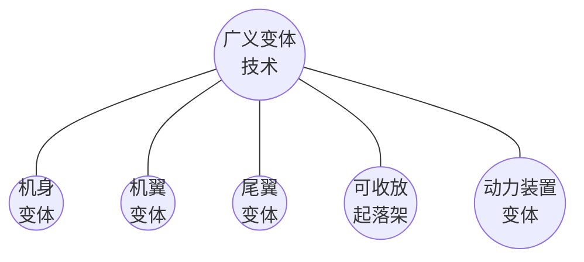
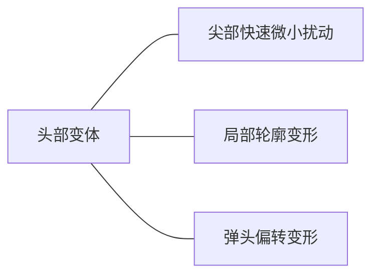

# 变体飞行器变形方式及气动布局设计关键技术研究进展

陈树生 $^{1, *}$, 贾苜梁 $^1$, 刘衍旭 $^1$, 高正红 $^1$, 向星皓 $^2$

1. 西北工业大学 航空学院，西安 710072
2. 中国空气动力研究与发展中心，绵阳 621000

**摘 要**：能够根据任务需求、飞行环境自适应改变外形来达到最佳飞行性能的变体飞行器已成为未来飞行器发展的重要方向之一。综述了变体飞行器变形方式及气动布局设计关键技术研究现状。首先，按照时间发展历程，将变体技术的发展分为简单机械变形、多维度柔性变形 2 个阶段。其次，按照变体部位和变形方式详细介绍了头部变体、机翼变体、动力装置变体和组合变体方案的发展历程和现状，重点阐述了可变后掠机翼、可变前掠机翼、折叠机翼、伸缩机翼、斜置机翼、连续变弯度机翼等机翼变体方案的研究进展，总结其在不同布局构型上的应用，并分析了各自的气动、操稳特性。之后，归纳了飞行器变体的实现目的，将其分为单域最优变构型、多域融合变构型、一器多能变构型 3 种。接着，与固定外形飞行器进行对比，梳理了变体飞行器因为变构型的实现而衍生的气动布局与总体协调设计、时变空气动力学效应评估、气动布局方案优化、多学科耦合设计等方面的关键技术难点，重点对变体飞行器动态气动力计算方法和气动优化设计技术的研究进展和现状进行了综述和分析。最后，展望了变体技术未来研究方向和发展前景，面向宽速域和大空域飞行需求，探索可以提高多飞行任务性能的新概念变形方式，建立智能变体设计模型及多学科强耦合一体化设计体系将成为重要发展趋势。

**关键词**：变体飞行器；变形方式；机翼变体；优化设计；非定常效应；多学科一体化

**中图分类号**：V 221.3; V 11 **文献标识码**：A **文章编号**：1000-6893(2024)06-629595-47

自莱特兄弟“飞行者一号”问世以来，广大设计人员致力于研究发展提高飞行器气动效率和改善飞行性能的技术方法$^{}$。经过多年发展，针对不同任务和性能需求已经设计出了一系列高性能飞行器，如具有高机动性能的 F-18 战斗机、适合执行长航时侦察任务的全球鹰无人机、具备高超声速飞行能力的 HTV-2 等$^{}$。以单一任务目标开展布局方案设计和总体方案设计并针对

外形参数等进行优化的传统飞行器设计方法趋于成熟。

随着军用和民用飞行器飞行任务的复杂化，能够跨空域、宽速域飞行，具备多任务适应能力和通用性，实现“一机多能”逐渐成为飞行器设计的新要求。固定外形布局的飞行器性能空间有限，由此能够改变飞行器外形以适应不同的飞行环境并改善飞行器气动性能、扩展飞行包线的变

体飞行器应运而生，并且在军用、民用领域展现出广阔的应用前景。

飞行器变体指通过改变外形来改善飞行性能进而满足多任务飞行需求的技术手段。变体飞行器的定义可以从广义、狭义 2 个方面进行论述。广义上的变体如图 1 所示，包含了涉及飞行器外形改变的一切形式，通过外形局部或整体的改变来满足相应性能需求，如起落架收放、襟翼偏转、机头下垂、机翼变后掠等。狭义上的变体是指基于智能材料、智能控制等技术根据不同的工作环境主动改变气动外形，在不同飞行状态下达到最优的气动性能。

图 1 广义变体技术
Fig. 1 Generalized morphing technology

变体技术的发展对于军用、民用飞行器性能的提高都有着重要意义。本文将从时间角度介绍变体飞行器发展的简单机械变形、多维度柔性变形阶段，总结飞行器不同部位变体形式和变体实现目的，系统归纳变体飞行器发展现状及气动布局设计关键技术研究进展，以期为变体技术未来发展提供参考。

# 1 变体技术发展历程及进展

莱特兄弟通过控制机翼的扭曲来实现飞机的偏航和滚转，可以认为这是变体技术在飞机上的首次应用。在此之后，众多学者开展了一系列变体方式的研究。1951 年，可在空中机翼变后掠的 Bell X-5 飞机试飞成功，标志着变体技术发展的开端。本文以变形维度为分类依据，参考材料和结构技术的发展情况，将变体技术的发展分为简单机械变形、多维度柔性变形 2 个阶段。

## 1.1 简单机械变形阶段

变体技术发展的第 1 个阶段是通过简单机械结构控制的飞机局部变形。如通过襟翼、缝翼等高升力装置的机械变形提高飞机起飞升力，缩短起飞距离。机翼形状的改变主要是变展长与变后掠。考虑到早期飞机基本上为常规布局或者三角翼布局，这一阶段的变体技术基本上均为在常规布局上的应用。其中最具代表性的是已投入工程应用的可变后掠机翼飞行器，其通过外翼段与内翼段连接处的运动机构实现机翼后掠角的变化。机翼后掠变形带来了较大的气动收益，兼顾了低速和高速飞行时的性能要求，拓宽了飞行包线。可变后掠机翼飞机的工程应用证实了变体技术的可行性。

但传统的机械变形也带来了 2 个关键问题：刚性变体机构占用较大空间并增大飞机整体重量，这削弱了变后掠带来的气动收益，不利于燃油效率的提高；蒙皮等非连续变形使局部结构承受较大载荷并导致局部气动干扰。在 20 世纪 70 时代末，传统机械变形手段的发展陷入停滞，人们转向了随控布局固定翼飞行器的研究。

## 1.2 多维度柔性变形阶段

自 20 世纪 80 年代开始，随着智能材料、智能结构、智能控制等技术的不断进步，基于柔性材料的变体技术展现了巨大的应用价值，各国开始了对于智能柔性可变形机翼的探索，期间开展了一系列重大研究项目。这一阶段的研究主要致力于实现机翼的柔性变形和自适应变体。此外，由于简单的机翼变后掠形式已经无法满足飞行器的多种性能需求，还发展了多种新型变体形式，如自适应偏转弹头、可变进气道、倾转机翼技术等。

20 世纪 80 年代初，美国空军和美国国家航空航天局（National Aeronautics and Space Administration, NASA）联合开展了先进战斗机技术集成（Advanced Fighter Technology Integration, AFTI）项目，其中一项是针对 F-111 的任务自适应机翼（Mission Adaptive Wing, MAW）项目。MAW 项目采用液压驱动机构实现机翼连续弯度

变形来提高气动效率，变体设计方案如图 2所示，飞行试验结果表明自适应机翼在设计巡航点阻力减少了约 7%，非设计点的阻力减少了 20% 以上。

F-111 morphing design scheme

图 2 F-111 变体设计方案

Fig. 2 F-111 morphing design scheme

1985 年，NASA 与洛克韦尔公司合作开展了主动柔性机翼（Active Flexible Wing, AFW）项目，1996 年扩展为主动气动弹性机翼（Active Aeroelastic Wing, AAW）计划。该项目采用智能材料与智能结构技术，通过机翼主动气动弹性变形获得结构重量和气动效率上的收益。AAW 项目中的 X-53 试验机如图 3所示。多次风洞试验和飞行试验结果表明，主动气动弹性机翼技术具有提高飞行器低速和高速机动性、减轻飞机重量、减小阻力、抑制颤振、减缓阵风、机动载荷等优点。

1994 年，美国国防预研计划局（Defense Advanced Research Projects Agency, DARPA）开展了智能机翼（Smart Wing）项目，其发展目标与历程如图 4所示。该项目利用基于形状记忆合金（Shape Memory Alloys, SMA）的驱动机构取代无尾布局前缘和后缘的铰接控制面，并在无尾布局上应用柔性前后缘控制面，试验结果表明采用智能机翼技术的飞行器具有更佳的滚转、俯仰控制性能，证明了柔性控制面在各种飞行条件下提高飞行器气动特性和操纵性能的可行性。

X-53 AAW flight research aircraft

图 3 X-53 AAW 飞行试验机

Fig. 3 X-53 AAW flight research aircraft

2002 年，欧盟启动了主动气动弹性飞行器结构（Active Aeroelastic Aircraft Structures, 3AS）项目，利用气动弹性实现机翼的主动变形，并在 EURAM 试验平台（见图 5）上开展了包括阵风响应在内的多项测试。测试结果表明，主动气动弹性机翼的应用有利于提高飞行性能和经济性、减缓颤振、降低阻力。

2003 年，DARPA 组织开展了变形飞机结构（Morphing Aircraft Structures, MAS）计划，该项目以研究实现大幅度变形的新型智能变体技术并进行飞行验证为目的。参与该项目的 3 家公司分别提出了伸缩机翼、折叠机翼、滑动蒙皮 3 种变体方案（见图 6）。其中，最具代表性的

Smart wing program objectives and process timeline

图 4 智能机翼项目发展目标与历程

Fig. 4 Smart wing program objectives and process

EURAM experimental platform

图 5 EURAM 试验平台

Fig. 5 EURAM experimental platform

能需求，并且通过风洞实验和飞行测试证明了滑动蒙皮的可行性。

2011—2015 年，欧盟开展了灵巧智能飞机结构（Smart Intelligent Aircraft Structures, SARISTU）项目，通过采用自适应后缘（Adaptive Trailing Edge, ATED）、翼梢小翼主动后缘（Winglet Active Trailing Edge, WATE）、增强型自适应前缘（Enhanced Adaptive Drop Nose, EADN）等（见图 7）达到降噪减阻的目的。项目中设计的自适应后缘

Morphing schemes in MAS

图 6 MAS 项目中的变体方案
Fig. 6 Morphing schemes in MAS

Wing demonstrator in SARISTU

图 7 SARISTU 项目中的机翼示意
Fig. 7 Wing demonstrator in SARISTU

成果是 NextGen 公司试飞的 MFX-1、MFX-2，其采用滑动蒙皮技术，可以实现机翼翼面积、展长、后掠角的大幅变化以满足不同飞行环境下的性

装置（Adaptive Trailing Edge Device, ATED）可以实现后缘的智能变弯度，有效降低了飞行油耗。项目过程中开展了多次风洞试验，充分验证了前缘、后缘、翼梢变形的可行性。

2014年，NASA组织开展了自适应柔性后缘（Adaptive Compliant Trailing Edge, ACTE）项目。在湾流飞机上安装ACTE襟翼来实现后缘连续弯曲变形，并开展了飞行试验（见图8），结果表明后缘偏转可带来更大的升力和俯仰力矩增量。

Gulfstream plane with ACTE flaps

图 8 采用 ACTE 襟翼的湾流飞机
Fig. 8 Gulfstream plane with ACTE flaps

2017年，NASA与波音公司开展了展向自适应机翼（Spanwise Adaptive Wing, SAW）项目，采用新型形状记忆合金设计固态驱动器代替液压驱动器，使得驱动机构重量减小80%。验证机（见图9）的多次飞行试验证明了该项技术可以提高巡航效率，减小飞行阻力。SAW项目主要是驱动器上的更新，与布局发展关系不大。之后，SAW项目还开展了展向自适应机翼技术在F-18飞机上的应用研究。

2017—2020年，欧盟在“地平线2020”计划

Testing planes in SAW

图 9 SAW 项目中的验证机
Fig. 9 Testing planes in SAW

资助下开展了智能变形与传感技术（Smart Morphing and Sensing, SMS）项目，项目中采用压电作动器、形状记忆合金实现机翼后缘的连续变弯度，有利于大型民机的降噪减阻，有效降低了飞机油耗。相关技术已经在空客A320飞行试验平台上开展了演示验证（见图10）。

A320 wing experimental and numerical results

图 10 A320 机翼试验和数值结果

Fig. 10 Experimental and numerical results of A320 wing

2016年以来，NASA联合麻省理工学院等多所高校共同开展了任务自适应数字化复合材料航空结构技术（Mission Adaptive Digital Composite Aerostructure Technologies, MADCAT）项目，设计的柔性组合变体飞行器如图11所示。项目过程中利用智能控制可以自动实现机翼扭转和增加机翼弯度，进而提高气动性能，该项目充分验证了柔性组合机翼的可行性。

MADCAT V1 testing

图 11 MADCAT V1 验证机
Fig. 11 MADCAT V1

2021年，空客公司启动了超性能机翼（Extra High Performance Wing）项目，设计方案如图12所示，并在2022年开展了风洞试验。该项目旨在利用变体技术、仿生设计技术改善飞机空气动力学特性，提升飞行性能。该项目采用半气动弹性铰接翼尖和连续变弯度后缘实现机翼多维度柔性变形进而改善飞机飞行性能。

柔性变形阶段一方面基于智能材料、智能

Diagram of extra high performance wing

图 12 超性能机翼示意图
Fig. 12 Diagram of extra high performance wing

结构等实现机翼局部或者大面积的柔性变形，进而提高变体飞行器的气动和操稳特性；另一方面通过智能控制技术充分发挥变体飞行器的环境自适应特性。飞行器的柔性变形主要包括机翼连续变弯度和机翼扭转。这一阶段的变体技术在多种气动布局形式上都有所应用，满足了提高飞行性能的需求。

# 2 不同部位变体技术研究进展

飞行器不同部位的变形会带来不同的性能增益。本节将按照变形部位分类综述飞行器头部变体、机翼变体、动力装置变体、组合变体的研究进展。

## 2.1 飞行器头部变体

飞行器头部形状同机翼一样可以影响飞行器气动性能，尤其是在超声速飞行时，合适的头部形状对于降低激波阻力、减小头部局部热流、降低地面声爆强度等具有良好效果。

早期头部变体技术的应用是协和号超声速客机上的可下垂机鼻。在起降阶段，机鼻下垂以改善飞行员视野；在超声速巡航时，机鼻复位，恢复良好的低阻流线外形。协和式客机的头部变体主要为了便于驾驶员观察，并非从气动性能角度考虑，但为头部变体技术发展提供了一种思路。

飞行器头部的偏转或者局部变形会导致流场变化，并在头部某些区域产生压差，进而产生相应气动力和气动力矩，可以起到敏捷控制飞行器姿态的作用。主要的头部变体形式如图 13 所示。其中相对体轴线的弹头偏转变形对飞行器气动特性影响最大，可以实现飞行器全方位的机动。本文主要对弹头偏转变形方案进行总结，其余头部变体方式可参考文献。

图 13 头部变体方式
Fig. 13 Head deformations

偏转弹头技术主要应用于导弹的快速机动，偏转弹头导弹的概念最早可以追溯到 1946 年。之后，针对偏转弹头方案进行了大量的可行性探索及技术应用研究。早期研究主要通过理论推导、风洞试验开展给定偏转角下导弹气动特性等的影响因素研究。

偏转弹头、鸭翼舵面是控制导弹机动的 2 种主要方案。偏转弹头导弹、鸭翼舵面导弹模型如图 14所示，相较于鸭翼舵面控制，偏转弹头控制避免了舵面与弹体的气动干扰。并且，由于弹头距离质心较远，较小的弹头偏转角度即可产生较大的操纵力矩。此外，与鸭翼舵面控制导弹相比，偏转弹头导弹具有更高的俯仰控制效率（见图 15，$\delta$ 为弹头偏转角度，$\Delta C_m$ 为俯仰力矩增量，$\Delta C_x$ 为轴向力系数增量）、更小的气动阻力。研究表明，与鸭翼导弹相比，偏转弹头导弹在 $Ma=3, 6$ 时阻力分别减小 5%、13%，适合超/高超声速飞行。因此，通过偏转弹头高效控制导弹机动飞行的技术受到广泛关注。

弹头偏转时，导弹攻角（$\alpha$）、俯仰力矩（$C_m$）随时间的变化曲线如图 16所示，附加升力导致的俯仰力矩会抑制导弹迎角的变化，有利于实现动态稳定飞行。随着弹头偏转角度的增加，导弹的法向过载明显增大（见图 17，$\beta$ 为弹头偏转角度，$N_{y_s}$ 为弹体坐标系下导弹法向过载），机动性显著增强。

目前，偏转弹头方案研究的热点主要集中在

Missile model Missile model

(a) 偏转弹头 (b) 鸭翼舵面

图 14 导弹模型
Fig. 14 Missile model

2 部分：一部分是建立飞行动力学模型，另一部分是研究不同来流马赫数、不同飞行攻角和不同弹头偏转角对偏转弹头局部压力分布、导弹整体气动特性的影响规律。针对气动特性的研究表明，偏转弹头导弹的气动效率随着偏转角、马赫数、攻角的增大而增大，且在超声速飞行时的气动效率相对于亚声速飞行时显著提高。

| δ/(°) | Ma=6.0 Deflectable nose | Ma=3.0 Deflectable nose | Ma=3.0 Canards | Ma=6.0 Canards |
| 0 | 0 | 0 | 0 | 0 |
| 4 | 0.6 | 0.4 | 0.2 | 0.1 |
| 8 | 1.5 | 1.0 | 0.5 | 0.3 |
| 12 | 2.3 | 1.6 | 0.8 | 0.5 |
| 16 | 2.8 | 2.1 | 1.1 | 0.7 |
| 20 |  | 2.5 | 1.3 | 0.9 |
| 24 |  |  | 1.5 | 1.1 |
| 28 |  |  | 1.7 | 1.3 |
(a) 俯仰力矩系数增量对比

| δ/(°) | Ma=6.0 Deflectable nose | Ma=3.0 Deflectable nose | Ma=6.0 Canards | Ma=3.0 Canards |
| 0 | 0 | 0 | 0 | 0 |
| 4 | 0.01 | 0.005 | 0.002 | 0.001 |
| 8 | 0.03 | 0.02 | 0.008 | 0.005 |
| 12 | 0.055 | 0.04 | 0.015 | 0.01 |
| 16 | 0.07 | 0.055 | 0.022 | 0.015 |
| 20 |  | 0.065 | 0.03 | 0.02 |
| 24 |  |  | 0.04 | 0.025 |
| 28 |  |  | 0.055 | 0.035 |
(b) 轴向力系数增量对比

图 15 俯仰控制效率对比
Fig. 15 Comparison of pitch control efficiency

此外，孙健根据蚕蛹的结构特征设计了头部引信可偏转结构，并探究了弹头偏转节数对气动性能的影响（见图 18），研究结果表明，不同偏转节数下的阻力系数、升力系数、俯仰力矩系数基本相同，节数增多会导致偏航力矩系数减小。

Pressure contours of deflection warhead with different numbers of deflection sections

图 18 偏转弹头不同偏转节数压力云图
Fig. 18 Pressure contours of deflection warhead with different numbers of deflection sections

由于弹头偏转导致流场的不对称分布，导弹在绕轴旋转时会产生非定常效应。研究发现，在飞行过程中弹头绕轴旋转会产生马格努斯效应并造成俯仰、偏航通道间的耦合，导弹气动特性干扰严重。不同转速下导弹气动特性随头部滚转角变化曲线如图 19所示。偏转弹头开始旋转时，弹头不同部位的速度差使得表面流动产生离心力进而形成气动力的增量，这种因弹头旋转引起的气动力的变化会使导弹呈螺旋摆动。

| t/s | α/(°) | C_m |
| 100 | 0.4 | 0 |
| 110 | 0.3 | -1 |
| 120 | 0.4 | 1 |
| 130 | 0.3 | -1 |
| 140 | 0.4 | 1 |
图 16 俯仰力矩系数
Fig. 16 Pitching moment

| t/s | β=0° | β=3° | β=5° |
| 0 | 0.2 | 0.2 | 0.2 |
| 50 | 0.2 | 0.2 | 0.2 |
| 100 | 0.2 | 0.2 | 0.2 |
| 150 | 0.3 | 0.3 | 0.3 |
| 200 | 3.5 | 3.5 | 3.5 |
| 250 | 0.5 | 0.5 | 0.5 |
图 17 法向过载
Fig. 17 Normal overload

| 滚转角φ/(°) | ω_h=70 r/s | ω_h=0 r/s |
| 0 | 0.05 | 0.05 |
| 90 | -0.08 | -0.05 |
| 180 | 0.05 | 0.05 |
| 270 | 0.08 | 0.05 |
| 360 | 0.05 | 0.05 |
(a) 升力系数随头部滚转角的变化曲线

| 滚转角$\phi/(^\circ)$ | 侧向力系数$C_z$ ($\omega_h=70\text{ r/s}$) | 侧向力系数$C_z$ ($\omega_h=0\text{ r/s}$) |
| --- | --- | --- |
| 0 | 0 | 0 |
| 90 | -0.10 | -0.04 |
| 180 | 0 | 0 |
| 270 | 0.08 | 0.04 |
| 360 | 0 | 0 |
| 头部转速$\omega_h/(\text{r}\cdot\text{s}^{-1})$ | 侧向力系数$C_z$ |
| --- | --- |
| 0 | 0 |
| 10 | -0.002 |
| 20 | -0.003 |
| 30 | -0.004 |
| 40 | -0.004 |
| 50 | -0.005 |
| 60 | -0.006 |
| 70 | -0.009 |
| 80 | -0.010 |

图 19 偏转弹头绕弹轴旋转时气动特性变化曲线

Fig. 19 Aerodynamic characteristics of deflected projectile during rotation around axis

数据。此外，超/高超声速来流下偏转弹头局部热流沉积、偏转和旋转过程的非定常效应是推动偏转弹头工程化亟需解决的关键问题。随着智能材料、智能结构、智能控制手段的发展，可以根据任务需求、飞行状态操纵导弹飞行姿态的自适应偏转弹头技术能够大幅提高导弹打击能力，增强军事力量，推动装备体系建设。

除此之外，广大学者通过模仿动物形态变化探索新型头锥变体方式。其中，蜜蜂根据环境变化腹部结构就为仿生变体提供了一种思路。基于蜜蜂腹部机构的仿生变体头锥设计目前集中于变体结构设计，对于气动布局构型设计、气动特性分析的研究较为缺乏。蜜蜂腹部形态变化及一种仿生头锥构型分别如图 20、图 21所示。

Morphological changes of honeybee's abdomen

图 20 蜜蜂腹部形态变化
Fig. 20 Morphological changes of honeybee's abdomen

偏转弹头技术发展的关键难点在于蒙皮材料、驱动器、控制技术。而针对偏转弹头气动特性的计算分析主要是为动力学模型的建立提供

Deformation principle of bionic deflectable nose

图 21 仿生变体头锥变形原理

Fig. 21 Deformation principle of bionic deflectable nose

此外，湾流公司（Gulfstream Aerospace）曾经提出了变体低声爆超声速民机的概念，通过飞机头部静音锥的主动伸缩降低不同飞行状态时的地面声爆强度。可变形状和变级数的头部静音锥变形方案为超声速民机低声爆被动抑制技术提供了参考。

## 2.2 机翼变体

作为飞行器升力的主要来源，机翼是飞行器变形的主要部位。如图 22 所示，机翼变体按照变形尺度分为大、中、小尺度变形。小尺度变形主要是机翼表面的局部可控微小变形，以此实现局部流动控制。中尺度变形主要是在翼型层面上的变形，包括前缘变弯度、可变后缘、变厚度等变形方式。大尺度变形主要是机翼布局层面上的

变形，包括变展长、变后掠角、变上反角等多种形式，可以实现气动性能的大幅变化。

不同的机翼变体方式对气动性能的影响不同，带来的气动增益也有较大差别。机翼参数变化对气动性能的影响如表 1所示。

本文研究主要涉及机翼层面的中、大尺度变形，总结伸缩机翼、可变后掠机翼、折叠机翼等机翼主要变形方式。

### 2.2.1 可变后掠机翼

大后掠角机翼可以降低激波阻力，有利于跨声速、超声速飞行，小后掠角机翼则具有良好的低速特性，可变后掠机翼飞行器可以同时兼顾起降、低速飞行、高速飞行时的性能。变后掠飞行器的发展历程如图 23 所示。最早的可变后掠飞行器概念可追溯到 1944 年，这时的设计方案仅可以在地面改变后掠角，无法实现飞行中后掠角的改变。1951 年试飞的 Bell X-5 飞机是第一架可变后掠机翼飞机，其可在多个后掠角之间切换，但是由于变后掠时气动中心的变化会产生低头力矩，并未真正投入使用。20 世纪 60~70 年代是可变后掠机翼发展的黄金时期，发展出一系列型号，如 F-111、F-14、米格-23、图-160 等。其中 F-14、图-160 可以认作是可变后掠机翼飞行器的典

机翼变形尺度分类层次图

图 22 机翼变形尺度分类
Fig. 22 Classification by morphing scale of wings

表 1 机翼参数对气动性能的影响

Table 1 Influence of wing parameters on aerodynamic performance

| 参数 | 变化 | 影响情况 |
| --- | --- | --- |
| 翼面积 | 增大 | 提升升力和承载能力 |
|  | 减小 | 降低摩擦阻力 |
| 展弦比 | 增大 | 提高升阻比、续航能力、巡航距离、偏航速率；降低发动机要求 |
|  | 减小 | 提高最大速度，减小摩擦阻力 |
| 上反角 | 增大 | 提高偏航性能和侧向稳定性 |
|  | 减小 | 提高最大速度 |
| 后掠角 | 增大 | 提高临界马赫数，减小阻力 |
|  | 减小 | 提高最大升力系数 |
| 根梢比 |  | 影响展向升力分布及诱导阻力 |
| 机翼扭转 |  | 影响翼尖失速及展向升力分布 |
| 翼型弯度 |  | 影响零升迎角、分离特性 |
| 前缘半径 | 增大 | 改善低速翼型性能 |
|  | 减小 | 改善高速翼型性能 |
| 翼型厚度 |  | 影响翼型性能、层流向湍流过渡 |

Development history of variable sweep wing showing different aircraft designs and operational modes: ground adjustment, in-flight adjustment, combination with other morphing methods, and automatic adjustment based on flight status.

图 23 变后掠形式发展历程
Fig. 23 Development history of variable sweep wing

型成果。F-14 采用双垂尾正常式气动布局，能根据飞行状态自动调整后掠角。

可变后掠机翼飞行器的设计存在 2 个问题：驱动结构增加飞机重量、结构复杂度，气动中心在变后掠过程中的大幅度变化严重影响整机的操稳性能。针对气动中心的变化往往会采取气动补偿措施，如 F-14 飞机在机翼固定段前缘设计了可动扇翼维持气动中心变化时的俯仰平衡。前期可变后掠机翼的应用基本针对常规布局飞行器，未对气动布局形式产生较大影响。由于结构、材料上的限制，可变后掠机翼飞行器在 20 世纪 70 年代后的发展陷入停滞，但其带来的巨大气动收益证实了变体技术提高飞行器气动性能的可行性。

随着智能材料、智能结构的发展，变后掠技术的研究再次受到人们关注。目前的可变后掠机翼设计方案并不仅是简单的后掠角变化，往往与其他形状参数的变化相结合，如变展长或变弦长等。其中最为著名的是美国 NextGen 公司提出的“滑动蒙皮方案”。该公司在 2007 年试飞了 MFX-1，机翼面积改变 40%，展长变化 30%，后掠角在 15°~35°之间变化，载重量 90 kg。2008 年又试飞了 MFX-2，变形仅需要 10 s，其机翼可以滑动并展开成 5 种姿态（见图 24），满足盘旋、巡航、爬升、高升力、高速机动的飞行要求。

目前针对可变后掠机翼飞行器气动布局的研究集中在：变后掠方式及变后掠技术在不同气动布局飞行器上的应用、不同后掠角下及变后掠过程中飞行器的飞行性能、最佳变后掠规律、变

Morphing wing configurations for different working conditions: high lift, climb, cruise, loiter, and maneuver.

图 24 几种工作状态时的变体方案
Fig. 24 Morphing wing configurations for working conditions

后掠与其他变形方式的组合、变后掠飞行器气动外形优化设计。陈钱等探索了旋转变后掠和剪切变后掠方式对气动特性的影响，针对翼身组合构型（Wing Body, WB）飞行器的数值模拟结果如图 25所示，$L/D$ 为升阻比，$C_D$ 为阻力系数。与旋转变后掠相比，剪切变后掠形式在变后掠过程中沿流向翼型保持不变，有利于控制流动分离和翼尖涡的产生，在宽速域内升阻比、阻力特性更佳。

彭悟宇对比了常规布局翼身组合体构型导弹应用伸缩机翼、可变后掠机翼、折叠机翼变体方案时的气动特性（见图 26）、操稳特性（见表 2、表 3）。对比气动特性发现，在超声速飞行状态下，伸缩机翼方案升阻比小于相同翼面积的变后掠机翼方案。3 种变形方案纵向静稳定性品质均较高，伸缩机翼静稳定性和舵面效率最佳。变后掠机翼方案、折叠机翼方案的舵面效率随着马赫数的增大快速降低。

李惠璟则将变后掠机翼应用到无尾鸭式布局上，研究结果表明机翼变后掠过程中焦点位置变化较大，不利于纵向静稳定，其气动特性如图 27所示，其中，$C_L$ 为升力系数，$\beta$ 为后掠角，$\delta$ 为舵偏角，下标表示对应舵面，$\Delta x$ 表示焦点位置。

可变后掠机翼技术在乘波体构型上的应用可以使飞行器满足宽速域飞行需求。一种变后掠乘波体的设计方案和相应气动特性如图 28所示，$\Lambda$ 为后掠角，$\alpha$ 为飞行迎角，$\Delta(L/D)$ 为各

(a) 旋转变后掠

(b) 不同马赫数下升阻比
| Ma_∞ | WB, 0° swee | WB, 60° rotating | WB, 60° shearing |
| --- | --- | --- | --- |
| 0.2 | 9.5 | 7.8 | 11.5 |
| 0.4 | 10.0 | 8.0 | 12.0 |
| 0.6 | 10.5 | 8.5 | 12.2 |
| 0.8 | 10.2 | 8.8 | 10.5 |
| 1.0 | 6.5 | 7.0 | 6.8 |
| 1.2 | 2.8 | 3.5 | 3.0 |

(c) 剪切变后掠

(d) 不同马赫数下阻力系数
| Ma_∞ | WB, 0° swee | WB, 60° rotating | WB, 60° shearing |
| --- | --- | --- | --- |
| 0.2 | 0.03 | 0.02 | 0.02 |
| 0.4 | 0.03 | 0.02 | 0.02 |
| 0.6 | 0.03 | 0.02 | 0.02 |
| 0.8 | 0.04 | 0.02 | 0.02 |
| 1.0 | 0.10 | 0.04 | 0.04 |
| 1.2 | 0.11 | 0.08 | 0.08 |

图 25 变后掠方式影响
Fig. 25 Effect of variable sweep forms

(a) 基准外形 (b) 变后掠方案 (c) 伸缩方案 (d) 折叠方案

(e) 升阻比对比
| Ma_∞ | Telescopic wing | Variable sweep wing | Folding wing |
| --- | --- | --- | --- |
| 2 | 2.84 | 2.78 | 2.81 |
| 3 | 2.89 | 2.82 | 2.86 |
| 4 | 2.93 | 2.86 | 2.91 |
| 5 | 2.92 | 2.85 | 2.90 |
| 6 | 2.90 | 2.83 | 2.88 |
| 7 | 2.88 | 2.81 | 2.86 |
| 8 | 2.87 | 2.80 | 2.84 |
| 9 | 2.85 | 2.78 | 2.82 |

图 26 不同变形方案升阻比对比
Fig. 26 Comparison of lift-to-drag ratio of different deformation schemes

**表 2 不同变形模式和马赫数下俯仰力矩静导数**
**Table 2 Static derivatives of pitching moment under different deformation modes and Mach numbers**

| 马赫数 $Ma$ | 俯仰力矩静导数 |
| --- | --- |
| 3 | $-0.002\ 859$ | $-0.002\ 857$ | $-0.002\ 833$ |
| 6 | $-0.002\ 174$ | $-0.001\ 976$ | $-0.002\ 032$ |
| 8 | $-0.002\ 058$ | $-0.001\ 941$ | $-0.001\ 960$ |

**表 3 不同变形模式和马赫数下操纵力矩静导数**
**Table 3 Static derivatives of operating moment under different deformation modes and Mach numbers**

| 马赫数 $Ma$ | 操纵力矩静导数 |
| --- | --- |
| 3 | $-0.001\ 606$ | $-0.001\ 616$ | $-0.001\ 526$ |
| 6 | $-0.000\ 758$ | $-0.000\ 688$ | $-0.000\ 630$ |
| 8 | $-0.000\ 529$ | $-0.000\ 455$ | $-0.000\ 414$ |

构型相对机翼收起构型的升阻比增量，$C_m$ 为俯仰力矩系数。该变后掠乘波体构型在不同马赫数下可以通过改变后掠角达到最佳气动性能，

在设计马赫数下，各构型俯仰力矩系数均随攻角减小，各构型保持纵向静稳定，这为实现乘波体飞行器机翼连续变后掠提供了参考。

Diagram of a tailless canard configuration with variable sweep wing scheme showing different wing positions labeled 1, 2, 3, 4.

(a) 变后掠方案

| CL | β=30° | β=40° | β=45° | β=50° | β=60° |
| --- | --- | --- | --- | --- | --- |
| 0.05 | 1.8 | 1.7 | 1.6 | 1.5 | 1.4 |
| 0.10 | 3.2 | 3.0 | 2.8 | 2.6 | 2.4 |
| 0.15 | 4.2 | 4.0 | 3.8 | 3.5 | 3.2 |
| 0.20 | 4.8 | 4.6 | 4.4 | 4.1 | 3.8 |
| 0.25 | 5.1 | 4.9 | 4.7 | 4.4 | 4.1 |
| 0.30 | 5.2 | 5.0 | 4.8 | 4.5 | 4.2 |
(b) 超声速状态下升阻比

| β/(°) | Ma=0.85 | Ma=1.60 |
| --- | --- | --- |
| 30 | 0.75 | 0.42 |
| 40 | 0.62 | 0.38 |
| 50 | 0.72 | 0.32 |
| 60 | 0.88 | 0.25 |
(c) 不同后掠角下焦点位置

| CL | β=30° | β=40° | β=45° | β=50° | β=60° |
| --- | --- | --- | --- | --- | --- |
| 0.1 | 4.5 | 4.0 | 3.5 | 3.0 | 2.5 |
| 0.2 | 8.2 | 7.5 | 6.8 | 6.0 | 5.2 |
| 0.3 | 11.5 | 10.5 | 9.5 | 8.5 | 7.5 |
| 0.4 | 13.8 | 12.5 | 11.2 | 10.0 | 8.8 |
| 0.5 | 14.5 | 13.2 | 11.8 | 10.5 | 9.2 |
| 0.6 | 14.2 | 12.8 | 11.5 | 10.2 | 8.9 |
(d) 亚声速状态下升阻比

图 27 无尾鸭式布局变后掠方案
Fig. 27 Tailless canard configuration with variable sweep wing scheme

虽然增大后掠角可以降低阻力，有利于高速飞行，但在变后掠过程中，后掠角的增大会导致展长、升力面的减小。为了保证变后掠过程的升力特性，研究人员探究了变展长、变后掠结合的组合方案。试验结果如图 29所示，其中，$C_{CP}$ 为压心位置系数。后掠角增大增强了飞行器纵向稳定性，有后掠角时，展长的增大同样增强了纵向静稳定性，但导致操纵性变差。虽然组合方案可以有效改善气动性能，但是方案的实现需要机翼具有多自由度变形能力，对机翼变体结构提出了更高的要求，吸引了广大研究者开展涉及变后掠、展向弯曲、扭转等多维度变形机构方案的设计研究。

题同样显著，飞行攻角、马赫数、变后掠速率均会对非定常效应产生影响。变后掠速率对气动特性滞回环的影响如图 30所示（$\lambda$ 为外段机翼后掠角，$T$ 为变后掠周期，$C_{Mz}$、$C_{Fz}$、$C_{Mx}$ 分别为俯仰力矩系数、侧向力系数、滚转力矩系数），变后掠速率的改变会使气动特性滞回环大小出现大幅变化。在气动布局设计过程中，需要关注连续变后掠带来的非定常气动力的变化，保证飞行器纵向和横航向的稳定性。近些年来，基于机器学习的非定常气动力预测方法在变体飞行器领域也有所应用。

可变后掠机翼技术可以显著提高飞行器气动性能，并且变体形式相对简单，在巡航导弹、飞翼布局飞行器、乘波体构型飞行器上具有广阔的应用前景。

此外，变后掠过程中的非定常空气动力学问

Diagrams and line charts showing waverider configuration with variable sweep wing scheme, including aerodynamic coefficients like lift-to-drag ratio increments and pitching moment coefficients at various Mach numbers and sweep angles.

图 28 变后掠乘波体构型方案
Fig. 28 Waverider configuration with variable sweep wing scheme

Diagrams and line charts showing combined scheme of variable sweep and span, including four different configurations (A, B, C, D) and their corresponding aerodynamic performance curves for pitching moment coefficient, lift-to-drag ratio, and pressure center coefficient.

图 29 变后掠变展长组合方案
Fig. 29 Combined scheme of variable sweep and span

| λ/(°) | Quasi-steady | Unsteady, T=17.58 s | Unsteady, T=8.79 s | Unsteady, T=4.40 s |
| --- | --- | --- | --- | --- |
| 32 | 365 | 365 | 365 | 365 |
| 36 | 345 | 355 | 350 | 340 |
| 40 | 320 | 330 | 325 | 315 |
| 44 | 300 | 310 | 305 | 295 |
| 48 | 290 | 290 | 290 | 290 |
(a) 升力系数

| λ/(°) | Quasi-steady | Unsteady, T=17.58 s | Unsteady, T=8.79 s | Unsteady, T=4.40 s |
| --- | --- | --- | --- | --- |
| 32 | -0.285 | -0.285 | -0.285 | -0.285 |
| 36 | -0.275 | -0.265 | -0.270 | -0.280 |
| 40 | -0.260 | -0.250 | -0.255 | -0.265 |
| 44 | -0.245 | -0.235 | -0.240 | -0.250 |
| 48 | -0.235 | -0.235 | -0.235 | -0.235 |
(b) 俯仰力矩系数

| λ/(°) | Quasi-steady | Unsteady, T=17.58 s | Unsteady, T=8.79 s | Unsteady, T=4.40 s |
| --- | --- | --- | --- | --- |
| 32 | -95 | -95 | -95 | -95 |
| 36 | -88 | -82 | -85 | -92 |
| 40 | -82 | -76 | -79 | -86 |
| 44 | -76 | -72 | -74 | -78 |
| 48 | -70 | -70 | -70 | -70 |
(c) 侧向力系数

| λ/(°) | Quasi-steady | Unsteady, T=17.58 s | Unsteady, T=8.79 s | Unsteady, T=4.40 s |
| --- | --- | --- | --- | --- |
| 32 | -0.165 | -0.165 | -0.165 | -0.165 |
| 36 | -0.145 | -0.135 | -0.140 | -0.150 |
| 40 | -0.130 | -0.120 | -0.125 | -0.135 |
| 44 | -0.120 | -0.115 | -0.118 | -0.122 |
| 48 | -0.115 | -0.115 | -0.115 | -0.115 |
(d) 滚转力矩系数

图 30 变后掠速率对气动特性滞回环的影响
Fig. 30 Effect of sweep speed on hysteresis loop of aerodynamic characteristics

## 2. 2. 2 可变前掠机翼

可变后掠机翼在大后掠角时翼面积的减小会导致升力减小，与之相比，相同翼面积的前掠翼可提供更大的升力。此外，前掠机翼飞行器具有良好的失速特性和高机动性能。人们开始探讨可变前掠机翼技术方案。

经典的可变前掠机翼方案如图 31所示。在低速起降、亚声速巡航过程中采用升阻比较高的平直翼。随着马赫数的增大，在跨声速巡航或

者超声速机动时，采用可以避免翼尖失速进而提高操纵性能的前掠机翼布局，并根据飞行速度改变前掠角以达到最优气动性能。在超声速巡航过程中，机翼完全前掠为三角翼布局，进而减小波阻，提高超声速飞行性能。虽然前掠机翼避免了翼尖失速，但带来了翼根失速的问题，诸多设计方案通过加装鸭翼、边条翼来控制翼根部位的流动分离。此外，变前掠为三角翼布局时，后缘操纵面距离中心较远，适合采用无尾布局形式。而且，鸭式无尾布局可以改善无尾布局横航向操纵能力上的不足，提高低速机动性能和起降性能。因此，可变前掠机翼技术往往应用在鸭式无尾布局飞行器上，兼顾隐身、横航向操纵、高速飞行能力。

Deformation process of variable forward sweep wing

平直翼	前掠翼	三角翼

图 31 可变前掠机翼变形过程
Fig. 31 Deformation process of variable forward sweep wing

平直翼（前掠角 0°）、三角翼（前掠角 90°）、前掠翼（前掠角 22.5°、45.0°）对应的各飞行阶段气动特性如图 32所示。在低速巡航阶段，平直翼在对应各迎角下升阻比最大；机动阶段，在大迎角下前掠翼对应升力系数较大，失速迎角最大，

| 迎角/(°) | 前掠角0°+副油箱 | 前掠角0° | 前掠角-22.5° | 前掠角-45.0° | 前掠角-90.0° |
| --- | --- | --- | --- | --- | --- |
| -4 | -8 | -6 | -5 | -4 | -3 |
| 0 | 5 | 6 | 7 | 8 | 9 |
| 4 | 11 | 12 | 13 | 14 | 10 |
| 8 | 8 | 9 | 10 | 9 | 8 |
| 12 | 5 | 5 | 5 | 5 | 5 |
(a) 低速巡航过程升阻比比较($Ma=0.6$)

| 迎角/(°) | 前掠角0° | 前掠角-22.5° | 前掠角-45.0° |
| --- | --- | --- | --- |
| -5 | -0.2 | -0.2 | -0.2 |
| 5 | 0.5 | 0.5 | 0.5 |
| 15 | 1.2 | 1.2 | 1.2 |
| 25 | 1.8 | 1.8 | 1.8 |
| 35 | 2.3 | 2.3 | 2.3 |
| 45 | 2.2 | 2.2 | 2.2 |
(b) 机动过程升力系数比较($Ma=0.4$)

| 迎角/(°) | 前掠角0° | 前掠角-22.5° | 前掠角-45.0° |
| --- | --- | --- | --- |
| -5 | 0.2 | 0.2 | 0.2 |
| 5 | 0 | -0.1 | -0.2 |
| 15 | -0.3 | -0.5 | -0.8 |
| 25 | -0.6 | -1.0 | -1.5 |
| 35 | -0.9 | -1.6 | -2.2 |
| 45 | -1.2 | -2.2 | -2.8 |
(c) 机动过程俯仰力矩系数比较($Ma=0.4$)

| 马赫数 | 前掠角0°+副油箱 | 前掠角0° | 前掠角-22.5° | 前掠角-45.0° | 前掠角-90.0° |
| --- | --- | --- | --- | --- | --- |
| 0.4 | 0.02 | 0.02 | 0.02 | 0.02 | 0.02 |
| 0.8 | 0.025 | 0.025 | 0.025 | 0.025 | 0.025 |
| 1.2 | 0.13 | 0.12 | 0.11 | 0.10 | 0.10 |
| 1.6 | 0.11 | 0.10 | 0.09 | 0.08 | 0.08 |
(d) 超声速飞行过程阻力系数比较

图 32 可变前掠飞行器各飞行阶段气动特性对比
Fig. 32 Comparison of aerodynamic characteristics of variable forward sweep aircraft in each flight stage

同时纵向静稳定性更佳；超声速飞行过程，三角翼对应零升阻力系数最小，利于超声速飞行。可变前掠机翼方案能够兼顾平直翼、前掠翼、三角翼的气动性能优势。

叶露同样针对鸭式无尾布局可变前掠机翼飞行器的气动特性开展了数值模拟研究，气动特性变化曲线如图 33所示，$\Lambda_0$ 为前掠角，$\chi_{acw}$ 为静稳定度。结果表明，平直翼和前掠翼均表现为纵向静稳定，三角翼表现为纵向静不稳定。3 种构型焦点相对于重心的移动幅度较小，纵向静稳定性好。

前掠机翼良好的横航向稳定性也推动了大型客机前掠后缘尾翼的应用探索，与传统尾翼相比，前掠尾翼的应用在保证操控性能的前提下可以使尾翼面积减小 2%，进而节省燃油。新型可变前掠尾翼不失为一种增强控制稳定性的思路。

但前掠机翼会导致翼根失速，对机翼与机身连接处的结构强度提出了很高的要求。此外，自由流撞击到翼尖上会引起扭曲，带来严重的气动弹性发散，可能导致翼尖结构的破坏。可变前掠机翼技

| α/(°) | 平直翼 | 前掠翼 | 三角翼 |
| --- | --- | --- | --- |
| -20 | 0.1 | 0.1 | 0.1 |
| 0 | 0 | 0 | 0 |
| 20 | -0.1 | -0.2 | 0.1 |
| 40 | -0.2 | -0.4 | 0.2 |
| 60 | -0.3 | -0.6 | 0.3 |
(a) 俯仰力矩系数对比

| Λ₀/(°) | χacw |
| --- | --- |
| 0 | -0.12 |
| 20 | -0.08 |
| 40 | -0.04 |
| 60 | -0.01 |
| 80 | 0.01 |
| 100 | 0.02 |
(b) 静稳定度随前掠角变化曲线

图 33 变前掠鸭式无尾布局气动特性
Fig. 33 Aerodynamic characteristics of tailless canard configuration with variable forward sweep wing

术的应用依赖于材料和结构学科的发展，在大空域、宽速域的变体飞行器领域具有应用前景。

### 2.2.3 折叠机翼

折叠机翼的发展历程如图 34 所示，折叠机翼技术最早是应用在第二次世界大战的舰载机上，考虑到甲板空间有限，通过铰链等笨重机械结构实现机翼折叠便于舰载机的停放。随着变体技术的发展，通过大幅度改变翼面积或展长改善飞机气动特性的折叠机翼技术得到了广泛关注。

早期的折叠机翼技术主要针对翼尖折叠，受驱动结构限制只能在有限角度折叠。其中最为著名的是 XB-70 超声速飞机，低空超声速飞行时翼尖向下偏转 25°，高空高速巡航时向下偏转 65°。翼尖折叠时与翼梢小翼作用一致，可以减少下洗流，以此改善飞机的飞行性能。折叠机翼技术主要通过展弦比、翼面积的变化满足低速飞行和高速巡航的任务需求。

Images showing different folding wing configurations and mechanisms

图 34 折叠机翼发展历程

Fig. 34 Development history of folding wing

在 MAS 项目中，洛马公司提出了 Z 型折叠机翼方案并开展了一系列应用研究，包括大量风洞测试。风洞试验模型如图 35所示，折叠机翼完全展开后，机翼面积增大 2.8 倍，展长增大 1.7 倍，浸润面积增大 1.3 倍，可以大幅改善气动性能。

该项目针对折叠翼展开/折叠过程气动特性变化开展了研究，发现机翼的折叠和展开可以实现升力的大幅变化。

在施加临界载荷 Q 下，机翼升力、迎角、外侧（Outboard, OB）机翼电机扭矩（Motor Torque, MIR TQ）、内侧（Inboard, IB）机翼折叠角和外侧机翼折叠角如图 36所示。图 37表示机翼折叠角为 130°时，施加气动载荷后，内侧机翼折叠角和外侧机翼折叠角随气动载荷的变化情况，表明机翼会产生弹性变形。

Wind tunnel model showing different configurations: Intermediate, Dash, and Loiter

Close-up of wind tunnel model showing flexible seamless skins

图 35 风洞试验模型
Fig. 35 Wind tunnel model

此外，项目还探讨了折叠处局部非定常气动载荷的影响（见图 38），以及连接位置铰链力矩的影响（不同试验次数对应内侧机翼和外侧机翼处铰链力矩随折叠角度从 0°~130°和从 130°~0°变化曲线如图 39所示）。结果发现，折叠过程非定常效应明显，局部气动干扰仍然是折叠机翼技术不可忽略的问题。此外，连接机构在机翼展开折叠过程中承受较大集中动态载荷，对强度和刚度要求很高。设计发展新型驱动机构是未来折叠机翼技术的重要研究趋势。

国内对于折叠机翼技术也开展了大量研究。袁明川等分析了折叠机翼变形过程非定常效应的产生机制，数值模拟结果表明，气动力的滞回效应与机翼前缘涡的影响有关（折叠与展开过程涡量云图和速度矢量图如图 40所示）。郭秋亭等总结了攻角、折叠角等参数对折叠机翼气

| Time/s | Lift/lbs | AoA/(°) | OB MTR TQ/% |
| --- | --- | --- | --- |
| 0 | 2500 | 5 | 0 |
| 10 | 2500 | 6 | 0 |
| 20 | 2500 | 7 | 0 |
| 30 | 2500 | 8 | 0 |
| 40 | 2500 | 9 | 0 |
| 50 | 2500 | 10 | 0 |
| 60 | 2500 | 11 | -100 |
| 70 | 2500 | 12 | -100 |
| Time/s | IB fold angle/(°) | OB fold angle/(°) |
| --- | --- | --- |
| 0 | 0 | 0 |
| 10 | 10 | 10 |
| 20 | 20 | 20 |
| 30 | 30 | 30 |
| 40 | 40 | 40 |
| 50 | 50 | 50 |
| 60 | 130 | 130 |
| 70 | 130 | 130 |

图 36 折叠机翼运动变形过程
Fig. 36 Deformation process of folding wing motion

| Lift/lbs | Wing fold angle IB | Wing fold angle OB | Nominal angle |
| --- | --- | --- | --- |
| 500 | 131 | 130 | 130 |
| 1000 | 131 | 129 | 130 |
| 1500 | 131 | 128 | 130 |
| 2000 | 131 | 127 | 130 |
| 2500 | 131 | 126 | 130 |
| 3000 | 131 | 125 | 130 |
| Angle/(°) | Hinge Moment (a) | Hinge Moment (b) |
| --- | --- | --- |
| 10 | 4 | -3 |
| 30 | 5 | -2 |
| 50 | 6 | -1 |
| 70 | 7 | 0 |
| 90 | 8 | 1 |
| 110 | 12 | 1 |
| 130 | 24 | 0 |

图 37 升力与折叠角关系图

Fig. 37 Relationship between lift force and folding angle

图 39 连接处铰链力矩随折叠角变化
Fig. 39 Hinge moment at joint varying with folding angle

| Time/s | Upstream Xducer | Downstream Xducer |
| --- | --- | --- |
| 53.5 | -0.3 | -0.2 |
| 54.5 | -0.35 | -0.25 |
| 55.5 | -0.3 | -0.2 |
| 56.5 | -0.35 | -0.25 |
| 57.5 | -0.3 | -0.2 |

图 38 连接处不稳定的压力分布

Fig. 38 Unstable pressure distribution at connection

Pressure distribution visualization on a wing surface

(a) 折叠过程

动效率的影响规律。

总的来说，折叠机翼技术在不同布局方案飞行器上的应用需考虑如何设置飞行器气动中心以达到纵向、横航向上的静稳定，以及如何提高舵面操纵效率。

随着飞翼布局飞行器性能优势愈加显著，探

Flow field visualization of a folding wing during morphing motion

图 40 折叠机翼变形过程流场分布
Fig. 40 Flow field in morphing motion of folding wing

索飞翼布局上变体技术应用的可行性引起了关注。国内很多学者探索了 Z 型折叠机翼技术和传统外翼段/翼尖折叠技术在飞翼布局上的应用。

郭述臻等将 Z 型折叠机翼技术应用到飞翼布局飞行器上，并研究了其气动特性、操稳特性，结果如图 41所示，$x_c$ 为焦点位置，$\delta_a$ 为副翼偏角，$C_{Mx}$ 为滚转力矩系数。随着折叠角度增大，翼

面积减小，升力系数逐渐减小，飞行器纵向静稳定性先增强后减弱；机翼的折叠减缓了气流的展向流动，飞行器失速迎角增大；机翼折叠后滚转操纵响应更加灵敏。金鼎等的研究则表明折叠翼飞机具有更好的纵向动稳定性。

尹文强等则将翼尖折叠技术应用到飞翼布局上，开展了空气动力学与飞行动力学分析。结果如图 42所示，$C_{mC_L}$ 反映飞行器的纵向静稳定裕度，$C_{mC_L} = (C_m - C_{m0}) / C_L$；$C_{l\beta}$ 为滚转力矩系数对侧滑角的导数，用来反映飞行器的横向静稳定性；$C_{n\beta}$ 为偏航力矩系数对侧滑角的导数，用来反映飞行器的航向静稳定性；$C_{m\delta_{ea}}$ 为俯仰力矩系数对副翼偏角的导数；$C_{n\delta_{ea}}$ 为偏航力矩系数对副翼偏角的导数；$C_{l\delta_{ea}}$ 为滚转力矩系数对副翼偏角的导数。随着机翼的折叠，飞行器纵向静稳定裕度增大，副翼滚转操纵效率、航向操纵效率都有所提高。

| β/(°) | α=8° | α=6° | α=2° |
| --- | --- | --- | --- |
| 0 | 0.88 | 0.78 | 0.58 |
| 30 | 0.87 | 0.77 | 0.57 |
| 60 | 0.80 | 0.70 | 0.52 |
| 90 | 0.70 | 0.62 | 0.46 |
| 120 | 0.60 | 0.53 | 0.40 |
| 150 | 0.50 | 0.45 | 0.35 |
(b) 升力系数随折叠角度变化曲线

| β/(°) | x_c/m |
| --- | --- |
| 0 | 6.65 |
| 30 | 6.70 |
| 60 | 6.80 |
| 90 | 6.85 |
| 120 | 6.88 |
| 150 | 6.65 |
(c) 焦点位置随折叠角度变化曲线

Schematic of aircraft outer shape with dimensions
(a) 飞行器外形

| δ_a/(°) | β=150° | β=0° |
| --- | --- | --- |
| -15 | -0.075 | -0.055 |
| -10 | -0.045 | -0.035 |
| -5 | -0.020 | -0.015 |
| 0 | 0.000 | 0.000 |
| 5 | 0.025 | 0.015 |
| 10 | 0.050 | 0.030 |
| 15 | 0.075 | 0.040 |
(d) 滚转力矩系数随副翼偏角

图 41 Z 型折叠机翼飞翼布局方案
Fig. 41 Flying wing layout scheme with z-folding wing

翼尖折叠飞翼布局方案及气动特性曲线图

(a) 设计方案

(b) 静稳定裕度随折叠角变化

(c) 横向稳定度随折叠角变化

(d) 航向静稳定度随折叠角变化

(e) 升降副翼操纵导数随折叠角变化

(f) 副翼偏航操纵导数随折叠角变化

(g) 副翼操纵效率随折叠角变化

图 42 翼尖折叠飞翼布局方案
Fig. 42 Flying wing layout scheme with wingtip folding

折叠机翼技术还在导弹弹翼、舵面折叠等领域得到了应用，并且具有较好效果。

折叠机翼技术可以大幅度改变翼面积，与伸缩机翼技术类似，能满足低速巡航与高速飞行任务需求。但是，折叠机翼连接结构复杂、承受载荷大，需要开展结构设计。近年来，折叠机翼无人机受到广泛关注，具有停放占用空间小、可快速飞行等优点，目前已应用到潜射折叠机翼无人机、舰载折叠机翼无人机、炮射/箱式发射折叠机翼无人机等军用无人机领域，提高作战能力。

### 2.2.4 伸缩机翼

大展弦比机翼飞机在燃油效率、高升阻比方面具有优势，但缺乏机动性且仅适用于在相对较低的速度下巡航；小展弦比飞机具有高机动性、高巡航速度的优势，但气动效率较差。针对不同飞行状态改变展长可以使飞行器同时具有大展弦比和小展弦比飞行器的优势。当展弦比增大时，机翼升力线斜率增大。两侧机翼展长不同时，还可产生额外的滚转力矩用于横航向控制。

早期的伸缩机翼飞机设计可以追溯到 1931 年的 MAK-10（见图 43(a)），其翼展能从 13 m 变化到 21 m。在此之后还有一系列伸缩机翼飞机的问世，如 LIG-7（见图 43(b)）、Fanasa Beach 等。早期伸缩机翼飞机均是通过简单伸缩机构控制外侧机翼从内侧机翼伸出实现展长变化。由于材料

MAK-10 飞机设计图

(a) MAK-10

LIG-7 飞机设计图

(b) LIG-7
图 43 早期伸缩机翼飞机
Fig. 43 Early variable span wing aircraft

和结构技术等的限制，伸缩结构较为笨重复杂，伸缩机翼技术的发展缓慢。

21 世纪初，随着材料、结构等的发展，伸缩机翼技术重新得到关注。其中最具代表性的是 MAS 项目中的伸缩机翼方案，以“战斧”巡航导弹为研究对象，希望能使导弹以小展弦比快速飞至高空，以大展弦比在高空巡航至攻击目标上空，再以小展弦比形式快速俯冲打击目标。其机翼展长最大有 50% 的增幅，从而使得在巡航末端的盘旋时间增加约 75%。由于高速巡航导弹弹翼载荷较大，很难在薄弹翼中安装复杂的伸缩运动机构，该方案最终被放弃。同时，其他学者针对伸缩机翼导弹的研究表明改变机翼翼展可以有效改善飞行器气动性能。其中一种伸缩机翼导弹布局和升力随翼展变化曲线如图 44、图 45所示，$y_e$ 为机翼伸缩段长度，$b$ 为固定段展长。

之后的研究大多集中于伸缩机翼在小型无人机的应用，衍生了一些新的变展长方案，如充气机翼方案等。

Missile with variable span wing

图 44 伸缩翼导弹布局
Fig. 44 Missile with variable span wing

| Increase of span $y_e/b$ / % | Ma=0 | Ma=0.3 | Ma=0.5 | Ma=0.7 |
| --- | --- | --- | --- | --- |
| 0 | 0.18 | 0.19 | 0.21 | 0.24 |
| 10 | 0.21 | 0.22 | 0.24 | 0.28 |
| 20 | 0.24 | 0.25 | 0.27 | 0.31 |
| 30 | 0.27 | 0.28 | 0.30 | 0.34 |
| 40 | 0.30 | 0.31 | 0.33 | 0.37 |
| 50 | 0.33 | 0.34 | 0.36 | 0.41 |

图 45 升力随翼展变化
Fig. 45 Lift variation with span length

伸缩机翼在常规布局导弹、飞翼布局飞行器上都有所应用。总的来看，伸缩机翼方案具有良好的气动收益，可以兼顾快速机动飞行和长时间巡航，满足多任务飞行的需要，尤其在巡航导弹、长航时飞行器上具有巨大应用价值。但是，机翼的伸缩机构复杂，使得结构重量增大、燃油效率降低，并且外侧机翼需要伸缩进内侧机翼，对需要较大机翼空间的飞行器不利（尤其是多级伸缩机翼）。其次，机翼伸展开后，翼面的不连续外形会导致严重的气动干扰问题，甚至可能导致气动性能的恶化。相同伸缩速度下（25 mph），有接缝机翼和无接缝机翼气动性能随攻角的变化规律如图 46所示，在大攻角下，翼面接缝会对气动性能产生大幅影响。受限于上述问题，伸缩机翼技术仍需长时间发展才能投入工程应用，但不失为变体飞行器发展的一种思路。

| Angle of attack / (°) | Telesc II 100% 25 mph no tape | Telesc II 100% 25 mph tape | Theory 100% |
| --- | --- | --- | --- |
| 0 | 0.02 | 0.02 | 0.00 |
| 5 | 0.35 | 0.35 | 0.38 |
| 10 | 0.65 | 0.65 | 0.75 |
| 15 | 0.90 | 0.90 | 1.10 |
| 20 | 0.80 | 0.85 |  |
| 25 | 0.75 | 0.82 |  |
| Angle of attack / (°) | Telesc II 100% 25 mph no tape | Telesc II 100% 25 mph tape |
| --- | --- | --- |
| 0 | 0.02 | 0.02 |
| 5 | 0.03 | 0.03 |
| 10 | 0.06 | 0.06 |
| 15 | 0.12 | 0.12 |
| 20 | 0.22 | 0.20 |
| 25 | 0.35 | 0.30 |

图 46 接缝对气动性能影响
Fig. 46 Impact of seams on aerodynamic characteristics

### 2.2.5 斜置机翼

降低跨声速和超声速飞行时的激波阻力是优化飞行器阻力特性的方法之一。20 世纪 50 年代 Jones提出的斜置机翼方案能有效减小激波阻力。具有相同后掠角的斜置机翼与常规后掠

机翼相比，沿流向长度较长，升致波阻、体致波阻显著降低（见图 47）。不同转掠角机翼阻力系数随飞行攻角的变化曲线如图 48所示，斜置机翼飞机可以通过改变机翼转掠角兼顾亚声速巡航性能和超声速飞行时的阻力特性。此外，与可变后掠机翼布局相比，斜置机翼布局单点枢轴的结构设计相对简单。

从气动布局设计角度考虑，斜置机翼飞行器首先考虑降低升致波阻和体致波阻。其中，升致

波阻取决于飞机的速度参数、重量、升力长度分布，其与飞机升力分布长度的平方成反比，这要求斜置机翼细长、后掠角要大；体致波阻与飞机的体积、长细比有关，为了减小体致波阻，要求飞机的体积尽量小，同时增加斜置机翼升力分布长度。因此，多数斜置机翼飞行器都会选择采用大展弦比机翼、细长机身的布局方案来增大机翼浸润面积、降低阻力。

半个多世纪以来，设计人员提出了大量斜置机翼飞行器的设计方案，但大多数都停留在概念研究阶段。只有少部分通过风洞试验、数值计算或飞行试验工作对斜置机翼的气动原理进行研究。斜置机翼飞行器的发展历程如图 49 所示。早在第二次世界大战时期，德国对斜置机翼飞机开展了研究，并提出了 P202、P1101，但仅仅处于概念设计阶段。在 1951 年 Jones 提出斜置机翼方案后，出现了大批将斜置机翼技术应用到运输机、客机和战斗机上的设计方案，但由于技术限制等各种原因，均没有投入实际使用。直到 20 世纪 70 年代，NASA 开展了 OWRA (Oblique Wing Research Aircraft) 项目，并成功制造了一批验证机探索斜置机翼飞机的可行性。1979 年，Jones 团队设计制造的 AD-1 低速斜置机翼飞机试飞成功，这也是斜置机翼技术应用最著名的成果之一。之后，该项目还探索了斜置机翼技术在 F-18 飞机上的应用，但项目最终被搁置。1990 年，Vandervelden基于理论分析和数值计算研究了斜置飞翼布局飞机在不同后掠角时的气动特性，发现与常规布局飞机相比斜置飞翼具有高升阻比的优势（见图 50、图 51）。在此之后，斜置飞翼布局运输机和客机的研究成为了热点。NASA 在这一时期组织了 DAC-1、OAW-3 设计研究工作。2006 年，DARPA 开展了斜置飞翼 (Oblique Flying Wing, OFW) 项目，计划设计制造一种斜置飞翼布局 X-飞机，其斜掠角可以随着速度的增大而增大，保证飞机在不同飞行状态下具有高升阻比特性。虽然后期项目被搁置，但也展现了可变斜置飞翼布局飞行器的应用价值。

尽管斜置机翼带来了良好的气动效应收益，但其独特的非对称机翼布局与常规对称机翼布

Comparison of span distribution between oblique and conventional wings

| Ma | C_D |
| 1.0 | 0.001 |
| 1.2 | 0.004 |
| 1.4 | 0.007 |
| 1.6 | 0.006 |

图 47 斜置机翼与常规机翼对比

Fig. 47 Comparison between oblique and conventional wing

| α/(°) | 转掠角0°(全机) | 转掠角10°(全机) | 转掠角15°(全机) | 转掠角20°(全机) | 全机去机翼 |
| -4 | 0.03 | 0.03 | 0.03 | 0.03 | 0.01 |
| 0 | 0.03 | 0.03 | 0.03 | 0.03 | 0.01 |
| 4 | 0.08 | 0.08 | 0.08 | 0.08 | 0.02 |
| 8 | 0.16 | 0.16 | 0.16 | 0.16 | 0.03 |
| 12 | 0.26 | 0.26 | 0.26 | 0.26 | 0.04 |
| α/(°) | 转掠角50°(全机) | 转掠角55°(全机) | 转掠角60°(全机) | 转掠角65°(全机) | 全机去机翼 |
| -4 | 0.05 | 0.04 | 0.04 | 0.03 | 0.01 |
| -2 | 0.04 | 0.03 | 0.03 | 0.02 | 0.01 |
| 0 | 0.04 | 0.03 | 0.03 | 0.02 | 0.01 |
| 2 | 0.05 | 0.04 | 0.04 | 0.03 | 0.01 |
| 4 | 0.07 | 0.06 | 0.05 | 0.04 | 0.01 |
| 6 | 0.10 | 0.09 | 0.08 | 0.07 | 0.02 |

图 48 不同转掠角对应阻力系数

Fig. 48 Drag coefficients corresponding to different sweep angles

Development of oblique wing

图 49 斜置机翼发展历程

Fig. 49 Development of oblique wing

Oblique flying wing scheme

图 50 斜置飞翼方案

Fig. 50 Oblique flying wing scheme

| Mach number | OFW | B747 | B 1080-827 |
| --- | --- | --- | --- |
| 0.4 | 20 | 15 |  |
| 0.6 | 22 | 16 |  |
| 0.8 | 24 | 17 |  |
| 1.0 | 21 | 12 | 12 |
| 1.2 | 19 |  | 13 |
| 1.4 | 17 |  | 14 |
| 1.6 | 15 |  | 12 |
| 1.8 | 13 |  | 11 |
| 2.0 | 11 |  | 10 |

图 51 升阻比对比

Fig. 51 Lift-to-drag ratio comparison

局相比，会导致新的非对称气动问题。前翼后缘尾涡的诱导下洗会在后翼上产生附加升力，使前翼下沉产生滚转力矩。不对称的诱导阻力分布也将产生使转掠角减小的偏航力矩，偏航和滚转的惯性耦合使得斜置机翼的飞行动力学特性变得非常复杂。常规飞翼布局飞行器的控制已十分复杂，重心的稳定甚至需要依靠主动控制技术，非对称的斜置飞翼方案会使得飞行器的控制

问题更加复杂。同时，机翼转掠时显著的动态气动干扰和气动弹性问题也是斜置机翼技术发展的技术难题。斜置机翼技术距离投入工程应用仍然需要经历长时间的发展。

## 2. 2. 6 连续变弯度机翼

机翼弯度等是影响飞行器气动效率的重要参数。传统的刚性襟翼、副翼等舵面是提高飞行器升力、控制飞机机动的重要部件。传统的刚性舵面无法实现光滑连续变形，偏转时容易诱导机翼表面的流动分离，可能导致气动特性的恶化。但是，机翼表面往往需要采用刚性材料来满足强度、刚度和热防护等方面的要求。这在很长一段时间内导致了可变弯度机翼飞行器发展的停滞。随着柔性蒙皮等材料和智能结构的发展，可连续变弯度的自适应柔性机翼重新受到人们的关注。NASA 在 2001 年提出了未来新概念变体飞行器的发展愿景，设计概念如图 52所示，可以通过柔性材料、智能结构实现翼展、后掠角、翼型弯度、翘曲角的连续改变，满足不同飞行状态的性能需求。

近几十年来，国外开展了一系列针对机翼变弯度的研究项目，如 MAW、AFW、AAW、Smart

NASA's morphing aircraft concept

图 52 NASA 的变体飞行器概念
Fig. 52 Morphing aircraft proposed by NASA

Wing 项目等，并取得了很多成果。其中最著名的是，ACTE 项目中在湾流飞机后缘加装的柔性 ACTE 襟翼，已经趋于工程应用。至今，机翼连续变弯度技术发展相对较为成熟。机翼连续变弯度可分为展向连续变弯度、弦向连续变弯度，本文主要针对弦向连续变弯度技术进行总结。

连续变弯度机翼分为连续变前缘机翼、连续变后缘机翼。连续变前缘机翼消除了前缘缝翼等与主翼之间的空腔带来的气动噪声，同时能够延缓翼面上的气流分离并产生附加升力，可用于层流机翼设计。

与传统的加装襟翼方案相比，后缘连续变弯度机翼在大攻角范围内升力系数和俯仰力矩系数更高、阻力系数更小。在起降过程中后缘变弯度能有效缩短滑跑距离。在巡航飞行过程中，后缘变弯度可以提高升阻比，减小雷达反射面积，减缓阵风。在非巡航任务剖面，后缘变形同样可以降低抖振点的激波强度。

连续变前后缘机翼技术在亚声速民机上得到广泛应用，该技术的应用不仅可以降低起降阶段噪声、缩短起降距离，还能提高巡航阶段的气动效率，并通过前后缘变弯度时刻保持最佳气动性能以大幅提高燃油效率和经济性。军用远程大型运输机除了上述优点外，还能提高隐身性

能。除此之外，该技术还可以应用到长航时无人机、战斗机、小型无人机等飞行器上以改善飞行性能、提高飞行品质。

不同飞行状态下飞行器对机翼前后缘变弯度的需求如图 53所示，可以通过前后缘变弯度实现不同飞行状态下最佳的气动效率、控制飞行姿态，进而优化飞行性能。连续变弯度机翼技术可以应用到各种气动布局构型上实现飞行器减阻、降噪、减重。但是，机翼连续变弯度技术的发展很大程度上依靠新型材料和新型驱动器的应用，在应用连续变弯度机翼时有必要考虑变弯度机构等与总体设计方案的协调。

### 2.2.7 其他

除了改变展长、弦长、弯度等机翼参数的变形方式，还有一些机翼整体变形的变体手段，如倾转机翼技术。

具有固定翼飞行器高速巡航能力又兼具直升机垂直起降能力的新概念飞行器一直以来都是航空领域研究的热点。目前已经发展了旋转机翼飞行器、倾转旋翼飞行器、倾转机翼飞行器、倾转涵道式飞行器、尾座式垂直起降飞行器等多种布局形式。其中，倾转机翼飞行器与倾转旋翼飞行器类似，通过机翼的倾转实现直升机模式

| Flight Condition | LE Deflection | TE Deflection | Altitude (ft) | Sweep Angle | Mach Number |
| Takeoff & landing high lift | 30° | 20° | Sea level | 18° |  |
| Ma=0.6 endurance | 5° | 7.5° root, 0° tip | 20,000 | 28° | 0.6 |
| Ma=0.85 cruise | 0° | 0° | 30,000 | 28° | 0.85 |
| Ma=0.9 maneuver | 5° | 7.5° root, 0° tip | 30,000 | 65° | 0.9 |
| Ma=0.9 attack | 0° | 0° root, -5° tip | Sea level | 60° | 0.9 |
| Ma=1.2 maneuver | 0° | 0° | 10,000 | 65° | 1.2 |
| Ma=2.0 maneuver | 5° | 0° root, -5° tip | 45,000 | 65° | 2.0 |
| Ma=2.0 cruise | 0° | 0° | 45,000 | 65° | 2.0 |

图 53 不同飞行状态下对机翼前后缘变弯度的需求

Fig. 53 Requirements for wing bending at front and rear edges under different flight conditions

和固定翼模式之间的转换，使飞行器同时具有垂直起降和高速巡航能力，进而扩大飞行包线。

最早的倾转机翼飞行器可以追溯到 20 世纪 50 年代的 VZ-2，其在 1957 年首次实现了直升机模式飞行，并在之后完成了 34 次完整过渡飞行，证明了倾转机翼技术的可行性。虽然 VZ-2 由于技术限制并没投入工程应用，但是为后续倾转旋翼飞行器 V-22 的研制提供了大量技术积累。随后，美国海军在 20 世纪 60 年代又启动了大型军用运输机 XC-142A（见图 54）的研制工作，并在 1965 年实现了过渡飞行。XC-142A 已经接近于投入使用，但仍因操控稳定性和噪声等问题未得到军方后续支持。之后，倾转机翼飞行器的发展陷入了很长时间的停滞。

XC-142A aircraft on a runway

图 54 XC-142A
Fig. 54 XC-142A

近些年来，随着分布式电推进技术（Distributed Electric Propulsion, DEP）的发展，倾转机翼技术又重新受到广泛关注。2015 年，NASA 推出了 GL-10 无人机，采用分布式螺旋桨布局，其在固定翼模式、过渡模式、直升机模式时的示意如图 55所示。多次测试结果表明，采用 DEP

系统可以使倾转机翼飞行器的推重比有较大增幅，有效提高了飞行效率。

除了军事用途外，采用 DEP 系统的倾转机翼飞行器在城市交通领域展现了广阔的应用前景。2016 年，空客公司启动了 Vahana 项目，研制了 Vahana 原型机作为下一代城市交通工具（见图 56）。到 2019 年，空客公司已经发展了第 2 代 Vahana 垂直起降飞行器，最快飞行速度可以达到 170 km/h。相关技术的研究推动了采用分布式电推进系统的倾转机翼飞行器的进一步发展。

Vahana air vehicle prototype in flight

图 56 Vahana 飞行器原型机
Fig. 56 Vahana air vehicle prototype

但是，倾转机翼飞行器在直升机模式下需要的升力和固定翼模式下需要的推力相差较大，串列多个螺旋桨的倾转机翼飞行器存在动力效率低的缺点。

2019 年，航空工业集团直升机研究所首先提出了多桨倾转机翼飞行器并在第五届中国天津国际直升机博览会展出缩比模型（见图 57）。该构型飞行器在前后机翼前缘布置多组升力旋翼与动力螺旋桨。垂直起降时，机翼保持竖直状态，升力由旋翼、动力螺旋桨共同提供，可以减小旋翼载荷，降低旋翼诱导速度，减小旋翼尾流的

GL-10 CAD models in different flight modes

图 55 不同飞行模式下的 GL-10 CAD 模型
Fig. 55 GL-10 CAD models in different flight modes

Multi-rotor tilt wing aircraft model at an exhibition

图 57 多桨倾转机翼飞行器
Fig. 57 Multi-rotor tilt wing aircraft

干扰。高速巡航时，旋翼收起，由螺旋桨提供前飞推力，有效提高巡航时的动力效率。

本研究团队面向多桨倾转机翼研发需求，针对已有 100 kg 级多桨倾转机翼无人机（见图 58）开展了总体布局研究，建立了适用于多桨倾转机翼无人机全飞行剖面的非线性飞行动力学模型，探究了垂直起降模式与固定翼模式下的操稳特性，着重对垂直起降模式开展了控制方法研究与控制律设计验证。研究结果表明：垂直起降模式不稳定，纵横向耦合严重且具有独特的横航向运动模态；固定翼模式下多桨倾转机翼无人机纵向静稳定性与固定翼飞行器相似，随重心位置变化剧烈。以前重心位置线性模型为对象设计的垂直起降过程中的前飞速度控制逻辑如图 59所

多桨倾转机翼无人机示意图

图 58 多桨倾转机翼无人机
Fig. 58 Multi-rotor tilt wing UAV

示，对应俯仰角阶跃仿真操纵信号和前向速度阶跃仿真操纵信号分别如图 60、图 61所示，姿态和速度控制回路的仿真结果表明了良好的控制效果。

前飞速度控制逻辑框图

图 59 前飞速度控制逻辑
Fig. 59 Forward flight speed control logic

| Time (t/s) | 高度操纵/(°) | 俯仰操纵/(°) | 滚转操纵/(°) | 偏航操纵/(°) |
| --- | --- | --- | --- | --- |
| 0 | 0 | 0 | 0 | 0 |
| 10 | 0 | 0 | 0 | 0 |
| 20 | 0 | 0 | 0 | 0 |
| 30 | 0.02 | -1.5 | 0.01 | 1.5 |
| 40 | 0.02 | -1.5 | 0.01 | 1.5 |
| 50 | 0.02 | -1.5 | 0.01 | 1.5 |
| 60 | 0.02 | -1.5 | 0.01 | 1.5 |
| 70 | 0.02 | -1.5 | 0.01 | 1.5 |
| 80 | 0.02 | -1.5 | 0.01 | 1.5 |
| 90 | 0.02 | -1.5 | 0.01 | 1.5 |
| 100 | 0.02 | -1.5 | 0.01 | 1.5 |
图 60 俯仰角阶跃仿真操纵信号
Fig. 60 Step simulation control signal of pitch angle

| Time (t/s) | 高度操纵/(°) | 俯仰操纵/(°) | 滚转操纵/(°) | 偏航操纵/(°) |
| --- | --- | --- | --- | --- |
| 0 | 0 | 0 | 0 | 0 |
| 10 | 0 | 0 | 0 | 0 |
| 20 | 0 | 0 | 0 | 0 |
| 30 | 0.05 | 4 | 0.04 | 0.05 |
| 40 | 0.05 | 4 | 0.04 | 0.05 |
| 50 | 0.05 | 4 | 0.04 | 0.05 |
| 60 | 0.05 | 4 | 0.04 | 0.05 |
| 70 | 0.05 | 4 | 0.04 | 0.05 |
| 80 | 0.05 | 4 | 0.04 | 0.05 |
| 90 | 0.05 | 4 | 0.04 | 0.05 |
| 100 | 0.05 | 4 | 0.04 | 0.05 |
图 61 前飞速度阶跃仿真操纵信号
Fig. 61 Step simulation control signal of forward speed

52

与倾转旋翼飞行器相比，倾转机翼飞行器机翼弦长与旋翼桨盘始终保持垂直，减缓了旋翼下洗对机翼的冲击作用。同时，采用电推进技术可以有效降低结构重量和复杂度并减小噪声。随着电推进技术的日益成熟，多桨倾转机翼电驱动飞行器将是新构型高速旋翼飞行器发展的重要方向之一。但是，倾转机翼飞行器面临着机翼/旋翼气动弹性耦合特性分析、过渡模式动力学建模等关键技术难题，亟需开展过渡模式下气动弹性、气动性能、操稳特性等相关研究。

## 2.3 动力装置变体

除头部与机翼外，针对飞行器动力装置的变体技术也得到了研究者的关注。

F-35B 通过如图 62 所示的升力风扇技术改变尾喷管的方向并在机身、机翼分别增加升力风扇和姿态控制喷管实现垂直起降和短距离滑跑起飞。F-35B 为正常式气动布局，涡扇的安装并未使其气动布局产生大的变化，只是使得飞机的结构重量增加，座舱后部机身空间被占用。飞机在正常模式飞行时阻力系数增大，升阻比略微减小。

目前的变体技术以实现飞行器的大空域、宽速域飞行为目的，利用机翼变体能有效确保飞行

器具有最佳气动性能。但是，在不同飞行环境尤其在宽速域下发动机匹配技术同样是阻碍变体技术发展的关键问题。作为重要的气流调节部件，进气道的效率直接影响发动机的性能。传统的定几何外形进气道在设计状态下具有良好性能但并不能满足宽速域下的多种进气需求。由此，众多研究人员开展了大量有关可变几何外形进气道的研究。

进气道变体方案分为变几何进气道、柔性鼓包进气道 2 种。变几何进气道通过喉道面积、压缩角度、中心锥位置等参数的调节和控制实现进气效率的改变，是目前常用的变体方案。

针对目前常见的涡轮基组合循环动力系统（Turbine Based Combined Cycle, TBCC），其变进气道形式分为轴对称式变几何进气道、二元式变几何进气道、内收缩式变几何进气道。轴对称式变几何进气道通过中心锥的移动改变激波位置，实现进气流量的动态调节。然而，常规的移动中心锥方案对应的工作马赫数范围仍然较小。为了拓宽轴对称式进气道的工作范围，Weir 等设计了一种变凹槽的轴对称式可变进气道，并在 F-18B 上进行了飞行测试。针对低马赫数时流场捕获能力差的问题，Maru等提出了多级盘式轴对称进气道（Multi-row Disk Inlet, MRD），通过中心锥的收缩或者扩张控制非设计点的流量，在捕获相同流量的情况下，总压恢复系数相比传统进气道提高了 10%（见图 65，TPR 为出口总压与环境压力的比值，MCR 为无量纲化的质量流量）。针对轴对称式进气道，还有许多针对中心锥的设计方案及变形调节规律的优化方法。

F-35B aircraft in flight

(a) F-35B

Diagram of F-35B lift fan technology and propulsion system layout

(b) 动力装置布局

图 62 升力风扇技术
Fig. 62 Lift fan technology

Channeled variable groove inlet

| Translation $x_{tran}/r_c$ | Unchanneled | Channeled |
| --- | --- | --- |
| -0.6 | 0.15 | 0.15 |
| -0.5 | 0.13 | 0.13 |
| -0.4 | 0.11 | 0.11 |
| -0.3 | 0.09 | 0.09 |
| -0.2 | 0.07 | 0.07 |
| -0.1 | 0.05 | 0.05 |
| 0 | 0.03 | 0.03 |
(a) Throat area ratio

Unchanneled variable groove inlet

| Translation $x_{tran}/r_c$ | Unchanneled | Channeled |
| --- | --- | --- |
| -0.6 | 3.4 | 3.4 |
| -0.5 | 3.4 | 3.4 |
| -0.4 | 3.4 | 3.4 |
| -0.3 | 3.4 | 3.4 |
| -0.2 | 3.4 | 3.4 |
| -0.1 | 3.4 | 3.4 |
| 0 | 3.4 | 3.4 |
(b) Throat station ratio

图 63 变凹槽进气道
Fig. 63 Variable groove inlet

Fixed geometry vs Variable geometry concave inlet schemes

| Ma | Fixed geometry(Scheme A) | Variable geometry(Scheme B) |
| --- | --- | --- |
| 2.4 | 0.9 | 0.9 |
| 2.6 | 0.88 | 0.88 |
| 2.8 | 0.86 | 0.86 |
| 3.0 | 0.84 | 0.84 |
| 3.2 | 0.82 | 0.82 |
| 3.4 | 0.8 | 0.8 |
| 3.6 | 0.77 | 0.77 |
| 3.8 | 0.74 | 0.74 |
| 4.0 | 0.71 | 0.71 |
| 4.2 | 0.68 | 0.68 |
| 4.4 | 0.65 | 0.65 |
| 4.6 | 0.42 | 0.62 |

图 64 凹腔进气道方案
Fig. 64 Concave inlet scheme

二元式变几何进气道主要通过唇口旋转、伸缩、压缩面转动等策略实现进气调节（见图 66）。其中，转动唇口式与伸缩唇口式通过减小总收缩比与内收缩比实现进气道的自起动，之后通过增大总收缩比实现更多流量的捕获。相对来说，伸缩唇口式对气动力/力矩影响更小，控制要求较低，但调节范围有限。

马赫数飞行状态。国内南京航空航天大学相关团队提出了内乘波式进气道并开展了一系列研究，通过进出口形状调整实现流量调节。与典型进气道相比，流量系数显著提高，非设计状态下流量系数都在 0.91 以上。

相较于常规进气道，内收缩式进气道具有更强的流量捕获能力，同时迎风阻力较小，适合高

柔性鼓包进气道技术通过机身上的三维鼓包实现对气流的压缩与导向，进而控制进气流量，并且可以减小结构重量和空气阻力、提高隐身性能。随着智能材料的发展，可以通过鼓包

Diagram of a solid centerbody inlet showing spillage flow, cowl, centerbody (spike), and throat area.

Diagram of an MRD inlet showing conical cavity, tip cone, and several disks.

| Point | MCR/MCR_ref | TPR/TPR_ref |
| --- | --- | --- |
| b-1 (Design point Mach 3.5) | 1.0 | 1.0 |
| b-2 | 0.98 | 0.85 |
| b-3 | 0.92 | 0.72 |
| b-4 | 0.85 | 0.65 |
| b-5 | 0.73 | 0.54 |
| b-6 | 0.95 | 0.83 |
| b-7 | 0.9 | 0.8 |
| b-8 | 0.88 | 0.88 |
| b-9 | 0.83 | 0.8 |
| b-10 | 0.78 | 0.73 |

图 65 MRD 进气道
Fig. 65 MRD inlet

Diagrams of binary variable inlet schemes: (a) Lip rotation, (b) Lip extension, (c) Compression surface rotation.

图 66 二元式变进气道方案
Fig. 66 Binary variable inlet scheme

的自适应变形满足不同飞行环境进气需求。
进气道的变体对飞行器气动布局设计并不会产生很大影响，飞发一体化设计过程中对机身形状调整较小，不会影响总体的气动布局。进气道变体技术通过不同形式的形状调整实现发动机工作马赫数范围的拓宽。变体形式的选择、设计主要依靠发动机类型及工作环境，并基于一体化设计、内外流匹配设计技术开展优化。随着宽域飞行的需求日渐突出，自适应可变进气道技术的研究和发展是必然趋势。

## 2.4 组合变体

集群化、智能化是无人机发展的必然方向，协同集群编队飞行可以有效提高无人机工作效率。为了进一步发挥无人机集群的飞行效能，逐渐发展出了组合式无人飞行器。

与单体飞行器相比，采用链翼技术的多体组合式飞行器在升阻比、巡航速度、巡航时间、巡航高度上均有显著优势。针对组合变体无人机的研究主要集中于组合多体飞行器的研究。安朝等对双机组合式无人机系统（见图 67）进行了配平和稳定性分析，提出了有效的控制增稳方案。杜万闪等对三体组合式飞行器（见图 68）飞行过程中单体飞行器气动性能的变化特性进行了分析并开展了增稳控制研究，为组合式飞行器长时间稳定飞行提供了解决方案。

Schematic of combined double aircraft showing two aircraft connected at wingtips

图 67 双体组合式无人机示意
Fig. 67 Combined double aircraft

图 68 三体组合式无人机示意
Fig. 68 Combined triple-body aircraft

Wu 等则开展了对接单体数量对组合式太阳能飞行器增效的影响研究，结果表明，单体数量的增加会使得飞行器增效降低。

针对目前组合变体最为常见的翼尖对接方式，在多个单体对接过程中，不可避免地会存在严重的气动干扰问题。准确预测动态对接过程中飞行器集群尾流对气动力/力矩的影响，并建立高效的操稳策略，是组合变体飞行器面临的关键科学技术难题之一。针对这一问题 Zhou 等基于翼尖对接风洞试验数据建立了快速、高效、非线性气动参数响应模型，为空中对接过程控制方案设计提供了参考。从单体飞行器气动布局设计出发解决动态变体过程中非稳态流动现象也是组合变体的研究趋势。

飞行器通过组合变体可以兼顾单体飞行器和集群飞行器的优势，同时具有长航时飞行、高抗风性能、多任务执行能力等特点，在军用作战/侦察无人机、太阳能无人机、物流配送无人机等领域发挥巨大应用价值。但同时仍然面临着集群协同策略、气动弹性、非定常气动干扰、增稳控制方案等方面的关键技术阻碍。随着相关技术难点的攻关突破，组合变体飞行器是提高无人机多任务执行能力和飞行性能的极具潜力的解决方案，也是推动无人机智能化、集群化发展的强劲动力。

# 3 变体技术实现目的

第 2 节中综述了飞行器不同部位变体的研究进展，包括头部变体、机翼变体、可变进气道、组合变体等多种形式。不同变体形式能满足飞行器不同的飞行任务及目的需求，如可变后掠机翼的应用可以实现飞机低速和高速飞行性能的提高，连续变弯度机翼可以有效提高低速飞行时的升力特性。按照变构型目的可以将变体飞行器分为单域最优变构型、多域融合变构型、一器多能变构型。

单域最优变体飞行器通过飞行器变构型实现单一速域内飞行性能的提升。目前的研究热点主要集中于民机增升、减阻、降噪领域。随着绿色航空理念的提出及对民机经济性要求的提高，发展民用飞机高升力系统先进技术是未来发展的重要方向和必然趋势。传统的前缘襟翼、前缘缝翼、后缘襟翼等高升力系统往往存在结构固化、设计空间有限等问题，在增升、减阻、降噪等方面的提升空间有限。新兴的智能柔性机翼通过局部自适应柔性变形实现增升、减阻、降噪、减重，已成为发展绿色航空的新思路。连续变弯度机翼等技术可以提升飞机低速起降性能和定速巡航性能，并降低飞机油耗，受到了人们广泛关注和研究。

伴随着飞行器大空域、宽速域飞行的需求日益凸显，跨域融合变构型飞行器应运而生。通过变体技术扩大飞行包线是宽域高超声速飞行器领域的前沿研究热点。目前宽域高超声速飞行器布局发展的主要思路包括涡波效应-乘波构型、乘波-机翼构型、变形/组合构型三大类。涡波效应-乘波构型以提高超声速飞行过程的涡升力为出发点，并未考虑涡波效应在低速飞行时的影响；乘波-机翼构型通过融合乘波前体和宽速域翼型/机翼来兼顾亚/跨/超/高超声速飞行性能。但是，固定布局的乘波-机翼构型飞行器无法满足更宽速域内的气动性能需求。考虑到变体技术提供了不同速域下获得良好气动特性的可行性，可变外形的乘波构型飞行器成为宽域高超声速飞行器发展的前沿热点。Dai 等设计了可变后掠机翼的乘波构型飞行器，研究了不同速域飞行下的气动特性，建立了动力学模型，提出了非线性模型预测控制器。研究结果表明，该构型可满足宽速域飞行需求。Dai 等的研究也为乘波构型飞行器与伸缩机翼、折叠机翼等变形方式结合的变体飞行器在

宽速域下的气动特性和操稳特性研究提供了参考价值。

此外，一方面，宽域高超声速变构飞行器在高超声速飞行过程中面临复杂的力/热环境，伴随着严重的气动加热和阻力激增等问题。另一方面，变构过程各部件之间存在的气动干扰会导致变构部位热流沉积和气动特性恶化，亟需建立宽域高超声速变构飞行器高效主动流动控制方案。目前针对宽域高超声速变构飞行器主动流动控制方案研究相对较少。Kanat 等开展了协同射流控制方案在伸缩机翼上的应用，获得了较好的飞行性能收益（见图 69）。Lü 等研究了一种可以实现发汗冷却的柔性蒙皮结构。风洞试验结果表明，该柔性蒙皮能够承受极端热力环境，可以应用于高速变体飞行器的热防护。探索逆向射流、迎风凹腔、等离子体激励等传统流动控制方案对飞行器变构型过程时变效应和非稳态流动的控制效果，对于宽域高超声速飞行器投入工程应用和型号研制具有实际价值。

Application of collaborative jet scheme on telescopic wing

图 69 协同射流方案在伸缩机翼上的应用

Fig. 69 Application of collaborative jet scheme on telescopic wing

一些多能变构型主要满足某些特定任务的需求，例如通过倾转机翼和涡轮风扇等实现飞行器的垂直起降，通过主要电磁来源部位的变体提高隐身能力等。此外，由于采用变前掠和折叠机翼等方案可以提高飞行器的机动性和操纵性能，目前已经发展了一系列大幅提高无人机栖息机动能力的变体方案。

# 4 变体飞行器气动布局设计关键技术难点

气动布局设计是飞行器结构、控制方案设计的基础，是总体设计的重要组成部分。变体飞行器需要实时改变局部或整体外形以适应多任务飞行性能要求，因此其气动布局设计面临诸多关键问题。针对传统固定外形飞行器的常规设计方法已不再完全适用于变体飞行器的气动布局设计过程。总结变体飞行器气动布局设计过程中的关键技术难点、找寻解决方案是拓宽飞行包线、提高飞行性能和飞行品质的基础。

## 4.1 气动布局与总体需求协调设计技术

F-14 飞机逐渐退出历史舞台的原因主要在于，采用可变后掠机翼技术满足飞行性能需求的同时加大了全机重量和维护成本。因此，开展任务需求分析并衡量变体技术带来的气动收益或性能增幅与可能付出的代价（尤其是重量的增大）之间的矛盾是变体设计的基础。

首先，有必要开展任务需求分析判断是否需要采用变体技术。Peters 等基于统计学方法总结了变体飞行器适合的飞行任务，这也表明变体技术并非是满足飞行器性能需求的最佳选择。寻求高效、快速评估方法并建立基于任务场景的评估模型在设计前期至关重要。

其次，应确定飞行阶段并根据任务需求选择变体方案，并针对各阶段气动性能需求进行协调设计。目前常规的变体飞行器气动外形设计思路是：针对每个飞行阶段性能需求确定固定外形，设置目标函数对各个飞行阶段的机翼参数进行优化设计。这种思路仅适用于可变后掠机翼、伸缩机翼、连续变弯度机翼等气动布局形式并未发生较大变化的变体方案。以图 70 所示的本研究团队设计的一种可变尾翼飞翼布局飞行器为例，其尾翼打开、关闭阶段的性能需求不同，对应的技术指标也有所差别，气动布局需要协调有尾翼和无尾翼的布局方案设计方法。

Variable tail flying wing layout showing tail closed and tail open configurations

(a) 尾翼关闭  (b) 尾翼打开

图 70 可变尾翼飞翼布局
Fig. 70 Variable tail flying wing layout

最后，变体方案设计还需要考虑飞行器的布局形式及其与其他分系统的协调。不同布局形式的飞行器往往倾向于采取不同类型的变体方案，如大展弦比飞行器通常采取伸缩机翼的变体形式。同时，变体机构将极大影响飞行器内装载空间与结构形式，如伸缩机翼变形机构会减少机翼内可用空间，因此设计变体机构时应当与其他分系统充分协调。

总的来说，变体气动布局设计要时刻考虑总体需求，协调变体各个阶段性能指标要求，同时兼顾其他分系统对布局形式的需求。

## 4.2 时变空气动力学效应评估技术

对于某一变形状态下变体飞行器的气动特性计算评估与常规固定外形飞行器研究方法基本一致。国内外学者针对变形过程开展了大量定常计算，初步分析了变体飞行器随变形状态（如折叠角、后掠角等）和攻角等参数的气动特性变化规律。但是，变体飞行器在飞行过程中需要实现瞬态变形，尤其在大尺度变形过程中会产生严重的非定常气动干扰问题。同时，变体过程中压心、焦点、操纵面舵效的巨大变化会对操稳特性产生强烈影响。此外，飞行器变体过程的动态气动力计算方法与传统方法存在较大差别。因此，研究变体过程中的流动非定常效应评估技术是指导气动布局设计、结构设计、控制系统设计和变体决策设计的基础。

### 4.2.1 非定常效应评估与机制分析

目前，已经应用到变体飞行器气动特性计算的方法主要有 Theodorsen 理论、非定常涡格法（Unsteady Vortex Lattice Method, UVLM）、偶极子格网法（Doublet-Lattice Method, DLM）等。其中，Theodorsen 理论基于薄翼型理论，局限性较大，常用语大展弦比变展长机翼的非定常气动力建模。UVLM 基于连续方程对速度场进行求解，具有较高的求解效率，并且不需要离散空间，极大减轻了前处理的工作量，其求解效率高，在连续变弯度机翼中应用较多。但是该方法没有考虑黏性流动、前缘分离涡、尾涡的影响，计算精度较低。DLM 较好地兼顾了求解精

度和计算效率，但 DLM 的频域特性使该方法多用于气动弹性分析。该方法基于平面假设，在变弯度机翼等的应用上受限，在 Z 型折叠机翼、翼尖折叠机翼上的应用较多。上述计算方法都具有较高的计算效率，可以用作气动参数的快速评估，但在精度上均存在不足，亟需发展高分辨率数值计算方法。

得益于在计算精度上的优势，基于计算流体力学（Computational Fluid Dynamic, CFD）的数值模拟技术已成为非定常气动特性评估重要手段，常用于变体飞行器的流动机制研究。陈钱等、Zeng 等针对滑动蒙皮、变后掠过程中的流场迟滞效应、附加运动效应、固壁牵连效应进行了大量的 CFD 数值模拟和风洞试验。研究发现，变体过程的非定常效应会产生如图 30 所示的滞回环，变形规律和速率、变形位置、飞行状态均会对滞回环的大小产生影响。因此，开展变体过程中的气动特性、操稳特性的影响规律研究对于气动布局、控制律设计都有重要意义。目前，非定常效应产生的流动机制、变体过程动态气动干扰效应和利用布局设计缓解非定常效应的研究较为缺乏。此外，CFD 非定常方法仍需进一步提高时间精度和计算效率，并解决网格生成速度与鲁棒性等问题。

### 4.2.2 非线性、非定常气动力建模

飞行器在存在流动分离等情况下会出现强非线性、非定常气动效应。飞行器的大尺度变形和柔性变形会使得非线性效应更加显著。发展适用于变体飞行器的动态非线性气动力建模方法是开展气动外形优化设计、气动弹性分析的关键。上述基于线化理论的 UVLM 等方法无法考虑强烈的非线性气动效应，而直接采用大涡模拟或者分离涡模拟等 CFD 数值方法会导致设计周期大幅提高。针对以上问题，已经发展了一系列具有一定适用性的基于非线性系统辨识理论的动态非线性气动力降阶模型（Reduced-Order Model, ROM），例如本征正交分解方法、谐波平衡法、神经网络法，并已在结构未变形机翼的气动弹性分析上取得大量应用。

目前针对变体飞行器的动态非线性气动力

建模方法研究极少，这与变构型过程复杂的动力学特征有关。对于更加复杂的动力学特征，例如折叠机翼的大结构变形，上述基于非线性系统辨识方法的非定常气动力降阶模型可能存在欠学习现象。

### 4.2.3 时变气动参数快速高精度预测

上述用于快速评估的工程算法在计算精度上存在不足，而具有较高计算精度的CFD数值模拟方法在针对变体飞行器尤其是大尺度变形的三维飞行器时，所需计算周期较长，不利于方案设计与评估。因此，为了缩短变体飞行器气动布局设计周期，以及建立控制系统设计、多学科耦合设计的气动数据基础，需要探索建立快速、准确的动态气动参数预测模型。

随着人工智能的快速发展和广泛应用，目前形成了一系列基于深度学习等方法的固定外形飞行器非定常气动力预测模型。相对而言，变体飞行器涉及更多的输入特征，变形过程中的非定常效应更加显著，对模型的预测精度提出了更高的要求，模型更加复杂，建立难度更高。如何实现变体飞行器非定常气动参数的实时高精度预测并且考虑变体运动过程中的强非线性、非定常效应是建立快速预测模型的关键。

目前，针对变体飞行器升力、阻力和力矩等参数的快速实时预测已有所研究。Zhao等针对三维折叠机翼常规布局飞行器，建立了一种多任务交叉神经网络模型，在给定输入的情况下可以在0.1 s内获得任意迎角和折叠角下飞行器的气动参数，并且实现了较高的预测精度。不同攻角和折叠角下升力系数预测结果与CFD数值模拟结果的对比如图71所示，MTC为预测值，CFD为数值模拟结果。此外，其还建立了针对二维扑翼非定常、非线性气动参数的快速预测模型，同样具有较高的计算精度和较快的计算速度。

随着机器学习与人工智能技术的发展，基于数据驱动的动态气动参数预测方法在精度与速度方面展现出显著的优势。但一方面，目前研究的预测模型大多数是针对升力、阻力、力矩的预测，针对机翼压力分布、变体部位的气动载荷快速预测模型甚少，建立可以实现更多参数实时预

| t/s | MTC (α=14°) | CFD (α=14°) | MTC (α=9°) | CFD (α=9°) | MTC (α=3°) | CFD (α=3°) | MTC (α=-5°) | CFD (α=-5°) |
| --- | --- | --- | --- | --- | --- | --- | --- | --- |
| 0 | 0.2 | 0.2 | 0.1 | 0.1 | 0.1 | 0.1 | -0.1 | -0.1 |
| 0.5 | 0.4 | 0.4 | 0.3 | 0.3 | 0.2 | 0.2 | -0.2 | -0.2 |
| 1.0 | 0.9 | 0.9 | 0.7 | 0.7 | 0.3 | 0.3 | -0.4 | -0.4 |
| 1.5 | 1.0 | 1.0 | 0.8 | 0.8 | 0.35 | 0.35 | -0.4 | -0.4 |
| 2.0 | 0.9 | 0.9 | 0.8 | 0.8 | 0.35 | 0.35 | -0.4 | -0.4 |
(a) 不同攻角

| α/(°) | MTC (β=0°) | MTC (β=24.6°) | MTC (β=45.0°) | MTC (β=65.4°) | MTC (β=90.0°) | CFD (β=0°) | CFD (β=24.6°) | CFD (β=45.0°) | CFD (β=65.4°) | CFD (β=90.0°) |
| --- | --- | --- | --- | --- | --- | --- | --- | --- | --- | --- |
| -5 | -0.2 | -0.3 | -0.4 | -0.5 | -0.6 | -0.2 | -0.3 | -0.4 | -0.5 | -0.6 |
| 0 | 0.2 | 0.1 | 0 | -0.1 | -0.2 | 0.2 | 0.1 | 0 | -0.1 | -0.2 |
| 5 | 0.6 | 0.5 | 0.4 | 0.3 | 0.2 | 0.6 | 0.5 | 0.4 | 0.3 | 0.2 |
| 10 | 0.8 | 0.7 | 0.6 | 0.5 | 0.4 | 0.8 | 0.7 | 0.6 | 0.5 | 0.4 |
| 15 | 1.0 | 0.9 | 0.8 | 0.7 | 0.6 | 1.0 | 0.9 | 0.8 | 0.7 | 0.6 |
(b) 不同折叠角

图 71 CFD 结果与预测结果对比
Fig. 71 Comparison between CFD and predictive values

测的模型是未来发展方向之一；另一方面，现有针对变体飞行器的快速预测模型泛化能力不高，建立可以实现不同变体方式、不同飞行环境下的预测大模型也是发展的趋势。

### 4.2.4 风洞试验模型方案设计

风洞试验同样是开展变体飞行器气动特性和操稳特性评估的重要手段。此外，风洞试验数据也对变体飞行器稳态气动力建模、时变空气动力学建模的准确性验证具有参考作用。与传统固定外形飞行器相比，变体飞行器的风洞试验模型方案设计存在以下难题。

一方面，风洞试验过程中需要对变形过程中变体机构（如折叠机翼折叠转轴处）气动载荷进行测量评估。研究关键部位尺度效应对飞行器气动特性的影响规律，进而建立合适的缩比准则

体现变体部位的气动干扰特征，是设计变体飞行器风洞试验模型的重中之重。

另一方面，瞬态非定常气动干扰效应的高分辨率评估始终是变体飞行器气动特性分析面临的严峻考验。在风洞试验方案设计过程中，试验设备、测量方法的选取需要着重考虑变形处及变形过程中的动态气动参数数据的收集。

此外，开展变体飞行器气动伺服弹性系统的风洞试验方案设计同样是变体飞行器气动布局设计过程中面临的重大挑战。这与现有的气动伺服弹性技术的理论建模方法无法精准描述变体飞行器的动力学行为有关。目前有关气动伺服弹性系统风洞试验较少，变体飞行器的相关方案设计更是缺乏。

目前，一方面，针对变体飞行器某一变形状态下气动特性的风洞试验研究相对成熟，其与固定外形飞行器风洞试验方案设计方法区别不大。针对变形过程，尤其是连续变形过程的风洞试验方案设计是目前研究的热点。张桢锴等提出了系统化的可变弯度柔性后缘的设计框架，大幅度提高了柔性后缘的变形精度，可以推广至机翼可变弯度飞行器风洞试验模型、飞行试验模型的设计中。另一方面，连续变形飞行器风洞试验方案设计领域已经发展出了一些成熟的风洞试验模型、测量手段，但在实现模型的光滑连续变形、建立合适的缩比准则等方面仍然需要寻求更合适、准确的实现方法。

## 4.3 气动优化设计技术

与固定外形飞行器相比，变体飞行器的可变参数较多，还涉及连续变形问题，对传统优化方法提出严峻挑战。同时，飞行器在多种飞行状态下的最佳外形难以通过试验或数值计算等方法直接确定，有必要借助优化设计方法获取不同工况下最优的外形方案。另一方面，由于不同任务阶段飞行环境复杂多变，需要进行变体策略的优化设计，实现不同飞行阶段气动效率和操纵特性最优。

为了全面提升变体飞行器的性能指标、降低研制成本、缩短设计周期，分析三维参数化建模方法、气动外形优化和变体策略优化过程中的技术难点并思考解决方案对于变体飞行器气动优化设计具有指导意义。

### 4.3.1 参数化建模方法

针对常规固定外形飞行器的外形优化一般是确定基准外形后对剖面形状或者机翼扭转角进行小尺度范围内的优化。平面形状发生大尺度范围变形（变展长、变后掠等）、多维度变形（局部鼓包等）的飞行器需要较大的变形自由度，对参数化建模方法提出了更高要求。

优化过程的参数化建模希望通过少量的变量表征较大的设计空间，以提高设计效率、降低设计成本。目前常用的三维参数化方法主要有：自由变形法（Free-Form Deformation, FFD）、从二维发展而来的三维类形状转化（Class Shape Transformation, CST）方法、基于计算机辅助设计（Computer Aided Design, CAD）的参数化建模方法。Panagiotou 等针对翼尖折叠的飞翼布局飞行器，采用基于 CAD 的参数化方法，以起降距离、爬升率、最大飞行速度、续航能力等气动性能为优化目标，引入稳定性约束，开展外形优化并提高了气动效率。Liu 等采用 FFD 方法对某一后掠角、弦长、相对厚度、弯度变化的机翼进行参数化建模，改善了多种流动状态下的飞行性能。

针对大尺度变形的变体飞行器来说，三维 CST 方法更适合总体轮廓或者剖面形状的描述，并不适合复杂变形的模型描述。FFD 方法对飞行器外形的描述更加精细，理论上可以描述任意复杂程度的模型。但其局部控制能力有限，需要较多的控制点，使得设计优化问题维度极高，不利于优化设计。基于 CAD 的参数化方法可以提高建模效率，能用于复杂模型的参数化，但需要采取适用的网格变形技术便于生成高质量样本集。

目前的参数化方法都在一定程度上简化模型，不利于变体飞行器局部外形的精细化描述。此外，变体飞行器的参数化建模需要在变形部位处设置较多控制点，大幅提高设计维度，降低优化设计效率。

52 随着变体飞行器变形方式日益复杂化、变形

维度多维化、精度要求越来越高，迫切需要开发设计变量少、模型描述精度高、适合复杂网格变形的参数化方法。

### 4.3.2 网格重构技术

在变体飞行器优化设计过程中，既存在大位移、大变形甚至变几何拓扑问题，又涉及飞行器外形的精细化设计，对网格重构的效率、鲁棒性、质量均提出了较高的要求。

目前，研究人员已开发出了多种网格重构方法用以解决结构化、非结构化网格的重构问题，如径向基函数法、弹簧法、有限元方法、四元数方法、弹性体方法等。

但是，现有的网格重构技术在变体飞行器的应用仍存在严重不足。一方面，对于实际工程中复杂的三维外形、变体过程中几何拓扑的剧烈变化，网格重构将带来极大的计算量；另一方面，网格重构过程中相邻时间步网格的差值将带来一定的计算误差，而针对变体过程的研究需要开展多个周期的非定常计算，其中将产生无法忽略的累积误差。因此，亟需发展针对变体飞行器的兼顾计算效率与时间精度的网格重构方法。

近年来，自适应网格技术领域的研究进展使得笛卡尔网格重新进入了研究者视野，为变体飞行器网格重构提供了新的思路。Liu 等放宽了对笛卡尔网格的正交性要求，允许网格在 $y$ 方向扭转，使其能更好地与研究对象所采用的折叠机翼变体方式相适应，显著提高了计算效率。笛卡尔网格的主要缺陷在于其难以对流动黏性进行捕捉，王荣和白鹏采用的投影网格生成方法为这一问题的解决提供了思路。笛卡尔网格重构效率高，具有良好的自适应特点，随着 CFD 和计算技术发展，其缺陷将逐步得到克服，有希望广泛应用于多维度变体飞行器网格重构领域。

### 4.3.3 气动外形优化设计

开展变体飞行器气动外形优化设计是提高飞行性能的重要技术途径。相较于固定外形飞行器，变体飞行器设计变量更多，同时需要考虑设置更加符合工程实际意义的约束条件和目标函数。

变体飞行器运动机构带来的重量上的提升会对燃油效率和巡航效率产生不利影响，许多变体飞行器的外形优化会考虑将重量作为约束条件或优化目标。如 Roth 和 Crossley针对机翼变体常规布局飞行器，以降低起飞总重为优化目标，对其任务剖面不同阶段的机翼面积、展弦比、后掠角、相对厚度进行了优化设计，结果使起飞重量降低了 8%。常见的气动性能优化目标主要是升阻比最大、阻力最小，这并不足以描述变体飞行器多任务飞行过程中多性能指标影响下的实际工程优化设计需求。因此，建立具有实际意义的多目标、多约束优化设计方法是一个重要发展方向。

目前，针对变体飞行器的气动外形优化设计多集中在前缘可变弯度机翼的优化设计，这是由于连续变弯度机翼主要针对剖面形状进行变形，与固定外形飞行器的气动外形优化方法差别不大，相对容易进行。另外，相关变体飞行器气动外形优化设计均采用了较为成熟的优化算法，取得了一定的优化效果，但绝大多数优化对象采用按任务阶段划分的非连续变形的变体方式，不能充分挖掘变体飞行器的气动性能。针对连续大尺度、多维度变形的变体飞行器开展气动外形优化设计需要考虑动态变构型过程中的非稳态流动特征、气动特性时变效应，以提高全任务剖面的气动性能增益。

随着人工智能技术在自然语言等领域的颠覆性应用，其在飞行器设计领域表现了潜在应用价值。伴随着未来飞行器设计技术呈现快速突破、加速融合和群体跃进的趋势，引入智能思维进而缩短设计周期是变体飞行器气动布局设计发展的必然趋势。目前基于人工智能最为常见的思路是建立气动参数智能预测模型并将其作为代理模型，构筑升力、阻力等气动特性与飞行器外形参数之间的高精度映射，满足气动力快速评估需求。与传统的 Kriging 代理模型相比，气动参数智能预测模型已经实现了较高的拟合精度和预测精度。基于智能预测模型开展气动外形优化设计可以实现布局方案的快速迭代，具有优化效果和设计效率层面的独特优势。

近年来，生成式人工智能模型正成为数字 52

化、智能化的新型技术基座。与判别式模型相比，生成式模型可以直接建立输入数据与输出数据之间的联合分布，在图像和视觉计算、信息安全等领域已取得了广泛应用。生成式模型具有“自主性”特征，为飞行器自演进、智能化设计与优化提供可能性，为先进变体气动布局设计提供新思路，可以大幅缩短概念方案设计时间。基于生成式模型可以开展面向高维约束下飞行器多目标变体气动布局优化设计，实现变体飞行器气动外形的快速迭代，满足多样化性能需求。并且，生成式模型可以通过生成伪样本实现小样本数量下的高预测精度，有利于减小设计成本。目前大量研究者已建立了一系列针对飞行器性能预测的强鲁棒生成式模型，极大提高了预测精度和效率。如 Wang 等基于条件生成式对抗网络（Conditional Generative Adversarial Networks, CGAN）实现了对翼型压力系数的高进度预测。进一步，基于生成式模型建立未来新质新域飞行器气动智能设计体系，对于创新发展融合智能模型的飞行器设计范式，提高飞行性能具有重要意义。

此外，基于人工智能的气动优化设计技术的一个重要发展方向就是物理模型约束与人工智能模型的结合，以提高模型对物理信息的识别能力和训练集外状态的预测精度。针对流场预测已经发展了添加 Navier-Stokes 流动控制方程的机器学习模型。Li 等则在二维翼型外形优化设计中添加了几何约束，通过迁移学习策略开展机翼优化，实现了良好的预测精度。对于变体飞行器的优化设计，通过添加物理模型约束满足变形物理规律，可以有效提高模型预测精度、可解释性。而添加何种物理约束体现变体的物理特征则是物理模型与机器学习结合的关键难点。

### 4.3.4 变体策略优化设计

在复杂环境多任务飞行过程中，有必要设计变体飞行器沿飞行轨迹的变形规律。指定的变形策略需要满足每个飞行阶段性能需求并且使得气动外形最优。在给定任务轨迹的条件下，传统的变形决策需要耗费大量时间且效率低，需要

开展变体策略优化设计以缩短规划周期。变形规律的设计可视为针对不同任务的多目标优化问题，可采用目前已发展成熟的多种优化方法。如 Chen 等采用多保真度 Kriging 代理模型设计了机翼位置与后掠角的变形策略。遗传算法及其改进方法也在变翼型、可变后掠机翼、折叠机翼等多种变体策略设计中得到了广泛应用。此外，广大研究者开展了大量基于智能赋能的自适应变体策略研究，为变体决策设计提供了新的思路。

优化方法在变体策略规划中呈现出了显著的效率优势，但现有研究采用的变体飞行器模型与变形方式均较为简单，并且基于离散变形而并非连续变形的方式进行规划，在实际工程应用中具有局限性。此外，变体飞行器的优化目标数量显著增加，设计空间也极大扩展，对优化方法的效率与精度提出了更高的要求。

### 4.4 多学科耦合一体化设计技术

集成和耦合是变体技术的主要特点。变体飞行器的气动布局设计涉及气动、结构、防热、飞行控制、材料、隐身等多学科复杂耦合问题，其飞行性能是不同学科、不同目标之间相互影响、协同制约的综合结果。归纳和建立变体飞行器多学科的交叉耦合机制，从总体综合性能提高的角度指导气动布局设计，开展多学科优化设计（Multidisciplinary Design Optimization, MDO），寻求系统最优解，对于提高飞行器气动效率和操纵效能具有重要作用。

飞行器的设计与结构密不可分，飞行过程中气动力、弹性力、惯性力的耦合有可能导致操纵反效、变形发散、颤振、抖振等问题，需要开展气动弹性设计或者气动伺服弹性设计。分析变体过程中的结构运动和弹性变形的耦合需要进一步考虑结构动力学的影响（动力学建模的关键难点和研究进展可参考文献）。如 Samareh 等开发了气动/结构/动力学一体化设计方法，可应用于伸缩机翼、滑动蒙皮机翼和折叠机翼的设计分析。)E

此外，变体飞行器的变形会导致结构和气动上的非线性效应，大多数关于变形机翼的气动弹

性研究均是线性的，对非线性效应的研究集中在结构非线性上，而针对动态非线性气动力建模的研究较少，其中的关键难点在 4.2.2 节中有所介绍。目前，考虑动态线性气动力的参数化气动弹性建模方法已经取得了一定进展，但强非线性气动伺服弹性力学对飞行器气动性能和操纵特性的影响规律仍有待进一步研究。此外，在气动/结构/动力学耦合研究中，大多数研究都采用机翼模型，鲜有考虑整机的气动弹性设计分析。

变体飞行器的飞行包线与常规飞行包线一致，同样存在气动边界、推力边界、结构边界和气动热边界（见图 72）。飞行速度和高度的提高使飞行器面临复杂的力/热载荷。同时，对于高超声速飞行器来说，在高速飞行过程中表面严重的气动加热现象始终是一个不可逃避的问题。变体飞行器变体部位的局部热流沉积以及实现变体应用的柔性材料会使得热防护问题更加突出。面向复杂环境下变体飞行器热防护需求，探索热力学场、气动力学场、结构力学场之间的多物理场耦合规律，有利于提高飞行性能、减轻结构重量，是变体技术投入工程应用的基础。李铭琦基于热-流-固耦合理论考虑了滑动蒙皮变形过程中非定常气动力的影响，优化后的结构质量减轻了 12%。此外，流场/结构场/热力场耦合发展而来的气动热弹性分析方法对于飞行器颤振特性的研究具有重要工程意义。任浩源等针对极端高温环境和时变气动载荷环境下的折叠舵面，构建了综合考虑温度、载荷和摩擦特性等因素的折叠机构力学模型，并基于三维活塞理论建立了

气动力模型，有效预测了飞行器舵面颤振特性。需要注意到的是，针对变体飞行器的气动热弹性分析、气动伺服弹性分析同样需要计入结构的动力学特征行为，并发展基于 CFD 的气动力和气动热降阶模型来提高计算效率。武宇飞等针对类乘波体变体飞行器提出了气动力热非层次多模型融合降阶方法，并用于滑翔跨域飞行的变体方案设计中。

随着飞行器通用性的要求日益提高，变体飞行器需要通过构型的改变满足快速飞行、高隐身、低噪等一系列要求，单一学科的传统设计方法已无法满足变体飞行器气动布局设计的需要。目前，大多数的多学科耦合研究都是针对气动、结构和动力学的耦合设计，并且多数是松耦合形式，存在计算精度上的缺陷。需要建立起涉及气动、电磁、结构、控制、材料、热力学、噪声等多学科的集成交叉强耦合设计方法，以此指导飞行器在全任务剖面的变体方案设计。

# 5 结 论

变体技术是协调飞行包线内不同任务场景下飞行性能需求的新概念技术，具有广阔的研究前景和工程应用价值。了解变体具体形式以及发展历程，梳理变体飞行器气动布局设计过程关键技术难点对于其发展具有指导意义。

本文以未来多用途变体飞行器发展为背景，总结了变体技术发展的 2 个阶段，并详细综述了不同部位变体技术的发展历程与现状，探讨了在不同布局构型上的应用和性能增益，总结了变体技术的实现目的。得出了以下结论：

1）变体技术的发展历程可大致划分为简单机械变形、多维度柔性变形 2 个阶段，目前发展阶段主要是基于智能结构和智能材料实现机翼的多维度柔性变形，以及探索满足不同性能需求的新型变体方式。

2）以变形部位为依据，变体技术主要包括头部变体、机翼变体、动力装置变体、组合变体 4 种。其中，头部变体技术主要用于实现飞行器的快速机动，提高导弹打击能力、拦截能力。进气道变体技术能够解决高低速飞行时的进气需求矛盾，是发展宽速域、大空域飞行器的关键技术。组合

Diagram showing flight envelope boundaries for variant and traditional flight, including aerodynamic, thrust, and aero-thermal boundaries.

图 72 变体飞行器飞行包线边界
Fig. 72 Flight envelope boundary of variant aircraft

变体技术可以发挥无人机集群的作战效能，兼顾机动能力和长航时飞行能力。

3）作为关键气动部件，机翼的变体形式得到了最为广泛的关注。现有的机翼变形方式主要包括可变后掠机翼、可变前掠机翼、折叠机翼、伸缩机翼、斜置机翼、连续变弯度机翼、倾转机翼等。机翼变体具有高气动收益、良好的气动和操稳特性，在多种布局构型上均有应用并且有集中应用于飞翼布局的趋势。多种形式的机翼变体方案有助于满足飞行器宽速域、大空域、多任务的设计需求，但仍需克服气动弹性、非定常动态气动干扰等关键问题。

4）以变体技术实现目的为分类依据，单域最优变构型通过变体大幅提高单一速域内的飞行性能；多域融合变构型可以满足宽域飞行需求，提高宽域内的气动性能；一器多能变构型可以有效提高飞行器通用性和任务适应性。

与固定外形飞行器相比，飞行器的变体使常规气动布局设计方法面临新的挑战。本文梳理了气动布局与总体需求协调设计、时变空气动力学效应评估、气动优化设计、多学科耦合一体化设计等关键技术难点，综述了目前研究进展，并探讨了未来的研究方向：

1）时变空气动力学效应评估技术。动态气动效应评估是变体飞行器外形设计的基础，飞行器的变体降低了传统计算方法的效率并导致了气动力非线性效应及局部气动干扰问题。目前亟需建立时变非线性气动力模型、高精度实时快速评估方法，并且针对变体飞行器建立适用的风洞试验模型和测量方案，为其气动外形设计提供依据并缩短设计周期。

2）气动优化设计技术。与固定外形飞行器相比，变体飞行器的大尺度变形对参数化建模方法、网格重构技术提出了更高的要求。实现针对变体飞行器大尺度、多维度变形的高维多目标优化设计对于气动特性和操稳特性的提高有着重要作用。

3）多学科交叉耦合一体化设计。变体技术是耦合多个学科的集成技术，一方面，需要满足控制、隐身等其他学科性能需求；另一方面，需要考虑气动弹性/气动伺服弹性等对飞行性能的影响，此外还需结合表面连续光滑变形对材料的要求。单一学科的设计方法无法满足变体设计需求，亟需建立涉及气动、结构、电磁、材料等多个学科交叉强耦合的一体化设计方法，指导变体飞行器的气动布局方案设计。

### 参 考 文 献

［1］ 李雪江，刘峰，乔宇. 变体飞行器发展现状与应用前景［J］. 飞机设计，2022，42(5)：1-7，13.

LI X J, LIU F, QIAO Y. Development and application prospect of morphing aircraft［J］. Aircraft Design, 2022, 42(5): 1-7, 13 (in Chinese).

［2］ 白鹏，陈钱，徐国武，等. 智能可变形飞行器关键技术发展现状及展望［J］. 空气动力学学报，2019，37(3)：426-443.

BAI P, CHEN Q, XU G W, et al. Development status of key technologies and expectation about smart morphing aircraft［J］. Acta Aerodynamica Sinica, 2019, 37(3): 426-443 (in Chinese).

［3］ JHA A K, KUDVA J N. Morphing aircraft concepts, classifications, and challenges［C］ // Smart Structures and Materials. Proc SPIE 5388, Smart Structures and Materials 2004: Industrial and Commercial Applications of Smart Structures Technologies. San Diego: SPIE, 2004, 5388: 213-224.

［4］ 李军府，艾俊强，董海锋. 飞机变形技术发展探究［J］. 航空科学技术，2009，20(2)：3-6.

LI J F, AI J Q, DONG H F. Research on the development of aircraft morphing technologies［J］. Aeronautical Science and Technology, 2009, 20(2): 3-6 (in Chinese).

［5］ SMITH S B, NELSON D W. Determination of the aerodynamic characteristics of the mission adaptive wing［J］. Journal of Aircraft, 1990, 27(11): 950-958.

［6］ PERRY B III, COLE S R, MILLER G D. Summary of an active flexible wing program［J］. Journal of Aircraft, 1995, 32(1): 10-15.

［7］ CLARKE R, ALLEN M, DIBLEY R, et al. Flight test of the F/A-18 active aeroelastic wing airplane［C］ // Proceedings of the AIAA Atmospheric Flight Mechanics Conference and Exhibit. Reston: AIAA, 2005: AIAA2005-6316.

［8］ PENDLETON E, FLICK P, PAUL D, et al. The X-53 A summary of the active aeroelastic wing flight research program［C］ // Proceedings of the 48th AIAA/ASME/ASCE/AHS/ASC Structures, Structural Dynamics, and Materials Conference. Reston: AIAA, 2007: AIAA2007-1855.

52

［9］ KUDVA J N. Overview of the DARPA smart wing proj-

ect[J]. Journal of Intelligent Material Systems and Structures, 2004, 15(4): 261-267.

KUZMINA S, ISHMURATOV F, ZICHENKOV M, et al. Integrated numerical and experimental investigations of the Active/Passive Aeroelastic concepts on the European Research Aeroelastic Model (EuRAM) [J]. Journal of Aeroelasticity and Structural Dynamics, 2011, 2(2): 31-51.

LOVE M, ZINK P, STROUD R, et al. Demonstration of morphing technology through ground and wind tunnel tests [C] // Proceedings of the 48th AIAA/ASME/ASCE/AHS/ASC Structures, Structural Dynamics, and Materials Conference. Reston: AIAA, 2007: AIAA2007-1729.

TAKAHASHI T, SPALL R, TURNER D, et al. A multi-disciplinary assessment of morphing aircraft technology applied to tactical cruise missile configurations [C] // Proceedings of the 45th AIAA/ASME/ASCE/AHS/ASC Structures, Structural Dynamics & Materials Conference. Reston: AIAA, 2004: AIAA2004-1725.

FLANAGAN J, STRUTZENBERG R, MYERS R, et al. Development and flight testing of a morphing aircraft, the NextGen MFX-1[C]// Proceedings of the 48th AIAA/ASME/ASCE/AHS/ASC Structures, Structural Dynamics, and Materials Conference. Reston: AIAA, 2007: AIAA2007-1707.

KUZMINA S, ISHMURATOV F, ZICHENKOV M, et al. Wind tunnel testing of adaptive wing structures [M]// Morphing Wing Technologies. Amsterdam: Elsevier, 2018: 713-755.

CONCILIO A, DIMINO I, PECORA R. SARISTU: adaptive Trailing Edge Device (ATED) design process review [J]. Chinese Journal of Aeronautics, 2021, 34(7): 187-210.

CUMMING S B, SMITH M S, ALI A, et al. Aerodynamic flight test results for the adaptive compliant trailing edge[C]// Proceedings of the AIAA Atmospheric Flight Mechanics Conference. Reston: AIAA, 2016: AIAA2016-3855.

张庆, 董彦非, 李恒, 等. 展向自适应机翼总体气动特性分析[J]. 西安交通大学学报, 2020, 54(10): 174-184.
ZHANG Q, DONG Y F, LI H, et al. Computational investigation of overall aerodynamic characteristics for spanwise adaptive wing[J]. Journal of Xi’an Jiaotong University, 2020, 54(10): 174-184 (in Chinese).

MOHILT M, BENAFAN O. Spanwise adaptive wing: AFRC-E-DAA-TN46764 [R]. Washington D. C.: NASA, 2017.

SMITH M S, SANDWICH C, ALLEY N R. Aerodynamic Analyses in Support of the Spanwise Adaptive Wing Project: AFRC-E-DAA-TN57436[R]. Atlanta: AIAA Aviation, 2018.

MAROUF A, SIMIRIOTIS N, TÔ J B, et al. Smart morphing and sensing for the wings of the future [M]. Berlin; Cham: Springer International Publishing, 2022: 17-36.

CHEUNG K, CELLUCCI D, COPPLESTONE G, et al. Development of mission adaptive digital composite aerostructure technologies (MADCAT)[C]// Proceedings of the 17th AIAA Aviation Technology, Integration, and Operations Conference. Reston: AIAA, 2017: AIAA2017-4273.

AIRBUS S E. Airbus launches extra high performance wing demonstrator to fortify decarbonisation ambition [EB/OL]. .

杨森, 刘峰, 聂瑞, 等. 变体飞行器智能材料驱动器和柔性蒙皮研究进展[J/OL]. 航空工程进展: 1-13 .
YANG S, LIU F, NIE R, et al. Review of smart materials actuator and flexible skin for morphing aircraft [J/OL]. Advances in Aeronautical Science and Engineering: 1-13 .  Chinese).

吴斌, 杜旭朕, 汪嘉兴. 变体飞机智能结构技术进展[J]. 航空科学技术, 2022, 33(12): 13-30.
WU B, DU X Z, WANG J X. Smart structure technology progress of morphing aircraft [J]. Aeronautical Science & Technology, 2022, 33(12): 13-30 (in Chinese).

冉茂鹏, 王成才, 刘华华, 等. 变体飞行器控制技术发展现状与展望[J]. 航空学报, 2022, 43(10): 527449.

董二宝. 智能变形飞行器结构实现机制与若干关键技术研究[D]. 合肥: 中国科学技术大学, 2010.
DONG E B. Research on structure realization mechanism and some key technologies of intelligent deformable aircraft[D]. Hefei: University of Science and Technology of China, 2010 (in Chinese).

白皓. 头部局部轮廓变形对增强飞行器机动性的研究[D]. 合肥: 中国科学技术大学, 2011.
BAI H. Study on local contour deformation of head to enhance maneuverability of aircraft [D]. Hefei: University of Science and Technology of China, 2011 (in Chinese).

［28］ MILLER C G III, GNOFFO P A. Pressure distributions and shock shapes for a bent-nose biconic at incidence［J］. AIAA Journal, 1982, 20(8): 1150-1152.

［29］ LANDERS M, HALL L, AUMAN L, et al. Deflectable nose and canard controls for a fin-stabilized projectile at supersonic and hypersonic speeds［C］// Proceedings of the 21st AIAA Applied Aerodynamics Conference. Reston: AIAA, 2003: AIAA2003-3805.

［30］ 张志勇, 陈志华, 黄振贵. 偏转头弹箭飞行特性［J］. 空气动力学学报, 2017, 35(6): 883-886.
ZHANG Z Y, CHEN Z H, HUANG Z G. Flight characteristics of deflected nose projectile［J］. Acta Aerodynamica Sinica, 2017, 35(6): 883-886 (in Chinese).

［31］ XU Y J, ZHIJUN WANG Z, DONG F D. Ballistic trajectory modeling for missile with deflectable nose［J］. Mechanics, 2020, 26(5): 450-456.

［32］ REN Y M, WANG S S, LI J W, et al. Aerodynamic and trajectory characteristics of a typical mortar projectile with a deflectable nose［J］. Defence Technology, 2019, 15(5): 758-767.

［33］ 吕硕, 张庆振, 郭云鹤, 等. 基于反步滑模的偏转弹头导弹姿态控制［J］. 空天防御, 2022, 5(4): 30-37.
LYU S, ZHANG Q Z, GUO Y H, et al. Attitude control of missile with deflectable nose based on backstepping sliding mode control［J］. Air & Space Defense, 2022, 5(4): 30-37 (in Chinese).

［34］ 郭玉洁. 偏转头弹箭的超声速流场与气动特性［D］. 南京: 南京理工大学, 2014.
GUO Y J. Supersonic flow field and aerodynamic characteristics of deflection head projectile and arrow［D］. Nanjing: Nanjing University of Science and Technology, 2014 (in Chinese).

［35］ ZHANG B, WANG S S, CAO M Y, et al. Simulation and analysis on aerodynamic characteristics of deflectable nose［J］. Progress in Computational Fluid Dynamics, an International Journal, 2015, 15(5): 279.

［36］ WEI J F, LI X, WANG S S, et al. Aerodynamic characteristics and trajectory of projectile with a deflectable nose［J］. Applied Mechanics and Materials, 2014, 543-547: 16-19.

［37］ ZHANG B, WANG S S, CAO M Y, et al. Design and research of wind tunnel test for deflectable nose［J］. Applied Mechanics and Materials, 2013, 423-426: 2063-2067.

［38］ 孙健. 弹道修正引信仿生变体结构设计及气动性能研究［D］. 长春: 吉林大学, 2023.
SUN J. Design and aerodynamic performance study of bionic variant of ballistic correction fuse［D］. Changchun: Jinlin University, 2023 (in Chinese).

［39］ 刘吉磊. 基于单通道舵机的旋转非对称偏头气动控制技术［D］. 南京: 南京航空航天大学, 2021.

LIU J L. Aerodynamics control technology of rotating asymmetric deflectable nose based on single-channel actuator［D］. Nanjing: Nanjing University of Aeronautics and Astronautics, 2021 (in Chinese).

［40］ LI J L, WU J N, YAN S Z. Conceptual design of deployment structure of morphing nose cone［J］. Advances in Mechanical Engineering, 2013, 5: 590957.

［41］ ZHAO J L, WU J N, YAN S Z. Movement analysis of flexion and extension of honeybee abdomen based on an adaptive segmented structure［J］. Journal of Insect Science, 2015, 15(1): 109.

［42］ ZHAO J L, YAN S Z, WU J N. Critical structure for telescopic movement of honey bee (insecta: Apidae) abdomen: Folded intersegmental membrane［J］. Journal of Insect Science, 2016, 16(1): 79.

［43］ ZHAO J L, YAN S Z, DENG L R, et al. Design and analysis of biomimetic nose cone for morphing of aerospace vehicle［J］. Journal of Bionic Engineering, 2017, 14(2): 317-326.

［44］ WU X B, WU Z Y, LIANG L L, et al. Bio-inspired design and performance evaluation of a novel morphing nose cone for aerospace vehicles［J］. Aerospace Science and Technology, 2023, 137: 108274.

［45］ GUO J B, ZHAO C J, SONG Z G. Discussion on research status and key technologies of morphing aircraft［J］. Journal of Physics: Conference Series, 2022, 2228(1): 012021.

［46］ BOWMAN J, SANDERS B, CANNON B, et al. Development of next generation morphing aircraft structures［C］ // Proceedings of the 48th AIAA/ASME/ASCE/AHS/ASC Structures, Structural Dynamics, and Materials Conference. Reston: AIAA, 2007: AIAA2007-1730.

［47］ 陈钱, 白鹏, 尹维龙, 等. 飞机外翼段大尺度剪切式变后掠设计与分析［J］. 空气动力学学报, 2013, 31(1): 40-46.

CHEN Q, BAI P, YIN W L, et al. Design and analysis of a variable-sweep morphing aircraft with outboard wing section large-scale shearing［J］. Acta Aerodynamica Sinica, 2013, 31(1): 40-46 (in Chinese).

［48］ 陈钱, 白鹏, 李锋. 可变形飞行器机翼两种变后掠方式及其气动特性机理［J］. 空气动力学学报, 2012, 30(5): 658-663.

CHEN Q, BAI P, LI F. Morphing aircraft wing variable-sweep: two practical methods and their aerodynamic characteristics［J］. Acta Aerodynamica Sinica, 2012, 30(5): 658-663 (in Chinese).

［49］ 彭悟宇. 高超声速飞行器气动变形方案设计与外形优化

Fig. 29 Combined scheme of variable sweep and span⁵²

方法研究[D]. 长沙：国防科技大学，2019.

PENG W Y. Research on aerodynamic deformation scheme design and shape optimization method of hypersonic vehicle[D]. Changsha: National University of Defense Technology, 2019 (in Chinese).

［50］ 李惠璟. 变体飞行器气动性能分析与布局研究[D]. 西安：西北工业大学，2021.

LI H J. Aerodynamic performance analysis and configuration study of morphing aircraft[D]. Xi’an: Northwestern Polytechnical University, 2021 (in Chinese).

［51］ DAI P, YAN B B, HUANG W, et al. Design and aerodynamic performance analysis of a variable-sweep-wing morphing waverider[J]. Aerospace Science and Technology, 2020, 98: 105703.

［52］ 陈钱，尹维龙，白鹏，等. 变后掠变展长翼身组合体系统设计与特性分析[J]. 航空学报, 2010, 31(3): 506-513.

CHEN Q, YIN W L, BAI P, et al. System design and characteristics analysis of a variable-sweep and variable-span wing-body[J]. Acta Aeronautica et Astronautica Sinica, 2010, 31(3): 506-513 (in Chinese).

［53］ 肖洪，郭宏伟，张蒂，等. 一种基于四面体单元的变形翼骨架设计与分析[J]. 航空学报, 2022, 43(7): 425391.

XIAO H, GUO H W, ZHANG D, et al. Design and analysis of morphing wing skeleton based on tetrahedral element[J]. Acta Aeronautica et Astronautica Sinica, 2022, 43(7): 425391 (in Chinese).

［54］ 陈钱，白鹏，李锋. 飞行器变后掠过程非定常气动特性形成机理[J]. 力学学报, 2013, 45(3): 307-313.

CHEN Q, BAI P, LI F. Study on the formation mechanisms of unsteady aerodynamic characteristics of morphing flight vehicle in sweep-varying process[J]. Chinese Journal of Theoretical and Applied Mechanics, 2013, 45(3): 307-313 (in Chinese).

［55］ ZHAO J C, ZENG L F, SHAO X M. A novel prediction method for unsteady aerodynamic force on three-dimensional folding wing aircraft[J]. Aerospace Science and Technology, 2023, 137: 108287.

［56］ MOORE M, FREI D. X-29 forward swept wing aerodynamic overview[C] // Proceedings of the Applied Aerodynamics Conference. Reston: AIAA, 1983: AIAA1983-1834.

［57］ NEWMAN B A, SWAIM R L. Classical flight dynamics of a variable forward-sweep-wing aircraft[J]. Journal of Guidance, Control, and Dynamics, 1986, 9(3): 352-356.

［58］ 刘文法，王旭，米康. 一种新的变前掠翼无人机气动布局[J]. 航空学报, 2009, 30(5): 832-836.

LIU W F, WANG X, MI K. A new aerodynamic configuration of UAV with variable forward-swept wing[J]. Acta Aeronautica et Astronautica Sinica, 2009, 30(5): 832-836 (in Chinese).

［59］ 刘文法，王旭，刘雄. 变前掠翼布局气动特性及流动机理研究[J]. 空气动力学学报, 2010, 28(5): 559-564.

LIU W F, WANG X, LIU X. Aerodynamic characteristics and flow mechanism of the configuration with variable forward-swept wing[J]. Acta Aerodynamica Sinica, 2010, 28(5): 559-564 (in Chinese).

［60］ 王旭，黄萌，任智静，等. 前掠翼与平直翼布局气动特性的比较分析[J]. 空军工程大学学报（自然科学版）, 2011, 12(4): 1-4.

WANG X, HUANG M, REN Z J, et al. Comparison and analysis on the aerodynamic characteristics of forward swept and orthogonal wing configurations[J]. Journal of Air Force Engineering University (Natural Science Edition), 2011, 12(4): 1-4 (in Chinese).

［61］ ZHANG K, TAIRA K. Laminar vortex dynamics around forward-swept wings[J]. Physical Review Fluids, 2022, 7(2): 024704.

［62］ 刘文法，王旭，米康. 前掠翼与后掠翼布局流动机理的数值研究[J]. 空军工程大学学报（自然科学版）, 2008, 9(6): 11-15.

LIU W F, WANG X, MI K. The numerical research on flow mechanism of forward-swept wing and backward-swept wing configurations[J]. Journal of Air Force Engineering University (Natural Science Edition), 2008, 9(6): 11-15 (in Chinese).

［63］ 叶露. 变掠翼无尾飞机气动布局设计研究[J]. 飞行力学, 2019, 37(2): 36-40.

YE L. Research of variable forward-sweep wing tailless aircraft aerodynamic configuration design[J]. Flight Dynamics, 2019, 37(2): 36-40 (in Chinese).

［64］ CORCIONE S, CUSATI V, MEMMOLO V, et al. Impact at aircraft level of elastic efficiency of a forward-swept tailplane[J]. Aerospace Science and Technology, 2023, 140: 108461.

［65］ 刘瑜，吕凡熹，周进. XB-70 飞行器折叠机翼总体性能分析[J]. 航空科学技术, 2022, 33(12): 47-53.

LIU Y, LYU F X, ZHOU J. Overall performance analysis on XB-70 folding wingtip system[J]. Aeronautical Science & Technology, 2022, 33(12): 47-53 (in Chinese).

［66］ IVANCO T, SCOTT R, LOVE M, et al. Validation of the lockheed martin morphing concept with wind tunnel testing[C] // Proceedings of the 48th AIAA/ASME/ASCE/AHS/ASC Structures, Structural Dynamics, and Materials Conference. Reston: AIAA, 2007: AIAA2007-2235.

［67］ 袁明川，史志伟，程克明. 折叠翼变体飞行器非定常气动特性实验研究[J]. 实验流体力学, 2013, 27(6): 14-18.
YUAN M C, SHI Z W, CHENG K M. Research on un-

steady aerodynamic characteristics of folding wing aircraft by wind tunnel test [J]. Journal of Experiments in Fluid Mechanics, 2013, 27(6): 14-18 (in Chinese).

郭秋亭, 张来平, 常兴华, 等. 变形飞机动态气动特性数值模拟研究 [J]. 空气动力学学报, 2011, 29(6): 744-750.

GUO Q T, ZHANG L P, CHANG X H, et al. Numerical simulation of dynamic aerodynamic characteristics of a morphing aircraft [J]. Acta Aerodynamica Sinica, 2011, 29(6): 744-750 (in Chinese).

郭述臻, 郑祥明, 尹崇, 等. 折叠翼飞机的气动特性分析 [J]. 航空工程进展, 2013, 4(3): 358-363.

GUO S Z, ZHENG X M, YIN C, et al. Aerodynamic performance analysis of folding-wing aircraft [J]. Advances in Aeronautical Science and Engineering, 2013, 4(3): 358-363 (in Chinese).

金鼎, 张炜, 艾俊强. 折叠机翼变体飞机纵向操纵性与稳定性研究 [J]. 飞行力学, 2011, 29(1): 5-8, 12.

JIN D, ZHANG W, AI J Q. Study on longitudinal maneuverability and stability of folding wing morphing aircraft [J]. Flight Dynamics, 2011, 29(1): 5-8, 12 (in Chinese).

尹文强, 安然, 安玉娇. 飞翼布局折叠机翼变体飞机操稳特性研究 [J]. 飞行力学, 2015, 33(6): 495-499.
YIN W Q, AN R, AN Y J. Study on controllability and stability of flying wing and folding wing morphing aircraft [J]. Flight Dynamics, 2015, 33(6): 495-499 (in Chinese).

王晨, 杨洋, 沈星, 等. 用于变体飞行器的波纹板等效强度模型及其优化设计 [J]. 航空学报, 2022, 43(6): 526146.

WANG C, YANG Y, SHEN X, et al. An equivalent strength model of corrugated panel and optimization design for morphing aircraft [J]. Acta Aeronautica et Astronautica Sinica, 2022, 43(6): 526146 (in Chinese).

昌敏, 孙杨, 白俊强, 等. 平角旋转机构约束的管射无人机二次折叠翼气动优化设计 [J]. 航空学报, 2022, 43(11): 463-474.

CHANG M, SUN Y, BAI J Q, et al. Aerodynamic design optimization of twice folding wing for tube-launched UAV constrained by flat-angle rotation mechanism [J]. Acta Aeronautica et Astronautica Sinica, 2022, 43(11): 463-474 (in Chinese).

WEISSHAAR T. Morphing aircraft technology - new shapes for aircraft design: RTO-MP-AVT-141 [R]. Indiana: Aeronautics and Astronautics Department Purdue University, 2006.

BAE J S, SEIGLER T M, INMAN D, et al. Aerodynamic and aeroelastic considerations of a variable-span morphing wing [C] // Proceedings of the 45th AIAA/ASME/ASCE/AHS/ASC Structures, Structural Dynamics & Materials Conference. Reston: AIAA, 2004: AIAA2004-1726.

KHEONG B L, JACOB J. In flight aspect ratio morphing using inflatable wings [C] // Proceedings of the 46th AIAA Aerospace Sciences Meeting and Exhibit. Reston: AIAA, 2008: AIAA2008-425.

SAMUEL J B, PINES D. Design and testing of a pneumatic telescopic wing for unmanned aerial vehicles [J]. Journal of Aircraft, 2007, 44(4): 1088-1099.

JONES R T. The minimum drag of thin wings in frictionless flow [J]. Journal of the Aeronautical Sciences, 1951, 18(2): 75-81.

马经忠, 肖毅, 万俊明, 等. 斜置翼飞机转掠升阻特性试验研究 [J]. 气动研究与试验, 2023, 1(2): 90-95.

MA J Z, XIAO Y, WAN J M, et al. Experimental study on lift drag characteristics of oblique wing aircraft [J]. Aerodynamic Research & Experiment, 2023, 1(2): 90-95 (in Chinese).

VANDERVELDEN A, KROO I. The aerodynamic design of the oblique flying wing supersonic transport [R]. Washington D.C.: NASA, 1990.

程思野, 高正红. 斜置机翼技术的研究与发展 [J]. 飞行力学, 2008, 26(2): 1-4.

CHENG S Y, GAO Z H. Research and development of oblique wing technique [J]. Flight Dynamics, 2008, 26(2): 1-4 (in Chinese).

MCGOWAN A R, VICROY D, BUSAN R C, et al. Perspectives on highly adaptive or morphing aircraft [R]. Washington D.C.: NASA, 2009.

陈钱, 白鹏, 尹维龙, 等. 可连续光滑偏转后缘的变弯度翼型气动特性分析 [J]. 空气动力学学报, 2010, 28(1): 46-53.

CHEN Q, BAI P, YIN W L, et al. Analysis on the aerodynamic characteristics of variable camber airfoils with continuous smooth morphing trailing edge [J]. Acta Aerodynamica Sinica, 2010, 28(1): 46-53 (in Chinese).

王彬文, 杨宇, 钱战森, 等. 机翼变弯度技术研究进展 [J]. 航空学报, 2022, 43(1): 024943.

WANG B W, YANG Y, QIAN Z S, et al. Technical development of variable camber wing: review [J]. Acta Aeronautica et Astronautica Sinica, 2022, 43(1): 024943 (in Chinese).

李春鹏, 钱战森, 孙侠生. 远程民机变弯度机翼后缘外形变形矩阵气动设计 [J]. 航空学报, 2023, 44(7): 127335.
LI C P, QIAN Z S, SUN X S. Trailing edge deformation matrix aerodynamic design for long-range civil aircraft variable camber wing [J]. Acta Aeronautica et Astro-

nautica Sinica, 2023, 44(7): 127335 (in Chinese).

［86］ 王科雷, 周洲, 马悦文, 等. 垂直起降固定翼无人机技术发展及趋势分析［J］. 航空工程进展, 2022, 13(5): 1-13.

WANG K L, ZHOU Z, MA Y W, et al. Development and trend analysis of vertical takeoff and landing fixed wing UAV［J］. Advances in Aeronautical Science and Engineering, 2022, 13(5): 1-13 (in Chinese).

［87］ SHARDA S Y, NAIR M, KHAN R. Design of E-VTOL aircraft with tilt-wings［D］. India: Hindustan Institute of Technology and Science, 2022.

［88］ ROTHHAAR P M, MURPHY P C, BACON B J, et al. NASA langley distributed propulsion VTOL TiltWing aircraft testing, modeling, simulation, control, and flight test development［C］// Proceedings of the 14th AIAA Aviation Technology, Integration, and Operations Conference. Reston: AIAA, 2014: AIAA2014-2999.

［89］ YAN X F, LOU B, XIE A H, et al. A review of advanced high-speed rotorcraft［J］. IOP Conference Series: Materials Science and Engineering, 2021, 1102 (1) : 012006.

［90］ HA T H, LEE K, HWANG J T. Large-scale design-economics optimization of eVTOL concepts for urban air mobility ［C］ //AIAA Scitech 2019 Forum. Reston: AIAA, 2019: AIAA2019-1218.

［91］ 季逸民. 多桨倾转机翼无人机飞行动力学建模与控制方法研究［D］. 西安: 西北工业大学, 2022.

JI Y M. Research on flight dynamics modeling and control method of multi rotor tilt wing UAV［D］. Xi’an: Northwestern Polytechnical University, 2022 (in Chinese).

［92］ 邓景辉. 高速直升机关键技术与发展［J］. 航空学报,

DENG J H. Key technologies and development for high speed helicopters［J］. Acta Aeronautica et Astronautica Sinica,  (in Chinese).

［93］ 程毅, 赵金瑞, 黄水林, 等. 分布式多旋翼/倾转机翼气弹耦合动特性研究［J］. 北京航空航天大学学报,

CHENG Y, ZHAO J R, HUANG S L, et al. Research on dynamic characteristics of distributed multi-rotor/tilting wing aeroelastic coupling［J］. Journal of Beijing University of Aeronautics and Astronautics,  (in Chinese).

［94］ 刘泽宇, 招启军, 张夏阳, 等. 倾转机翼无人倾转旋翼机飞行动力学稳定性分析［J］. 飞行力学, 2021, 39(3): 1-7.

LIU Z Y, ZHAO Q J, ZHANG X Y, et al. Analysis of flight dynamics stability of unmanned tilt-rotor aircraft with tilting wings［J］. Flight Dynamics, 2021, 39(3): 1-7 (in Chinese).

7 (in Chinese).

［95］ 史金帅, 方昕卓异, 张夏阳, 等. 倾转旋翼机过渡状态飞行速度对气动性能的影响［J］. 飞行力学, 2023, 41(2): 1-6.

SHI J S, FANG X, ZHANG X Y, et al. Influence of flight speed in transition state on aerodynamic performance of tiltrotor aircraft［J］. Flight Dynamics, 2023, 41(2): 1-6 (in Chinese).

［96］ 刘纪福, 马东林, 罗骏. 小型多桨倾转机翼飞行器倾转过渡特性风洞试验研究［J］. 直升机技术, 2023(1): 29-33, 40.

LIU J F, MA D L, LUO J. Wind-tunnel testing on tilting flight mode characteristics of a small distributed propulsion VTOL tilt-wing aircraft［J］. Helicopter Technique, 2023(1): 29-33, 40 (in Chinese).

［97］ 袁长龙, 弓升, 于萍, 等. 短距起飞/垂直降落飞机外流场特性研究［J］. 燃气涡轮试验与研究, 2016, 29(6): 10-15.

YUAN C L, GONG S, YU P, et al. External flow field performance study of STOVL aircraft［J］. Gas Turbine Experiment and Research, 2016, 29 (6) : 10-15 (in Chinese).

［98］ 顾韵. 一种发动机可变进气道的设计及优化［D］. 天津: 中国民航大学, 2021.

GU Y. Design and optimization of an engine variable intake port ［D］. Tianjin: Civil Aviation University of China, 2021 (in Chinese).

［99］ WEIR L, SANDERS B, VACHON J. A new design concept for supersonic axisymmetric inlets［C］// Proceedings of the 38th AIAA/ASME/SAE/ASEE Joint Propulsion Conference & Exhibit. Reston: AIAA, 2002: AIAA2002-3775.

［100］ 滕健, 袁化成. 一种轴对称变几何进气道设计方法［J］. 航空动力学报, 2013, 28(1): 96-103.

TENG J, YUAN H C. Design methodology of axisymmetric variable geometry inlet［J］. Journal of Aerospace Power, 2013, 28(1): 96-103 (in Chinese).

［101］ MARU Y, TANATSUGU N, SATO T, et al. Multi-row disk arrangement concept for spike of axisymmetric air inlet［C］// Proceedings of the 40th AIAA/ASME/SAE/ASEE Joint Propulsion Conference and Exhibit. Reston: AIAA, 2004: AIAA2004-3407.

［102］ 宁啸天, 辜天来, 田亚洲, 等. 一种轴对称变几何进气道气动设计及性能分析［J］. 固体火箭技术, 2021, 44(6): 783-792.

NING X T, GU T L, TIAN Y Z, et al. Aerodynamic design and performance analysis of an axisymmetric variable geometry inlet［J］. Journal of Solid Rocket Technology, 2021, 44(6): 783-792 (in Chinese).

［103］金志光，张堃元. 宽马赫数范围高超声速进气道伸缩唇口式变几何方案［J］. 宇航学报，2010，31(5)：1503-1510.
JIN Z G, ZHANG K Y. A variable geometry scramjet inlet with a translating cowl operating in a large Mach number range［J］. Journal of Astronautics, 2010, 31(5): 1503-1510 (in Chinese).

［104］朱呈祥，黄国平，尤延铖，等. 内乘波式进气道与典型侧压式进气道的性能对比［J］. 推进技术，2011，32(2)：151-158.
ZHU C X, HUANG G P, YOU Y C, et al. Performance comparison between internal waverider inlet and typical sidewall compression inlet［J］. Journal of Propulsion Technology, 2011, 32(2): 151-158 (in Chinese).

［105］戎佳欣. 自适应鼓包进气道结构的柔性蒙皮技术研究［D］. 南京：南京航空航天大学，2018.
RONG J X. Study on flexible skin technology of adaptive bulging inlet structure［D］. Nanjing: Nanjing University of Aeronautics and Astronautics, 2018 (in Chinese).

［106］周伟，马培洋，郭正，等. 基于翼尖链翼的组合固定翼无人机研究［J］. 航空学报，2022，43(9)：325946.
ZHOU W, MA P Y, GUO Z, et al. Research of combined fixed-wing UAV based on wingtip chained［J］. Acta Aeronautica et Astronautica Sinica, 2022, 43(9): 325946 (in Chinese).

［107］安朝，谢长川，孟杨，等. 多体组合式无人机飞行力学稳定性分析及增稳控制研究［J］. 工程力学，2021，38(11)：248-256.
AN C, XIE C C, MENG Y, et al. Flight dynamics and stable control analyses of multi-body aircraft［J］. Engineering Mechanics, 2021, 38(11): 248-256 (in Chinese).

［108］杜万闪，周洲，拜昱，等. 组合式飞行器多体动力学建模与飞行力学特性［J］. 兵工学报，2023，44(8)：2245-2262.
DU W S, ZHOU Z, BAI Y, et al. Study on multibody dynamics modeling and flight dynamic characteristics of combined aircraft［J］. Acta Armamentarii, 2023, 44(8): 2245-2262 (in Chinese).

［109］WU M J, SHI Z W, XIAO T H, et al. Effect of wingtip connection on the energy and flight endurance performance of solar aircraft［J］. Aerospace Science and Technology, 2021, 108: 106404.

［110］ZHOU W, MA P Y, WEI B B, et al. Experimental study on aerodynamic characteristics of fixed-wing UAV air docking［J］. Aerospace Science and Technology, 2023, 137: 108257.

［111］杨延平，张子健，应培，等. 集群组合式柔性无人机：创新、机遇及技术挑战［J］. 飞行力学，2021，39(2)：1-9, 15.
YANG Y P, ZHANG Z J, YING P, et al. Flexible modular swarming UAV: Innovative, opportunities, and technical challenges［J］. Flight Dynamics, 2021, 39(2): 1-9, 15 (in Chinese).

［112］张旭辉，解春雷，刘思佳，等. 智能变形飞行器发展需求及难点分析［J］. 航空学报,
ZHANG X H, XIE C L, LIU S J, et al. Development needs and difficulty analysis for smart morphing aircraft［J］. Acta Aeronautica et Astronautica Sinica,  (in Chinese).

［113］马高杰，安刚，史佑民，等. 民用飞机高升力系统先进技术及发展［J］. 航空学报，2023，44(增刊1)：6-19.
MA G J, AN G, SHI Y M, et al. Advanced technology and development of civil aircraft high lift system［J］. Acta Aeronautica et Astronautica Sinica, 2023, 44(Sup 1): 6-19 (in Chinese).

［114］LIU C Z, BAI P, TIAN J W, et al. Nonlinearity analysis of increase in lift of double swept waverider［J］. AIAA Journal, 2020, 58(1): 304-314.

［115］FENG C, CHEN S S, YUAN W, et al. A wide-speed-range aerodynamic configuration by adopting wave-riding-strake wing［J］. Acta Astronautica, 2023, 202: 442-452.

［116］陈树生，张兆康，李金平，等. 一种宽速域乘波三角翼气动布局设计［J］. 航空学报，2023，44(24)：128441.
CHEN S S, ZHANG Z K, LI J P, et al. A wide-speed aerodynamic layout adopting waverider-delta wing［J］. Acta Aeronautica et Astronautica Sinica, 2023, 44(24): 128441 (in Chinese).

［117］ZHAO Z T, HUANG W, YAN L, et al. An overview of research on wide-speed range waverider configuration［J］. Progress in Aerospace Sciences, 2020, 113: 100606.

［118］谢赞，周灿灿，赵振涛，等. 宽速域飞行器发展及研究现状综述［J］. 空天技术，2022(4)：28-39, 86.
XIE Z, ZHOU C C, ZHAO Z T, et al. Overview of development and research status of wide speed range aircraft［J］. Aerospace Technology, 2022(4): 28-39, 86 (in Chinese).

［119］DAI P, FENG D Z, ZHAO J Q, et al. Asymmetric integral barrier Lyapunov function-based dynamic surface control of a state-constrained morphing waverider with anti-saturation compensator［J］. Aerospace Science and Technology, 2022, 131: 107975.

［120］DAI P, YAN B B, LIU R F, et al. Modeling and nonlinear model predictive control of a variable-sweep-wing morphing waverider［J］. IEEE Access, 2021, 9: 63510-63520.

［121］DAI P, YAN B B, HAN T, et al. Barrier Lyapunov function based model predictive control of a morphing wa-

verider with input saturation and full-state constraints[J]. IEEE Transactions on Aerospace and Electronic Systems, 2023, 59(3): 3071-3081.

performance analysis of morphing nose cone driven by a novel bionic parallel mechanism for aerospace vehicle[J]. Aerospace Science and Technology, 2023, 139: 108365.

KANAT Ö Ö, KARATAY E, KÖSE O, et al. Combined active flow and flight control systems design for morphing unmanned aerial vehicles [J]. Proceedings of the Institution of Mechanical Engineers, Part G: Journal of Aerospace Engineering, 2019, 233(14): 5393-5402.

NAMGOONG H, CROSSLEY W A, LYRINTZIS A S. Aerodynamic optimization of a morphing airfoil using energy as an objective[J]. AIAA Journal, 2007, 45(9): 2113-2124.

LÜ X Z, YUAN C, BAO W M, et al. Numerical and experimental investigation of aerodynamic heat control of leading edge of hypersonic vehicle's flexible skin[J]. Science China Information Sciences, 2022, 65(10): 1-14.

LIU B, LIANG H A, HAN Z H, et al. Surrogate-based aerodynamic shape optimization of a morphing wing considering a wide Mach-number range[J]. Aerospace Science and Technology, 2022, 124: 107557.

曾品棚，陈树生，李金平，等. 减阻杆与环形喷流组合构型钝头降热数值模拟[J]. 航空学报，2023, 44(22): 124-135.

ZENG P P, CHEN S S, LI J P, et al. Numerical simulation of heat reduction on blunt-headed bodies by combined scheme of drag reduction spike and annular jets[J]. Acta Aeronautica et Astronautica Sinica, 2023, 44(22): 124-135 (in Chinese).

AUTERI F, SAVINO A, ZANOTTI A, et al. Experimental evaluation of the aerodynamic performance of a large-scale high-lift morphing wing[J]. Aerospace Science and Technology, 2022, 124: 107515.

朱广生，姚世勇，段毅. 高速飞行器减阻降热流动控制技术研究进展及工程应用[J]. 航空学报，2023, 44(15): 9-24.

ZHU G S, YAO S Y, DUAN Y. Research progress and engineering application of flow control technology for drag and heat reduction of high-speed vehicles[J]. Acta Aeronautica et Astronautica Sinica, 2023, 44(15): 9-24 (in Chinese).

HUANG C, YANG C, WU Z G, et al. Variations of flutter mechanism of a span-morphing wing involving rigid-body motions[J]. Chinese Journal of Aeronautics, 2018, 31(3): 490-497.

喻世杰，周兴华，黄锐. 变弯度机翼参数化气动弹性建模与颤振特性分析[J]. 航空学报，2023, 44(8): 227346.
YU S J, ZHOU X H, HUANG R. Parametric aeroelastic modeling and flutter characteristic analysis of variable camber wing[J]. Acta Aeronautica et Astronautica Sinica, 2023, 44(8): 227346 (in Chinese).

张良阳，李占科，韩海洋. 微型无人机栖息设计技术综述[J]. 航空学报，2023, 44(12): 24-49.

ZHANG L Y, LI Z K, HAN H Y. A review of perching technology of micro-UAV[J]. Acta Aeronautica et Astronautica Sinica, 2023, 44(12): 24-49 (in Chinese).

ZHANG W, LV S L, NI Y G. Parametric aeroelastic modeling based on component modal synthesis and stability analysis for horizontally folding wing with hinge joints [J]. Nonlinear Dynamics, 2018, 92(2): 169-179.

PETERS C, ROTH B, CROSSLEY W, et al. Use of design methods to generate and develop missions for morphing aircraft [C] // Proceedings of the 9th AIAA/ISSMO Symposium on Multidisciplinary Analysis and Optimization. Reston: AIAA, 2002: AIAA2002-5468.

CHEUNG R C, REZGUI D, COOPER J E, et al. Testing of folding wing-tip for gust load alleviation in high aspect ratio wing[C] // Proceedings of the AIAA Scitech 2019 Forum. Reston: AIAA, 2019: AIAA2019-1863.

TALLEY D, SCHELLPFEFFER N, JOHNSON C, et al. Methodology for the mission requirement determination and conceptual design of a morphing UCAV[C] // Proceedings of the AIAA 3rd Unmanned Unlimited Technical Conference Workshop and Exhibit. Reston: AIAA, 2004: AIAA2004-6597.

陈钱，白鹏，陈农，等. 滑动蒙皮变后掠无人机非定常气动特性研究[J]. 空气动力学学报，2011, 29(5): 645-650.

CHEN Q, BAI P, CHEN N, et al. Investigation on the unsteady aerodynamic characteristics of sliding-skin variable-sweep morphing unmanned aerial vehicle [J]. Acta Aerodynamica Sinica, 2011, 29(5): 645-650 (in Chinese).

FROMMER J, CROSSLEY W. Enabling continuous optimization for sizing morphing aircraft concepts[C] // Proceedings of the 43rd AIAA Aerospace Sciences Meeting and Exhibit. Reston: AIAA, 2005: AIAA2005-816.

ZENG L F, LIU L, SHAO X M, et al. Mechanism analysis of hysteretic aerodynamic characteristics on variable-sweep wings[J]. Chinese Journal of Aeronautics, 2023, 36(5): 212-222.

ZHANG Y L, WU H Y, ZHAO J L, et al. Design and

吕侦军，卢志毅，陈庆民，等. 高速变翼面飞行器研究现状及关键气动技术[J]. 空天技术，2022(6): 49-56, 76.
LYU Z J, LU Z Y, CHEN Q M, et al. Research status and key aerodynamic technology of high speed variable

wing vehicle[J]. Aerospace Technology, 2022(6): 49-56, 76 (in Chinese).

HUANG R, HU H Y, ZHAO Y H. Nonlinear reduced-order modeling for multiple-input/multiple-output aerodynamic systems[J]. AIAA Journal, 2014, 52(6): 1219-1231.

HUANG R, LI H K, HU H Y, et al. Open/closed-loop aeroservoelastic predictions via nonlinear reduced-order aerodynamic models[J]. AIAA Journal, 2015, 53(7): 1812-1824.

寇家庆. 非定常气动力建模与流场降阶方法研究[D]. 西安: 西北工业大学, 2018.

KOU J Q. Study on unsteady aerodynamic modeling and flow field reduction method[D]. Xi'an: Northwestern Polytechnical University, 2018 (in Chinese).

赵嘉墀, 王天琪, 曾丽芳, 等. 基于 GRU 的扑翼非定常气动特性快速预测[J]. 浙江大学学报(工学版), 2023, 57(6): 1251-1256.

ZHAO J C, WANG T Q, ZENG L F, et al. Rapid prediction of unsteady aerodynamic characteristics of flapping wing based on GRU[J]. Journal of Zhejiang University (Engineering Science), 2023, 57(6): 1251-1256 (in Chinese).

黄锐, 胡海岩. 飞行器非线性气动伺服弹性力学[J]. 力学进展, 2021, 51(3): 428-466.

HUANG R, HU H Y. Nonlinear aeroservoelasticity of aircraft[J]. Advances in Mechanics, 2021, 51(3): 428-466 (in Chinese).

LIVNE E. Aircraft active flutter suppression: state of the art and technology maturation needs[J]. Journal of Aircraft, 2018, 55(1): 410-452.

张桢锴, 贾思嘉, 宋晨, 等. 柔性变弯度后缘机翼的风洞试验模型优化设计[J]. 航空学报, 2022, 43(3): 226071.
ZHANG Z K, JIA S J, SONG C, et al. Optimum design of wind tunnel test model for compliant morphing trailing edge[J]. Acta Aeronautica et Astronautica Sinica, 2022, 43(3): 226071 (in Chinese).

NEAL D, FARMER J, INMAN D. Development of a morphing aircraft model for wind tunnel experimentation[C] // Proceedings of the 47th AIAA/ASME/ASCE/AHS/ ASC Structures, Structural Dynamics, and Materials Conference. Reston: AIAA, 2006: AIAA2006-2141.

刘志涛, 蒋永, 聂博文, 等. 弯折翼尖对飞翼布局飞机气动特性影响[J]. 航空学报, 2021, 42(6): 124179.

LIU Z T, JIANG Y, NIE B W, et al. Effect of bendable wing tip on aerodynamic characteristics of flying-wing configuration aircraft[J]. Acta Aeronautica et Astronautica Sinica, 2021, 42(6): 124179 (in Chinese).

PANAGIOTOU P, ANTONIOU S, YAKINTHOS K.

Cant angle morphing winglets investigation for the enhancement of the aerodynamic stability and performance characteristics of a tactical Blended-Wing-Body UAV[J]. Aerospace Science and Technology, 2022, 123: 107467.

魏其. 变体飞行器多物理场耦合分析[D]. 西安: 西北工业大学, 2017.

WEI Q. Multidiscipline coupled-field analysis of morphing aircraft[D]. Xi'an: Northwestern Polytechnical University, 2017 (in Chinese).

ZHANG T T, WANG Z G, HUANG W, et al. A review of parametric approaches specific to aerodynamic design process[J]. Acta Astronautica, 2018, 145: 319-331.

LIU D, CHEN P C, ZHANG Z C, et al. Continuous dynamic simulation for morphing wing aeroelasticity[C] // Proceedings of the 50th AIAA/ASME/ASCE/AHS/ ASC Structures, Structural Dynamics and Materials Conference. Reston: AIAA, 2009: AIAA2009-2572.

王荣, 白鹏. 基于 FFD 与网格重构的飞翼无人机外形优化设计[J]. 航空科学技术, 2018, 29(10): 43-47.

WANG R, BAI P. Aerodynamic design optimization for a flying-wing UAV based on FFD and grid reconstruction[J]. Aeronautical Science & Technology, 2018, 29(10): 43-47 (in Chinese).

ROTH B, CROSSLEY W. Application of optimization techniques in the conceptual design of morphing aircraft[C] // Proceedings of the AIAA's 3rd Annual Aviation Technology, Integration, and Operations (ATIO) Forum. Reston: AIAA, 2003: AIAA2003-6733.

BASHIR M, LONGTIN MARTEL S, BOTEZ R M, et al. Aerodynamic shape optimization of camber morphing airfoil based on black widow optimization[C] // Proceedings of the AIAA SCITECH 2022 Forum. Reston: AIAA, 2022: AIAA2022-2575.

NEGAHBAN M H, BASHIR M, BOTEZ R M. Aerodynamic optimization of a novel synthetic trailing edge and chord elongation morphing: application to the UAS-S45 airfoil[C] // Proceedings of the AIAA SCITECH 2023 Forum. Reston: AIAA, 2023: AIAA2023-1582.

LYU Z J, MARTINS J R R A. Aerodynamic shape optimization of an adaptive morphing trailing-edge wing[J]. Journal of Aircraft, 2015, 52(6): 1951-1970.

BURDETTE D A, MARTINS J R R A. Impact of morphing trailing edges on mission performance for the common research model[J]. Journal of Aircraft, 2019, 56(1): 369-384.

陈海昕, 邓凯文, 李润泽. 机器学习技术在气动优化中的应用[J]. 航空学报, 2019, 40(1): 522480.

CHEN H X, DENG K W, LI R Z. Utilization of machine learning technology in aerodynamic optimization

[J]. Acta Aeronautica et Astronautica Sinica, 2019, 40(1): 522480 (in Chinese).

WANG Y Q, DENG L, WAN Y B, et al. An intelligent method for predicting the pressure coefficient curve of airfoil-based conditional generative adversarial networks [J]. IEEE Transactions on Neural Networks and Learning Systems, 2023, 34(7): 3538-3552.

JIN X W, CAI S Z, LI H, et al. NSFnets (Navier-Stokes flow nets): Physics-informed neural networks for the incompressible Navier-Stokes equations [J]. Journal of Computational Physics, 2021, 426: 109951.

战庆亮, 刘鑫, 白春锦, 等. 考虑物理方程约束的机器学习流场时程表征方法 [J]. 工程力学,

ZHAN Q L, LIU X, BAI C J, et al. Physical constrained flow representation model using machine learning for flow time history [J]. Engineering Mechanics,  (in Chinese).

LI R Z, ZHANG Y F, CHEN H X. Transfer learning from two-dimensional supercritical airfoils to three-dimensional transonic swept wings [J]. Chinese Journal of Aeronautics, 2023, 36(9): 96-110.

CHEN X Y, LI C N, GONG C L, et al. A study of morphing aircraft on morphing rules along trajectory [J]. Chinese Journal of Aeronautics, 2021, 34(7): 232-243.

杜厦, 昂海松. 变体平尾翼型气动外形设计方法 [J]. 南京航空航天大学学报, 2012, 44(6): 780-785.

DU S, ANG H S. Airfoil aerodynamic optimization method of morphing horizontal stabilizer [J]. Journal of Nanjing University of Aeronautics & Astronautics, 2012, 44(6): 780-785 (in Chinese).

高飞云. 新概念变形飞行器建模与飞行方案优化设计 [D]. 哈尔滨: 哈尔滨工业大学, 2014.

GAO F Y. Modeling and flight scheme optimization design of new concept morphing aircraft [D]. Harbin: Harbin Institute of Technology, 2014 (in Chinese).

吕吉婵. 变后掠翼身组合体的最佳变后掠规律研究 [D]. 南昌: 南昌航空大学, 2016.

LÜ/LV/LU/LYU J C. Study on the optimal law of variable sweep wing-body combination [D]. Nanchang: Nanchang Hangkong University, 2016 (in Chinese).

GONG L G, WANG Q, HU C H, et al. Switching control of morphing aircraft based on Q-learning [J]. Chinese Journal of Aeronautics, 2020, 33(2): 672-687.

XU W F, LI Y H, PEI B B, et al. Coordinated intelligent control of the flight control system and shape change of variable sweep morphing aircraft based on dueling-DQN [J]. Aerospace Science and Technology, 2022, 130: 107898.

CHU L L, LI Q, GU F, et al. Design, modeling, and control of morphing aircraft: A review [J]. Chinese Journal of Aeronautics, 2022, 35(5): 220-246.

SAMAREH J, CHWALOWSKI P, HORTA L, et al. Integrated aerodynamic/structural/dynamic analyses of aircrafts with large shape changes [C] // Proceedings of the 48th AIAA/ASME/ASCE/AHS/ASC Structures, Structural Dynamics, and Materials Conference. Reston: AIAA, 2007: AIAA2007-2346.

AJAJ R M, PARANCHEERIVILAKKATHIL M S, AMOOZGAR M, et al. Recent developments in the aeroelasticity of morphing aircraft [J]. Progress in Aerospace Sciences, 2021, 120: 100682.

詹玖榆, 周兴华, 黄锐. 基于流形切空间插值的折叠翼参数化气动弹性建模 [J]. 力学学报, 2021, 53(4): 1103-1113.

ZHAN J Y, ZHOU X H, HUANG R. Parametric aeroelastic modeling of folding wing based on manifold tangent space interpolation [J]. Chinese Journal of Theoretical and Applied Mechanics, 2021, 53(4): 1103-1113 (in Chinese).

HUANG R, YANG Z J, YAO X J, et al. Parameterized modeling methodology for efficient aeroservoelastic analysis of a morphing wing [J]. AIAA Journal, 2019, 57(12): 5543-5552.

李铭琦. 基于热流固多场耦合分析的剪切式滑动蒙皮变后掠翼设计与优化 [D]. 哈尔滨: 哈尔滨工业大学, 2021.
LI M Q. Design and optimization of variable swept wing with shear sliding skin based on heat flow-solid multi-field coupling analysis [D]. Harbin: Harbin Institute of Technology, 2021 (in Chinese).

任浩源, 王毅, 王亮, 等. 基于热/力试验的折叠舵连接刚度与颤振分析 [J]. 航空学报, 2023, 44(14): 183-199.

REN H Y, WANG Y, WANG L, et al. Connection stiffness and flutter analysis of folding fin based on thermal-mechanical test [J]. Acta Aeronautica et Astronautica Sinica, 2023, 44(14): 183-199 (in Chinese).

武宇飞, 龙腾, 史人赫, 等. 跨域变体飞行器气动力热非层次多模型融合降阶方法 [J]. 航空学报, 2023, 44(21): 528259.

WU Y F, LONG T, SHI R H, et al. Non-hierarchical multi-model fusion order reduction based on aerodynamic and aerothermodynamic characteristics for cross-domain morphing aircraft [J]. Acta Aeronautica et Astronautica Sinica, 2023, 44(21): 528259 (in Chinese).

Combined scheme of variable sweep and span
Fig. 29 Combined scheme of variable sweep and span

（责任编辑：李明敏）

# Deformation modes and key technologies of aerodynamic layout design for morphing aircraft: Review

CHEN Shusheng, JIA Muliang, LIU Yanxu, GAO Zhenghong, XIANG Xinghao

1. *School of Aeronautics, Northwestern Polytechnical University, Xi'an 710072, China*
2. *China Aerodynamics Research and Development Center, Mianyang 621000, China*

**Abstract:** Morphing aircraft, capable of real-time shape deformation according to task requirements and flight conditions to achieve optimal flight performance, has emerged as a significant direction for the future development of aircraft. This paper reviews the research status of deformation modes and key technologies of aerodynamic layout design for morphing aircraft. Firstly, the development of morphing aircraft can be divided into two stages by the progression of time: the mechanical deformation stage and the flexible and muti-dimensional deformation stage. Then, this article summarizes morphing solutions for different parts of the aircraft, namely, the head deformation, wing deformation, power plant deformation, and combined deformation. It particularly explores the developmental history of various wing morphing schemes, discusses their applications in different aerodynamic configurations including variable sweep wing, variable forward sweep wing, folding wing, telescopic wing, oblique wing, continuous variable curvature wing, and analyzes their aerodynamic and stability characteristics, respectively. Next, the implementation objectives of morphing aircraft are summarized and divided into three types: single domain optimal variable configuration, multi-domain fusion variable configuration, and one vessel multi-energy variable configuration. Subsequently, compared with fixed shape aircraft, the key technical challenges in aerodynamic layout and overall coordination design, time-varying aerodynamic effect evaluation, aerodynamic layout scheme optimization, and multidisciplinary coupling design derived from the implementation of morphing aircraft are analyzed, with particular focus on the research progress and current status of dynamic aerodynamic calculation methods and aerodynamic optimization design technologies for morphing aircraft. Finally, the future research direction and development prospects of morphing technologies are envisioned. Targeting at the needs of wide velocity domain and large airspace flight, exploring new conceptual deformation methods that can improve the performance of multiple flight missions and establishing intelligent morphing design model and multidisciplinary strong coupling integrated design system will become important development trends.

**Keywords:** morphing aircraft; deformation modes; morphing wing; optimization design; unsteady effect; multidisciplinary integration

**Received:** 2023-09-18; **Revised:** 2023-09-28; **Accepted:** 2023-11-03; **Published online:** 2023-11-17 13:35
**URL:**
**Foundation items:** Young Elite Scientists Sponsorship Program by CAST (2022QNRC001); National Natural Science Foundation of China (92371109, 12002355, 12102345); Project of State Key Laboratory of Aerodynamics (SKLA-2022-KFKT-005, SKLA-2022-JJXM-005)
\* **Corresponding author.** E-mail:
