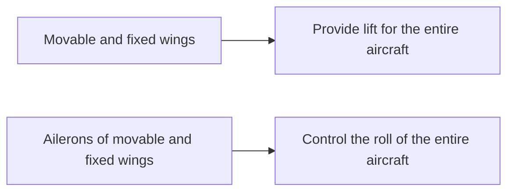
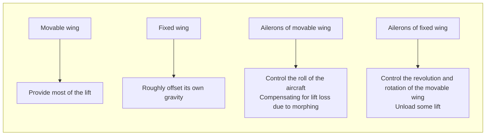

Final Accepted Version

# Research on an Aerodynamic-Driven Morphing Aircraft and Its Aerodynamic Design

Tingyu Guo a,b, Chenhua Zhu a, Liangtao Feng a, Yuyu Duan a, Haixin Chen a,*

a *School of Aerospace Engineering, Tsinghua University, Beijing 100084, China*
b *China Academy of Aerospace Science and Innovation, Beijing 100088, China*

Received xx xx xxxc; revised xx xx xxxc; accepted xx xx xxxc

**Abstract**

Morphing technology is considered a crucial direction for the future development of aircraft. However, conventional morphing aircraft often employ complex actuation mechanisms and actuators to drive the morphing process. The associated costs in terms of structural weight increase and space occupancy are prohibitively high, even exceeding the benefit of morphing. Especially for high aspect ratio aircraft with large root bending moments, it is very difficult for actuators to directly drive wing deformation. To address this issue, aerodynamic forces generated by control surface deflection can be utilized as an alternative to actuator-driven morphing. This approach reduces the overall cost of morphing while enhancing its benefits. This novel aerodynamic-driven morphing technique imposes new requirements and challenges on the aerodynamic design of aircraft. With a combination of flight experiments and numerical simulations, this article analyzes the variations in aerodynamic forces during the aerodynamic-driven process. Using a high aspect ratio long-endurance UAV as the design baseline, the design method of the control surface for aerodynamic-driven morphing is also discussed.

*Keywords:* High aspect ratio aircraft; Morphing aircraft; Flight test; Aerodynamic design; Computational Fluid Dynamics;

## 1. Introduction

High-altitude long-endurance aircraft play a crucial role in various fields, including but not limited to Earth/sea observation, resource survey, and meteorology.1-4 At high altitudes, where the air is thin, aircraft engaged in high-altitude cruising experience higher lift coefficients, with induced drag constituting a significant portion of the total drag. To enhance the lift-to-drag ratio and extend the range, high-altitude aircraft often adopt designs with high aspect ratios, even to the extent of super-high aspect ratios.

However, high aspect ratio aircraft have stringent requirements for takeoff and landing facilities, and their maneuverability and resistance to gusty winds are relatively poor, significantly limiting their practical utility.5,6 In recent years, morphing aircraft have emerged as a focal point in aircraft development exploration. By altering the wing span during different flight phases through morphing technology, the conflicting design requirements between takeoff/landing performance and cruising efficiency in high aspect ratio aircraft can be effectively addressed.7-13

Although variable-span morphing technology has made considerable progress in recent times, its application still faces substantial challenges. Many existing variable-span morphing aircraft incur high costs in terms of structural weight increase and

internal space occupancy, rendering the benefits of morphing technology unable to offset the various costs. Enhancing the performance benefits of morphing technology and reducing its overall costs are imperative for the future development of morphing technology.7,14-17

In response to this, the research team proposed an aerodynamic-driven morphing aircraft.18-20 The wings of this morphing aircraft consist of fixed wings and movable wings connected by rods. The movable wings rotate around hinges on the rod, while the rod  rotates around hinges on the fixed wings, and the morphing process is achieved through the coordination of these two rotations. During takeoff and landing, the fixed and movable wings form a biplane configuration, resulting in a smaller wingspan, lower requirements for takeoff/landing facilities, and improved resistance to wind during flight. In the cruising state, the fixed and movable wings form a high aspect ratio monoplane configuration, as shown in Figure 1.

Diagram showing the morphing process between Biplane Mode and Monoplane Mode, labeling the Movable Wing, Rod, and Fixed Wing.

Fig. 1. Morphing process of the Monoplane-Biplane morphing aircraft.

The morphing process is achieved through aerodynamic forces generated by the deflection of ailerons. No additional drive mechanisms are required at the hinges. The morphing motion of the wings can be decomposed into the "revolution" of the rod around the fixed wing and the "rotation" of the movable wing around the rod, as illustrated in Figure 2. Each movable wing is equipped with a segment of aileron on both its left and right sides. During the morphing process, the deflection of the ailerons is employed to alter the direction and magnitude of the lift vector on the movable wing, thereby controlling the motion of the movable wing.

Diagram of the wing structure for aerodynamic-driven morphing, showing unactuated hinges, ailerons, rotation angle, and revolution angle.

Fig. 2. Wing structure of the aerodynamic-driven morphing.

In this novel concept, the research team conducted morphing flight experiments of the aerodynamic-driven morphing aircraft, validating the rationality and feasibility of the aerodynamic-driven morphing concept. Figure 3 illustrates the process of controlling

the morphing through aileron deflection during the flight experiment, where the length of the arrows reflects the magnitude of lift and gravity.

Under normal flight conditions, all ailerons contributed to the aircraft's roll control (Figure 3.A). When the aircraft was preparing to transition from a biplane configuration to a monoplane configuration, the four ailerons on the two movable wings deflected upward, generating lift on the wings that was less than their own weight. The aerodynamic forces maintain the movable wings in a stationary position, then released them from the fixed position (Figure 3.B). After releasing, the ailerons deflected downward, creating lift slightly greater than the weight of the wings and inducing the wings to rotate upward (Figure 3.C), reaching a peak altitude (Figure 3.D). Subsequently, the ailerons deflected upward, producing lift slightly less than the weight of the wings and driving the wings to rotate downward (Figure 3.E). During the morphing process, the two ailerons on each movable wing differentially deflected to control the roll of the movable wing

around the rod, keeping it essentially parallel to the fixed wing while be able to generate necessary lateral force to drive the revolution by small bank angle. Upon completion of the morphing, the ailerons continued to deflect downward, generating lift less than the weight of the movable wings, maintaining their stationary position and completing the fixation of the movable wings (Figure 3.F). Throughout the morphing process, the ailerons on the fixed wing were responsible for controlling the roll of the entire aircraft through differential deflection. They may also deflected downward as needed to compensate for lift losses due to morphing. The process of transitioning from a monoplane to a biplane is the reverse of the described morphing process. The use of aileron deflection-generated aerodynamic forces for autonomous morphing simplified the morphing structure, minimized intrusion into the internal space of the wings, and achieved a 50% change in aircraft wingspan. This method effectively avoids the shortcomings of other variable-span methods.

Normal flight: Ailerons contributing to roll control.

The movable wing released before morphing: Ailerons deflected upward.

Movable wings rotating upward: Ailerons deflected downward.

Movable wings at peak altitude.

Movable wings rotating downward: Ailerons deflected upward.

The movable wing fixed after morphing.

Fig. 3. The process of aerodynamic-driven morphing in flight test of the validation aircraft.

This paper focuses on the aerodynamic-driven morphing variant aircraft, utilizing computational fluid dynamics methods and flight experiments to analyze the aerodynamic changes during the morphing process. Additionally, the paper explores geometric shape design methods and control surface design methods for aerodynamic-driven morphing aircraft.

## 2. Aerodynamic characteristics of aerodynamic-driven morphing aircraft

The aerodynamic-driven morphing aircraft employs aerodynamic forces for autonomous folding and unfolding. During the morphing process, it is necessary to adjust the deflection of ailerons to maintain the lift on the movable wings slightly greater or slightly less than their own weight. To achieve this, it is essential to first understand the changes in aerodynamic forces during the morphing process. If

there is a significant or unsteady change in lift during the morphing process, it may adversely affect the control and safety of the morphing process.

## 2.1. Research methods

In this paper, computational fluid dynamics (CFD) methods are primarily utilized to study the aerodynamic characteristics during the morphing process. Considering that a complete model of the morphing aircraft, including ailerons, rods, and other structural components, is relatively complex and computationally challenging, a simplified geometric model is employed to reduce computational complexity. The geometric model used for calculations is a half-model, consisting of the fuselage, fixed wing, and movable wing. The movable wing can rotate parallel to the fixed wing. Both the fixed wing and the movable wing are modeled as straight wings with NACA 2412 airfoil profiles. The chord length for both wings is 1 meter, and the wingspan is 5 meters each, resulting in an overall wingspan of 20 meters in the monoplane configuration, as illustrated in Figure 4. The CFD calculations involve a structured hexahedral mesh, comprising background and nested meshes. The background mesh includes the fuselage, fixed wing, symmetry plane, and flow field grid, with approximately 14 million grid cells. The nested mesh includes the movable wing and the surrounding flow field, with approximately 2 million grid cells, as illustrated in Figure 5. For the configuration changes during the morphing process, the overlapping grid method was used for grid reconstruction, as shown in Figure 6.

Diagram showing the morphing path of the movable wing from monoplane to biplane configuration, highlighting the fixed and movable wings.

Diagram illustrating the revolution angle of the movable wing relative to the fixed wing during the morphing process.

Fig. 4. The geometric model used in CFD calculation of morphing.

Computational grid used for CFD analysis, showing the mesh density around the fuselage and wing surfaces.

Fig. 5. The grid used in CFD calculation of morphing.

Detailed view of the overset grid used to handle the moving parts during the morphing process.

Fig. 6. The overset grid used in the morphing process.

The inflow Mach number for the calculations is 0.2, and the Reynolds number is 4 million. During the simulations, the movable wing undergoes a uniform rotation from monoplane to biplane configuration or vice versa. The rotational speed of the movable wing around the fixed wing is set at 10° per second, with a rotation time of 15.7 seconds. The wing is at 0 degrees of rotation when in the monoplane configuration and at 157 degrees when in the biplane configuration. The calculations employ the Unsteady Reynolds-Averaged Navier-Stokes (URANS) method and the Shear-Stress Transport (SST) turbulence model. The calculation adopts a dual time step advancement, with a time step length of 0.005s, and advances a total of 3500 steps.

## 2.2. Changes in aerodynamic forces between biplane and monoplane

Before discussing the aerodynamic changes during the morphing process, it is necessary to first clarify the aerodynamic characteristics of the aircraft in both monoplane and biplane configurations. Biplane appeared in the early stages of aircraft development, providing greater lift when wingspan was limited. However, the mutual interference between the upper and lower wings also resulted in a loss of aerodynamic efficiency. Early research on biplane aircraft found that the aerodynamic loss mainly depends on the wing spacing between the upper and lower wings . The larger the spacing, the lower the aerodynamic loss. However, for the aerodynamic-driven morphing aircraft, the wing spacing cannot be greater than the fuselage height. At the same time, excessive wing spacing may have adverse effects on pitch stability. Therefore, setting the spacing between the upper and lower wings to about 1 chord length is appropriate.

Rectangular and trapezoidal wing configurations for monoplane and biplane, showing the morphing process.

Fig. 7. Geometric configurations of rectangular and trapezoidal wings.

Considering that high aspect ratio planes typically use rectangular or trapezoidal wings, aerodynamic calculations and analyses were conducted on these two types of monoplanes and biplanes, the geometric configurations are shown in Figure 7, and the taper ratio of the trapezoidal wing is 0.4.

Figure 8 and Figure 9 show the changes in lift and drag between monoplane and biplane (Lift and drag of wings, excluding fuselage and other parts). When the spacing between the wings is 1 chord length, the biplane loses about 25% lift compared with monoplane at the same angle of attack. However, due to the larger stall angle of biplane, the maximum lift coefficient loss is reduced to 13% - which is completely acceptable compared to the benefits of reducing the takeoff wingspan by half.

| Angle of attack (°) | Monoplane - Trapezoidal wing | Biplane - Trapezoidal wing | Monoplane - Rectangular wing | Biplane - Rectangular wing |
| --- | --- | --- | --- | --- |
| 0 | 0.0 | 0.0 | 0.0 | 0.0 |
| 5 | 0.65 | 0.5 | 0.6 | 0.45 |
| 10 | 1.2 | 0.9 | 1.15 | 0.85 |
| 15 | 1.3 | 1.15 | 1.25 | 1.1 |

Fig. 8. Comparison of lift coefficients between monoplanes and biplanes.

The drag of a biplane is significantly increased compared to a monoplane, partly due to the biplane interference, and partly due to a halving of the aspect ratio while the monoplane is converted to biplane.

| Angle of attack (°) | Monoplane - Trapezoidal wing | Biplane - Trapezoidal wing | Monoplane - Rectangular wing | Biplane - Rectangular wing |
| --- | --- | --- | --- | --- |
| 0 | 0.005 | 0.01 | 0.005 | 0.01 |
| 5 | 0.015 | 0.025 | 0.015 | 0.025 |
| 10 | 0.04 | 0.055 | 0.04 | 0.055 |
| 15 | 0.08 | 0.11 | 0.08 | 0.11 |

Fig. 9. Comparison of drag coefficients between monoplanes and biplanes.

On the other hand, it can be seen that the lift and drag coefficients of biplanes with rectangular wings and trapezoidal wings are almost identical, which also means that the discussion of rectangular wings in this section can be further extended to trapezoidal wings.

## 2.3. Changes in aerodynamic forces during the morphing process

### 2.3.1 Lift and drag during the morphing process

For such a brand-new aerodynamic-driven morphing, the aerodynamic changes during the morphing process are more complex. Figure 10 illustrates the variation in lift and drag for different angles of attack (2° and 6°) during the morphing process, while Figure 11 shows the changes in wing pressure distribution at a 2-degree angle of attack. From the computational results, it can be observed that during the transition from monoplane to biplane configuration, there is a diminishing trend in the low-pressure region at the leading edge of the upper surface of the movable wing.

The lift exhibits a gradual decrease, with a variation of approximately 20% during the morphing process. Meanwhile, the drag shows an increasing trend. Overall, the changes in lift and drag are relatively stable, which is favorable for aerodynamic control during the morphing process.

In addition to lift and drag, it is crucial to consider the variations in the aerodynamic center and the center of lift during the morphing process. Changes in the pressure center and aerodynamic center along the chord direction of the wing can affect the pitch stability of the aircraft during morphing, while variations in the pressure center along the span of the movable wing can influence its rotation.

| Lift coefficient (AoA = 2°) |
| --- |
| 0 | 0.410 | 0.175 | 0.235 | 0.380 | 0.145 | 0.235 |
| 30 | 0.385 | 0.165 | 0.220 | 0.365 | 0.145 | 0.220 |
| 60 | 0.365 | 0.160 | 0.205 | 0.355 | 0.150 | 0.205 |
| 90 | 0.350 | 0.155 | 0.195 | 0.345 | 0.150 | 0.195 |
| 120 | 0.340 | 0.150 | 0.190 | 0.340 | 0.150 | 0.190 |
| 150 | 0.330 | 0.140 | 0.190 | 0.330 | 0.140 | 0.190 |
| Lift coefficient (AoA = 6°) |
| --- |
| 0 | 0.780 | 0.335 | 0.445 | 0.750 | 0.305 | 0.445 |
| 30 | 0.710 | 0.315 | 0.395 | 0.690 | 0.295 | 0.395 |
| 60 | 0.685 | 0.305 | 0.380 | 0.675 | 0.295 | 0.380 |
| 90 | 0.670 | 0.295 | 0.375 | 0.665 | 0.290 | 0.375 |
| 120 | 0.655 | 0.285 | 0.370 | 0.650 | 0.280 | 0.370 |
| 150 | 0.635 | 0.275 | 0.360 | 0.635 | 0.275 | 0.360 |
| Drag coefficient (AoA = 2°) |
| --- |
| 0 | 0.0205 | 0.0075 | 0.0130 | 0.0205 | 0.0075 | 0.0130 |
| 30 | 0.0210 | 0.0080 | 0.0130 | 0.0210 | 0.0080 | 0.0130 |
| 60 | 0.0215 | 0.0080 | 0.0135 | 0.0215 | 0.0080 | 0.0135 |
| 90 | 0.0215 | 0.0080 | 0.0135 | 0.0215 | 0.0080 | 0.0135 |
| 120 | 0.0218 | 0.0080 | 0.0138 | 0.0218 | 0.0080 | 0.0138 |
| 150 | 0.0220 | 0.0075 | 0.0145 | 0.0220 | 0.0070 | 0.0150 |
| Drag coefficient (AoA = 6°) |
| --- |
| 0 | 0.033 | 0.014 | 0.019 | 0.034 | 0.015 | 0.019 |
| 30 | 0.036 | 0.016 | 0.020 | 0.036 | 0.016 | 0.020 |
| 60 | 0.037 | 0.017 | 0.020 | 0.037 | 0.017 | 0.020 |
| 90 | 0.038 | 0.017 | 0.021 | 0.038 | 0.017 | 0.021 |
| 120 | 0.039 | 0.017 | 0.022 | 0.039 | 0.017 | 0.022 |
| 150 | 0.038 | 0.013 | 0.025 | 0.039 | 0.014 | 0.025 |

Fig. 10. Changes in lift and drag of the aircraft during the morphing process.

| Pressure (Pa) |
| --- |
| 88500 |
| 87700 |
| 86900 |
| 86100 |
| 85300 |
| 84500 |

Pressure (Pa)

Fig. 11. Pressure distribution changes during the morphing process.

### 2.3.2 Lift center and aerodynamic center

For the morphing aircraft, the height of the center of gravity undergoes significant changes during the morphing process. The conventional definitions of the center of lift and aerodynamic center for typical aircraft are no longer applicable. Therefore, in this study, the aircraft is divided into the fixed wing and fuselage, and the movable wing, calculating their respective centers of lift and aerodynamic centers.

Taking the leading edge of the fixed wing and the leading edge of the movable wing as the coordinate origins, Figure 12 depicts the variations in the chordwise center of lift and aerodynamic center for both the fixed wing and fuselage, as well as the movable wing during the morphing process. It can be observed that the center of lift of the movable wing

undergoes a change of around 5% (2° angle of attack) and 3% (6° angle of attack) of the chord length during the morphing process, while the center of lift positions of the fixed wing and fuselage remain essentially unchanged. During the transition from monoplane to biplane configuration, the aerodynamic centers of the fixed wing and fuselage shift forward by approximately 3% of the wing chord, and the aerodynamic center of the movable wing shifts forward by about 2% of the wing chord. Therefore, in the aerodynamic design of the aircraft, it is necessary to increase the static stability margin appropriately to ensure pitch stability during the morphing process. Therefore, in the design of aerodynamic-driven morphing aircraft, the pitch stability should be appropriately enhanced, to cope with the aerodynamic center movement during the morphing process.

Lift center position/chord length (%) - Angle of attack = 2°
| Revolution angle (°) | Movable wing (B to M) | Fixed wing & fuselage (B to M) | Movable wing (M to B) | Fixed wing & fuselage (M to B) |
| --- | --- | --- | --- | --- |
| 0 | 38 | 32 | 38 | 32 |
| 30 | 39 | 33 | 39 | 33 |
| 60 | 39 | 33 | 39 | 33 |
| 90 | 40 | 33 | 40 | 33 |
| 120 | 40 | 33 | 40 | 33 |
| 150 | 38 | 33 | 38 | 33 |

Lift center position/chord length (%) - Angle of attack = 6°
| Revolution angle (°) | Movable wing (B to M) | Fixed wing & fuselage (B to M) | Movable wing (M to B) | Fixed wing & fuselage (M to B) |
| --- | --- | --- | --- | --- |
| 0 | 31 | 23 | 31 | 23 |
| 30 | 31 | 23 | 31 | 23 |
| 60 | 31 | 23 | 31 | 23 |
| 90 | 31 | 23 | 31 | 23 |
| 120 | 31 | 23 | 31 | 23 |
| 150 | 29 | 22 | 29 | 22 |

Aerodynamic center position/chord length (%)
| Revolution angle (°) | Movable wing (B to M) | Fixed wing & fuselage (B to M) | Movable wing (M to B) | Fixed wing & fuselage (M to B) |
| --- | --- | --- | --- | --- |
| 0 | 23 | 13 | 23 | 13 |
| 30 | 22 | 12 | 22 | 12 |
| 60 | 22 | 11 | 22 | 11 |
| 90 | 22 | 11 | 22 | 11 |
| 120 | 22 | 11 | 22 | 11 |
| 150 | 21 | 10 | 21 | 10 |

3D visualization of wing segments with percentage labels indicating spanwise positions (0% to 100%) and flow direction arrows.

Fig. 12. Changes in the lift center and aerodynamic center of the aircraft in the chord direction during the morphing process.

Taking the innermost end of the movable wing as the coordinate origin (The coordinate axis is defined according to Figure 12, 0% corresponds to the innermost end of the movable wing, and 100% corresponds to the outermost end of the movable wing), Figure 13 illustrates the variation in the spanwise center of lift for the movable wing during the morphing process at 2-degree angle of attack. It is worth noting that in both monoplane and biplane configurations, the spanwise lift center of the movable wing is located near the inner side, while in the morphing process, the spanwise lift center is located at the center of 50% of the spanwise length.

From Figure 13, it can be observed that in the initial stage of the morphing process, when the movable wing separates from the fixed wing, the spanwise movement of the spanwise center of lift on the movable wing is significant. Figure 14 further illustrates the flow conditions during this stage, showing that there is a strong wingtip vortex interference between the inner end surface of the movable wing and the outer end surface of the fixed wing. This interference can cause asymmetric lift on both sides of the movable wing, and the wingtip vortex will "lift" the inner side of the movable wing, preventing it from falling, obstructing the docking

and locking of two wing tips. This phenomenon was particularly evident in the flight test of the aircraft, as depicted in Figure 15. Therefore, in aerodynamic design, it is crucial to pay attention to the placement of the hinge and coordinate it with a certain control surface compensation to ensure the desired attitude of the movable wing.

Lift center position/wingspan (%)
| Revolution angle (°) | Movable wing (B to M) | Fixed wing & fuselage (B to M) | Movable wing (M to B) | Fixed wing & fuselage (M to B) |
| --- | --- | --- | --- | --- |
| 0 | 42 | 42 | 42 | 42 |
| 30 | 49.5 | 49.5 | 49.5 | 49.5 |
| 60 | 50.5 | 50.5 | 50.5 | 50.5 |
| 90 | 51 | 51 | 51 | 51 |
| 120 | 51.5 | 51.5 | 51.5 | 51.5 |
| 150 | 49 | 50.5 | 47.5 | 50.5 |

Fig. 13. Change of lift center in the spanwise direction of movable wings during the morphing process.

Visualization of X Vorticity and Pressure distribution on movable and fixed wings during morphing

Fig.14. Flow situation of movable and fixed wings at the beginning of morphing.

Sequence of photos showing interference between fixed and movable wings during a flight test

Fig.15. Interference between fixed and movable wings hinder the rotation of the movable wing during a flight test.

## 2.4. Unsteady effects during the morphing process

From Figures 10 and 12, it is evident that there are stable differences in the computed results between the folding morph and unfolding morph cases, indicating the presence of unsteady effects during the morphing process. To further analyze the source of these unsteady effects, additional steady-state calculations were conducted at intervals of 15 degrees in the morphing path, based on the previously obtained results.

The comparison between the results of steady-state and unsteady-state calculations is shown in Figure 16. There is a noticeable difference between the two sets of results, and this difference approximately follows a

sine curve with the rotation angle. Moreover, the difference becomes zero at a rotation angle of 90 degrees. It is hypothesized that this discrepancy may be attributed to the motion of the movable wing during the morphing process, causing a change in the effective angle of attack perpendicular to the incoming flow direction. Then leads to variations in lift and drag on the movable wing, as depicted in Figure 17.

| Top Panel: Lift coefficient vs Revolution angle |
| --- |
| 0 | 0.42 | 0.42 | 0.42 |
| 30 | 0.38 | 0.38 | 0.37 |
| 60 | 0.37 | 0.37 | 0.36 |
| 90 | 0.36 | 0.36 | 0.35 |
| 120 | 0.34 | 0.35 | 0.34 |
| 150 | 0.31 | 0.33 | 0.32 |
| 160 | 0.30 | 0.33 | 0.31 |
| Bottom Panel: Lift coefficient vs Revolution angle |
| Revolution angle (°) | Unsteady (bi to mono) | Unsteady (mono to bi) | Steady |
| 0 | 0.76 | 0.76 | 0.76 |
| 30 | 0.69 | 0.69 | 0.70 |
| 60 | 0.67 | 0.67 | 0.68 |
| 90 | 0.66 | 0.66 | 0.66 |
| 120 | 0.64 | 0.65 | 0.65 |
| 150 | 0.61 | 0.64 | 0.63 |
| 160 | 0.60 | 0.64 | 0.62 |

Fig. 16. Comparison of Unsteady and Steady Calculation Results in the Morphing Process.

Diagram showing the source of unsteady effects in the morphing process, illustrating velocity vectors and angles of attack for movable and fixed wings.

Fig. 17. The Source of Unsteady Effects in the Morphing Process.

Where $v$ is the velocity of the moving wing around the fixed wing, $v_y$ is the vertical component of $v$, $\alpha$ is the angle of attack, $v_\infty$ is the velocity of the incoming flow, $v'_\infty$ is the equivalent velocity of the incoming flow after considering the motion of the

wing. We can then deduce that:

$$ \Delta C_L = \frac{v_y}{v_\infty} C_{L\alpha} \eqno(1) $$

Where $\Delta C_L$ is the change in lift coefficient caused by wing motion, and $C_{L\alpha}$ is the derivative of lift coefficient with respect to angle of attack. To verify this conclusion, the results obtained from this formula were compared with those from CFD calculations, as shown in Figure 18. It can be observed that the two sets of results are in close agreement, confirming the earlier hypothesis that the unsteady effects during wing morphing primarily arise from the variation in effective angle of attack caused by the motion of the movable wing.

| Revolution angle (°) | CFD (-2°) | CFD (-6°) | Theoretical |
| --- | --- | --- | --- |
| 0 | -0.018 | -0.018 | -0.018 |
| 15 | -0.014 | -0.014 | -0.014 |
| 30 | -0.013 | -0.013 | -0.013 |
| 45 | -0.012 | -0.012 | -0.012 |
| 60 | -0.010 | -0.010 | -0.010 |
| 75 | -0.007 | -0.007 | -0.007 |
| 90 | -0.004 | -0.004 | -0.004 |
| 105 | 0.000 | 0.000 | 0.000 |
| 120 | 0.004 | 0.004 | 0.004 |
| 135 | 0.007 | 0.007 | 0.007 |
| 150 | 0.010 | 0.011 | 0.010 |
| 160 | 0.012 | 0.014 | 0.013 |

Fig. 18. Comparison of Unsteady Effects between Theoretical Prediction Values and CFD Results.

## 2.5 Aerodynamics during the morphing process with aileron deflection

The above aerodynamic calculations are based on wings without ailerons, but the deflection of ailerons is crucial for the aerodynamic-driven morphing. Therefore, it is necessary to discuss the aileron rudder effect during the morphing process.

Two movable wing geometries with ailerons deflected upwards and downwards by 10° were constructed, and aerodynamic calculations were performed on the aileron effects of the movable wing at different positions during the morphing process. The wing geometry and calculation results are shown in Figures 19 and 20. The angle of attack in the calculation is 2 degrees, and the position of the aileron hinge is at 80% chord length. From the calculation results, the aileron rudder effect hardly changes during the morphing process, which is also beneficial for controlling the morphing process.

3D model of a wing section with aileron deflected upwards

(a) Aileron deflected upwards

3D model of a wing section with aileron deflected downwards

(b) Aileron deflected downwards

Fig. 19. Geometry of movable wings with ailerons deflected upwards/downwards.

| Revolution angle (°) | Ailerons do not deflect | Ailerons deflected upwards by 10 degrees | Ailerons deflected downwards by 10 degrees |
| --- | --- | --- | --- |
| 0 | 0.40 | 0.19 | 0.60 |
| 20 | 0.37 | 0.17 | 0.54 |
| 40 | 0.36 | 0.16 | 0.53 |
| 60 | 0.35 | 0.16 | 0.52 |
| 80 | 0.35 | 0.16 | 0.51 |
| 100 | 0.34 | 0.16 | 0.51 |
| 120 | 0.34 | 0.15 | 0.50 |
| 140 | 0.33 | 0.15 | 0.49 |
| 160 | 0.32 | 0.15 | 0.49 |

Fig. 20. Geometry of movable wings with ailerons deflected upwards/downwards.

in the morphing process is very clear, and the rudder effect of the aileron remains unchanged during the process of morphing, which is advantageous for aerodynamic control during the morphing process. Based on these results and conclusions, further discussions can be conducted on the design criteria and methods for control surfaces during the aerodynamic-driven morphing process.

# 3. Aileron design for aerodynamic-driven morphing aircraft

The aerodynamic-driven morphing aircraft utilizes the aerodynamic forces generated by the deflection of control surfaces for morphing. The area of the aerodynamic control surfaces (ailerons) is one of its most crucial design parameters. Therefore, it is necessary to conduct specialized discussions on the design of ailerons for aerodynamic-driven morphing aircraft.

## 3.1. Design constraints for ailerons in morphing processes

Unlike traditional aircraft, the ailerons of aerodynamic-driven aircraft perform different functions during different stages. Figure 21 illustrates the task allocation of control surfaces during the morphing process. In conventional flight, both the fixed wing and the movable wing contribute to the aircraft's lift, and the ailerons of both wings participate in the aircraft's roll control. However, during the morphing process, the lift of the movable wing should be approximately equal to its own weight, while the lift of the fixed wing needs to balance the entire remaining weight of the aircraft. The ailerons of the movable wing control both the rotation and revolution of the movable wing, while the ailerons of the fixed wing control the roll of the aircraft and compensate for the loss of lift due to morphing.

From the comprehensive analysis of the above calculation results, it can be observed that the lift variation during the aerodynamic-driven morphing process is relatively low and exhibits a smooth transition. The mechanism of unsteady aerodynamics

### Conventional flight

### During the morphing

Fig. 21. The Role of Different Rudders in the Process of Aerodynamic-driven Morphing.

In the conventional flight state of the aircraft, both the movable wing and the fixed wing generate lift,

and the sum of their lifts is equal to the weight of the aircraft. At this moment:

$$ G = L = L_{\text{fixed}} + L_{\text{movable}} \tag{2} $$

$$ L_{\text{fixed}} = \frac{1}{2} \rho v^2 S_{\text{fixed}} C_{L,\text{fixed1}} \tag{3} $$

$$ L_{\text{movable}} = \frac{1}{2} \rho v^2 S_{\text{movable}} C_{L,\text{movable1}} \tag{4} $$

$G$ represents the total weight of the aircraft, $L_{\text{fixed}}$ and $L_{\text{movable}}$ are the lifts generated by the fixed wing and movable wing respectively, $S_{\text{fixed}}$ and $S_{\text{movable}}$ are the areas of the fixed wing and movable wing respectively, $C_{L,\text{fixed1}}$ and $C_{L,\text{movable1}}$ are the lift coefficients of the fixed wing and movable wing at this moment. During the morphing process, the total lift of the aircraft needs to be redistributed. The lift of the movable wing will be partially unloaded, causing its lift to be slightly greater or slightly less than its own weight, driving it to move upward or downward (see Figure 22). Meanwhile, the lift of the fixed wing needs to compensate for a portion, ensuring its lift equals the remaining weight of the entire aircraft:

$$ L_{\text{fixed}} = G_{\text{fixed}} = \frac{1}{2} \rho v^2 S_{\text{fixed}} C_{L,\text{fixed2}} \tag{5} $$

$$ L_{\text{movable}} = G_{\text{movable}} = \frac{1}{2} \rho v^2 S_{\text{movable}} C_{L,\text{movable2}} \tag{6} $$

$G_{\text{fixed}}$ and $G_{\text{movable}}$ represent the weight of the fixed portion and the movable wing of the aircraft respectively, $S_{\text{fixed}}$ and $S_{\text{movable}}$ are the areas of the fixed wing and the movable wing respectively, $C_{L,\text{fixed2}}$ and $C_{L,\text{movable2}}$ are the lift coefficients of the fixed wing and the movable wing at this moment.

The process of redistributing lift is achieved through aileron deflection and changing the angle of attack, assuming that the slope of the lift line for fixed and morphing wings is the same, then:

$$ C_{L,\text{fixed2}} = C_{L,\text{fixed1}} + C_{L\alpha} \Delta\alpha + C_{Lr,\text{fixed}} \Delta r_{\text{fixed}} \tag{7} $$

$$ C_{L,\text{movable2}} = C_{L,\text{movable1}} + C_{L\alpha} \Delta\alpha + C_{Lr,\text{movable}} \Delta r_{\text{movable}} \tag{8} $$

Among them, $\Delta\alpha$ is the change in angle of attack, $C_{L\alpha}$ is the slope of the lift line, $\Delta r_{\text{fixed}}$ is the deflection angle of the aileron for fixed wings (downward deviation is positive), $\Delta r_{\text{movable}}$ is the deflection angle of the aileron for movable wings, $C_{Lr,\text{fixed}}$ is the derivative of the fixed wing lift coefficient with respect to the aileron deflection angle, $C_{Lr,\text{movable}}$ is the derivative of the movable wing lift coefficient with respect to the aileron deflection angle.

Furthermore, the deflection angle of the active wing ailerons during the morphing process can be obtained:

$$ \Delta\alpha = \frac{C_{L,\text{fixed2}} - C_{L,\text{fixed1}} - C_{Lr,\text{fixed}} \Delta r_{\text{fixed}}}{C_{L\alpha}} \tag{9} $$

$$ \Delta r_{\text{movable}} = \frac{C_{L,\text{movable2}} - C_{L,\text{movable1}} - C_{L\alpha} \Delta\alpha}{C_{Lr,\text{movable}}} \tag{10} $$

For this, we can obtain the required aileron deflection angle for morphing under different flight conditions. To ensure that the aileron effectiveness remains linear throughout the morphing process, the aileron deflection angle $\Delta r_{\text{movable}}$ should not exceed 10-15 degrees. Based on this, the minimum required $C_{Lr,\text{movable}}$ can be calculated, and consequently, the required aileron area can be determined.

### 3.2. Design principles of aileron based on the morphing envelope

In conventional aircraft design, it is essential to define the flight envelope to proceed with the overall aircraft design. For morphing aircraft, in addition to the flight envelope, it is crucial to specify its morphing envelope. The morphing envelope includes the maximum dynamic pressure envelope and the minimum dynamic pressure envelope. The maximum dynamic pressure of the morphing envelope is mainly determined by the structural strength of the morphing mechanism, while the minimum dynamic pressure depends on the effectiveness of the ailerons on the morphing aircraft's movable wings. A larger morphing envelope provides greater flexibility for transitions between different configurations.

| Revolution angle(°) | Expected lift of the movable wing (%) | Lift of the movable wing without aileron deflection (%) | Gravity of the movable wing (%) |
| --- | --- | --- | --- |
| 0 | 100 | 100 | 55 |
| 20 | 90 | 90 | 55 |
| 40 | 80 | 80 | 55 |
| 60 | 70 | 70 | 55 |
| 80 | 60 | 60 | 55 |
| 100 | 55 | 55 | 55 |
| 120 | 55 | 55 | 55 |
| 140 | 55 | 55 | 55 |
| 160 | 55 | 55 | 55 |

Fig. 22. Expected rudder effect of movable wing ailerons during morphing process from biplane to monoplane.

Taking the aerodynamic-driven morphing aircraft based on RQ-4A as the reference model in Figure 1, the maximum upward deflection angle of the ailerons on the movable wings is limited to 15 degrees. Among these, 5 degrees are used to control the roll of the movable wings, and 10 degrees are utilized for unloading the lift on the movable wings ($\Delta r_{movable} < 10^\circ$). Assuming that the ailerons of the fixed wing do not participate in lift redistributing ($\Delta r_{fixed} = 0$). According to formulas (2) - (10) and the calculation results in chapter 2.3, the morphing envelopes for the aircraft with different aileron areas are obtained, as shown in Figure 23 (The taper ratio has little effect on the performance of the wing, so we think that the aerodynamic characteristics of rectangular wings in chapter 2.3 can be approximately extended to trapezoidal wings). It can be observed that increasing the aileron area of the movable wings significantly expands the morphing envelope of the aircraft. When the aileron area of the movable wings accounts for 25%, the morphing envelope range is approximately twice as large compared to when the aileron area is 15%.

If the control strategy during the morphing process is altered, with the fixed-wing ailerons compensating for a lift coefficient of 0.1 through downward deflection ($C_{Lr,fixed} \Delta r_{fixed} = 0.1$), the morphing envelope of the aircraft under these conditions is illustrated in Figure 24. Comparing Figure 24 with Figure 23, it becomes evident that applying lift compensation to the fixed-wing ailerons similarly leads to a significant expansion of the aircraft's morphing envelope.

| Airspeed(km/h) | Monoplane flight envelope (km) | Morphing envelope when aileron area ratio is 15% (km) | Morphing envelope when aileron area ratio is 20% (km) | Morphing envelope when aileron area ratio is 25% (km) |
| --- | --- | --- | --- | --- |
| 200 | 0 | 0 | 0 | 0 |
| 400 | 15 | 8 | 10 | 12 |
| 600 | 18 | 13 | 14 | 15 |
| 800 | 0 |  |  |  |
Fig. 24. Morphing envelope of the aerodynamic-driven morphing aircraft when fixed-wing ailerons compensating some lift.

Overall, the design of aerodynamic-driven morphing aircraft control surfaces depends primarily on the requirements for the morphing envelope and is coupled with the flight control strategy during the morphing process. In the design process, it is essential to first define the morphing envelope of the aircraft and the flight control strategy, and subsequently determine the design approach for the control surfaces based on the wing's planform shape. The analysis results for the RQ-4A as the baseline aircraft indicate that a control surface area ratio of approximately 15%-20% can meet the requirements of aerodynamic-driven morphing. Although this value is larger compared to conventional aircraft, it does not significantly disrupt the wing's shape and structural design.

# 4. Conclusions

The aerodynamic-driven morphing aircraft utilizes the deflection of control surfaces to achieve morphing, eliminating the need for complex actuation mechanisms. This approach effectively addresses the high weight penalty associated with traditional morphing aircraft designs. However, this novel morphing mode presents new challenges for the aerodynamic design of the aircraft. This study focuses on a new concept of aerodynamic-driven morphing aircraft and conducts research on its aerodynamic design methodology.

(1) The paper begins by analyzing the variation of aerodynamic forces during the morphing process through a combination of flight experiments and numerical simulations. The study investigates the aerodynamic effects and non-steady-state phenomena during the morphing process. Based on the understanding of aerodynamic variations during

| Airspeed(km/h) | Monoplane flight envelope (km) | Morphing envelope when aileron area ratio is 15% (km) | Morphing envelope when aileron area ratio is 20% (km) | Morphing envelope when aileron area ratio is 25% (km) |
| --- | --- | --- | --- | --- |
| 200 | 0 | 0 | 0 | 0 |
| 400 | 15 | 6 | 8 | 10 |
| 600 | 18 | 10 | 12 | 14 |
| 800 | 0 |  |  |  |
Fig. 23. Morphing envelope of the aerodynamic-driven morphing aircraft with different aileron area of movable wing.

morphing, the allocation of tasks to control surfaces during the aerodynamically driven morphing process is discussed. The aerodynamic variation during the aerodynamic-driven morphing process is relatively low and exhibits a smooth transition. The mechanism of unsteady aerodynamics in the morphing process is clear, and the rudder effect of the aileron remains unchanged during the process of morphing. From the perspective of aerodynamic control, aerodynamic-driven morphing is highly feasible.

From the perspective of aerodynamic design, this morphing approach also brings some new problems, such as the need for additional enhancement of static stability to cope with aerodynamic center changes during the morphing process, and a loss of about 13% in the maximum lift coefficient under a biplane configuration. However, compared to the ability to change the 50% wingspan, these costs are completely acceptable. At the same time, the complexity of aerodynamic in morphing undoubtedly increases the difficulty of control and structural design, which also brings additional challenges to aircraft designers.

(2) Based on the understanding of aerodynamic variations during morphing, the allocation of tasks to control surfaces during the aerodynamically driven morphing process is discussed. Using  as the baseline aircraft, the impact of different design parameters on the morphing envelope is further explored, leading to the formulation of aerodynamic design principles based on the morphing envelope for aerodynamic-driven morphing aircraft. The analysis results suggest that the aileron area ratio of approximately 15%-20% for movable wings can meet the need for aerodynamic-driven morphing. This means that simply expanding ailerons can replace the original actuators, greatly reducing the costs of morphing.

### Acknowledgements

（陈老师需要您补充基金号）

### Declaration of generative AI and AI-assisted technologies in the writing process

During the preparation of this work the authors used GhatGPT in order to check for grammar errors, improve readability and language. After using this tool/service, the authors reviewed and edited the content as needed and takes full responsibility for the content of the publication.
