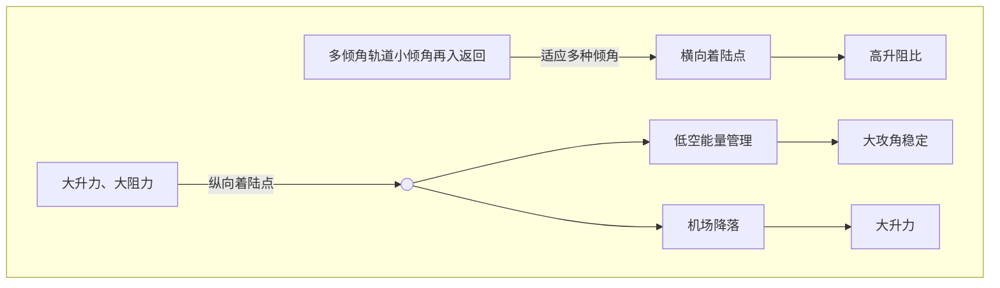

# 跨域变构飞行器变形方案设计及气动特性分析

安英韬 闫 溟 陈聪聪 解春雷*

摘 要：针对跨域飞行航天运输场景，立足需求牵引，结合国内前期已形成的相关技术积累，提出了一种具有折展变构型能力的空天飞行器设计方案。通过计算流体力学（CFD）方法，对折叠构型和展开构型的空天飞行器在不同高度、不同马赫数、不同攻角下的升阻特性、飞行稳定性进行了分析及对比。结果表明，折叠构型在高空高速条件下具备优良的减速性能，并可在大攻角下实现稳定飞行。展开构型在低马赫数下呈现出高升阻比特性，利于低空滑翔。在跨域飞行中，通过变构技术将两种构型进行适应性转变可充分发挥不同构型在不同空域速域下的飞行优势，实现高效飞行目标，为未来可重复使用天地往返运输系统的建设提供了新的思路。

关键词：空天飞行器；变体飞行器；航天运输系统；气动特性

当前世界航天已经进入以大规模互联网星座、太空资源开发与利用、载人月球探测等为代表的新阶段。航天运输系统作为一个国家开展航天活动的支撑和基础，其发展程度代表了一个国家能否自由自主地进入空间，是综合国力的重要标志。在战略需求的驱动下，航天运输技术爆发了三次高潮（图1）。随着太空资源开发，太空经济逐步从萌芽走向现实，以航班化天地往返、1小时全球抵达为代表的航天运输技术将迎来新一轮的发展热潮。而高效可靠、可重复使用的航班化航天运输系统是实现规模化进出太空、治理太空的重要技术支撑。

航天运输三次浪潮示意图，展示了从1960年洲际再入、1980年太空竞赛、2010年大规模低轨星座到2030年以后太空经济的发展阶段。

图1 航天运输三次浪潮

从20世纪60年代美国国家航空航天局（NASA）启动航天飞机的研制工作开始，人们就一直在进行对于可重复使用航天器的探索，旨在通过助推段火箭发动机和上面级轨道飞行器的回收和重复使用，来显著降低发射成本。但是由于材料、热防护等技术的不成熟，每次任务结束轨道飞行器均需要进行大量隔热瓦的拆解、检测和更换维护工作。随后英

国和德国也先后提出了各自的可重复使用航天运输方案：HOTOL和Sanger，但均因高昂的研发经费和难以突破的技术壁垒在90年代先后下马。21世纪以来，世界各国对第二代可重复使用航天器的研发热度不断提高。美国太空探索技术公司（SpaceX）提出了超重-星舰完全可复用两级火箭构型的天地运输方案，但目前两次试飞均以失败告终。Sanger计划的研究遗产被德国航空航天中心（DLR）消化吸收后，衍生出了SpaceLiner，一种更具可行性的两级带翼高超声速飞行器方案。计划2035年左右开展原型机飞行试验，2040年后实现可运营的高速客运飞行。可以预见的是，未来可重复使用航天器的任务需求包括但不限于：卫星批量化部署、地月经济圈建设、地面与地球轨道间的人/货往返运输以及重要城市间的洲际人/货快速运输。不难发现，针对单一空域-速域剖面设计的传统飞行器很难适应上述多种任务需求，需要有提升飞行器的跨域变构飞行能力。

基于多次可重复使用需求、在大气层内采用滑翔弹道长距离飞行、普通机场水平着陆的可重复使用空天飞行器面临着宽速域飞行工况的挑战，空气动力学设计需在亚声速、超声速、高超声速各个飞行阶段持续提供飞行器所需的性能。目前已经提出的跨域飞行方案中，或多或少存在着一些问题，如“星舰”的气动外形能够使其在再入段以最快的速度大攻角减速下降，但其在降落回收的过程采用喷气式反推降落模式，需要携带大量燃料。而以

SpaceLiner 飞行器为代表下一代空天飞行器概念，可以解决民航客机远距离客运飞行时间过长的问题，其远距离水平滑翔降落的特点充分节省了燃料，但是在高空段由于其大曲率的端头和展开翼的存在会面临较大的防热压力。

传统飞行器性能提升面临天花板，变形飞行器利用新的技术途径，可显著提升飞行性能、拓展任务剖面，意义重大且发展潜力突出。由此，笔者提出了一种可变构型的空天飞行器设计方案，通过折展变构型技术将适应高速飞行及低速飞行任务的优势构型集成到同一套航天运输平台上，可根据飞行任务需要来调整飞行器的构型（图 2）。

图 2 变构智能飞行

# 1 跨域变构飞行方案

## 1.1 跨域高效智能飞行

跨域高效智能飞行是指飞行器通过智能自主的跨域变构飞行，实现跨域高效、高可靠、可重复使用，其在飞行器全部飞行剖面内的起飞、上升、返回、再入、着陆等各个环节，均实现最优的飞行性能。

## 1.2 变构飞行方案

立足需求牵引，针对航班化航天运输的场景，借鉴了世界各国空天飞行器的设计思路，笔者提出了一种具有折展变构能力的可重复使用升力式空天飞行器构型设计方案：离轨再入阶段采用折叠构型，进行高马赫数大攻角减速降热，在飞行马赫数降至 6 以下再择机展开翼面，实现小攻角水平滑翔进场着落，构型如图 3 所示。

本文所研究的空天飞行器概念设计阶段基础外形参考美国的 X-37B 轨道试验飞行器，为降低防热难度，对端头做了钝化处理，在翼根处增加了折展变形机构和柔性蒙皮，使得机翼可以在飞行过程中自由展开和收拢，从而根据任务调整构型，发展了收缩折叠和大翼面展开两种构型，采用两级垂直发射、水平起降（VTHL）方式。

（a）折叠构型

（a）折叠构型

（b）展开构型

（b）展开构型

图 3 空天飞行器折叠及展开构型

# 2 气动仿真分析及方法

## 2.1 模型及网格

变构型空天飞行器设计长度为 13 m，飞行器为面对称模型，考虑到要对飞行器的飞行稳定性进行分析，在计算时需要计入侧滑角的影响，因此在流场建模时采用全模进行建模。首先生成壁面的三角形非结构网格，如图 4 所示，然后通过阵面推进法沿着法向生成各向异性的六面体网格，最后采用四面体和金字塔形体网格填充整个流场。为提高计算效率，对网格密度和数量进行了控制：面网格最小尺寸 10 mm，边界层第一层网格高度为 0.01 mm，增长率为 1.3，共设置 15 层。高超声速计算网格单元总约数为 120 万，亚声速计算网格单元总数约为 400 万。

（a）折叠构型壁面网格

（a）折叠构型壁面网格

（b）展开构型壁面网格

（b）展开构型壁面网格

图 4 折叠和展开构型壁面网格

## 2.2 气动力计算工况及数值计算方法

本文的分析过程关注空天飞行器再入段开始下降到滑翔着陆的高超声速和亚声速特性。选取的飞

行高度从50 km（此刻接近再入过程动压最大值）到1 km，飞行马赫数从12 Ma到0.4 Ma，每个飞行高度计算了从0°到90°共10个攻角状态。为了对飞行稳定性进行分析，计算时引入了5°侧滑角，具体计算状态见表 1。

表1 气动力计算状态

| 高度/km | 马赫数 | 攻角范围/(°) | 侧滑角/(°) |
| --- | --- | --- | --- |
| 50 | 12 | 0~90 | 5 |
| 25 | 6 | 0~90 | 5 |
| 10 | 2 | 0~90 | 5 |
| 2 | 0.8 | 0~90 | 5 |
| 1 | 0.4 | 0~90 | 5 |

计算采用的控制方程为雷诺平均纳维-斯托克斯（Reynolds-averaged Navier Stokes, RANS）方程。其一般形式可表示为：

$$\frac{\partial U}{\partial t} + \frac{\partial F}{\partial x} + \frac{\partial G}{\partial y} + \frac{\partial H}{\partial z} - (\frac{\partial F_v}{\partial x} + \frac{\partial G_v}{\partial y} + \frac{\partial H_v}{\partial z}) = 0 \quad (1)$$

其中，$U$ 代表守恒变量，$F$、$G$ 和 $H$ 分别代表了 $x$、$y$ 和 $z$ 方向的无黏通量，$F_v$、$G_v$、$H_v$ 是 $x$、$y$ 和 $z$ 方向的黏性通量。

控制方程的离散方式采用有限体积法，湍流模型采用一方程Spalart-Allmaras（S-A）模型，计算区域内的壁面边界使用无滑移绝热壁边界条件，外边界则采用远场边界条件。

## 2.3 升阻特性分析

### 2.3.1 折叠构型高超声速升阻特性

按照飞行轨迹设计方案，折叠构型将用于高超声速段减速下降过程。从图 5可以看出，折叠构型在高超声速及超声速飞行状态下，最大升力出现在50°攻角附近，随后有所下降；阻力系数始终随着攻角增大而不断提高，符合一般规律，以大攻角姿态飞行，流动分离和非定常效应明显，阻力系数显著提高，在90°攻角达到最大。而折叠构型高超声速飞行的最大升阻比出现20°～30°攻角区间，也仅为1.38~1.5。

| AoA/(°) | Ma=0.4 | Ma=0.8 | Ma=2 | Ma=6 | Ma=12 |
| 0 | -2 | -2 | -2 | -2 | -2 |
| 10 | 5 | 4 | 3 | 2 | 1 |
| 20 | 12 | 10 | 8 | 6 | 4 |
| 30 | 18 | 15 | 12 | 10 | 8 |
| 40 | 23 | 20 | 16 | 14 | 12 |
| 50 | 28 | 25 | 20 | 18 | 16 |
| 60 | 26 | 23 | 18 | 16 | 14 |
| 70 | 20 | 18 | 14 | 12 | 10 |
| 80 | 12 | 10 | 8 | 6 | 4 |
| 90 | 2 | 1 | 0 | -1 | -2 |
（a）折叠构型升力系数

| AoA/(°) | Ma=0.4 | Ma=0.8 | Ma=2 | Ma=6 | Ma=12 |
| 0 | 2 | 2 | 3 | 4 | 5 |
| 10 | 4 | 5 | 6 | 8 | 10 |
| 20 | 8 | 10 | 12 | 15 | 18 |
| 30 | 14 | 18 | 22 | 25 | 28 |
| 40 | 20 | 25 | 30 | 35 | 38 |
| 50 | 26 | 32 | 38 | 42 | 45 |
| 60 | 30 | 38 | 45 | 48 | 50 |
| 70 | 32 | 42 | 48 | 50 | 52 |
| 80 | 33 | 44 | 50 | 52 | 53 |
| 90 | 34 | 45 | 51 | 53 | 54 |
（b）折叠构型阻力系数

| AoA/(°) | Ma=0.4 | Ma=0.8 | Ma=2 | Ma=6 | Ma=12 |
| 0 | -0.5 | -0.5 | -0.4 | -0.3 | -0.2 |
| 10 | 1.5 | 1.2 | 0.8 | 0.5 | 0.3 |
| 20 | 2.5 | 2.0 | 1.4 | 1.0 | 0.8 |
| 30 | 2.6 | 2.2 | 1.5 | 1.2 | 1.0 |
| 40 | 2.2 | 1.8 | 1.3 | 1.1 | 0.9 |
| 50 | 1.8 | 1.5 | 1.1 | 0.9 | 0.8 |
| 60 | 1.4 | 1.2 | 0.8 | 0.7 | 0.6 |
| 70 | 1.0 | 0.8 | 0.6 | 0.5 | 0.4 |
| 80 | 0.6 | 0.5 | 0.4 | 0.3 | 0.2 |
| 90 | 0.1 | 0.1 | 0.0 | 0.0 | 0.0 |
（c）折叠构型升阻比
图5 折叠构型升阻特性

在本文的设计中，折叠构型在再入段拟采用和星舰类似的大攻角飞行方式以充分利用自身阻力进行气动减速。再入段的典型飞行攻角为60°～70°，马赫数为12。该状态下升力系数为14.6~19.0，阻力系数为35.7~43.5，升阻比为0.337~0.533，呈现出高阻低升特性。因此，折叠构型为一种低升阻比构型，有利于在再入段快速减速。同时由于其机翼收起，相较于传统的航天飞机采用40°攻角的姿态进行再入飞行的情况，有望降低翼面峰值热流（图6）。

展开构型热流分布云图，显示了飞行器表面的热流分布，右侧有热流数值标尺，范围从200到2600 kW/m^2

（a）展开构型热流分布

展开构型热流分布云图

（b）展开构型热流分布

图6 折叠构型与展开构型的热流分布

### 2.3.2 展开构型低速升阻特性

由于有航程需求，升阻比被认为是飞行器气动布局最核心的技术指标之一。在飞行器的无动力滑翔段，其飞行距离与初速和升阻比正相关：

$$ x = \frac{(L/D)V_c^2}{2g} \ln \frac{1-(V_e/V_c)^2}{1-(V_0/V_c)^2} \quad (2) $$

式中：$V_c$ 为第一宇宙速度；$V_0$ 为飞行器初速度；$V_e$ 为飞行器末速度；$L/D$ 为升阻比。

从节省燃料的角度来讲，期待飞行器具备远距离无动力滑翔能力，因此展开构型主要用于超声速和亚声速飞行。图 7的蓝色、红色和灰色曲线分别给出了展开构型在2马赫的超声速、0.8马赫以及0.4马赫的亚声速飞行工况下的升阻曲线。

结果表明，展开构型超声速飞行最大升力出现在40°～50°攻角区间，阻力系数仍然在90°攻角处达到最大，升阻比最大值则出现在10°～20°攻角区间。升阻比最大的10°～20°攻角区间也是展开构型亚声速滑翔飞行的典型攻角，在0.4马赫下，升力系数为 16.3~36.6 ，阻力系数为 3.5~12.4 ，最大升阻比在 4.7~5.0。可以看出，在亚声速飞行区间，该构型呈现出低阻高升的特性，可适应低马赫数远距离滑翔任务需求。

| AoA/(°) | Ma =0.4 | Ma =0.8 | Ma =2 | Ma =6 | Ma =12 |
| --- | --- | --- | --- | --- | --- |
| 0 | 0 | 0 | 0 | 0 | 0 |
| 10 | 15 | 12 | 10 | 8 | 5 |
| 20 | 28 | 25 | 20 | 15 | 10 |
| 30 | 38 | 35 | 28 | 22 | 15 |
| 40 | 42 | 38 | 32 | 25 | 18 |
| 50 | 40 | 35 | 30 | 24 | 18 |
| 60 | 35 | 30 | 25 | 20 | 15 |
| 70 | 25 | 20 | 18 | 15 | 10 |
| 80 | 15 | 12 | 10 | 8 | 5 |
| 90 | 2 | 2 | 2 | 2 | 2 |

（a）展开构型升力系数

| AoA/(°) | Ma =0.4 | Ma =0.8 | Ma =2 | Ma =6 | Ma =12 |
| --- | --- | --- | --- | --- | --- |
| 0 | 2 | 2 | 2 | 2 | 2 |
| 10 | 5 | 5 | 5 | 5 | 5 |
| 20 | 10 | 10 | 10 | 10 | 10 |
| 30 | 20 | 20 | 20 | 20 | 20 |
| 40 | 35 | 35 | 35 | 35 | 35 |
| 50 | 50 | 50 | 50 | 50 | 50 |
| 60 | 65 | 65 | 65 | 65 | 65 |
| 70 | 80 | 80 | 80 | 80 | 80 |
| 80 | 88 | 88 | 88 | 88 | 88 |
| 90 | 90 | 90 | 90 | 90 | 90 |

（b）展开构型阻力系数

| AoA/(°) | Ma =0.4 | Ma =0.8 | Ma =2 | Ma =6 | Ma =12 |
| --- | --- | --- | --- | --- | --- |
| 0 | 0 | 0 | 0 | 0 | 0 |
| 10 | 4.8 | 4.2 | 2.2 | 1.8 | 1.2 |
| 20 | 3.5 | 3.2 | 2.1 | 1.6 | 1.1 |
| 30 | 2.2 | 2.0 | 1.6 | 1.3 | 0.9 |
| 40 | 1.5 | 1.4 | 1.2 | 1.0 | 0.7 |
| 50 | 1.0 | 0.9 | 0.8 | 0.7 | 0.5 |
| 60 | 0.7 | 0.6 | 0.5 | 0.4 | 0.3 |
| 70 | 0.4 | 0.3 | 0.3 | 0.2 | 0.2 |
| 80 | 0.2 | 0.2 | 0.1 | 0.1 | 0.1 |
| 90 | 0 | 0 | 0 | 0 | 0 |

（c）展开构型升阻比

图 7展开构型升阻特性

## 3 飞行静稳定性分析

### 3.1 纵向稳定性分析

#### 3.1.1 折叠构型高超声速飞行纵向稳定性

纵向稳定性以及相应的配平能力与质心位置密切相关。图8给出了折叠构型在 $Ma = 12$ 条件下纵向压心系数随攻角的变化曲线。若再入下降过程采用 60° ～70° 大攻角状态飞行，对应纵向压心位置 0.509~0.514，在结构设计时，使质心位于其附近可以保证大攻角下降过程中良好的配平效率。

| AoA/(°) | Ma =6 | Ma =12 |
| --- | --- | --- |
| 0 | 0.2 | 0.2 |
| 10 | 0.6 | 0.6 |
| 20 | 0.52 | 0.52 |
| 30 | 0.51 | 0.51 |
| 40 | 0.51 | 0.51 |
| 50 | 0.51 | 0.51 |
| 60 | 0.51 | 0.51 |
| 70 | 0.52 | 0.52 |
| 80 | 0.53 | 0.53 |
| 90 | 0.54 | 0.54 |

图8 折叠构型在 $Ma = 12$ 工况下纵向压心位置

图9给出了在 $Ma = 12$ 和 $Ma = 6$ 两种飞行速度下，折叠构型的俯仰力矩系数随攻角的变化曲线。从曲线可以看出折叠构型飞行器可实现大攻角纵向配平。当质心系数为0.51时，60°攻角下的俯仰力矩系数约等于0，即该状态下飞行器可以实现自配平。从曲线斜率可以看出，在大攻角飞行时，$C_{mz}^\alpha < 0$ 意味着在50°以上的攻角范围内，飞行器是纵向静稳定的。

| AoA/(°) | Ma = 6 | Ma = 12 |
| --- | --- | --- |
| 0 | -2 | -2 |
| 10 | -1.5 | -0.5 |
| 20 | -1 | 0 |
| 30 | -0.5 | 0.5 |
| 40 | 0 | 1 |
| 50 | 0.5 | 1 |
| 60 | 0 | 0.5 |
| 70 | -3.5 | -3.5 |
| 80 | -8 | -8 |
| 90 | -16 | -16 |
图9 折叠构型俯仰力矩系数

### 3.1.2 展开构型亚声速飞行纵向稳定性

图 10 给出了展开构型在 $Ma = 0.4$ 和 $Ma = 0.8$ 的亚声速条件下纵向压心系数随攻角的变化曲线。可以看出，在亚声速条件下保持 10°～20° 攻角飞行，纵向压心在 0.53~0.548 范围内，符合展开构型的质量分布规律，为质心的调整保留了足够的裕度。如果想要实现更大攻角（30°～40°）配平则需要质心纵向位置位于 0.5 左右，需要大幅度增大配重来使重心位置前移，在工程上不具备太大的可行性。

| AoA/(°) | Ma = 0.4 | Ma = 0.8 |
| --- | --- | --- |
| 0 | 0.56 | 0.58 |
| 10 | 0.55 | 0.55 |
| 20 | 0.54 | 0.54 |
| 30 | 0.5 | 0.51 |
| 40 | 0.51 | 0.51 |
| 50 | 0.52 | 0.52 |
| 60 | 0.53 | 0.53 |
| 70 | 0.55 | 0.55 |
| 80 | 0.57 | 0.57 |
| 90 | 0.58 | 0.58 |
图10 展开构型在亚声速工况下纵向压心位置

图 11 给出了在 $Ma = 0.4$ 和 $Ma = 0.8$ 工况下，展开构型的俯仰力矩系数随着攻角的变化情况。可以看出，在攻角 10°～20° 这个区间曲线斜率为负，即 $C_m^\alpha < 0$，意味着在进行小攻角飞行时，飞行器是纵向静稳定的。

| AoA/(°) | Ma = 0.4 | Ma = 0.8 |
| --- | --- | --- |
| 0 | -2 | -2 |
| 10 | -8 | -8 |
| 20 | -12 | -12 |
| 30 | -8 | -8 |
| 40 | -2 | -2 |
| 50 | -8 | -8 |
| 60 | -16 | -16 |
| 70 | -24 | -24 |
| 80 | -24 | -24 |
| 90 | -24 | -24 |
图11 展开构型俯仰力矩系数

## 3.2 侧向稳定性分析

### 3.2.1 折叠构型高超声速飞行横向静稳定性
仍然讨论 $Ma = 12$ 和 $Ma = 6$ 的飞行速度，计算

折叠构型在高超声速状态下的横向气动导数，如图 12 所示。显然，无论是小攻角飞行，还是在典型的 60°～70° 攻角工况，气动导数 $C_{l\beta}$ 均为负，折叠构型的飞行器都是横向静稳定的。无需像星舰一样配备前翼和后翼结构来对滚转进行控制。

| AoA/(°) | Ma = 6 | Ma = 12 |
| --- | --- | --- |
| 0 | -0.05 | -0.05 |
| 10 | -0.08 | -0.06 |
| 20 | -0.18 | -0.18 |
| 30 | -0.28 | -0.24 |
| 40 | -0.34 | -0.31 |
| 50 | -0.4 | -0.35 |
| 60 | -0.44 | -0.4 |
| 70 | -0.44 | -0.41 |
| 80 | -0.42 | -0.39 |
| 90 | -0.42 | -0.42 |
图12 折叠构型横向气动导数

### 3.2.2 折叠构型高超声速飞行航向静稳定性

折叠构型在 $Ma = 12$ 和 $Ma = 6$ 两类工况下的航向气动导数如图 13 所示。从图 13 中可以看出，在攻角超过 35 度后，$C_{n\beta}$ 的值由负转正，意味着在大攻角情况下，飞行器航向是不稳定的。

| AoA/(°) | Ma = 6 | Ma = 12 |
| --- | --- | --- |
| 0 | -4.5 | -5.5 |
| 10 | -4.5 | -5.5 |
| 20 | -5 | -6 |
| 30 | -3 | -2.5 |
| 40 | -1 | -0.5 |
| 50 | -2 | -1.5 |
| 60 | -2 | -1.5 |
| 70 | -1 | -0.5 |
| 80 | -1 | 0 |
| 90 | 3 | 3 |
图13 折叠构型航向气动导数

在侧向稳定性问题中，存在滚转、偏航明显耦合的现象。根据航天飞机的设计经验，其在高速飞行时（马赫数大于 2）也会出现 $C_{n\beta}$ 为正的不稳定情况，因此，不能简单从航向气动导数来判定飞行器的航向不稳定的。为此，使用更为准确的荷兰滚模态判据 $C_{l\beta\_dyn}$ 来确定飞行器的航向静稳定性：

$$ C_{n\beta\_dyn} = C_{n\beta} \cos \alpha + \frac{I_y}{I_x} C_{l\beta} \sin \alpha \quad (3) $$

其中，$I_x$、$I_y$ 分别是对 $x$ 轴和 $y$ 轴的转动惯量，$C_{n\beta\_dyn} < 0$ 时，飞行器航向静稳定。

根据折叠构型的质量惯性参数，保守地取偏航轴与滚转轴惯量比 $I_y/I_x$ 为 7，计算 $C_{l\beta(dyn)}$ 如图 14 所示。可见，在 20° 以上相当宽的攻角区间内，$C_{l\beta(dyn)}$ 为负，即折叠构型航向是静稳定的；而在 20° 以下小攻角区间，折叠构型航向反而是静不稳定的。

| AoA/(°) | Ma = 6 | Ma = 12 |
| 0 | 0.3 | 0.35 |
| 10 | 0.25 | 0.28 |
| 20 | 0.1 | 0.15 |
| 30 | 0 | 0.08 |
| 40 | -0.08 | 0.02 |
| 50 | -0.18 | -0.15 |
| 60 | -0.22 | -0.2 |
| 70 | -0.25 | -0.28 |
| 80 | -0.3 | -0.32 |
| 90 | -0.38 | -0.35 |
图14 折叠构型荷兰滚模态判据曲线

| AoA/(°) | Ma = 0.4 | Ma = 0.8 |
| 0 | -5 | -6 |
| 10 | -5 | -7 |
| 20 | -7 | -9 |
| 30 | -4 | -5 |
| 40 | -5 | -5 |
| 50 | -4 | -6 |
| 60 | -6 | -8 |
| 70 | -11 | -14 |
| 80 | -10 | -16 |
| 90 | -18 | -20 |
图17 折叠构型荷兰滚模态判据曲线

### 3.2.3 展开构型亚声速飞行横向静稳定性

对于展开构型，讨论其在亚声速飞行状态下的横向稳定性。图 15给出了在$Ma= 0.4$和$Ma= 0.8$的亚声速条件下展开构型横向气动导数随攻角变化曲线。可以看出，在0°～90°攻角下，$C_{l\beta}$始终为负，表明展开构型在亚声速条件下横向是静稳定的。

| AoA/(°) | Ma = 0.4 | Ma = 0.8 |
| 0 | -0.3 | -0.4 |
| 10 | -0.7 | -0.9 |
| 20 | -1.1 | -1.3 |
| 30 | -0.4 | -1.1 |
| 40 | -1.1 | -1.3 |
| 50 | -0.8 | -1.0 |
| 60 | -1.0 | -1.2 |
| 70 | -1.5 | -1.8 |
| 80 | -1.3 | -2.4 |
| 90 | -2.1 | -3.0 |
图15 展开构型横向气动导数

### 3.2.4 展开构型亚声速飞行航向静稳定性

图16给出了在$Ma= 0.4$和$Ma= 0.8$的亚声速条件下展开构型航向气动导数随攻角变化曲线，可以看出，在0°～30°的小攻角范围内飞行，$C_{n\beta}$为负，飞行器航向是静稳定的。但当攻角增大，航向气动导数$C_{n\beta}$在较宽的区间出现大于0的情况，即飞行器航向是静不稳定。

| AoA/(°) | Ma = 0.4 | Ma = 0.8 |
| 0 | -4 | -5 |
| 10 | -4.2 | -5.2 |
| 20 | -4.5 | -5.5 |
| 30 | -2 | -2.5 |
| 40 | 1.5 | -0.2 |
| 50 | 0.5 | -1.5 |
| 60 | 0.5 | -1.2 |
| 70 | -1.5 | 1.8 |
| 80 | -1.2 | 1.5 |
| 90 | 5.5 | 3 |
图16 折叠构型航向气动导数

同样，仿照折叠构型，图 17给出了展开构型航向稳定性的荷兰滚模态判据。可以看出，无论是小攻角飞行还是大攻角飞行$C_{l\beta(dyn)}$均为负，即满足航向稳定性要求。

# 4 结 论

（1）着眼于可重复使用天地往返运输系统未来发展，针对跨域飞行背景，提出了两种不同的空天飞行器构型。

（2）折叠构型在高空高马赫数条件下展现出优良的高空减速性能，且仍然具备高度的纵向、航向和横向稳定性。

（3）展开构型在低空低马赫数条件下展现出高升阻比特性，利于低空滑翔，在小攻角飞行具备优良的飞行稳定性。

（4）在跨域飞行过程中，通过变构型技术将两种构型进行环境适应性转变，可充分发挥两种构型在不同飞行高度的优势，将高空大攻角减速和低空低马赫数滑翔能力集成到同一套天地往返运输平台上，对推动可重复使用天地往返运输系统的建设、实现航班化天地往返运输及1小时全球抵达等多元任务的实现提供了新的思路。

### 参考文献

包为民, 汪小卫. 航班化航天运输系统发展展望[J].宇航总体技术, 2021, 5(3): 1-6.

Bao Weimin, Wang Xiaowei. Prospect of airline-flight-mode aerospace transportation system[J]. Astronautical Systems Engineering Technology, 2021, 5(3): 1-6.

宋征宇,黄兵,汪小卫,等.重复使用航天运载器的发展及其关键技术[J].前瞻科技,2022,1(1):62-74.
Song Zhenyu, Huang Bing, Wang Xiaowei, et al. Development and Key Technologies of Reusable Launch Vehicle[J]. Science and Technology Foresight, 2022,1(1):62-74.

E. SMITH. Space Shuttle in perspective-History in the making, AIAA 1975-336. 11th Annual Meeting and Technical Display. February 1975.

Andy Prince, Billy Carson. Human Spaceflight Value Study: Was the Shuttle a Good Dea [C]// 2012 Joint ISPA/SCEA International Conference and Training Workshop. Brussels, Belgium. 2012.

Mesnard, J. An overview of the British Aerospace HOTOL transatmospheric vehicle[R]. NASA-TM-88008, 1986.

Hoegenauer E., Koelle D.E.. Saenger - The German aerospace vehicle program [C]// AIAA First National Aero-space Plane Conference. Reston, Virginia, 1989.

孟光, 刘昶, 杨冬春,等.美国 SpaceX 超重-星舰首飞分析及对中国航天产业的启示[J]. 航空学报, 2023, 44(10):028914.
Meng Guang, Liu Chang, Yang Dongchun, et al. First flight of SpaceX heavy-lift starship: Enlightenment for aerospace industry in China[J]. Acta Aeronautica et Astronautica Sinica, 2023, 44(10):028914.

杨金龙, 林旭斌. 德国 SpaceLiner 空天飞行器综述[J]. 飞航导弹

2019(11): 21-30.
Yang Jinlong, Lin Xubin. Overview of the German SpaceLiner space vehicle[J]. Aerospace Technology, 2019(11): 21-30.

孟博威, 马虎, 夏镇娟, 等. 旋转爆轰燃烧室与涡轮导向器集成特性数值研究[J]. 航空学报, 2024, 45: 129223.
Meng Bowei, Ma Hu, Xia Zhenjuan, et al. Numerical study on characterization of integrated rotating detonation combustor and nozzle guide vane[J]. Acta Aeronautica et Astronautica Sinica, 2024, 45: 129223.

张旭辉, 解春雷, 刘思佳, 等. 智能变形飞行器发展需求及难点分析[J]. 航空学报, 2023, 44(21): 529302.
Zhang Xu Hui, Xie Chunlei, Liu Sijia, et al. Development needs and difficulty analysis for smart morphing aircraft[J]. Acta Aeronautica et Astronautica Sinica, 2023, 44(21): 529302.

左光, 艾邦成. 先进空间运输系统气动设计综述[J]. 航空学报, 2021, 42(2): 624077.
Zuo Guang, Ai Bangsheng. Aerodynamic design of advanced space transportation system: Review[J]. Acta Aeronautica et Astronautica Sinica, 2021, 42(2): 624077.

李志文, 张磊, 李亮, 等. 星舰气动布局性能特点分析[J]. 空气动力学学报, 2022, 40(5): 1-14.
Li Zhi, Zhang Lei, Li Liang, et al. Performance and characteristics analysis on the Starship aerodynamic configuration[J]. Acta Aerodynamica Sinica, 2022, 40(5): 1-14 (in Chinese).

SURBER T E, OLSEN D C. Space shuttle orbiter aerodynamic development[J]. Journal of Spacecraft and Rockets, 1978, 15(1): 40-47.

# Design and aerodynamic characteristic analysis of a morphing aircraft for cross-domain flight

AN Yingtao YAN Ming CHEN Congcong XIE Chunlei*

(China Academy of Aerospace Science and Innovation, Beijing 100088, China)

**Abstract**: Aiming at the cross-domain flight and space transportation scenario, a design concept for an aerospace vehicle with morphing capabilities is proposed, leveraging previous domestic technological advancements. Utilizing Computational Fluid Dynamics (CFD) methodology, the aerodynamic characteristics and flight stability of the folded and unfolded configurations of the aerospace vehicle are analyzed and compared across different altitudes, Mach numbers, and angles of attack. The findings reveal that the folded configuration exhibits excellent deceleration capabilities at high altitudes and speeds, while remaining stable at high angles of attack. Conversely, the unfolded configuration demonstrates a high lift-to-drag ratio characteristic at low Mach numbers, facilitating low-altitude gliding. Employing morphing technology to adaptively transition between the two configurations during cross-domain flight optimally exploits their respective advantages at different flight altitudes, thus achieving efficient flight objectives and offering novel insights into the development of future reusable Earth-to-space transportation systems.

**Key words**: Aerospace vehicles (ASV); Morphing Aircraft; Aerospace transportation system; Aerodynamic characteristics
