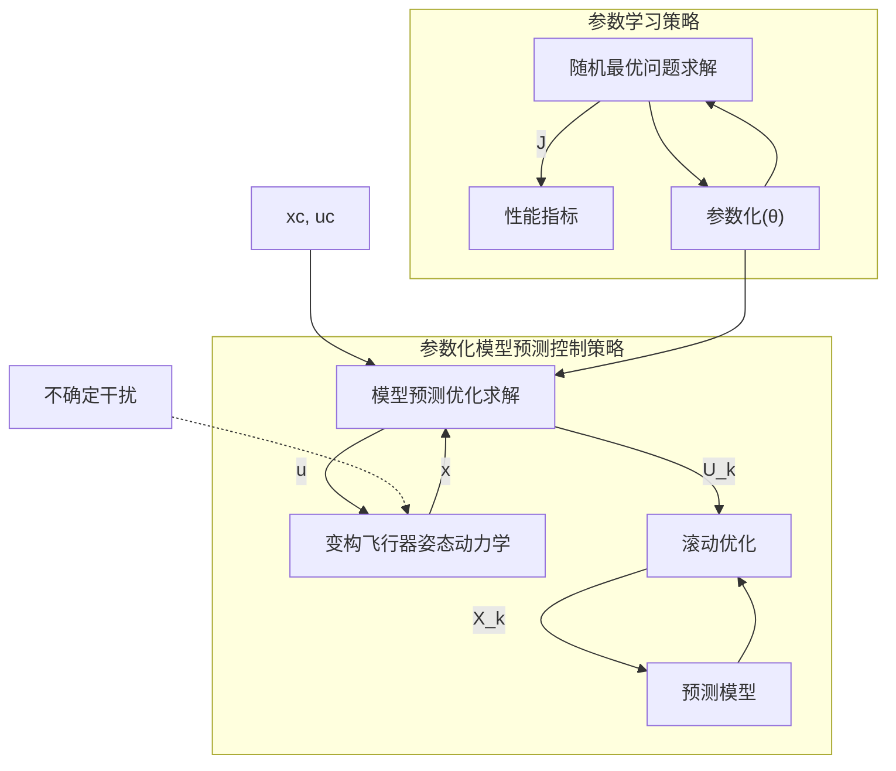

# 跨域变构飞行器自学习模型预测姿态控制方法

贾正宇，张 冉，李惠峰

（北京航空航天大学宇航学院，北京 102206）

**摘 要：**跨域变构飞行器可以根据任务环境自主改变气动外形，以最佳的气动性能完成跨空域、跨速域飞行任务。针对跨域变构滑翔段的动力学模型大范围变化，以及变构过程引起的气动扰动非线性不确定性的问题，提出了一种自学习模型预测姿态控制方法。在随机干扰和构型下，依据系统自身的模型与数据进行控制参数的学习，提高控制系统的鲁棒性。该方法在参数化模型预测控制问题的基础上，将模型偏差和构型作为随机变量，通过参数学习降低随机最优控制问题的代价函数，得到变构飞行器模型预测最优控制参数。仿真结果表明，对不同的构型变化任务，所提出的控制方法能够在 30% 的气动参数偏差下保持较好的控制品质，且相较于未训练参数能够提升姿态跟踪响应速度。

**关键词：**变构飞行器；参数学习；自学习；模型预测控制

# Self-learning Model Predictive Attitude Control Method for Large-flight-envelope Morphing Flight Vehicle

JIA Zhengyu, ZHANG Ran, LI Huifeng

(School of Astronautics, Beihang University, Beijing 102206, China)

**Abstract:** The large-flight-envelope morphing flight vehicle can autonomously adjust its aerodynamic shape according to the environment to achieve optimal aerodynamic performance for large-flight-envelope mission. To address the significant changes in the dynamic model caused by morphing and the nonlinear uncertainties in aerodynamic disturbances during the glide phase, a self-learning model predictive attitude control method is proposed. This method involves learning of control parameters based on the system's own model and data under random disturbances and configurations to enhance the controller's robustness. Based on the parametric model predictive control problem, this method treats model deviations and configurations as random variables to reduce the cost function of the stochastic optimal control problem through parameter learning, and obtains the optimal model predictive control parameters for the morphing flight vehicle. Simulation results for different morphing missions show that this control method can maintain good control quality under a 30% deviation in aerodynamic parameters, and improve attitude tracking response speed compared to untrained parameters.

**Key words:** Morphing flight vehicle; Parameter learning; Self-learning; Model predictive control

## 0 引 言

跨域变构飞行器是指飞行包络跨 0 至轨道高度大空域、0 至第一宇宙速度宽速域、构型可变的一类新概念飞行器。这类飞行器通过调整外形改变气动特性，从而优化飞行性能，使其能够适应更为宽泛的飞行空域和速域，应对更为复杂的飞行任务和环境挑战，实现更优的气动效率和操控性<sup></sup>。然而，

在高速飞行过程中，变构会引起复杂的气动特性变化，且质心位置、转动惯量等参数变化明显；因此该过程具有强耦合、强非线性、强不确定性等诸多特点，这对控制系统的设计提出了挑战<sup></sup>。

针对上述问题，变构飞行器姿态控制采用线性变参数控制以及非线性控制方法。线性变参数控制将变构飞行动力学建模为变参数线性系统，通过增益调度<sup></sup>和自适应控制<sup></sup>等方法实时调整反馈增

益,保证变构飞行的稳定性。切换控制也是变参数控制的一种,它将变构飞行器动力学建模为多个线性系统,针对各个线性系统设计子系统控制器,利用切换系统理论将子系统集成在一起,实现了变构飞行的稳定控制<sup></sup>。由于线性控制方法难以保证全局稳定性,非线性控制方法也被用于变构姿态控制中。利用动态逆的控制<sup></sup>能够有效解决姿态动力学的非线性和耦合控制问题,其与自适应控制方法相结合,能够有效提升系统动态特性和舵偏利用率<sup></sup>。滑模控制与动态逆控制相结合的控制方法<sup></sup>能够提升控制器对模型参数变化的鲁棒性;有限时间控制与动态逆控制相结合的控制方法<sup></sup>能够提升响应速率并降低变构执行机构的动作频率。

随着智能控制的发展,基于学习的智能控制方法也被用于变构飞行器姿态控制。神经网络控制<sup></sup>和基于强化学习的控制方法<sup></sup>被用于提升变构飞行器控制系统的控制性能。文献[15]提出了一种基于数据驱动的无模型自适应动态规划方法,将构型作为状态进行姿态构型一体化控制。文献[16]提出了一种自适应神经动态曲面控制方法,不仅减少了神经网络参数数量,而且具有处理输入输出约束的能力。文献[17]基于增强学习理论,提出了一种新型的变体飞行器翼型自适应控制方法,可以满足变体飞行器在多任务状态下保持最优性能的需求。文献[18]基于 T-S 模糊理论建立了变形飞机的 T-S 模糊模型,设计了模型参考自适应飞行控制算法,并通过仿真验证了该方法抑制外界干扰的能力。文献[19]提出了一种基于二型 TSK 模糊滑模控制的切换自适应控制方法,保证了飞行器在收缩小翼切换过程中的稳定性和平滑性。文献[20]设计了深度确定性策略梯度学习步骤,提高了飞行过程中的外形优化效果。在上述文献中,基于学习的智能控制方法未能考虑随机模型偏差对控制系统的影响,因此这类方法对不确定性大的变构型姿态控制缺乏鲁棒性保证。此外,在学习过程中将构型参数作为随机变量,以训练控制器适应不同构型的方法,目前尚未见诸文献。

本文针对跨域变构飞行器再入滑翔段的姿态控制问题,提出了一种自学习模型预测控制方法。首先,给出了跨域变构飞行器动力学模型;然后,构建了参数化模型预测控制问题,并给出了保证系统稳定的充分条件;同时,将模型偏差和构型作为随机变量,依据系统模型与系统仿真数据进行控制参数的学习优化,降低随机最优控制问题的代价函数,得到变构飞行器模型预测最优控制参数;最后,仿真结果验证了所提方法在不确定条件下对变构飞行姿态控制品质的提升。

## 1 变构飞行器运动模型

以图 1 所示的可变后掠飞行器为研究对象。为了在跨域飞行中实现最优的气动效率和飞行性能,后掠角需要根据飞行状态和飞行任务进行调整,在最小后掠角与最大后掠角之间连续变化($\chi = 30^\circ \sim 60^\circ$),通过小后掠角提升升阻比,通过大后掠角降低阻力。后掠角变化会导致气动力、转动惯量等飞行参数的变化,因此建立飞行器姿态运动模型时需要关注后掠角变化带来的舵效和质量特性变化。

Morphing aircraft with variable-sweep

图 1 可变后掠飞行器

Fig. 1 Morphing aircraft with variable-sweep

飞行器的控制执行机构为尾部的垂尾舵面以及可变后掠翼上的一对水平舵面,垂尾舵面控制飞行器偏航运动,水平舵面控制飞行器的俯仰运动与滚转运动。通过控制分配,定义滚转、俯仰和偏航三通道的通道舵偏 $\delta_a, \delta_e, \delta_r$。

姿态控制需要使攻角 $\alpha$ 和倾侧角 $\mu$ 跟踪响应指令,同时镇定侧滑角 $\beta$ 在 $0^\circ$,因此选用气流角描述姿态比较合适。结合动量矩定理得到的绕心转动动力学中三轴角速度 $p, q, r$ 的动态,6 个方程共同组成了姿态控制模型

$$
\begin{cases}
\dot{\alpha} = q - p \cos \alpha \tan \beta - r \sin \alpha \tan \beta + \\
\quad \frac{g}{V \cos \beta} \cos \mu \cos \gamma - \frac{F_L}{mV \cos \beta} \\
\dot{\beta} = p \sin \alpha - r \cos \alpha + \frac{g}{V} \sin \mu \cos \gamma + \frac{F_Y}{mV} \\
\dot{\mu} = p \frac{\cos \alpha}{\cos \beta} + r \frac{\sin \alpha}{\cos \beta} + \frac{F_L \tan \beta}{mV} - \frac{g \tan \beta}{V} \cos \mu \cos \gamma \\
\dot{p} = [I_{xz}(I_x - I_y + I_z)pq + (I_y I_z - I_z^2 - I_{xz}^2)qr + \\
\quad I_z L_A + I_{xz} N_A] / (I_x I_z - I_{xz}^2) \\
\dot{q} = [(I_z - I_x)pr - I_{xz}(p^2 - r^2) + M_A] / I_y \\
\dot{r} = [(I_x I_y - I_x^2 + I_{xz}^2)pq + I_{xz}(-I_x + I_y - I_z)qr + \\
\quad I_x N_A + I_{xz} L_A] / (I_x I_z - I_{xz}^2)
\end{cases} \quad (1)
$$

式中：$g$ 为重力加速度；$V$ 为飞行器相对地面的速度；$m$ 为飞行器质量，$I$ 为转动惯量，随构型发生变化；$F_L$ 和 $F_Y$ 分别为升力和侧向力；$L_A, M_A$ 和 $N_A$ 分别为滚转力矩、俯仰力矩和偏航力矩。气动力与气动力矩表示为

$$
\begin{cases}
F_L = C_L Q S_{\text{ref}} \\
F_Y = C_Y Q S_{\text{ref}}
\end{cases}
\text{（2）}
$$

$$
\begin{cases}
L_A = C_{m_x} Q S_{\text{ref}} L_{\text{ref}} \\
M_A = C_{m_y} Q S_{\text{ref}} L_{\text{ref}} \\
N_A = C_{m_z} Q S_{\text{ref}} L_{\text{ref}}
\end{cases}
\text{（3）}
$$

式中：$Q$ 是动压 $\rho V^2/2$；$S_{\text{ref}}$ 是飞行器参考面积；$L_{\text{ref}}$ 是飞行器参考长度；$C_L, C_Y$ 分别是升力和侧向力系数；$C_{m_x}, C_{m_y}, C_{m_z}$ 分别是三通道气动力矩系数。

$$
\begin{cases}
C_L = (1 + \Delta C_L) \left[ C_L^\alpha (\chi, Ma) \alpha + C_L^\beta (\chi, Ma) \beta \right] \\
C_Y = (1 + \Delta C_Y) \left[ C_Y^\alpha (\chi, Ma) \alpha + C_Y^\beta (\chi, Ma) \beta \right] \\
C_{m_x} = (1 + \Delta C_{m_x}) \left[ C_{m_x}^\alpha (\chi, Ma) \alpha + C_{m_x}^\beta (\chi, Ma) \beta + \right. \\
\quad \left. C_{m_x}^{\delta_x} (\chi, Ma) \delta_x + C_{m_x}^{\delta_y} (\chi, Ma) \delta_y + C_{m_x}^{\delta_z} (\chi, Ma) \delta_z \right] \\
C_{m_y} = (1 + \Delta C_{m_y}) \left[ C_{m_y}^\alpha (\chi, Ma) \alpha + C_{m_y}^\beta (\chi, Ma) \beta + \right. \\
\quad \left. C_{m_y}^{\delta_x} (\chi, Ma) \delta_x + C_{m_y}^{\delta_y} (\chi, Ma) \delta_y + C_{m_y}^{\delta_z} (\chi, Ma) \delta_z \right] \\
C_{m_z} = (1 + \Delta C_{m_z}) \left[ C_{m_z}^\alpha (\chi, Ma) \alpha + C_{m_z}^\beta (\chi, Ma) \beta + \right. \\
\quad \left. C_{m_z}^{\delta_x} (\chi, Ma) \delta_x + C_{m_z}^{\delta_y} (\chi, Ma) \delta_y + C_{m_z}^{\delta_z} (\chi, Ma) \delta_z \right]
\end{cases}
\text{（4）}
$$

式中：$C_L^\alpha$ 表示升力系数对攻角的偏导数，其他类似符号表示对应的力或力矩系数对相关量的偏导数，计算方法见文献［21］；$\Delta C$ 表示气动未建模动态以及变构引起的气动扰动偏差；此外，气动系数是后掠角 $\chi$ 的函数，随后掠角产生明显变化。

为简化书写，定义

$$
\begin{cases}
\boldsymbol{x} = \left[ \begin{array}{cccccc} \alpha & \beta & \mu & p & q & r \end{array} \right]^T \\
\boldsymbol{u} = \left[ \begin{array}{ccc} \delta_x & \delta_y & \delta_z \end{array} \right]^T \\
\boldsymbol{\omega} = \left[ \begin{array}{ccccc} \Delta C_L & \Delta C_Y & \Delta C_{m_x} & \Delta C_{m_y} & \Delta C_{m_z} \end{array} \right]^T
\end{cases}
\text{（5）}
$$

则飞行器标称动力学模型式（1）写为紧凑形式

$$
\dot{\boldsymbol{x}} = \boldsymbol{f}(\boldsymbol{x}, \boldsymbol{u}, \chi, \boldsymbol{\omega}) \text{（6）}
$$

其中转动惯量以及气动力、气动力矩都是后掠角的函数，因此变构飞行器的动力学具有变化范围大的特点；同时，受气动模型误差和变构引起的非线性非定常效应的影响，气动扰动具有不确定性大的特点。二者对姿态控制器的设计提出了挑战。

# 2 控制器设计

姿态控制系统在再入滑翔段的目的是：在变构动力学变化范围大、气动干扰不确定性大的环境下，所设计的控制律能够使飞行器姿态 $\alpha, \mu$ 稳定准确地跟踪参考指令 $\alpha_c, \mu_c$，同时镇定侧滑角 $\beta$ 为 0。

## 2.1 控制策略

飞行控制品质可以由积分型代价函数表征，同时为了考虑飞行动力学当中不确定干扰和构型的影响，构造随机最优控制问题如下：

$$
\begin{cases}
\min_{\boldsymbol{\theta}} \bar{J}(\boldsymbol{\theta}) = E[J(\boldsymbol{\theta})] = E \left\{ \int_{t_0}^{t_f} L \left[ \boldsymbol{x}(t), \boldsymbol{u}(t), \boldsymbol{x}_c(t) \right] dt \right\} \\
\text{s. t. } \dot{\boldsymbol{x}} = \boldsymbol{f}(\boldsymbol{x}, \boldsymbol{u}, \chi, \boldsymbol{\omega}) \\
\quad \boldsymbol{u} = \boldsymbol{u}(\boldsymbol{x}, \chi, \boldsymbol{\theta})
\end{cases}
\text{（7）}
$$

式中：$\boldsymbol{\theta}$ 是控制器参数；$\boldsymbol{\omega}$ 是随机干扰偏差，假设服从正态分布 $\boldsymbol{\omega} \sim N(0, \sigma^2)$；$\chi$ 是飞行过程中的后掠角，在飞行任务前也是先验未知的，假设服从平均分布 $\chi \sim U(30^\circ, 60^\circ)$，$L$ 表示积分型性能指标中待设定的拉格朗日项。随机最优控制问题的解是控制器的最优控制参数 $\boldsymbol{\theta}^*$，再入滑翔任务在该控制参数下的代价函数 $J(\boldsymbol{\theta})$ 的期望 $\bar{J}(\boldsymbol{\theta})$ 能够达到最小。

为满足飞行任务的实时性要求，同时保证对未知干扰的鲁棒性，提出自学习模型预测控制框架，如图 2 所示：



图 2 自学习模型预测控制框架

Fig. 2 Self-learning model predictive control

参数化模型预测控制策略为飞行器提供实时控制量，结合随机不确定干扰下的动力学模型给参数学习策略提供仿真样本；参数学习策略利用随机

不确定干扰下的仿真样本对控制参数进行更新，通过梯度下降算法最小化代价函数。

具体而言，模型预测控制策略基于滚动时域思想，通过最优化预测时域 $t_p$ 内的二次型指标给出控制指令

$$ J_k^{\text{MPC}} = \int_{t_k}^{t_k + t_p} \left[ \left[ \boldsymbol{x}^T(t) - \boldsymbol{x}_c^T(t) \right] \boldsymbol{Q}(\boldsymbol{\theta}) \left[ \boldsymbol{x}(t) - \boldsymbol{x}_c(t) \right] + \right. $$
$$ \left. \left[ \boldsymbol{u}^T(t) - \boldsymbol{u}_c^T(t) \right] \boldsymbol{R}(\boldsymbol{\theta}) \left[ \boldsymbol{u}(t) - \boldsymbol{u}_c(t) \right] \right] dt \quad (8) $$

式中：二次型指标权重矩阵 $\boldsymbol{Q}(\boldsymbol{\theta})$、$\boldsymbol{R}(\boldsymbol{\theta})$ 的选取将对姿态控制的快速性和鲁棒性产生影响，且会随着参数学习而改进。

参数学习系统根据模型预测控制策略，以及对随机干扰和构型的采样，通过蒙特卡洛仿真得到随机最优控制问题代价函数 $\bar{J}(\boldsymbol{\theta})$ 的近似 $\hat{J}$

$$ \hat{J}(\boldsymbol{\theta}) = \frac{1}{K} \sum_{i=1}^K J_i \quad (9) $$

进而使用梯度下降算法更新控制参数 $\boldsymbol{\theta}$，得到一组最优控制参数，达到在随机干扰和不同构型下的最佳控制品质。

整体而言，图 2 所示控制框架通过参数化模型预测控制策略实现实时最优控制求解；同时通过在参数学习的动力学中引入随机扰动，提高了控制参数对气动干扰不确定性的鲁棒性；此外，控制器参数并不是针对某种确定构型训练的，在参数训练过程中，构型变化也被视为一个随机变量，增强了参数化控制器对不同构型的综合适应性。

## 2. 2 模型预测控制

为了满足控制算法的实时性，局部最优姿态控制基于滚动时域思想进行设计，如图 3 所示。

基于滚动时域的局部最优姿态控制示意图，展示了当前时刻和上一时刻的预测时域范围。

图 3 基于滚动时域的局部最优姿态控制

Fig. 3 Rolling horizon-based local optimal attitude control

其中，动力学采用雅克比线性化的动力学方程

$$ \dot{\boldsymbol{x}}(t) = \boldsymbol{f}(\boldsymbol{x}_c, \boldsymbol{u}_c, \boldsymbol{\chi}) + \boldsymbol{A}(\boldsymbol{\chi}) \left[ \boldsymbol{x}(t) - \boldsymbol{x}_c(t) \right] + \boldsymbol{B}(\boldsymbol{\chi}) \left[ \boldsymbol{u}(t) - \boldsymbol{u}_c(t) \right] \quad (10) $$

式中：$\boldsymbol{u}_c(t)$ 是配平舵偏，有：

$$ \boldsymbol{u}_c(t) = \boldsymbol{B}^{-1}(\boldsymbol{\chi}) \left[ -\boldsymbol{f}(\boldsymbol{x}_c, \boldsymbol{u}_c, \boldsymbol{\chi}) + \boldsymbol{A}(\boldsymbol{\chi}) \boldsymbol{x}_c(t) \right] \quad (11) $$

将式(11)代入式(10)得到

$$ \dot{\boldsymbol{x}}(t) = \boldsymbol{A}(\boldsymbol{\chi}) \boldsymbol{x}(t) + \boldsymbol{B}(\boldsymbol{\chi}) \boldsymbol{u}(t) \quad (12) $$

式(12)是模型预测控制的动力学模型，其中

$$ \begin{cases} \boldsymbol{A}(\boldsymbol{\chi}) = \left. \frac{\partial \boldsymbol{f}}{\partial \boldsymbol{x}} \right|_{\boldsymbol{x}_c, \boldsymbol{u}_c} \\ \boldsymbol{B}(\boldsymbol{\chi}) = \left. \frac{\partial \boldsymbol{f}}{\partial \boldsymbol{u}} \right|_{\boldsymbol{x}_c, \boldsymbol{u}_c} \end{cases} \quad (13) $$

将式(12)进行离散化

$$ \boldsymbol{x}(k+1) = \boldsymbol{\Phi}(\boldsymbol{\chi}) \boldsymbol{x}(k) + \boldsymbol{\Gamma}(\boldsymbol{\chi}) \boldsymbol{u}(k) \quad (14) $$

局部最优指标采用参数化的滚动时域二次型指标式(8)，其离散形式为

$$ \begin{aligned} J_k^{\text{MPC}} = & \left[ \left( \boldsymbol{x}_{(i)} - \boldsymbol{x}_{c(i)} \right)^T \boldsymbol{Q}(\boldsymbol{\theta}) \left( \boldsymbol{x}_{(i)} - \boldsymbol{x}_{c(i)} \right) + \right. \\ & \left. \left( \boldsymbol{u}_{(i)} - \boldsymbol{u}_{c(i)} \right)^T \boldsymbol{R}(\boldsymbol{\theta}) \left( \boldsymbol{u}_{(i)} - \boldsymbol{u}_{c(i)} \right) \right] + \\ & \left( \boldsymbol{x}_{(N+k)} - \boldsymbol{x}_{c(N+k)} \right)^T \boldsymbol{Q}_f(\boldsymbol{\theta}) \left( \boldsymbol{x}_{(N+k)} - \boldsymbol{x}_{c(N+k)} \right) \end{aligned} \quad (15) $$

式中：$\boldsymbol{Q}(\boldsymbol{\theta}) = \boldsymbol{\theta}_Q^T \boldsymbol{\theta}_Q, \boldsymbol{R}(\boldsymbol{\theta}) = \boldsymbol{\theta}_R^T \boldsymbol{\theta}_R$ 均为待学习的控制器参数。式(14)和式(15)组成了模型预测控制器

$$ \begin{aligned} \min_{\boldsymbol{U}_k} J_k^{\text{MPC}} = & \sum_{i=0}^{N-1} \left[ \left( \boldsymbol{x}_{(k|i)} - \boldsymbol{x}_{c(k+i)} \right)^T \boldsymbol{Q}(\boldsymbol{\theta}) \left( \boldsymbol{x}_{(k|i)} - \boldsymbol{x}_{c(k+i)} \right) + \right. \\ & \left. \left( \boldsymbol{u}_{(k|i)} - \boldsymbol{u}_{c(k+i)} \right)^T \boldsymbol{R}(\boldsymbol{\theta}) \left( \boldsymbol{u}_{(k|i)} - \boldsymbol{u}_{c(k+i)} \right) \right] + \\ & \left( \boldsymbol{x}_{(k|N)} - \boldsymbol{x}_{c(k+N)} \right)^T \boldsymbol{Q}_f(\boldsymbol{\theta}) \left( \boldsymbol{x}_{(k|N)} - \boldsymbol{x}_{c(k+N)} \right) \\ \text{s.t. } \boldsymbol{x}_{(k|i+1)} = & \boldsymbol{\Phi}(\boldsymbol{\chi}) \boldsymbol{x}_{(k|i)} + \boldsymbol{\Gamma}(\boldsymbol{\chi}) \boldsymbol{u}_{(k|i)}, i = 0, \cdots, N-1 \\ \boldsymbol{x}_{(k|i)} \in & \boldsymbol{\mathcal{X}} \subset \mathbb{R}^m \\ \boldsymbol{u}_{(k|i)} \in & \boldsymbol{\Omega} \subset \mathbb{R}^n \\ \boldsymbol{x}_{(k|0)} = & \boldsymbol{x}(t) \end{aligned} \quad (16) $$

式中：$\boldsymbol{Q}_f(\boldsymbol{\theta})$ 表示终端权重矩阵；$\boldsymbol{U}_k = \left[ \boldsymbol{u}_{(k|0)}^T \quad \boldsymbol{u}_{(k|1)}^T \quad \cdots \quad \boldsymbol{u}_{(k|N-1)}^T \right]^T$ 表示第 $k$ 时刻待优化的预测控制序列；$\boldsymbol{\mathcal{X}}$ 和 $\boldsymbol{\Omega}$ 表示状态量和控制量的可选凸集；$\boldsymbol{x}_{(k|0)}$ 表示在 $t$ 时刻测量得到的状态量。模型预测控制选择 $\boldsymbol{u}_{(k|0)}$ 作为输入系统的当前时刻控制量。

与其他参数化控制策略相比，式(16)这类控制器参数选择的安全性较高。具体而言，由于模型预测问题的凸性质，对于这种参数化权重矩阵 $\boldsymbol{Q}(\boldsymbol{\theta})$ 和 $\boldsymbol{R}(\boldsymbol{\theta})$ 的规划问题，在保证权重矩阵正定的情况下，满足一定条件的 $\boldsymbol{\theta}$ 都能产生一个稳定的闭环系统，因此用其进行参数学习更为安全和高效。下面对这一特性进行说明。

选用目标函数 $J_k^{\text{MPC}}(\boldsymbol{x}_{(k|0)}, \boldsymbol{U}_k)$ 作为李雅普诺夫函数，根据李雅普诺夫稳定性判据，要系统渐进稳

定, 则需同时满足下面 2 个条件

$$
\begin{cases}
J_k^{\text{MPC}}(0, 0) = 0 \text{ 并且当 } \boldsymbol{x}_{(k|0)} \neq 0 \text{ 时 } J_k^{\text{MPC}}(\boldsymbol{x}_{(k|0)}, \boldsymbol{U}_k) > 0 \\
J_k^{\text{MPC}}(\boldsymbol{x}_{(k+1|0)}, \boldsymbol{U}_{k+1}) - J_k^{\text{MPC}}(\boldsymbol{x}_{(k|0)}, \boldsymbol{U}_k) < -\alpha \left( \left\| \boldsymbol{x}_{(k|0)} \right\| \right)
\end{cases}
$$

(17)
式中: $\alpha$ 为正定函数。由于目标函数是二次型形式, 因此其显然满足式(11)的第 1 个条件。下面给出满足第 2 个条件的定理。

首先定义线性化和未建模动态带来的预测误差

$$
\delta_i \left\| \boldsymbol{x}_{(k|i)} \right\|^2 = \boldsymbol{x}_{(k+1|i)}^{\text{T}} \boldsymbol{Q}(\boldsymbol{\theta}) \boldsymbol{x}_{(k+1|i)} - \boldsymbol{x}_{(k|i+1)}^{\text{T}} \boldsymbol{Q}(\boldsymbol{\theta}) \boldsymbol{x}_{(k|i+1)}
$$

(18)
**定理 1.** 如果终端状态权重矩阵 $\boldsymbol{Q}_f(\boldsymbol{\theta})$ 满足式(19)

$$
-\boldsymbol{x}_{(k|N)}^{\text{T}} \boldsymbol{Q}_f(\boldsymbol{\theta}) \boldsymbol{x}_{(k|N)} + \boldsymbol{x}_{(k|N+1)}^{\text{T}} \boldsymbol{Q}_f(\boldsymbol{\theta}) \boldsymbol{x}_{(k|N+1)} +
$$

$$
\sum_{i=0}^{N} \delta_i \left\| \boldsymbol{x}_{(k|i)} \right\|^2 + \boldsymbol{x}_{(k|N)}^{\text{T}} \boldsymbol{Q}(\boldsymbol{\theta}) \boldsymbol{x}_{(k|N)} \leq 0
$$

(19)
则式(17)第 2 个条件成立, 进而得到式(12)系统渐进稳定的结论。证明过程见附录 A。

下面进一步推导式(19)的充分条件。首先, $\boldsymbol{x}_{(k|N+1)}$ 可以写为

$$
\begin{aligned}
\boldsymbol{x}_{(k|N+1)} &= \boldsymbol{\Phi} \boldsymbol{x}_{(k|N)} + \boldsymbol{\Gamma} \boldsymbol{u}_{(k|N)} \\
&= (\boldsymbol{\Phi} + \boldsymbol{\Gamma} \boldsymbol{K}_{\infty}) \boldsymbol{x}_{(k|N)} = \boldsymbol{A}_{\text{cl}} \boldsymbol{x}_{(k|N)}
\end{aligned}
$$

(20)
式中: $\boldsymbol{K}_{\infty}$ 是 LQR 增益矩阵, 通过黎卡提方程求取。

$$
\boldsymbol{K}_{\infty} = -(\boldsymbol{\Gamma}^{\text{T}} \boldsymbol{P}_{\infty} \boldsymbol{\Gamma} + \boldsymbol{R})^{-1} \boldsymbol{\Gamma}^{\text{T}} \boldsymbol{P}_{\infty} \boldsymbol{\Phi}
$$

(21)
$$
\boldsymbol{P}_{\infty} = \boldsymbol{Q} + \boldsymbol{\Phi}^{\text{T}} \boldsymbol{P}_{\infty} \boldsymbol{\Phi} \boldsymbol{\Phi}^{\text{T}} \boldsymbol{P}_{\infty} \boldsymbol{\Gamma} (\boldsymbol{R} + \boldsymbol{\Gamma}^{\text{T}} \boldsymbol{P}_{\infty} \boldsymbol{\Gamma})^{-1} \boldsymbol{\Gamma}^{\text{T}} \boldsymbol{P}_{\infty} \boldsymbol{\Phi}
$$

(22)

将式(20)代入式(19)得到

$$
\boldsymbol{x}_{(k|N)}^{\text{T}} \left[ \boldsymbol{A}_{\text{cl}}^{\text{T}} \boldsymbol{Q}_f(\boldsymbol{\theta}) \boldsymbol{A}_{\text{cl}} + \boldsymbol{Q}(\boldsymbol{\theta}) - \boldsymbol{Q}_f(\boldsymbol{\theta}) + \delta \boldsymbol{I}_n \right] \boldsymbol{x}_{(k|N)} \leq 0
$$

(23)
式中: $\delta = \sum_{i=0}^{N} \delta_i \left\| \boldsymbol{x}_{(k|i)} \right\|^2$。

因此, 式(19)成立的充分条件是

$$
\boldsymbol{A}_{\text{cl}}^{\text{T}} \boldsymbol{Q}_f(\boldsymbol{\theta}) \boldsymbol{A}_{\text{cl}} + \boldsymbol{Q}(\boldsymbol{\theta}) - \boldsymbol{Q}_f(\boldsymbol{\theta}) + \delta \boldsymbol{I}_n = 0
$$

(24)

给出了模型预测控制系统渐进稳定的参数条件。
式(24)给出了求取终端状态权重矩阵 $\boldsymbol{Q}_f(\boldsymbol{\theta})$ 的公式, 其中预测误差 $\delta$ 需要根据动力学模型的非线性和飞行工况的不确定性程度进行估计, 非线性程度可以参考文献[22]给出的系统非线性测度计算方法。当系统非线性和不确定性较大时, 需要取较大的 $\delta$, 得到较为保守的 $\boldsymbol{Q}_f(\boldsymbol{\theta})$, 以保证系统的鲁棒性; 反之当系统线性化程度高且模型较为精确时, 可以取较小的 $\delta$, 以提升系统响应性能。

## 2.3 参数学习算法

变构飞行给动力学带来较大的非线性特性与不确定干扰, 对控制器提出了更高的鲁棒性要求, 因此很难通过直接给出确定性控制参数的方式保证飞行性能。对此, 本文采用随机控制问题框架, 以随机干扰的形式构建气动不确定等因素的影响机理, 通过优化随机代价函数的期望进行控制参数的自学习, 提高控制器的鲁棒性。

结合上文的参数化模型预测控制, 参数优化算法式(7)可以表示为

$$
\begin{cases}
\min \bar{J}(\boldsymbol{\theta}) = E \left\{ \int_{t_0}^{t_f} L \left[ \boldsymbol{x}(t), \boldsymbol{u}(t), \boldsymbol{x}_c(t) \right] \text{d}t \right\} \\
\text{s. t. } \dot{\boldsymbol{x}} = \boldsymbol{f}(\boldsymbol{x}, \boldsymbol{u}(\boldsymbol{x}, \boldsymbol{x}_c, \boldsymbol{X}, \boldsymbol{\theta}), \boldsymbol{\chi}, \boldsymbol{\omega})
\end{cases}
$$

(25)
式中: $\boldsymbol{u}$ 由式(16)隐式给出, 由控制器参数 $\boldsymbol{\theta}$ 决定, 所以 $\bar{J}$ 取决于控制参数 $\boldsymbol{\theta}$。

通常 $\bar{J}(\boldsymbol{\theta})$ 的准确值不能直接获得, 而是通过蒙特卡洛近似获得。给定控制参数 $\boldsymbol{\theta}$, 对状态初值 $\boldsymbol{x}_0$、后掠角 $\chi$ 以及扰动 $\boldsymbol{\omega}$ 进行采样, 可以获得若干个独立的状态和控制轨迹 $[\boldsymbol{x}^i(t), \boldsymbol{u}^i(t), \boldsymbol{\chi}^i(t), \boldsymbol{\omega}^i(t)], \cdots, [\boldsymbol{x}^K(t), \boldsymbol{u}^K(t), \boldsymbol{\chi}^K(t), \boldsymbol{\omega}^K(t)]$, 进而可以得到 $\bar{J}(\boldsymbol{\theta})$ 的估计值

$$
\hat{J}(\boldsymbol{\theta}) = \frac{1}{K} \sum_{i=1}^{K} J_i
$$

(26)

其中
$$
J_i = J \left[ \boldsymbol{x}^i(t), \boldsymbol{u}^i(t) \right] = \int_{t_0}^{t_f} L \left[ \boldsymbol{x}(t), \boldsymbol{u}(t), \boldsymbol{x}_c(t) \right] \text{d}t
$$

(27)
参数更新策略为

$$
\boldsymbol{\theta}^{j+1} = \boldsymbol{\Pi}_{\Theta} \left( \boldsymbol{\theta}^j - \alpha^j \left. \frac{\partial \hat{J}}{\partial \boldsymbol{\theta}} \right|_{\boldsymbol{\theta}=\boldsymbol{\theta}^j} \right)
$$

(28)
式中: $\boldsymbol{\Pi}_{\Theta}$ 为可行方向, $\alpha^j$ 为学习率, $\frac{\partial \hat{J}}{\partial \boldsymbol{\theta}}$ 为梯度方向。梯度方向通过式(29)计算得到

$$
\frac{\partial \hat{J}}{\partial \boldsymbol{\theta}} = \frac{1}{K} \sum_{i=1}^{K} \frac{\partial J_i}{\partial \boldsymbol{\theta}}
$$

(29)
$$
\frac{\partial J_i}{\partial \boldsymbol{\theta}} = \int_{t_0}^{t_f} \left( \frac{\partial L}{\partial \boldsymbol{x}} \frac{\partial \boldsymbol{x}}{\partial \boldsymbol{\theta}} + \frac{\partial L}{\partial \boldsymbol{u}} \frac{\partial \boldsymbol{u}}{\partial \boldsymbol{\theta}} + \frac{\partial L}{\partial \boldsymbol{x}_c} \frac{\partial \boldsymbol{x}_c}{\partial \boldsymbol{\theta}} \right) \text{d}t
$$

(30)
式(30)中 $\frac{\partial \boldsymbol{x}_c}{\partial \boldsymbol{\theta}} = 0$, 因此最后一项可以舍去。下面给出 $\frac{\partial \boldsymbol{x}}{\partial \boldsymbol{\theta}}$ 和 $\frac{\partial \boldsymbol{u}}{\partial \boldsymbol{\theta}}$ 的计算方法。
$\frac{\partial \boldsymbol{u}}{\partial \boldsymbol{\theta}}$ 需要通过局部最优姿态控制算法获得, 是式(16)中凸优化求解得到的控制量对控制器参数的

<footer>
中国知网
</footer>

梯度。式(16)的凸优化紧凑形式为

$$ \begin{cases} \min \left( \frac{1}{2} \boldsymbol{z}^{\mathrm{T}} \boldsymbol{H}(\boldsymbol{\theta}) \boldsymbol{z} + \boldsymbol{q}^{\mathrm{T}}(\boldsymbol{\theta}) \boldsymbol{z} \right) \\ \text{s. t. } \boldsymbol{G}(\boldsymbol{\theta}) \boldsymbol{z} < \boldsymbol{h}(\boldsymbol{\theta}) \\ \quad \boldsymbol{A}(\boldsymbol{\theta}) \boldsymbol{z} = \boldsymbol{b}(\boldsymbol{\theta}) \end{cases} \eqno(31) $$

其中, $\boldsymbol{z} = \begin{bmatrix} \boldsymbol{x}_1^{\mathrm{T}} & \cdots & \boldsymbol{x}_N^{\mathrm{T}} & \boldsymbol{u}_1^{\mathrm{T}} & \cdots & \boldsymbol{u}_N^{\mathrm{T}} \end{bmatrix}^{\mathrm{T}}$ 是模型预测控制得到的预测时域内的状态和控制序列。式(31)的 KKT 条件为

$$ \boldsymbol{g}(\boldsymbol{z}, \boldsymbol{\theta}) = \begin{bmatrix} \boldsymbol{H}(\boldsymbol{\theta}) \boldsymbol{z} + \boldsymbol{q}^{\mathrm{T}}(\boldsymbol{\theta}) + \text{diag}(\boldsymbol{\lambda}) \boldsymbol{G}(\boldsymbol{\theta}) + \boldsymbol{v}^{\mathrm{T}} \boldsymbol{A}(\boldsymbol{\theta}) \\ \text{diag}(\boldsymbol{\lambda}) \left[ \boldsymbol{G}(\boldsymbol{\theta}) \boldsymbol{z} - \boldsymbol{h}(\boldsymbol{\theta}) \right] \\ \boldsymbol{A}(\boldsymbol{\theta}) \boldsymbol{z} - \boldsymbol{b}(\boldsymbol{\theta}) \end{bmatrix} = \boldsymbol{0} \eqno(32) $$

设 $\boldsymbol{y} = \begin{bmatrix} \boldsymbol{z}^{\mathrm{T}} & \boldsymbol{\lambda}^{\mathrm{T}} & \boldsymbol{v}^{\mathrm{T}} \end{bmatrix}^{\mathrm{T}}$, 在一阶必要条件约束下, 应用隐函数定理可得

$$ \frac{\partial \boldsymbol{y}}{\partial \boldsymbol{\theta}} = - \left[ \frac{\partial}{\partial \boldsymbol{y}} \boldsymbol{g} \left( \boldsymbol{z}^*, \boldsymbol{\lambda}^*, \boldsymbol{v}^*, \boldsymbol{\theta} \right) \right]^{-1} \left[ \frac{\partial}{\partial \boldsymbol{\theta}} \boldsymbol{g} \left( \boldsymbol{z}^*, \boldsymbol{\lambda}^*, \boldsymbol{v}^*, \boldsymbol{\theta} \right) \right] \eqno(33) $$

其中

$$ \frac{\partial}{\partial \boldsymbol{y}} \boldsymbol{g} \left( \boldsymbol{z}^*, \boldsymbol{\lambda}^*, \boldsymbol{v}^*, \boldsymbol{\theta} \right) = \begin{bmatrix} \boldsymbol{H} & \boldsymbol{G}^{\mathrm{T}} & \boldsymbol{A}^{\mathrm{T}} \\ \text{diag}(\boldsymbol{\lambda}^*) \boldsymbol{G} & \text{diag}(\boldsymbol{G} \boldsymbol{z}^* - \boldsymbol{h}) & \boldsymbol{0} \\ \boldsymbol{A} & \boldsymbol{0} & \boldsymbol{0} \end{bmatrix} \eqno(34) $$

$$ \frac{\partial}{\partial \boldsymbol{\theta}} \boldsymbol{g} \left( \boldsymbol{z}^*, \boldsymbol{\lambda}^*, \boldsymbol{v}^*, \boldsymbol{\theta} \right) = \begin{bmatrix} \mathrm{d} \boldsymbol{H} \boldsymbol{z}^* + \frac{\partial \boldsymbol{q}}{\partial \boldsymbol{\theta}} + \mathrm{d} \boldsymbol{G}^{\mathrm{T}} \boldsymbol{\lambda}^* + \mathrm{d} \boldsymbol{A}^{\mathrm{T}} \boldsymbol{v}^* \\ \text{diag}(\boldsymbol{\lambda}^*) \left[ \mathrm{d} \boldsymbol{G} \boldsymbol{z}^* - \frac{\partial \boldsymbol{h}}{\partial \boldsymbol{\theta}} \right] \\ \mathrm{d} \boldsymbol{A} \boldsymbol{z}^* - \frac{\partial \boldsymbol{b}}{\partial \boldsymbol{\theta}} \end{bmatrix} \eqno(35) $$

将式(34)和式(35)代入式(33), 得到 $\frac{\partial \boldsymbol{z}}{\partial \boldsymbol{\theta}}$。模型预测控制只取控制序列的第 1 个值, 因此其中的 $\frac{\partial \boldsymbol{u}_1}{\partial \boldsymbol{\theta}}$ 就是需要求取的当前时刻 $\frac{\partial \boldsymbol{u}}{\partial \boldsymbol{\theta}}$。

$\frac{\partial \boldsymbol{x}}{\partial \boldsymbol{\theta}}$ 的求取需要使用 $\frac{\partial \boldsymbol{u}}{\partial \boldsymbol{\theta}}(t)$。设函数 $\boldsymbol{x}_{\theta}(t)$ 为
$$ \boldsymbol{x}_{\theta}(t) = \frac{\partial \boldsymbol{x}(t)}{\partial \boldsymbol{\theta}} \eqno(36) $$

则有
$$ \begin{aligned} \dot{\boldsymbol{x}}_{\theta}(t) &= \frac{\mathrm{d}}{\mathrm{d} t} \frac{\partial \boldsymbol{x}(t)}{\partial \boldsymbol{\theta}} = \frac{\partial \dot{\boldsymbol{x}}(t)}{\partial \boldsymbol{\theta}} = \\ &= \frac{\partial}{\partial \boldsymbol{\theta}} \left[ \boldsymbol{A}(t) \boldsymbol{x}(t) + \boldsymbol{B}(t) \boldsymbol{u}(t) \right] = \\ &= \boldsymbol{A}(t) \boldsymbol{x}_{\theta}(t) + \boldsymbol{B}(t) \frac{\partial \boldsymbol{u}(t)}{\partial \boldsymbol{\theta}} \end{aligned} \eqno(37) $$

所以 $\boldsymbol{x}_{\theta}(t)$ 可以通过数值积分计算得到, 其积分初值满足
$$ \boldsymbol{x}_{\theta}(0) = \frac{\partial \boldsymbol{x}(0)}{\partial \boldsymbol{\theta}} = \frac{\partial \boldsymbol{x}_0}{\partial \boldsymbol{\theta}} = 0 \eqno(38) $$

参数学习的算法结构如下, 具体流程见图 4。
**算法 1. 参数学习算法**

1) 设定蒙特卡洛仿真数量 $K$, 学习率 $\alpha$。

2) 设定飞行器初始状态 $\boldsymbol{x}_0$, 控制器初始参数 $\boldsymbol{\theta}_0$。

3) 设定代价函数 $L$, 求取 $\frac{\partial L}{\partial \boldsymbol{x}}$ 以及 $\frac{\partial L}{\partial \boldsymbol{u}}$。

4) 对随机干扰 $\omega$ 和后掠角 $\chi$ 进行采样。

5) 在确定的干扰和后掠角下, 对模型预测姿态控制系统进行仿真, 得到一次仿真的状态和控制序列 $\boldsymbol{x}^i(t), \boldsymbol{u}^i(t)$。

6) 通过式(32)逐点计算 KKT 条件 $\boldsymbol{g}(\boldsymbol{z}, \boldsymbol{\theta})$。

7) 通过式(33) ~ (35) 计算 $\frac{\partial \boldsymbol{u}}{\partial \boldsymbol{\theta}}$。

8) 对式(37)进行数值积分, 获得 $\frac{\partial \boldsymbol{x}}{\partial \boldsymbol{\theta}}$。

9) 通过式(30)计算 $\frac{\partial J_i}{\partial \boldsymbol{\theta}}$。

10) 将步骤 1) ~ 5) 重复 $K$ 次, 通过式(29)计算 $\frac{\partial \hat{J}}{\partial \boldsymbol{\theta}}$。

11) 通过式(28)对参数进行更新, 获得 $\boldsymbol{\theta}_{i+1}$。

```mermaid
graph LR
A[设定模型预测<br/>控制u及初始参数θ₀] --> B(u(x, χ, θ))
B --> C[对随机干扰和<br/>后掠角采样]
C -- "ω, χ" --> D[对模型预测<br/>控制系统仿真]
D -- "xⁱ(t)<br/>uⁱ(t)" --> E[计算性能指标<br/>及其偏导 ∂Ĵ/∂θ]
E --> F{|θᵢ₊₁ - θᵢ| < ε?}
F -- 否 --> G[更新参数θ]
G -- θ --> D
F -- 是 --> H[输出θ]
```

图 4 参数学习流程图

Fig. 4 Parametric learning flow chart

12) 参数保持稳定时停止更新：$|\theta_{i+1} - \theta_i| < \varepsilon$。

上述方法对各种拉偏和构型进行学习，得到的参数 $\theta$ 具有对不确定性的随机最优性，对实际飞行过程当中的未知不确定性具有鲁棒性。

此外，上述方法也可用于在线训练，以进一步提升对未知不确定性的适应能力。在在线训练方式中，选取过去一段时间范围内的飞行数据，以量测状态为线性化点，修正模型预测的参考模型，针对量测数据进行偏导数计算，以更新参数。本文采用的训练方式是离线训练，主要是因为训练需要蒙特卡洛仿真以及密集的采样点数，计算量大。

# 3 仿真校验

## 3.1 参数学习仿真校验

本节以变构飞行器滑翔段为研究对象，仿真动力学模型为式(1)的全量非线性模型，对所设计的控制律进行仿真校验与分析。

随机最优控制代价函数选为二次型形式：

$$L(x, u, x_c) = \left[ (x - x_c)^T \quad u^T \right] \begin{bmatrix} \bar{Q} & \bar{N} \\ \bar{N} & \bar{R} \end{bmatrix} \begin{bmatrix} x - x_c \\ u \end{bmatrix} \quad (39)$$

以攻角的阶跃响应为训练任务，设定模型预测控制的预测步长为 0.1 s，预测步数为 20 步，学习率 $\alpha^i = 0.1$，每次训练进行 5 次不同拉偏的仿真，取这 5 次的平均性能指标进行参数更新。考虑到模型预测控制问题的解只和权重矩阵 $Q(\theta), R(\theta)$ 的相对关系有关，所以将权重矩阵 $R(\theta)$ 设定为单位矩阵，而只对 $Q(\theta) = \text{diag}(Q_1, Q_2, Q_3, Q_4, Q_5, Q_6)$ 进行更新。设置权重矩阵初值 $R(\theta_0) = \text{diag}()$，$Q(\theta_0) = \text{diag}()$，图 5 展示了训练过程中权重矩阵对角线元素的更新情况。

| 训练次数 | Q1 | Q5 |
| --- | --- | --- |
| 0 | 10 | 10 |
| 20 | 42 | 15 |
| 40 | 48 | 17 |
| 60 | 51 | 18 |
| 80 | 52 | 18 |
| 100 | 53 | 18 |

图 5 权重矩阵随训练次数的变化
Fig. 5 Weight matrix with training iterations

其中 $Q_1, Q_5$ 分别对应攻角和俯仰角速度的权重系数。仿真结果显示训练次数达到 60 次以后，$Q_1$ 和 $Q_5$ 趋于稳定，达到最优值。代价函数随训练次数的变化如图 6 所示。

| 训练次数 | 代价函数 |
| --- | --- |
| 0 | 0.135 |
| 20 | 0.085 |
| 40 | 0.075 |
| 60 | 0.072 |
| 80 | 0.070 |
| 100 | 0.068 |

图 6 代价函数随训练次数的变化
Fig. 6 Cost function with training iterations

图 7 为训练前后攻角响应的均值标准差对比图。

| 时间/s | 训练前均值 | 训练前标准差带 | 训练后均值 | 训练后标准差带 |
| --- | --- | --- | --- | --- |
| 0 | 12 |  | 12 |  |
| 2 | 16.2 | [area] | 16.5 | [area] |
| 4 | 15.5 | [area] | 15.8 | [area] |
| 6 | 15.2 | [area] | 15.9 | [area] |
| 8 | 15.4 | [area] | 16.0 | [area] |
| 10 | 15.5 | [area] | 16.0 | [area] |

图 7 训练前后攻角响应的均值标准差对比图
Fig. 7 Comparison of the mean-standard deviation of angle of attack responses before and after training

训练前后仿真结果显示，在随机气动干扰和随机构型下，训练后攻角的均值响应速度提升 23%，均值超调量降低 11.2%，稳态误差降低 77.6%。同时，训练后攻角响应的最大标准差减小 65.3%。

图 8 展示了随着训练次数的增加，标称无拉偏工况下的姿态响应。

| 时间/s | 未训练 | 训练1次 | 训练10次 | 训练100次 | 训练200次 | 指令 |
| --- | --- | --- | --- | --- | --- | --- |
| 0 | 12 | 12 | 12 | 12 | 12 | 16 |
| 2 | 16.2 | 16.4 | 16.6 | 16.5 | 16.5 | 16 |
| 4 | 15.5 | 15.7 | 15.9 | 16.0 | 16.0 | 16 |
| 6 | 15.3 | 15.6 | 15.8 | 16.0 | 16.0 | 16 |
| 8 | 15.4 | 15.6 | 15.8 | 16.0 | 16.0 | 16 |
| 10 | 15.5 | 15.7 | 15.9 | 16.0 | 16.0 | 16 |

图 8 标称工况姿态控制训练效果
Fig. 8 Effects of training under nominal conditions

仿真结果显示，随着训练次数的增加和控制器参数的更新，标称工况的攻角响应速度逐渐提高，超调量和稳态误差逐渐减小。

在 2.3 GHz 处理器上进行实时性评估，上述离线训练平均每次训练耗时 0.57 s，计算量较大。而模型预测控制器平均每次的运算时间为 0.7 ms，满足实时性要求。

## 3.2 自学习模型预测控制仿真校验

为了比较验证所设计的自学习模型预测控制的控制性能，将本方法与未经学习的模型预测控制方法以及线性变参数控制方法<sup></sup>进行对比。文献[23]的线性变参数控制方法通过求解线性矩阵不等式获取不同构型参数下的 $H_\infty$ 次优控制参数，保证了系统 $L_2$ 范数增益的次优性，与本文自学习模型预测控制类似，都是求解参数优化问题。

在相同的初值与拉偏下，对常值构型下飞行姿态控制进行仿真，姿态响应曲线如图 9 所示。

| 时间/s | 指令 | 自学习模型预测控制 | 线性变参数控制 | 未学习的模型预测控制 |
| --- | --- | --- | --- | --- |
| 0 | 0 | 0 | 0 | 0 |
| 5 | 20 | 21 | 23 | 25 |
| 10 | 20 | 20 | 20 | 20 |
| 15 | 0 | 0 | 0 | 0 |
| 20 | 0 | 0 | 0 | 0 |

图 9 常值构型的姿态响应
Fig. 9 Attitude response of constant configuration

在相同的拉偏条件下，学习前后的仿真结果显示学习效果显著，并且自学习模型预测控制方法在响应速度、超调量和稳态误差方面优于线性变参数控制方法。具体来说，自学习模型预测控制通过梯度下降算法获得最优参数，并通过预测状态来给出最优控制，因此其控制性能较好。而线性变参数控制由于 $L_2$ 增益的次优性，不能完全匹配模型的拉偏，因此在收敛时间和超调量方面表现较差。仿真结果校验了自学习模型预测控制方法的优越性。

为了查看 3 种控制器的鲁棒性，在对比仿真中加入了湍流，风场模型为 Dryden 风场。在相同的状态初值、气动拉偏以及风场下，对常值构型下飞行姿态控制进行仿真，姿态响应曲线如图 10 所示。

| 时间/s | 指令 | 自学习模型预测控制 | 线性变参数控制 | 未学习的模型预测控制 |
| --- | --- | --- | --- | --- |
| 0 | 0 | 0 | 0 | 0 |
| 5 | 20 | 20 | 22 | 24 |
| 10 | 20 | 20 | 20 | 20 |
| 15 | 0 | 0 | 0 | 0 |
| 20 | 0 | 0 | 0 | 0 |

图 10 Dryden 风场下常值构型的姿态响应
Fig. 10 Attitude response of constant configuration in Dryden Wind Farm

从仿真结果可以看出，3 种方法中自学习模型预测控制在稳态时的跟踪误差最小，三通道的最大误差小于 0.5°，表明自学习模型预测控制对阵风干扰具有较强的鲁棒性。

最后进行变构飞行的参数学习与仿真校验。在每次仿真训练样本中，构型在 0～10 s 之间和 10～20 s 之间的随机时刻各发生一次阶跃变化：

$$
\begin{cases}
\chi = 60^\circ, & t \le t_{m1}, \quad t_{m1} \sim U(0\text{ s}, 10\text{ s}) \\
\chi = 30^\circ, & t_{m1} < t \le t_{m2}, \quad t_{m2} \sim U(10\text{ s}, 20\text{ s}) \\
\chi = 60^\circ, & t_{m2} < t
\end{cases} \quad (40)
$$

然后使用算法 1 进行参数学习。

用训练完成后的参数进行仿真，仿真时令 $t_{m1} = 5\text{ s}, t_{m2} = 15\text{ s}$，即在 5 s 和 15 s 时后掠角发生阶跃变化，得到相同初值与拉偏下的仿真结果如图 11 所示：

仿真结果显示，5 s 和 15 s 的后掠角阶跃变化会带来一定的姿态偏差。由于自学习模型预测控制

| 时间/s | 指令 | 自学习模型预测控制 | 线性变参数控制 | 未学习的模型预测控制 |
| --- | --- | --- | --- | --- |
| 0 | 0 | 0 | 0 | 0 |
| 5 | 20 | 21 | 23 | 25 |
| 10 | 20 | 20 | 20 | 20 |
| 15 | 0 | 0 | 0 | 0 |
| 20 | 0 | 0 | 0 | 0 |

图 11 变构型姿态响应
Fig. 11 Attitude response of morphing

参数对后掠角阶跃变化进行了针对性的学习，其后掠角变化引起的姿态偏差相对其他两种方法较小，且调节时间较短。这表明控制器对各种构型变化的学习效果显著，鲁棒性较强，表现出良好的快速性和控制精度。

# 4 结 论

本文针对跨域变构飞行器姿态控制问题，提出了一种自学习模型预测控制方法。该方法在参数化模型预测控制问题的基础上，将模型偏差和构型作为随机变量，通过参数学习降低随机最优控制问题的代价函数。文中给出了使参数化模型预测控制渐进稳定的参数条件，证明了参数选择的安全范围。此外，通过梯度下降算法，给出了参数学习策略的流程算法。仿真结果表明，运用所设计的自学习模型预测控制器，变构飞行器系统不但具有良好的稳定性和鲁棒性，而且姿态跟踪响应速度有所提高。

# 附 录 A

## 定理 1

证. 首先考虑如下关系

$$ \sum_{i=0}^{N-1} \boldsymbol{x}_{(k \mid i)}^{\mathrm{T}} \boldsymbol{Q}(\boldsymbol{\theta}) \boldsymbol{x}_{(k \mid i)} = \sum_{i=0}^{N-1} \boldsymbol{x}_{(k \mid i+1)}^{\mathrm{T}} \boldsymbol{Q}(\boldsymbol{\theta}) \boldsymbol{x}_{(k \mid i+1)} + \boldsymbol{x}_{(k \mid 0)}^{\mathrm{T}} \boldsymbol{Q}(\boldsymbol{\theta}) \boldsymbol{x}_{(k \mid 0)} - \boldsymbol{x}_{(k \mid N)}^{\mathrm{T}} \boldsymbol{Q}(\boldsymbol{\theta}) \boldsymbol{x}_{(k \mid N)} \quad (\mathrm{A} 1) $$

将式（18）代入式（A1）可以得到相邻时刻目标函数中状态量的二次项之差

$$ \left(\boldsymbol{x}_{(k+1 \mid i)}^{\mathrm{T}} \boldsymbol{Q}(\boldsymbol{\theta}) \boldsymbol{x}_{(k+1 \mid i)} - \boldsymbol{x}_{(k \mid i)}^{\mathrm{T}} \boldsymbol{Q}(\boldsymbol{\theta}) \boldsymbol{x}_{(k \mid i)}\right) = \sum_{i=0}^{N-1} \delta_{i}\left\|\boldsymbol{x}_{(k \mid i)}\right\|^{2} - \boldsymbol{x}_{(k \mid 0)}^{\mathrm{T}} \boldsymbol{Q}(\boldsymbol{\theta}) \boldsymbol{x}_{(k \mid 0)} + \boldsymbol{x}_{(k \mid N)}^{\mathrm{T}} \boldsymbol{Q}(\boldsymbol{\theta}) \boldsymbol{x}_{(k \mid N)} \quad (\mathrm{A} 2) $$

设 $J^{*}$ 是 $J$ 的最优值。为获得第 $k+1$ 时刻 $J^{*}$ 上界，考虑第 $k$ 时刻目标函数最优值

$$ J^{*}\left(\boldsymbol{x}_{(k \mid 0)}, \boldsymbol{U}_{k}^{*}\right) = \sum_{i=0}^{N-1}\left(\boldsymbol{x}_{(k \mid i)}^{\mathrm{T}} \boldsymbol{Q}(\boldsymbol{\theta}) \boldsymbol{x}_{(k \mid i)} + \boldsymbol{u}_{(k \mid i)}^{* \mathrm{~T}} \boldsymbol{R}(\boldsymbol{\theta}) \boldsymbol{u}_{(k \mid i)}^{*}\right) + \boldsymbol{x}_{(k \mid N)}^{\mathrm{T}} \boldsymbol{Q}_{\mathrm{f}}(\boldsymbol{\theta}) \boldsymbol{x}_{(k \mid N)} \quad (\mathrm{A} 3) $$

所得解为 $\boldsymbol{U}_{k}^{*}$。在第 $k+1$ 时刻如果令 $\boldsymbol{U}_{k+1} = \boldsymbol{U}_{k}^{*}$，由于模型的非线性与不确定性，显然

$$ J^{*}\left(\boldsymbol{x}_{(k+1 \mid 0)}, \boldsymbol{U}_{k+1}^{*}\right) \leqslant J\left(\boldsymbol{x}_{(k+1 \mid 0)}, \boldsymbol{U}_{k}^{*}\right) \quad (\mathrm{A} 4) $$

式（A4）中 $J\left(\boldsymbol{x}_{(k+1 \mid 0)}, \boldsymbol{U}_{k}^{*}\right)$ 可以写为

$$ \begin{aligned} J\left(\boldsymbol{x}_{(k+1 \mid 0)}, \boldsymbol{U}_{k}^{*}\right) = & J\left(\boldsymbol{x}_{(k \mid 0)}, \boldsymbol{U}_{k}^{*}\right) - \boldsymbol{x}_{(k \mid N)}^{\mathrm{T}} \boldsymbol{Q}_{\mathrm{f}}(\boldsymbol{\theta}) \boldsymbol{x}_{(k \mid N)} + \boldsymbol{x}_{(k+1 \mid N)}^{\mathrm{T}} \boldsymbol{Q}_{\mathrm{f}}(\boldsymbol{\theta}) \boldsymbol{x}_{(k+1 \mid N)} + \\ & \sum_{i=0}^{N-1}\left(\boldsymbol{x}_{(k+1 \mid i)}^{\mathrm{T}} \boldsymbol{Q}(\boldsymbol{\theta}) \boldsymbol{x}_{(k+1 \mid i)} - \boldsymbol{x}_{(k \mid i)}^{\mathrm{T}} \boldsymbol{Q}(\boldsymbol{\theta}) \boldsymbol{x}_{(k \mid i)}\right) \end{aligned} \quad (\mathrm{A} 5) $$

将式（A2）代入式（A5）得

$$ \begin{aligned} J\left(\boldsymbol{x}_{(k+1 \mid 0)}, \boldsymbol{U}_{k}^{*}\right) = & J^{*}\left(\boldsymbol{x}_{(k \mid 0)}, \boldsymbol{U}_{k}^{*}\right) - \boldsymbol{x}_{(k \mid N)}^{\mathrm{T}} \boldsymbol{Q}_{\mathrm{f}}(\boldsymbol{\theta}) \boldsymbol{x}_{(k \mid N)} + \\ & \boldsymbol{x}_{(k \mid N+1)}^{\mathrm{T}} \boldsymbol{Q}_{\mathrm{f}}(\boldsymbol{\theta}) \boldsymbol{x}_{(k \mid N+1)} + \sum_{i=0}^{N} \delta_{i}\left\|\boldsymbol{x}_{(k \mid i)}\right\|^{2} - \\ & \boldsymbol{x}_{(k \mid 0)}^{\mathrm{T}} \boldsymbol{Q}(\boldsymbol{\theta}) \boldsymbol{x}_{(k \mid 0)} + \boldsymbol{x}_{(k \mid N)}^{\mathrm{T}} \boldsymbol{Q}(\boldsymbol{\theta}) \boldsymbol{x}_{(k \mid N)} \end{aligned} \quad (\mathrm{A} 6) $$

显然如果满足

$$ \begin{aligned} -\boldsymbol{x}_{(k \mid N)}^{\mathrm{T}} \boldsymbol{Q}_{\mathrm{f}}(\boldsymbol{\theta}) \boldsymbol{x}_{(k \mid N)} + \boldsymbol{x}_{(k \mid N+1)}^{\mathrm{T}} \boldsymbol{Q}_{\mathrm{f}}(\boldsymbol{\theta}) \boldsymbol{x}_{(k \mid N+1)} + \\ \sum_{i=0}^{N} \delta_{i}\left\|\boldsymbol{x}_{(k \mid i)}\right\|^{2} + \boldsymbol{x}_{(k \mid N)}^{\mathrm{T}} \boldsymbol{Q}(\boldsymbol{\theta}) \boldsymbol{x}_{(k \mid N)} \leqslant 0 \end{aligned} \quad (\mathrm{A} 7) $$

则式（A6）化为

$$ J\left(\boldsymbol{x}_{(k+1 \mid 0)}, \boldsymbol{U}_{k}^{*}\right) - J^{*}\left(\boldsymbol{x}_{(k \mid 0)}, \boldsymbol{U}_{k}^{*}\right) \leqslant \boldsymbol{x}_{(k \mid 0)}^{\mathrm{T}} \boldsymbol{Q}(\boldsymbol{\theta}) \boldsymbol{x}_{(k \mid 0)} \quad (\mathrm{A} 8) $$

再由式（A4）得到
$$ J^{*}\left(\boldsymbol{x}_{(k+1 \mid 0)}, \boldsymbol{U}_{k+1}^{*}\right) - J^{*}\left(\boldsymbol{x}_{(k \mid 0)}, \boldsymbol{U}_{k}^{*}\right) \leqslant \boldsymbol{x}_{(k \mid 0)}^{\mathrm{T}} \boldsymbol{Q}(\boldsymbol{\theta}) \boldsymbol{x}_{(k \mid 0)} \quad (\mathrm{A} 9) $$

证毕.
